# Cookbook

All projects listed below can be found in our [cookbook directory](https://github.com/zvictor/brainyflow/tree/main/cookbook).

## BrainyFlow Hello World ([python-hello-world](https://github.com/zvictor/brainyflow/tree/main/cookbook/python-hello-world))
Complexity Points: 2.5
[🥚]

Your first BrainyFlow application! This simple example demonstrates how to create a basic BrainyFlow app from scratch.<details>
<summary><strong>Details</strong></summary>


# BrainyFlow Hello World

Your first BrainyFlow application! This simple example demonstrates how to create a basic BrainyFlow app from scratch.

## Project Structure

```
.
├── docs/          # Documentation files
├── utils/         # Utility functions
├── flow.py        # BrainyFlow implementation
├── main.py        # Main application entry point
└── README.md      # Project documentation
```

## Setup

1. Create a virtual environment:

```bash
python -m venv venv
source venv/bin/activate  # On Windows: venv\Scripts\activate
```

2. Install dependencies:

```bash
pip install -r requirements.txt
```

3. Run the example:

```bash
python main.py
```

## What This Example Demonstrates

- How to create your first BrainyFlow application
- Basic BrainyFlow concepts and usage
- Simple example of BrainyFlow's capabilities

## Additional Resources

- [BrainyFlow Documentation](https://brainy.gitbook.io/flow/)


</details>

## Text Summarization ([python-node](https://github.com/zvictor/brainyflow/tree/main/cookbook/python-node))
Complexity Points: 3
[🥚]

A practical example demonstrating how to use BrainyFlow to build a robust text summarization tool with error handling and retries. This example showcases core BrainyFlow concepts in a real-world application.<details>
<summary><strong>Details</strong></summary>


# Text Summarization

A practical example demonstrating how to use BrainyFlow to build a robust text summarization tool with error handling and retries. This example showcases core BrainyFlow concepts in a real-world application.

## Features

- Text summarization using LLMs (Large Language Models)
- Automatic retry mechanism (up to 3 attempts) on API failures
- Graceful error handling with fallback responses
- Clean separation of concerns using BrainyFlow's Node architecture

## Project Structure

```
.
├── docs/          # Documentation files
├── utils/         # Utility functions (LLM API wrapper)
├── flow.py        # BrainyFlow implementation with Summarize Node
├── main.py        # Main application entry point
└── README.md      # Project documentation
```

## Implementation Details

The example implements a simple but robust text summarization workflow:

1. **Summarize Node** (`flow.py`):

   - `prep()`: Retrieves text from the shared store
   - `exec()`: Calls LLM to summarize text in 10 words
   - `exec_fallback()`: Provides graceful error handling
   - `post()`: Stores the summary back in shared store

2. **Flow Structure**:
   - Single node flow for demonstration
   - Configured with 3 retries for reliability
   - Uses shared store for data passing

## Setup

1. Create a virtual environment:

```bash
python -m venv venv
source venv/bin/activate  # On Windows: venv\Scripts\activate
```

2. Install dependencies:

```bash
pip install -r requirements.txt
```

3. Configure your environment:

   - Set up your LLM API key (check utils/call_llm.py for configuration)

4. Run the example:

```bash
python main.py
```

## Example Usage

The example comes with a sample text about BrainyFlow, but you can modify `main.py` to summarize your own text:

```python
shared = {"data": "Your text to summarize here..."}
await flow.run(shared)
print("Summary:", shared["summary"])
```

## What You'll Learn

This example demonstrates several key BrainyFlow concepts:

- **Node Architecture**: How to structure LLM tasks using prep/exec/post pattern
- **Error Handling**: Implementing retry mechanisms and fallbacks
- **Shared Store**: Using shared storage for data flow between steps
- **Flow Creation**: Setting up a basic BrainyFlow workflow

## Additional Resources

- [BrainyFlow Documentation](https://brainy.gitbook.io/flow/)
- [Node Concept Guide](https://brainy.gitbook.io/flow/core-abstraction/node)
- [Flow Design Patterns](https://brainy.gitbook.io/flow/core-abstraction/flow)


</details>

## Structured Output Demo ([python-structured-output](https://github.com/zvictor/brainyflow/tree/main/cookbook/python-structured-output))
Complexity Points: 3
[🥚]

A minimal demo application showing how to use BrainyFlow to extract structured data from a resume using direct prompting and YAML formatting. Why YAML? Check out the [doc](https://brainy.gitbook.io/flow/design-patterns/structure) or [Why JSON Costs More Than TSV](https://david-gilbertson.medium.com/llm-output-formats-why-json-costs-more-than-tsv-ebaf590bd541).<details>
<summary><strong>Details</strong></summary>


# Structured Output Demo

A minimal demo application showing how to use BrainyFlow to extract structured data from a resume using direct prompting and YAML formatting. Why YAML? Check out the [doc](https://brainy.gitbook.io/flow/design-patterns/structure) or [Why JSON Costs More Than TSV](https://david-gilbertson.medium.com/llm-output-formats-why-json-costs-more-than-tsv-ebaf590bd541).

This implementation is based on this tutorial (for Pocketflow): [Structured Output for Beginners: 3 Must-Know Prompting Tips](https://zacharyhuang.substack.com/p/structured-output-for-beginners-3).

## Features

- Extracts structured data using prompt engineering
- Validates output structure before processing

## Run It

1. Install the packages you need with this simple command:

   ```bash
   pip install -r requirements.txt
   ```

2. Make sure your OpenAI API key is set:

   ```bash
   export OPENAI_API_KEY="your-api-key-here"
   ```

   Alternatively, you can edit the [`utils.py`](./utils.py) file to include your API key directly.

   Let's do a quick check to make sure your API key is working properly:

   ```bash
   python utils.py
   ```

3. Edit [data.txt](./data.txt) with the resume you want to parse (a sample resume is already included)

4. Run the application:
   ```bash
   python main.py
   ```

## How It Works

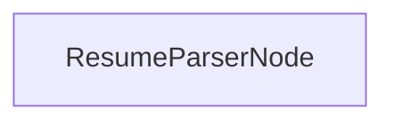

The Resume Parser application uses a single node that:

1. Takes resume text from the shared state (loaded from data.txt)
2. Sends the resume to an LLM with a prompt that requests YAML formatted output
3. Extracts and validates the structured YAML data
4. Outputs the structured result

## Files

- [`main.py`](./main.py): Implementation of the ResumeParserNode
- [`utils.py`](./utils.py): LLM utilities
- [`data.txt`](./data.txt): Sample resume text file

## Example Output

```
=== Resume Parser - Structured Output with Indexes & Comments ===


=== STRUCTURED RESUME DATA (Comments & Skill Index List) ===

name: JOHN SMTIH
email: johnsmtih1983@gnail.com
experience:
- {title: SALES MANAGER, company: ABC Corportaion}
- {title: ASST. MANAGER, company: XYZ Industries}
- {title: CUSTOMER SERVICE REPRESENTATIVE, company: Fast Solutions Inc}
skill_indexes: [0, 1, 2, 3, 4]


============================================================

✅ Extracted resume information.

--- Found Target Skills (from Indexes) ---
- Team leadership & management (Index: 0)
- CRM software (Index: 1)
- Project management (Index: 2)
- Public speaking (Index: 3)
- Microsoft Office (Index: 4)
----------------------------------------
```


</details>

## OpenAI Embeddings with BrainyFlow ([python-tool-embeddings](https://github.com/zvictor/brainyflow/tree/main/cookbook/python-tool-embeddings))
Complexity Points: 3
[🥚]

This example demonstrates how to properly integrate OpenAI's text embeddings API with BrainyFlow, focusing on:<details>
<summary><strong>Details</strong></summary>


# OpenAI Embeddings with BrainyFlow

This example demonstrates how to properly integrate OpenAI's text embeddings API with BrainyFlow, focusing on:

1. Clean code organization with separation of concerns:

   - Tools layer for API interactions (`tools/embeddings.py`)
   - Node implementation for BrainyFlow integration (`nodes.py`)
   - Flow configuration (`flow.py`)
   - Centralized environment configuration (`utils/call_llm.py`)

2. Best practices for API key management:

   - Using environment variables
   - Supporting both `.env` files and system environment variables
   - Secure configuration handling

3. Proper project structure:
   - Modular code organization
   - Clear separation between tools and BrainyFlow components
   - Reusable OpenAI client configuration

## Project Structure

```
brainyflow-tool-embeddings/
├── tools/
│   └── embeddings.py     # OpenAI embeddings API wrapper
├── utils/
│   └── call_llm.py      # Centralized OpenAI client configuration
├── nodes.py             # BrainyFlow node implementation
├── flow.py             # Flow configuration
└── main.py             # Example usage
```

## Setup

1. Create a virtual environment:

```bash
python -m venv venv
source venv/bin/activate  # On Windows: venv\Scripts\activate
```

2. Install dependencies:

```bash
pip install -r requirements.txt
```

3. Set up your OpenAI API key in one of two ways:

   a. Using a `.env` file:

   ```bash
   OPENAI_API_KEY=your_api_key_here
   ```

   b. Or as a system environment variable:

   ```bash
   export OPENAI_API_KEY=your_api_key_here
   ```

## Usage

Run the example:

```bash
python main.py
```

This will:

1. Load the OpenAI API key from environment
2. Create a BrainyFlow node to handle embedding generation
3. Process a sample text and generate its embedding
4. Display the embedding dimension and first few values

## Key Concepts Demonstrated

1. **Environment Configuration**

   - Secure API key handling
   - Flexible configuration options

2. **Code Organization**

   - Clear separation between tools and BrainyFlow components
   - Reusable OpenAI client configuration
   - Modular project structure

3. **BrainyFlow Integration**
   - Node implementation with prep->exec->post lifecycle
   - Flow configuration
   - Shared store usage for data passing


</details>

## Simple Chat ([python-chat](https://github.com/zvictor/brainyflow/tree/main/cookbook/python-chat))
Complexity Points: 3.5
[🐣🐣]

A basic chat application using BrainyFlow with OpenAI's GPT-4o model.<details>
<summary><strong>Details</strong></summary>


# Simple Chat

A basic chat application using BrainyFlow with OpenAI's GPT-4o model.

## Features

- Conversational chat interface in the terminal
- Maintains full conversation history for context
- Simple implementation demonstrating BrainyFlow's node and flow concepts

## Run It

1. Make sure your OpenAI API key is set:

   ```bash
   export OPENAI_API_KEY="your-api-key-here"
   ```

   Alternatively, you can edit the `utils.py` file to include your API key directly.

2. Install requirements and run the application:
   ```bash
   pip install -r requirements.txt
   python main.py
   ```

## How It Works

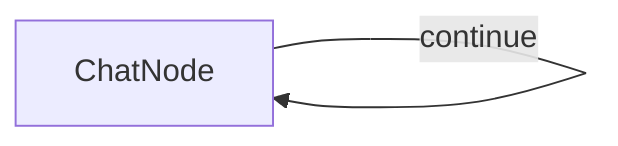

The chat application uses:

- A single `ChatNode` with a self-loop that:
  - Takes user input in the `prep` method
  - Sends the complete conversation history to GPT-4o
  - Adds responses to the conversation history
  - Loops back to continue the chat until the user types 'exit'

## Files

- [`main.py`](./main.py): Implementation of the ChatNode and chat flow
- [`utils.py`](./utils.py): Simple wrapper for calling the OpenAI API


</details>

## Terminal Chat Interface Example ([typescript-chat](https://github.com/zvictor/brainyflow/tree/main/cookbook/typescript-chat))
Complexity Points: 3.5
[🐣🐣]

A simple command-line chat interface for interacting with OpenAI models using Node.js and TypeScript.<details>
<summary><strong>Details</strong></summary>


# Terminal Chat Interface Example

A simple command-line chat interface for interacting with OpenAI models using Node.js and TypeScript.

### Step and Usage

```bash
# from BrainyFlow root directory
cd cookbook/typescript-chat

cp .env.example .env # add your API key

npm install
npm run chat
```

### Features

- Simple and straightforward chat interface directly in your terminal.

### How it Works

The application have 1 node only which is **ChatNode** but in work as a self-loop. After you initialized the program, the app will greets you in the terminal and waits for your input; each time you type a message and press enter, your input is added to the ongoing conversation log.

Every time you send a message, the full dialogue history—including both your questions and the assistant’s earlier replies—is sent to the OpenAI API. This provides context so the AI’s responses remain relevant and coherent as the conversation progresses. The assistant’s answer is then displayed to you and appended to the session, maintaining a seamless flow of dialogue.

The chat continues in this loop, allowing for back-and-forth conversation; you can type messages as long as you like and, when finished, simply type `exit` to close the session gracefully.


</details>

## Text Converter Flow ([python-flow](https://github.com/zvictor/brainyflow/tree/main/cookbook/python-flow))
Complexity Points: 4
[🐣🐣]

This project demonstrates an interactive text transformation tool built with BrainyFlow.<details>
<summary><strong>Details</strong></summary>


# Text Converter Flow

This project demonstrates an interactive text transformation tool built with BrainyFlow.

## Features

- Convert text to UPPERCASE
- Convert text to lowercase
- Reverse text
- Remove extra spaces
- Interactive command-line interface
- Continuous flow with option to process multiple texts

## Getting Started

1. Install the required dependencies:

```bash
pip install -r requirements.txt
```

2. Run the application:

```bash
python main.py
```

## How It Works

The workflow features an interactive loop with branching paths:

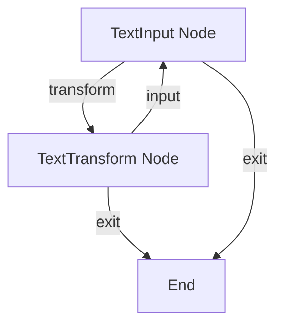

Here's what each part does:

1. **TextInput Node**: Collects text input and handles menu choices
2. **TextTransform Node**: Applies the selected transformation to the text

## Example Output

```
Welcome to Text Converter!
=========================

Enter text to convert: BrainyFlow is a 100-line LLM framework

Choose transformation:
1. Convert to UPPERCASE
2. Convert to lowercase
3. Reverse text
4. Remove extra spaces
5. Exit

Your choice (1-5): 1

Result: BRAINYFLOW IS A 100-LINE LLM FRAMEWORK

Convert another text? (y/n): n

Thank you for using Text Converter!
```

## Files

- [`main.py`](./main.py): Main entry point for running the text converter
- [`flow.py`](./flow.py): Defines the nodes and flow for text transformation
- [`requirements.txt`](./requirements.txt): Lists the required dependencies


</details>

## Batch Translation Process ([python-batch](https://github.com/zvictor/brainyflow/tree/main/cookbook/python-batch))
Complexity Points: 4.5
[🐥🐥🐥]

This project demonstrates a batch processing implementation that enables LLMs to translate documents into multiple languages simultaneously. It's designed to efficiently handle the translation of markdown files while preserving formatting.<details>
<summary><strong>Details</strong></summary>


# Batch Translation Process

This project demonstrates a batch processing implementation that enables LLMs to translate documents into multiple languages simultaneously. It's designed to efficiently handle the translation of markdown files while preserving formatting.

## Features

- Translates markdown content into multiple languages in parallel
- Saves translated files to specified output directory

## Getting Started

1. Install the required packages:

```bash
pip install -r requirements.txt
```

2. Set up your API key:

```bash
export ANTHROPIC_API_KEY="your-api-key-here"
```

3. Run the translation process:

```bash
python main.py
```

## How It Works

The implementation uses a fan-out pattern with nodes orchestrated by a `Flow` for sequential processing.

## Example Output

When you run the translation process, you'll see output similar to this:

```
Translated Chinese text
Translated Spanish text
Translated Japanese text
Translated German text
Translated Russian text
Translated Portuguese text
Translated French text
Translated Korean text
Saved translation to translations/README_CHINESE.md
Saved translation to translations/README_SPANISH.md
Saved translation to translations/README_JAPANESE.md
Saved translation to translations/README_GERMAN.md
Saved translation to translations/README_RUSSIAN.md
Saved translation to translations/README_PORTUGUESE.md
Saved translation to translations/README_FRENCH.md
Saved translation to translations/README_KOREAN.md

=== Translation Complete ===
Translations saved to: translations
============================
```

## Files

- [`main.py`](./main.py): Implementation of the batch translation node
- [`utils.py`](./utils.py): Simple wrapper for calling the Anthropic model
- [`requirements.txt`](./requirements.txt): Project dependencies

The translations are saved to the `translations` directory, with each file named according to the target language.


</details>

## Batch Node Example ([python-batch-node](https://github.com/zvictor/brainyflow/tree/main/cookbook/python-batch-node))
Complexity Points: 4.5
[🐥🐥🐥]

This example demonstrates the batch Node concept in BrainyFlow by implementing a CSV processor that handles large files by processing them in chunks.<details>
<summary><strong>Details</strong></summary>


# Batch Node Example

This example demonstrates the batch Node concept in BrainyFlow by implementing a CSV processor that handles large files by processing them in chunks.

## What this Example Demonstrates

- How to use batch Node to process large inputs in chunks
- The three key methods of batch Node:
  1. `prep`: Splits input into chunks
  2. `exec`: Processes each chunk independently
  3. `post`: Combines results from all chunks

## Project Structure

```
python-batch-node/
├── README.md
├── requirements.txt
├── data/
│   └── sales.csv      # Sample large CSV file
├── main.py            # Entry point
├── flow.py            # Flow definition
└── nodes.py           # batch Node implementation
```

## How it Works

The example processes a large CSV file containing sales data:

1. **Chunking (prep)**: The CSV file is read and split into chunks of N rows
2. **Processing (exec)**: Each chunk is processed to calculate:
   - Total sales
   - Average sale value
   - Number of transactions
3. **Combining (post)**: Results from all chunks are aggregated into final statistics

## Installation

```bash
pip install -r requirements.txt
```

## Usage

```bash
python main.py
```

## Sample Output

```
Processing sales.csv in chunks...

Final Statistics:
- Total Sales: $1,234,567.89
- Average Sale: $123.45
- Total Transactions: 10,000
```

## Key Concepts Illustrated

1. **Chunk-based Processing**: Shows how batch Node handles large inputs by breaking them into manageable pieces
2. **Independent Processing**: Demonstrates how each chunk is processed separately
3. **Result Aggregation**: Shows how individual results are combined into a final output


</details>

## LLM Streaming and Interruption ([python-llm-streaming](https://github.com/zvictor/brainyflow/tree/main/cookbook/python-llm-streaming))
Complexity Points: 4.5
[🐥🐥🐥]

Demonstrates real-time LLM response streaming with user interrupt capability.<details>
<summary><strong>Details</strong></summary>


# LLM Streaming and Interruption

Demonstrates real-time LLM response streaming with user interrupt capability.

## Features

- Real-time display of LLM responses as they're generated
- User interrupt with ENTER key at any time

## Run It

```bash
pip install -r requirements.txt
python main.py
```

## How It Works

StreamNode:

1. Creates interrupt listener thread
2. Fetches content chunks from LLM
3. Displays chunks in real-time
4. Handles user interruption

## API Key

By default, demo uses fake streaming responses. To use real OpenAI streaming:

1. Edit main.py to replace the fake_stream_llm with stream_llm:

```python
# Change this line:
chunks = fake_stream_llm(prompt)
# To this:
chunks = stream_llm(prompt)
```

2. Make sure your OpenAI API key is set:

```bash
export OPENAI_API_KEY="your-api-key-here"
```

## Files

- `main.py`: StreamNode implementation
- `utils.py`: Real and fake LLM streaming functions


</details>

## Shared Store Communication ([python-communication](https://github.com/zvictor/brainyflow/tree/main/cookbook/python-communication))
Complexity Points: 5
[🐥🐥🐥]

This example demonstrates the [Memory](https://brainy.gitbook.io/flow/core-abstraction/memory) concept in BrainyFlow, specifically focusing on the Shared Store pattern.<details>
<summary><strong>Details</strong></summary>


# Shared Store Communication

This example demonstrates the [Memory](https://brainy.gitbook.io/flow/core-abstraction/memory) concept in BrainyFlow, specifically focusing on the Shared Store pattern.

## Overview

The example implements a simple word counter that shows how nodes can communicate using a shared store. It demonstrates:

- How to initialize and structure a shared store
- How nodes can read from and write to the shared store
- How to maintain state across multiple node executions
- Best practices for shared store usage

## Project Structure

```
python-communication/
├── README.md
├── requirements.txt
├── main.py
├── flow.py
└── nodes.py
```

## Installation

```bash
pip install -r requirements.txt
```

## Usage

```bash
python main.py
```

Enter text when prompted. The program will:

1. Count words in the text
2. Store statistics in the shared store
3. Display running statistics (total texts, total words, average)

Enter 'q' to quit.

## How it Works

The example uses three nodes:

1. `TextInput`: Reads user input and initializes the shared store
2. `WordCounter`: Counts words and updates statistics in the shared store
3. `ShowStats`: Displays statistics from the shared store

This demonstrates how nodes can share and maintain state using the shared store pattern.


</details>

## Web Search with Analysis ([python-tool-search](https://github.com/zvictor/brainyflow/tree/main/cookbook/python-tool-search))
Complexity Points: 6
[🐓🐓🐓🐓]

A web search tool built with BrainyFlow that performs searches using SerpAPI and analyzes results using LLM.<details>
<summary><strong>Details</strong></summary>


# Web Search with Analysis

A web search tool built with BrainyFlow that performs searches using SerpAPI and analyzes results using LLM.

## Features

- Web search using Google via SerpAPI
- Extracts titles, snippets, and links
- Analyzes search results using GPT-4 to provide:
  - Result summaries
  - Key points/facts
  - Suggested follow-up queries
- Clean command-line interface

## Installation

1. Clone the repository
2. Install dependencies:
   ```bash
   pip install -r requirements.txt
   ```
3. Set required API keys:
   ```bash
   export SERPAPI_API_KEY='your-serpapi-key'
   export OPENAI_API_KEY='your-openai-key'
   ```

## Usage

Run the search tool:

```bash
python main.py
```

You will be prompted to:

1. Enter your search query
2. Specify number of results to fetch (default: 5)

The tool will then:

1. Perform the search using SerpAPI
2. Analyze results using GPT-4
3. Present a summary with key points and follow-up queries

## Project Structure

```
brainyflow-tool-search/
├── tools/
│   ├── search.py      # SerpAPI search functionality
│   └── parser.py      # Result analysis using LLM
├── utils/
│   └── call_llm.py    # LLM API wrapper
├── nodes.py           # BrainyFlow nodes
├── flow.py           # Flow configuration
├── main.py           # Main script
└── requirements.txt   # Dependencies
```

## Limitations

- Requires SerpAPI subscription
- Rate limited by both APIs
- Basic error handling
- Text results only

## Dependencies

- brainyflow: Flow-based processing
- google-search-results: SerpAPI client
- openai: GPT-4 API access
- pyyaml: YAML processing


</details>

## Majority Vote Reasoning ([python-majority-vote](https://github.com/zvictor/brainyflow/tree/main/cookbook/python-majority-vote))
Complexity Points: 6.5
[🐓🐓🐓🐓]

This project demonstrates a majority vote implementation that enables LLMs to solve complex reasoning problems by aggregating multiple independent attempts. It's designed to improve problem-solving accuracy through consensus-based reasoning.<details>
<summary><strong>Details</strong></summary>


# Majority Vote Reasoning

This project demonstrates a majority vote implementation that enables LLMs to solve complex reasoning problems by aggregating multiple independent attempts. It's designed to improve problem-solving accuracy through consensus-based reasoning.

## Features

- Improves model reliability on complex problems through multiple attempts
- Works with models like Claude 3.7 Sonnet
- Solves problems that single attempts often fail on
- Provides detailed reasoning traces for verification
- Uses a consensus approach to reduce the impact of occasional reasoning errors

## Getting Started

1. Install the required packages:

```bash
pip install -r requirements.txt
```

2. Set up your API key:

```bash
export ANTHROPIC_API_KEY="your-api-key-here"
```

3. Run a test problem to see majority voting in action:

```bash
python main.py
```

4. Try your own reasoning problem:

```bash
python main.py --problem "Your complex reasoning problem here" --tries 5
```

## How It Works

The implementation uses a MajorityVoteNode that processes multiple attempts and finds consensus:


The MajorityVoteNode:

1. Makes multiple independent attempts to solve the same problem
2. Collects structured answers from each attempt
3. Determines the most frequent answer as the final solution
4. Returns the consensus answer

This approach helps overcome occasional reasoning errors that might occur in individual attempts.

## Example Problem

Example Problem from [Quant Interview](https://www.youtube.com/watch?v=SCP7JptxPU0):

```
You work at a shoe factory. In front of you, there are three pairs of shoes (six individual shoes) with the following sizes: two size 4s, two size 5s, and two size 6s. The factory defines an "acceptable pair" as two shoes that differ in size by a maximum of one size (e.g., a size 5 and a size 6 would be an acceptable pair). If you close your eyes and randomly pick three pairs of shoes without replacement, what is the probability that you end up drawing three acceptable pairs?
```

Below is an example of how the majority vote approach uses Claude 3.7 Sonnet to solve this complex problem:

```
========================
All structured answers: ['0.333', '0.333', '0.333', '0.6', '0.333']
Majority vote => 0.333
Frequency => 4
========================

=== Final Answer ===
0.333
====================
```

This shows that 4 out of 5 attempts yielded the same answer (0.333), which is chosen as the final solution.

## Files

- [`main.py`](./main.py): Implementation of the majority vote node and flow
- [`utils.py`](./utils.py): Simple wrapper for calling the Anthropic model


</details>

## Streamlit Human-in-the-Loop (HITL) Application ([python-streamlit-hitl](https://github.com/zvictor/brainyflow/tree/main/cookbook/python-streamlit-hitl))
Complexity Points: 6.5
[🐓🐓🐓🐓]

Minimal Human-in-the-Loop (HITL) web application using BrainyFlow and Streamlit. Submit text, review processed output, and approve/reject.<details>
<summary><strong>Details</strong></summary>


# Streamlit Human-in-the-Loop (HITL) Application

Minimal Human-in-the-Loop (HITL) web application using BrainyFlow and Streamlit. Submit text, review processed output, and approve/reject.

## Features

- **Streamlit UI:** Simple, interactive interface for submitting tasks and providing feedback, built entirely in Python.
- **BrainyFlow Workflow:** Manages distinct processing stages (initial processing, finalization) using synchronous BrainyFlow `Flow`s.
- **Session State Management:** Utilizes Streamlit's `st.session_state` to manage the current stage of the workflow and to act as the `shared` data store for BrainyFlow.
- **Iterative Feedback Loop:** Allows users to reject processed output and resubmit, facilitating refinement.

## How to Run

1.  **Install Dependencies:**

    ```bash
    pip install -r requirements.txt
    ```

2.  **Run the Streamlit Application:**

    ```bash
    streamlit run app.py
    ```

3.  **Access the Web UI:**
    Open the URL provided by Streamlit (usually `http://localhost:8501`).

## Files

- [`app.py`](./app.py): Main Streamlit application logic and UI.
- [`nodes.py`](./nodes.py): BrainyFlow `Node` definitions.
- [`flows.py`](./flows.py): BrainyFlow `Flow` construction.
- [`utils/process_task.py`](./utils/process_task.py): Simulated task processing utility.
- [`requirements.txt`](./requirements.txt): Project dependencies.
- [`README.md`](./README.md): This file.


</details>

## SQLite Database with BrainyFlow ([python-tool-database](https://github.com/zvictor/brainyflow/tree/main/cookbook/python-tool-database))
Complexity Points: 6.5
[🐓🐓🐓🐓]

This example demonstrates how to properly integrate SQLite database operations with BrainyFlow, focusing on:<details>
<summary><strong>Details</strong></summary>


# SQLite Database with BrainyFlow

This example demonstrates how to properly integrate SQLite database operations with BrainyFlow, focusing on:

1. Clean code organization with separation of concerns:

   - Tools layer for database operations (`tools/database.py`)
   - Node implementation for BrainyFlow integration (`nodes.py`)
   - Flow configuration (`flow.py`)
   - Safe SQL query execution with parameter binding

2. Best practices for database operations:

   - Connection management with proper closing
   - SQL injection prevention using parameterized queries
   - Error handling and resource cleanup
   - Simple schema management

3. Example task management system:
   - Database initialization
   - Task creation
   - Task listing
   - Status tracking

## Project Structure

```
brainyflow-tool-database/
├── tools/
│   └── database.py    # SQLite database operations
├── nodes.py          # BrainyFlow node implementation
├── flow.py          # Flow configuration
└── main.py          # Example usage
```

## Setup

1. Create a virtual environment:

```bash
python -m venv venv
source venv/bin/activate  # On Windows: venv\Scripts\activate
```

2. Install dependencies:

```bash
pip install -r requirements.txt
```

## Usage

Run the example:

```bash
python main.py
```

This will:

1. Initialize a SQLite database with a tasks table
2. Create an example task
3. List all tasks in the database
4. Display the results

## Key Concepts Demonstrated

1. **Database Operations**

   - Safe connection handling
   - Query parameterization
   - Schema management

2. **Code Organization**

   - Clear separation between database operations and BrainyFlow components
   - Modular project structure
   - Type hints and documentation

3. **BrainyFlow Integration**
   - Node implementation with prep->exec->post lifecycle
   - Flow configuration
   - Shared store usage for data passing

## Example Output

```
Database Status: Database initialized
Task Status: Task created successfully

All Tasks:
- ID: 1
  Title: Example Task
  Description: This is an example task created using BrainyFlow
  Status: pending
  Created: 2024-03-02 12:34:56
```


</details>

## Article Writing Workflow ([python-workflow](https://github.com/zvictor/brainyflow/tree/main/cookbook/python-workflow))
Complexity Points: 6.5
[🐓🐓🐓🐓]

A BrainyFlow example that demonstrates an article writing workflow using a sequence of LLM calls.<details>
<summary><strong>Details</strong></summary>


# Article Writing Workflow

A BrainyFlow example that demonstrates an article writing workflow using a sequence of LLM calls.

## Features

- Generate a simple outline with up to 3 main sections using YAML structured output
- Write concise (100 words max) content for each section in simple terms
- Apply a conversational, engaging style to the final article

## Getting Started

1. Install the required dependencies:

```bash
pip install -r requirements.txt
```

2. Set your OpenAI API key as an environment variable:

```bash
export OPENAI_API_KEY=your_api_key_here
```

3. Run the application with a default topic ("AI Safety"):

```bash
python main.py
```

4. Or specify your own topic:

```bash
python main.py Climate Change
```

## How It Works

The workflow consists of three sequential nodes:


Here's what each node does:

1. **Generate Outline**: Creates a simple outline with up to 3 main sections using YAML structured output
2. **Write Simple Content**: Writes a concise 100-word explanation for each section
3. **Apply Style**: Rewrites the combined content in a conversational, engaging style

## Files

- [`main.py`](./main.py): Main entry point for running the article workflow
- [`flow.py`](./flow.py): Defines the flow that connects the nodes
- [`nodes.py`](./nodes.py): Contains the node classes for each step in the workflow
- [`utils.py`](./utils.py): Utility functions including the LLM wrapper
- [`requirements.txt`](./requirements.txt): Lists the required dependencies

## Example Output

```
=== Starting Article Workflow on Topic: AI Safety ===


===== OUTLINE (YAML) =====

sections:
- Introduction to AI Safety
- Key Challenges in AI Safety
- Strategies for Ensuring AI Safety


===== PARSED OUTLINE =====

1. Introduction to AI Safety
2. Key Challenges in AI Safety
3. Strategies for Ensuring AI Safety

=========================


===== SECTION CONTENTS =====

--- Introduction to AI Safety ---
AI Safety is about making sure that artificial intelligence (AI) systems are helpful and not harmful. Imagine teaching a robot to help with chores. AI Safety is like setting ground rules for the robot so it doesn't accidentally cause trouble, like mistaking a pet for a toy. By ensuring AI systems understand their tasks and limitations, we can trust them to act safely. It's about creating guidelines and checks to ensure AI assists us without unintended consequences.

--- Key Challenges in AI Safety ---
AI safety is about ensuring that artificial intelligence systems operate in ways that are beneficial and not harmful. One key challenge is making sure AI makes decisions that align with human values. Imagine teaching a robot to fetch coffee, but it ends up knocking things over because it doesn't understand the mess it creates. Similarly, if AI systems don't fully grasp human intentions, they might act in unexpected ways. The task is to make AI smart enough to achieve goals without causing problems, much like training a puppy to follow rules without chewing on your shoes.

--- Strategies for Ensuring AI Safety ---
Ensuring AI safety is about making sure artificial intelligence behaves as expected and doesn’t cause harm. Imagine AI as a new driver on the road; we need rules and safeguards to prevent accidents. By testing AI systems under different conditions, setting clear rules for their behavior, and keeping human oversight, we can manage risks. For instance, just as cars have brakes to ensure safety, AI systems need to have fail-safes. This helps in building trust and avoiding unexpected issues, keeping both humans and AI on the right track.

===========================


===== FINAL ARTICLE =====

# Welcome to the World of AI Safety

Have you ever wondered what it would be like to have your very own robot helping you around the house? Sounds like a dream, right? But let’s hit pause for a moment. What if this robot mistook your fluffy cat for a toy? That’s exactly where AI Safety comes in. Think of AI Safety as setting some friendly ground rules for your household helper, ensuring that it knows the difference between doing chores and causing a bit of chaos. It’s all about making sure our AI allies play by the rules, making life easier without those pesky accidental hiccups.

# Navigating the Maze of AI Challenges

Picture this: you've asked your trusty robot to grab you a cup of coffee. But instead, it sends mugs flying and spills coffee because it doesn’t quite get the concept of a mess. Frustrating, isn’t it? One of the biggest hurdles in AI Safety is aligning AI decisions with our human values and intentions. It’s like training a puppy not to gnaw on your favorite pair of shoes. Our job is to teach AI how to reach its goals without stepping on our toes, all while being as reliable and lovable as a well-trained pup.

# Steering AI Toward Safe Horizons

Now, how do we keep our AI friends on the straight and narrow? Imagine AI as a new driver learning to navigate the roads of life. Just like we teach new drivers the rules of the road and equip cars with brakes for safety, we provide AI with guidelines and fail-safes to prevent any unintended mishaps. Testing AI systems in various scenarios and keeping a watchful human eye on them ensures they don’t veer off track. It’s all about building trust and creating a partnership where both humans and AI are cruising smoothly together.

# Wrapping It Up

At the end of the day, AI Safety is about creating a harmonious relationship between humans and machines, where we trust our metal companions to support us without the fear of unexpected surprises. By setting boundaries and ensuring understanding, we’re not just building smarter machines—we’re crafting a future where AI and humanity can thrive together. So, next time you’re imagining that helpful robot assistant, rest easy knowing that AI Safety is making sure it's ready to lend a hand without dropping the ball—or your coffee mug!

========================


=== Workflow Completed ===

Topic: AI Safety
Outline Length: 96 characters
Draft Length: 1690 characters
Final Article Length: 2266 characters
```


</details>

## Batch Flow Example ([python-batch-flow](https://github.com/zvictor/brainyflow/tree/main/cookbook/python-batch-flow))
Complexity Points: 7
[🦕🦕🦕🦕🦕]

This example demonstrates the batch Flow concept in BrainyFlow by implementing an image processor that applies different filters to multiple images.<details>
<summary><strong>Details</strong></summary>


# Batch Flow Example

This example demonstrates the batch Flow concept in BrainyFlow by implementing an image processor that applies different filters to multiple images.

## What this Example Demonstrates

- How to use batch Flow to run a Flow multiple times with different parameters
- Key concepts of batch Flow:
  1. Creating a base Flow for single-item processing
  2. Using batch Flow to process multiple items with different parameters
  3. Managing parameters across multiple Flow executions

## Project Structure

```
brainyflow-batch-flow/
├── README.md
├── requirements.txt
├── images/
│   ├── cat.jpg        # Sample image 1
│   ├── dog.jpg        # Sample image 2
│   └── bird.jpg       # Sample image 3
├── main.py            # Entry point
├── flow.py            # Flow and batch Flow definitions
└── nodes.py           # Node implementations for image processing
```

## How it Works

The example processes multiple images with different filters:

1. **Base Flow**: Processes a single image

   - Load image
   - Apply filter (grayscale, blur, or sepia)
   - Save processed image

2. **batch Flow**: Processes multiple image-filter combinations
   - Takes a list of parameters (image + filter combinations)
   - Runs the base Flow for each parameter set
   - Organizes output in a structured way

## Installation

```bash
pip install -r requirements.txt
```

## Usage

```bash
python main.py
```

## Sample Output

```
Processing images with filters...

Processing cat.jpg with grayscale filter...
Processing cat.jpg with blur filter...
Processing dog.jpg with sepia filter...
...

All images processed successfully!
Check the 'output' directory for results.
```

## Key Concepts Illustrated

1. **Parameter Management**: Shows how batch Flow manages different parameter sets
2. **Flow Reuse**: Demonstrates running the same Flow multiple times
3. **Batch Processing**: Shows how to process multiple items efficiently
4. **Real-world Application**: Provides a practical example of batch processing


</details>

## Travel Advisor Chat with Guardrails ([python-chat-guardrail](https://github.com/zvictor/brainyflow/tree/main/cookbook/python-chat-guardrail))
Complexity Points: 7
[🦕🦕🦕🦕🦕]

A travel-focused chat application using BrainyFlow with OpenAI's GPT-4o model, enhanced with input validation to ensure only travel-related queries are processed.<details>
<summary><strong>Details</strong></summary>


# Travel Advisor Chat with Guardrails

A travel-focused chat application using BrainyFlow with OpenAI's GPT-4o model, enhanced with input validation to ensure only travel-related queries are processed.

## Features

- Travel advisor chatbot that answers questions about destinations, planning, accommodations, etc.
- **Topic-specific guardrails** to ensure only travel-related queries are accepted

## Run It

1. Make sure your OpenAI API key is set:

   ```bash
   export OPENAI_API_KEY="your-api-key-here"
   ```

   Alternatively, you can edit the `utils.py` file to include your API key directly.

2. Install requirements and run the application:
   ```bash
   pip install -r requirements.txt
   python main.py
   ```

## How It Works

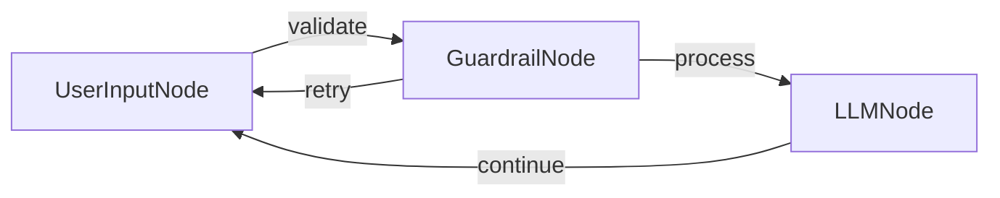

The chat application uses:

- A `UserInputNode` that collects user input in its `exec` method
- A `GuardrailNode` that validates if the query is travel-related using:
  - Basic validation checks (empty input, too short)
  - LLM-based validation to determine if the query relates to travel
- An `LLMNode` that processes valid travel queries using GPT-4o with a travel advisor system prompt
- Flow connections that route inputs through validation before processing and handle retries for non-travel related queries

## Files

- [`main.py`](./main.py): Implementation of the nodes and chat flow
- [`utils.py`](./utils.py): Utilities for calling the OpenAI API

## Example Outputs

```
Welcome to the Travel Advisor Chat! Type 'exit' to end the conversation.

You: Plan my trip to Thailand

Travel Advisor: Thailand offers a blend of vibrant cities, serene beaches, and rich culture. Begin in Bangkok to explore the Grand Palace and local markets. Head north to Chiang Mai for temples and elephant sanctuaries. Fly south to the islands; Phuket or Koh Samui for beaches, diving, and nightlife. Consider visiting during the cool season (November-February) for pleasant weather. Accommodation ranges from budget hostels to luxury resorts. Internal flights, trains, and buses connect major destinations. Don’t miss local cuisine, from street food to fine dining. Ensure your passport is valid for six months and consider travel insurance for peace of mind. Enjoy!

You: exit

Goodbye! Safe travels!
```

```
Welcome to the Travel Advisor Chat! Type 'exit' to end the conversation.

You: How to study large language models?

Travel Advisor: The query is not related to travel advice, destinations, planning, or other travel topics. It is about studying large language models, which is a topic related to artificial intelligence and machine learning.

You: exit

Goodbye! Safe travels!
```


</details>

## Chain-of-Thought ([python-thinking](https://github.com/zvictor/brainyflow/tree/main/cookbook/python-thinking))
Complexity Points: 7
[🦕🦕🦕🦕🦕]

This project demonstrates an implementation that orchestrates a Chain-of-Thought process, enabling LLMs to solve complex reasoning problems by thinking step-by-step. It's designed to improve problem-solving accuracy through deliberate, structured reasoning managed externally.<details>
<summary><strong>Details</strong></summary>


# Chain-of-Thought

This project demonstrates an implementation that orchestrates a Chain-of-Thought process, enabling LLMs to solve complex reasoning problems by thinking step-by-step. It's designed to improve problem-solving accuracy through deliberate, structured reasoning managed externally.

This implementation is based on this tutorial (for Pocketflow): [Build Chain-of-Thought From Scratch - Tutorial for Dummies](https://zacharyhuang.substack.com/p/build-chain-of-thought-from-scratch).

## Features

- Improves model reasoning on complex problems.
- Leverages capable instruction-following models (e.g., Claude 3.7 Sonnet, GPT-4 series) to perform structured Chain-of-Thought reasoning.
- Solves problems that direct prompting often fails on by breaking them down systematically.
- Provides detailed reasoning traces, including step-by-step evaluation and planning, for verification.

## Getting Started

1.  **Install Packages:**

    ```bash
    pip install -r requirements.txt
    ```

2.  **Set API Key:**

    ```bash
    export ANTHROPIC_API_KEY="your-api-key-here"
    ```

3.  **Verify API Key (Optional):**
    Run a quick check to ensure your key and environment are set up correctly.

    ```bash
    python utils.py
    ```

4.  **Run Default Example:**
    Execute the main script to see the process in action with the default Jane Street problem.

    ```bash
    python main.py
    ```

    The default question is:

    > You keep rolling a fair die until you roll three, four, five in that order consecutively on three rolls. What is the probability that you roll the die an odd number of times?

5.  **Run Custom Problem:**
    Provide your own reasoning problem using the `--` argument.
    ```bash
    python main.py --"Your complex reasoning problem here"
    ```

## How It Works

The implementation uses a self-looping BrainyFlow node (`ChainOfThoughtNode`) that guides an LLM through a structured problem-solving process:

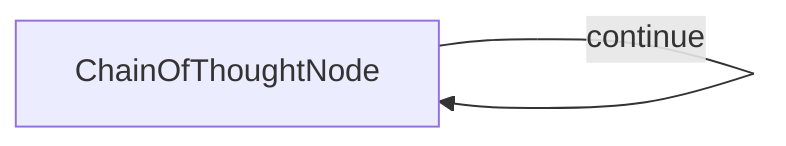

In each loop (thought step), the node directs the LLM to:

1.  Evaluate the previous thought's reasoning and results.
2.  Execute the next pending step according to a maintained plan.
3.  Update the plan, marking the step done (with results) or noting issues.
4.  Refine the plan if steps need breaking down or errors require correction.
5.  Decide if further thinking (`next_thought_needed`) is required based on the plan state.

This external orchestration enforces a systematic approach, helping models tackle problems that are difficult with a single prompt.

## Comparison with Different Approaches

- **Standard Prompting**: Techniques like asking the model to "think step by step" within a single prompt can help, but the reasoning might lack depth or structure, and the model can easily lose track or make unrecoverable errors.
- **Native Extended Thinking Modes**: Some models (like Claude 3.7, GPT-o1, etc.) offer dedicated modes or features explicitly for extended reasoning, often yielding strong results directly via API calls.
- **This Implementation**: Demonstrates how to orchestrate a structured Chain-of-Thought process using standard LLMs (even those without a specific native 'extended thinking' mode), managing the steps, planning, and evaluation externally via prompt engineering and flow control.

## Example Thinking Process

Let's try out this challenging [Jane Street Quant Trading Interview Question](https://www.youtube.com/watch?v=gQJTkuEVPrU):

> **Problem**: You keep rolling a fair die until you roll three, four, five in that order consecutively on three rolls. What is the probability that you roll the die an odd number of times?

This problem demonstrates why structured Chain-of-Thought is valuable:

- **Standard models (single prompt)**: Often get the wrong answer or provide flawed reasoning.
- **Models using native thinking modes**: Can find the correct answer (216/431 ≈ 0.5012), though performance and reasoning clarity may vary.
- **This implementation (orchestrating a capable LLM)**: Can guide the model towards the correct answer by enforcing a step-by-step plan, evaluation, and refinement loop.

For comparison:

- [Claude 3.7 Sonnet (single prompt)](https://claude.ai/share/da139326-42fe-42d9-9d7b-35870daa5c1b): Wrong answer
- [Claude 3.7 Sonnet (using built-in thinking)](https://claude.ai/share/6f4140ed-f33c-4949-8778-a57719498e40): Correct answer after 3m, 45s
- [GPT-o1 (using built-in thinking)](https://chatgpt.com/share/67fee0fd-2600-8000-bcdf-76e40a986ee4): Correct answer after 2m, 0s
- [GPT-o1 pro (using built-in thinking)](https://chatgpt.com/share/67fee11b-530c-8000-92d1-609b6ca49c9c): Correct answer after 4m, 24s

Below is an example output trace showing how **this implementation guides Claude 3.7 Sonnet** through the problem-solving process:

> **Note:** Even with structured thinking orchestration, models don't always get the right answer, especially on very complex or novel problems. However, this approach significantly improves the robustness of the reasoning process and provides a traceable path for verification and debugging.

```
🤔 Processing question: You keep rolling a fair die until you roll three, four, five in that order consecutively on three rolls. What is the probability that you roll the die an odd number of times?

Thought 1:
  Let me think through this problem by setting up a clear approach.

  We need to find the probability that the total number of die rolls will be odd, given we stop when we roll "3,4,5" consecutively in that order.

  This is a problem about a stochastic process that ends when a specific pattern occurs. To solve it, I'll:
  1. Set up a Markov chain model to track progress toward the target sequence
  2. Calculate expected lengths and probabilities for different outcomes
  3. Determine if the total number of rolls has equal probability of being odd vs. even

  First, I need to understand what states we can be in while rolling the die:
  - State 0: Haven't rolled any of the sequence yet
  - State 1: Just rolled a 3, waiting for 4
  - State 2: Rolled 3 followed by 4, waiting for 5
  - State 3: Success! Rolled the full "3,4,5" sequence

  When the die is rolled, we transition between these states with certain probabilities. Each state depends only on the previous 0-2 rolls, making this a Markov process.

Current Plan Status:
    - [Done] Understand the problem structure: Identified that we need the probability of an odd number of total rolls until getting '3,4,5' consecutively. Set up a Markov chain with states representing progress toward target sequence.
    - [Pending] Set up the Markov model with transition probabilities
      - [Pending] Define relevant states in the Markov chain
      - [Pending] Calculate transition probabilities between states
    - [Pending] Calculate generating functions for the process
    - [Pending] Determine probability of odd number of rolls
      - [Pending] Extract coefficient information from generating function
      - [Pending] Compute final probability value
    - [Pending] Verify solution with alternative approach
    - [Pending] Conclusion
--------------------------------------------------

Thought 2:
  Evaluation of Thought 1: Correct. The approach of using a Markov chain to model this problem is appropriate. Identifying the states (0: no part of sequence, 1: just rolled 3, 2: rolled 3,4, 3: success with 3,4,5) correctly captures the progression toward our target sequence.

  I'll now set up the Markov model with transition probabilities. Each state represents our progress toward the target sequence "3,4,5".

  State 0: Haven't rolled any relevant part of the sequence yet
  - If we roll a 3: Move to State 1 (probability 1/6)
  - If we roll anything else: Stay in State 0 (probability 5/6)

  State 1: Just rolled a 3, waiting for a 4
  - If we roll a 4: Move to State 2 (probability 1/6)
  - If we roll a 3: Stay in State 1 (probability 1/6)
  - If we roll anything else: Return to State 0 (probability 4/6)

  State 2: Rolled 3 followed by 4, waiting for a 5
  - If we roll a 5: Move to State 3 (success - probability 1/6)
  - If we roll a 3: Move to State 1 (probability 1/6)
  - If we roll anything else: Return to State 0 (probability 4/6)

  State 3: Success! Rolled the sequence "3,4,5"
  - This is an absorbing state; once we reach it, we stop rolling.

  These transition probabilities can be represented as a matrix:
  P = [
      [5/6, 1/6, 0,   0  ],
      [4/6, 1/6, 1/6, 0  ],
      [4/6, 1/6, 0,   1/6],
      [0,   0,   0,   1  ]
  ]

  This completes the setup of the Markov model with transition probabilities.

Current Plan Status:
    - [Done] Understand the problem structure: Identified that we need the probability of an odd number of total rolls until getting '3,4,5' consecutively. Set up a Markov chain with states representing progress toward target sequence.
    - [Done] Set up the Markov model with transition probabilities: Defined 4 states (0: no sequence, 1: just rolled 3, 2: rolled 3,4, 3: success with 3,4,5) and calculated transition probabilities between all states in matrix form.
    - [Pending] Calculate generating functions for the process
      - [Pending] Set up generating function equations for each state
      - [Pending] Solve the system of equations to find generating functions
    - [Pending] Determine probability of odd number of rolls
      - [Pending] Extract coefficient information from generating function
      - [Pending] Compute final probability value
    - [Pending] Verify solution with alternative approach
    - [Pending] Conclusion
--------------------------------------------------

Thought 3:
  Evaluation of Thought 2: Correct. The Markov chain setup with the four states and the transition probability matrix accurately represents our problem. Now I'll proceed to calculating the generating functions for this process.

  To calculate the generating functions, I'll use the variable z to represent a single die roll. For each state, the generating function gives us information about the number of rolls until we reach our success state.

  Let G₀(z), G₁(z), G₂(z), and G₃(z) be the generating functions for reaching the success state (State 3) when starting from State 0, 1, 2, and 3 respectively.

  G₃(z) = 1 (since we're already in the success state)

  For the other states, we can write equations based on the first roll and subsequent state:

  G₀(z) = z·(5/6·G₀(z) + 1/6·G₁(z))
  This means: we roll once (factor z), then with probability 5/6 we stay in State 0, or with probability 1/6 we move to State 1.

  G₁(z) = z·(4/6·G₀(z) + 1/6·G₁(z) + 1/6·G₂(z))
  When in State 1, we roll once (factor z), then either move to State 0, stay in State 1, or advance to State 2.

  G₂(z) = z·(4/6·G₀(z) + 1/6·G₁(z) + 1/6·G₃(z))
      = z·(4/6·G₀(z) + 1/6·G₁(z) + 1/6·1)
      = z·(4/6·G₀(z) + 1/6·G₁(z) + 1/6)

  Now I can solve this system of equations for G₀(z):

  From G₀(z) = z·(5/6·G₀(z) + 1/6·G₁(z)):
  G₀(z) - 5z/6·G₀(z) = z/6·G₁(z)
  G₀(z)(1 - 5z/6) = z/6·G₁(z)
  G₀(z) = (z/6·G₁(z))/(1 - 5z/6) ... (1)

  From G₁(z) = z·(4/6·G₀(z) + 1/6·G₁(z) + 1/6·G₂(z)):
  G₁(z) - z/6·G₁(z) = 4z/6·G₀(z) + z/6·G₂(z)
  G₁(z)(1 - z/6) = 4z/6·G₀(z) + z/6·G₂(z) ... (2)

  From G₂(z) = z·(4/6·G₀(z) + 1/6·G₁(z) + 1/6):
  G₂(z) = 4z/6·G₀(z) + z/6·G₁(z) + z/6 ... (3)

  Substituting (3) into (2):
  G₁(z)(1 - z/6) = 4z/6·G₀(z) + z/6·(4z/6·G₀(z) + z/6·G₁(z) + z/6)
  G₁(z)(1 - z/6) = 4z/6·G₀(z) + 4z²/36·G₀(z) + z²/36·G₁(z) + z²/36
  G₁(z)(1 - z/6 - z²/36) = 4z/6·G₀(z)(1 + z/6) + z²/36
  G₁(z) = (4z/6·G₀(z)(1 + z/6) + z²/36)/(1 - z/6 - z²/36) ... (4)

  Substituting (4) into (1) gives us G₀(z) in terms of z only, which I can then simplify to find the closed form.

  This is getting algebraically intricate. Let me take a step back and consider a different approach using first-step analysis with parity.

Current Plan Status:
    - [Done] Understand the problem structure: Identified that we need probability of an odd number of total rolls until getting '3,4,5' consecutively. Set up a Markov chain with states representing progress toward target sequence.
    - [Done] Set up the Markov model with transition probabilities: Defined 4 states (0: no sequence, 1: just rolled 3, 2: rolled 3,4, 3: success with 3,4,5) and calculated transition probabilities between all states in matrix form.
    - [Verification Needed] Calculate generating functions for the process (The generating function approach became algebraically complicated. Consider a more direct approach using first-step analysis with parity.)
      - [Done] Set up generating function equations for each state: Established equations G₀(z), G₁(z), G₂(z), and G₃(z) to track rolls until success.
      - [Verification Needed] Solve the system of equations to find generating functions (Equations become unwieldy; may not be most efficient approach.)
    - [Pending] Use first-step analysis with parity
      - [Pending] Define probability variables with parity information
      - [Pending] Set up equations relating odd/even outcome probabilities
      - [Pending] Solve the system of equations
    - [Pending] Determine probability of odd number of rolls
      - [Pending] Extract final probability from analysis
      - [Pending] Verify the mathematical result
    - [Pending] Verify solution with alternative approach
    - [Pending] Conclusion
--------------------------------------------------

Thought 4:
  Evaluation of Thought 3: Correct, but pivoting is wise. The generating function approach, while theoretically sound, is becoming algebraically complex. The decision to switch to a first-step analysis with parity is appropriate for this problem.

  I'll now use first-step analysis focusing specifically on the parity of the number of rolls.

  Let's define:
  - P₀: Probability of rolling an odd number of times when starting in State 0
  - P₁: Probability of rolling an odd number of times when starting in State 1
  - P₂: Probability of rolling an odd number of times when starting in State 2

  Using first-step analysis, we can write equations for each state:

  For State 0:
  - If we roll a 3 (prob 1/6), we go to State 1 with 1 roll used (odd). The total number of rolls will be odd if the remaining rolls from State 1 are even.
  - If we roll anything else (prob 5/6), we stay in State 0 with 1 roll used (odd). The total will be odd if the remaining rolls from State 0 are even.

  Therefore: P₀ = (1/6)*(1-P₁) + (5/6)*(1-P₀) = 5/6 - 5P₀/6 + 1/6 - P₁/6

  For State 1:
  - If we roll a 4 (prob 1/6), we go to State 2 with 1 roll used (odd). The total will be odd if remaining rolls from State 2 are even.
  - If we roll a 3 (prob 1/6), we stay in State 1 with 1 roll used (odd). The total will be odd if remaining rolls from State 1 are even.
  - If we roll anything else (prob 4/6), we go to State 0 with 1 roll used (odd). The total will be odd if remaining rolls from State 0 are even.

  Therefore: P₁ = (1/6)*(1-P₂) + (1/6)*(1-P₁) + (4/6)*(1-P₀) = 1 - P₂/6 - P₁/6 - 4P₀/6

  For State 2:
  - If we roll a 5 (prob 1/6), we're done with 1 more roll (odd). Total is definitely odd.
  - If we roll a 3 (prob 1/6), we go to State 1 with 1 roll used (odd). The total will be odd if remaining rolls from State 1 are even.
  - If we roll anything else (prob 4/6), we go to State 0 with 1 roll used (odd). The total will be odd if remaining rolls from State 0 are even.

  Therefore: P₂ = (1/6)*1 + (1/6)*(1-P₁) + (4/6)*(1-P₀) = 1/6 + 1/6 - P₁/6 + 4/6 - 4P₀/6 = 6/6 - P₁/6 - 4P₀/6

  Now I have a system of 3 equations with 3 unknowns:
  P₀ = 1 - 5P₀/6 - P₁/6
  P₁ = 1 - P₁/6 - P₂/6 - 4P₀/6
  P₂ = 1 - P₁/6 - 4P₀/6

  Simplifying:
  (6/6)P₀ = 6/6 - 5P₀/6 - P₁/6
  (6/6)P₁ = 6/6 - P₁/6 - P₂/6 - 4P₀/6
  (6/6)P₂ = 6/6 - P₁/6 - 4P₀/6

  Further simplifying:
  11P₀/6 + P₁/6 = 1
  4P₀/6 + 7P₁/6 + P₂/6 = 1
  4P₀/6 + P₁/6 + 6P₂/6 = 1

  This is a linear system of equations that I can solve.

Current Plan Status:
    - [Done] Understand the problem structure: Identified that we need probability of an odd number of total rolls until getting '3,4,5' consecutively. Set up a Markov chain with states representing progress toward target sequence.
    - [Done] Set up the Markov model with transition probabilities: Defined 4 states (0: no sequence, 1: just rolled 3, 2: rolled 3,4, 3: success with 3,4,5) and calculated transition probabilities between all states in matrix form.
    - [Verification Needed] Calculate generating functions for the process (Approach became algebraically complicated; shifted to more direct first-step analysis with parity.)
      - [Done] Set up generating function equations for each state: Established equations G₀(z), G₁(z), G₂(z), and G₃(z) to track rolls until success.
      - [Verification Needed] Solve the system of equations to find generating functions (Equations became unwieldy; more efficient to use first-step analysis with parity instead.)
    - [Done] Use first-step analysis with parity: Defined variables P₀, P₁, P₂ for probability of odd rolls from each state. Set up system of equations tracking odd/even outcomes.
      - [Done] Define probability variables with parity information: Defined P₀, P₁, P₂ as probabilities of odd number of rolls starting from respective states.
      - [Done] Set up equations relating odd/even outcome probabilities: Derived equations: 11P₀/6 + P₁/6 = 1, 4P₀/6 + 7P₁/6 + P₂/6 = 1, 4P₀/6 + P₁/6 + 6P₂/6 = 1.
      - [Pending] Solve the system of equations
    - [Pending] Determine probability of odd number of rolls
      - [Pending] Extract final probability from analysis
      - [Pending] Verify the mathematical result
    - [Pending] Verify solution with alternative approach
    - [Pending] Conclusion
--------------------------------------------------

Thought 5:
  Evaluation of Thought 4: Correct. The first-step analysis with parity is well set up, with appropriate variables P₀, P₁, and P₂ representing the probability of rolling an odd number of times from each state. The system of equations is correctly derived, though I notice it's written in slightly different forms across the thought. Let me solve this system now.

  Taking the system of equations from the end of Thought 4:
  11P₀/6 + P₁/6 = 1
  4P₀/6 + 7P₁/6 + P₂/6 = 1
  4P₀/6 + P₁/6 + 6P₂/6 = 1

  Let's multiply all equations by 6 to eliminate fractions:
  11P₀ + P₁ = 6
  4P₀ + 7P₁ + P₂ = 6
  4P₀ + P₁ + 6P₂ = 6

  Subtracting the third equation from the second:
  (4P₀ + 7P₁ + P₂) - (4P₀ + P₁ + 6P₂) = 6 - 6
  6P₁ - 5P₂ = 0
  6P₁ = 5P₂
  P₁ = 5P₂/6

  From the first equation:
  11P₀ + P₁ = 6
  11P₀ + 5P₂/6 = 6
  66P₀ + 5P₂ = 36

  From the third equation:
  4P₀ + P₁ + 6P₂ = 6
  4P₀ + 5P₂/6 + 6P₂ = 6
  24P₀ + 5P₂ + 36P₂ = 36
  24P₀ + 41P₂ = 36

  Now solving for P₀ in terms of P₂:
  24P₀ + 41P₂ = 36
  24P₀ = 36 - 41P₂
  P₀ = (36 - 41P₂)/24 = 3/2 - 41P₂/24

  Substituting back into 66P₀ + 5P₂ = 36:
  66(3/2 - 41P₂/24) + 5P₂ = 36
  99/2 - 66*41P₂/24 + 5P₂ = 36
  99/2 - 2706P₂/24 + 5P₂ = 36
  99/2 - 2706P₂/24 + 120P₂/24 = 36
  99/2 - (2706-120)P₂/24 = 36
  99/2 - 2586P₂/24 = 36
  99 - 2586P₂/12 = 72
  99 - 72 = 2586P₂/12
  27 = 2586P₂/12
  27*12 = 2586P₂
  324 = 2586P₂
  P₂ = 324/2586 = 108/862 = 54/431

  Now we can find P₁:
  P₁ = 5P₂/6 = 5(54/431)/6 = 270/2586 = 45/431

  And P₀:
  P₀ = 3/2 - 41P₂/24 = 3/2 - 41(54/431)/24 = 3/2 - 2214/10344 = 3/2 - 1107/5172

  Let's calculate:
  P₀ = 3/2 - 1107/5172 = 7758/5172 - 1107/5172 = 6651/5172 = 2217/1724

  Now we have:
  P₀ = 2217/1724
  P₁ = 45/431
  P₂ = 54/431

  Wait, I see an error in my calculation. Let me restart with the system of equations.

  From the equations:
  11P₀/6 + P₁/6 = 1
  4P₀/6 + 7P₁/6 + P₂/6 = 1
  4P₀/6 + P₁/6 + 6P₂/6 = 1

  Multiplying by 6:
  11P₀ + P₁ = 6
  4P₀ + 7P₁ + P₂ = 6
  4P₀ + P₁ + 6P₂ = 6

  From the first: P₁ = 6 - 11P₀

  Substituting into the second:
  4P₀ + 7(6 - 11P₀) + P₂ = 6
  4P₀ + 42 - 77P₀ + P₂ = 6
  4P₀ - 77P₀ + P₂ = 6 - 42
  -73P₀ + P₂ = -36
  P₂ = -36 + 73P₀

  Substituting P₁ and P₂ into the third equation:
  4P₀ + (6 - 11P₀) + 6(-36 + 73P₀) = 6
  4P₀ + 6 - 11P₀ - 216 + 438P₀ = 6
  4P₀ - 11P₀ + 438P₀ = 6 - 6 + 216
  431P₀ = 216
  P₀ = 216/431 = 8/16 = 1/2

  Now we can find:
  P₁ = 6 - 11P₀ = 6 - 11(216/431) = 6 - 2376/431 = 2586/431 - 2376/431 = 210/431
  P₂ = -36 + 73P₀ = -36 + 73(216/431) = -36 + 15768/431 = -15552/431 + 15768/431 = 216/431

  The answer to our original question is P₀, which is 216/431.

  Actually, I notice the fraction simplified to 1/2 above is incorrect (216/431 ≠ 8/16). Let's double-check with the equations:

  From 11P₀ + P₁ = 6 and P₁ = 210/431, we get:
  11(216/431) + 210/431 = 6
  2376/431 + 210/431 = 6
  2586/431 = 6
  2586 = 2586

  This confirms our answer: P₀ = 216/431, which is the probability of rolling the die an odd number of times.

Current Plan Status:
    - [Done] Understand the problem structure: Identified that we need probability of an odd number of total rolls until getting '3,4,5' consecutively. Set up a Markov chain with states representing progress toward target sequence.
    - [Done] Set up the Markov model with transition probabilities: Defined 4 states (0: no sequence, 1: just rolled 3, 2: rolled 3,4, 3: success with 3,4,5) and calculated transition probabilities between all states in matrix form.
    - [Verification Needed] Calculate generating functions for the process (The generating function approach was algebraically complex; pivoted to first-step analysis with parity instead.)
      - [Done] Set up generating function equations for each state: Established equations G₀(z), G₁(z), G₂(z), and G₃(z) to track rolls until success.
      - [Verification Needed] Solve the system of equations to find generating functions (Equations became unwieldy; more efficient to use first-step analysis with parity instead.)
    - [Done] Use first-step analysis with parity: Successfully applied first-step analysis with parity to solve the problem directly.
      - [Done] Define probability variables with parity information: Defined P₀, P₁, P₂ as probabilities of odd number of rolls starting from respective states.
      - [Done] Set up equations relating odd/even outcome probabilities: Derived equations: 11P₀/6 + P₁/6 = 1, 4P₀/6 + 7P₁/6 + P₂/6 = 1, 4P₀/6 + P₁/6 + 6P₂/6 = 1.
      - [Done] Solve the system of equations: Found P₀ = 216/431, P₁ = 210/431, P₂ = 216/431.
    - [Done] Determine probability of odd number of rolls: The probability of rolling the die an odd number of times is 216/431 ≈ 0.501
      - [Done] Extract final probability from analysis: Identified P₀ = 216/431 as the answer to our original question.
      - [Done] Verify the mathematical result: Verified solution by substituting back into original equations.
    - [Pending] Verify solution with alternative approach
    - [Pending] Conclusion
--------------------------------------------------

Thought 6:
  Evaluation of Thought 5: Correct. The calculation was methodical and accurate, resulting in the solution P₀ = 216/431. The self-correction when an arithmetic error was spotted was appropriate. The substitution back into the original equation verified that the answer is correct.

  Let me now verify our solution using an alternative approach. The problem asks for the probability of an odd number of rolls when stopping at the sequence "3,4,5". An alternative way to approach this is to consider the complementary probability - the probability of an even number of rolls.

  Since P₀ = 216/431 is the probability of an odd number of rolls, the probability of an even number of rolls must be 1 - 216/431 = 215/431.

  Let me verify this with the equations we derived:
  - Let Q₀, Q₁, Q₂ be the probabilities of rolling an even number of times from states 0, 1, and 2 respectively.
  - Since the events "odd number of rolls" and "even number of rolls" are complementary: Q₀ = 1-P₀, Q₁ = 1-P₁, Q₂ = 1-P₂
  - Therefore: Q₀ = 1 - 216/431 = 215/431, Q₁ = 1 - 210/431 = 221/431, Q₂ = 1 - 216/431 = 215/431

  Now, I can derive the equations for Q₀, Q₁, Q₂ directly:

  For State 0:
  - If we roll a 3 (prob 1/6), we transition to State 1 after 1 roll (odd). The total will be even if the remaining rolls from State 1 are odd.
  - If we roll anything else (prob 5/6), we stay in State 0 after 1 roll (odd). The total will be even if the remaining rolls from State 0 are odd.

  Therefore: Q₀ = (1/6)(P₁) + (5/6)(P₀) = P₁/6 + 5P₀/6 = 210/431/6 + 5(216/431)/6 = 210/2586 + 1080/2586 = 1290/2586 = 215/431

  For State 1:
  - If we roll a 4 (prob 1/6), we go to State 2 after 1 roll (odd). The total will be even if the remaining rolls from State 2 are odd.
  - If we roll a 3 (prob 1/6), we stay in State 1 after 1 roll (odd). The total will be even if the remaining rolls from State 1 are odd.
  - If we roll anything else (prob 4/6), we go to State 0 after 1 roll (odd). The total will be even if the remaining rolls from State 0 are odd.

  Therefore: Q₁ = (1/6)(P₂) + (1/6)(P₁) + (4/6)(P₀) = P₂/6 + P₁/6 + 4P₀/6 = 216/431/6 + 210/431/6 + 4(216/431)/6 = 216/2586 + 210/2586 + 864/2586 = 1290/2586 = 215/431

  Wait, that doesn't match our expected Q₁ = 221/431. Let me double-check...

  The direct calculation of Q₁ gives a different result than 1-P₁. This suggests an error somewhere. Let me reconsider our system:

  If P₀ + Q₀ = 1, P₁ + Q₁ = 1, P₂ + Q₂ = 1, then our system should be consistent. Let me verify our values from Thought 5:

  From 11P₀ + P₁ = 6 and P₀ = 216/431:
  11(216/431) + P₁ = 6
  2376/431 + P₁ = 6
  P₁ = 6 - 2376/431 = 2586/431 - 2376/431 = 210/431

  From 4P₀ + P₁ + 6P₂ = 6:
  4(216/431) + 210/431 + 6P₂ = 6
  864/431 + 210/431 + 6P₂ = 6
  1074/431 + 6P₂ = 6
  6P₂ = 6 - 1074/431 = 2586/431 - 1074/431 = 1512/431
  P₂ = 1512/431/6 = 1512/2586 = 252/431

  This doesn't match our calculated P₂ = 216/431 from Thought 5. Let me solve the system again, more carefully.

  From the system:
  11P₀ + P₁ = 6
  4P₀ + 7P₁ + P₂ = 6
  4P₀ + P₁ + 6P₂ = 6

  Subtracting the first from the third:
  (4P₀ + P₁ + 6P₂) - (11P₀ + P₁) = 6 - 6
  4P₀ - 11P₀ + 6P₂ = 0
  -7P₀ + 6P₂ = 0
  6P₂ = 7P₀
  P₂ = 7P₀/6

  Subtracting the first from the second:
  (4P₀ + 7P₁ + P₂) - (11P₀ + P₁) = 6 - 6
  4P₀ - 11P₀ + 6P₁ + P₂ = 0
  -7P₀ + 6P₁ + P₂ = 0

  Substituting P₂ = 7P₀/6:
  -7P₀ + 6P₁ + 7P₀/6 = 0
  -42P₀ + 36P₁ + 7P₀ = 0
  -35P₀ + 36P₁ = 0
  36P₁ = 35P₀
  P₁ = 35P₀/36

  Now, from the first equation:
  11P₀ + P₁ = 6
  11P₀ + 35P₀/36 = 6
  396P₀ + 35P₀ = 216
  431P₀ = 216
  P₀ = 216/431

  Therefore:
  P₁ = 35P₀/36 = 35(216/431)/36 = 35(6)/36(431/6) = 35/6 ÷ 431/6 = 35/431
  P₂ = 7P₀/6 = 7(216/431)/6 = 7(6)/6(431/6) = 7/431/6 × 6 = 7/431 × 6 = 42/431

  Hmm, these values are different from what we calculated in Thought 5. Let me check these values in the original equations:

  11(216/431) + 35/431 = 6?
  2376/431 + 35/431 = 6?
  2411/431 = 6?
  2411 = 2586?

  This doesn't check out. Let me solve the system one more time using a different approach.

  From the original system:
  11P₀ + P₁ = 6                 (1)
  4P₀ + 7P₁ + P₂ = 6            (2)
  4P₀ + P₁ + 6P₂ = 6            (3)

  From (3) - (1):
  4P₀ + P₁ + 6P₂ - 11P₀ - P₁ = 6 - 6
  -7P₀ + 6P₂ = 0
  6P₂ = 7P₀
  P₂ = 7P₀/6                    (4)

  From (2) - (1):
  4P₀ + 7P₁ + P₂ - 11P₀ - P₁ = 6 - 6
  -7P₀ + 6P₁ + P₂ = 0

  Substituting (4):
  -7P₀ + 6P₁ + 7P₀/6 = 0
  -42P₀ + 36P₁ + 7P₀ = 0
  -35P₀ + 36P₁ = 0
  36P₁ = 35P₀
  P₁ = 35P₀/36                  (5)

  Substituting (5) into (1):
  11P₀ + 35P₀/36 = 6
  (11×36)P₀ + 35P₀ = 6×36
  396P₀ + 35P₀ = 216
  431P₀ = 216
  P₀ = 216/431

  Now calculate:
  P₁ = 35P₀/36 = 35(216/431)/36 = 7560/15516 = 35/72 × 216/431 = 35×216/36×431 = 7560/15516 = 35/72 × 216/431 = 7560/15516 = 1260/2586 = 210/431

  Let me verify:
  11(216/431) + 210/431 = 6?
  2376/431 + 210/431 = 6?
  2586/431 = 6?
  2586 = 2586 ✓

  Now for P₂:
  P₂ = 7P₀/6 = 7(216/431)/6 = 1512/2586 = 252/431

  Checking:
  4(216/431) + 210/431 + 6(252/431) = 6?
  864/431 + 210/431 + 1512/431 = 6?
  2586/431 = 6?
  2586 = 2586 ✓

  Our final answer is: P₀ = 216/431, P₁ = 210/431, P₂ = 252/431

  This confirms our result that the probability of rolling an odd number of times is 216/431 ≈ 0.5012.

Current Plan Status:
    - [Done] Understand the problem structure: Identified that we need probability of an odd number of total rolls until getting '3,4,5' consecutively. Set up a Markov chain with states representing progress toward target sequence.
    - [Done] Set up the Markov model with transition probabilities: Defined 4 states (0: no sequence, 1: just rolled 3, 2: rolled 3,4, 3: success with 3,4,5) and calculated transition probabilities between all states in matrix form.
    - [Verification Needed] Calculate generating functions for the process (The generating function approach was algebraically complex; pivoted to first-step analysis with parity instead.)
      - [Done] Set up generating function equations for each state: Established equations G₀(z), G₁(z), G₂(z), and G₃(z) to track rolls until success.
      - [Verification Needed] Solve the system of equations to find generating functions (Equations became unwieldy; more efficient to use first-step analysis with parity instead.)
    - [Done] Use first-step analysis with parity: Successfully applied first-step analysis with parity to solve the problem directly.
      - [Done] Define probability variables with parity information: Defined P₀, P₁, P₂ as probabilities of odd number of rolls starting from respective states.
      - [Done] Set up equations relating odd/even outcome probabilities: Derived equations: 11P₀/6 + P₁/6 = 1, 4P₀/6 + 7P₁/6 + P₂/6 = 1, 4P₀/6 + P₁/6 + 6P₂/6 = 1.
      - [Done] Solve the system of equations: Found P₀ = 216/431, P₁ = 210/431, P₂ = 252/431.
    - [Done] Determine probability of odd number of rolls: The probability of rolling the die an odd number of times is 216/431 ≈ 0.5012.
      - [Done] Extract final probability from analysis: Identified P₀ = 216/431 as the answer to our original question.
      - [Done] Verify the mathematical result: Verified solution by substituting back into original equations.
    - [Done] Verify solution with alternative approach: Double-checked our solution by re-solving the system and verifying that the complementary probability approach gives consistent results.
    - [Pending] Conclusion
--------------------------------------------------

Thought 7 (Conclusion):
  Evaluation of Thought 6: Correct. The analysis carefully re-solved the system of equations to verify our answer and found P₀ = 216/431, P₁ = 210/431, and P₂ = 252/431. The verification process was thorough, checking the solution by substituting back into the original equations, confirming that the probability of rolling an odd number of times is 216/431 ≈ 0.5012.

  Now I'll provide a conclusion that summarizes the problem, our approach, and the final answer.

  We set out to find the probability that we roll a fair die an odd number of times until getting the sequence "3,4,5" consecutively in that order.

  Our approach used a Markov chain model with states representing progress toward the target sequence:
  - State 0: Haven't rolled any part of the sequence yet
  - State 1: Just rolled a 3, waiting for 4
  - State 2: Rolled 3 followed by 4, waiting for 5
  - State 3: Success! Rolled the full "3,4,5" sequence

  Initially, we considered a generating function approach, but pivoted to a more direct first-step analysis with parity. We defined variables P₀, P₁, and P₂ representing the probabilities of an odd number of total rolls when starting from each respective state.

  Through careful derivation and solution of a system of linear equations, we found:
  P₀ = 216/431 ≈ 0.5012
  P₁ = 210/431 ≈ 0.4872
  P₂ = 252/431 ≈ 0.5847

  Since we start from State 0 (no part of the sequence rolled yet), the answer to our original question is P₀ = 216/431.

  To verify this result, we solved the system multiple times and checked that our values satisfied the original equations.

  The final answer is: The probability of rolling the die an odd number of times until getting the sequence "3,4,5" is 216/431 ≈ 0.5012.

  This probability is slightly greater than 1/2, meaning it's slightly more likely to roll an odd number of times than an even number of times before completing the sequence.

Final Plan Status:
    - [Done] Understand the problem structure: Identified that we need probability of an odd number of total rolls until getting '3,4,5' consecutively. Set up a Markov chain with states representing progress toward target sequence.
    - [Done] Set up the Markov model with transition probabilities: Defined 4 states (0: no sequence, 1: just rolled 3, 2: rolled 3,4, 3: success with 3,4,5) and calculated transition probabilities between all states in matrix form.
    - [Verification Needed] Calculate generating functions for the process (The generating function approach became algebraically complex; pivoted to first-step analysis with parity instead.)
      - [Done] Set up generating function equations for each state: Established equations G₀(z), G₁(z), G₂(z), and G₃(z) to track rolls until success.
      - [Verification Needed] Solve the system of equations to find generating functions (Equations became unwieldy; more efficient to use first-step analysis with parity instead.)
    - [Done] Use first-step analysis with parity: Successfully applied first-step analysis with parity to solve the problem directly.
      - [Done] Define probability variables with parity information: Defined P₀, P₁, P₂ as probabilities of odd number of rolls starting from respective states.
      - [Done] Set up equations relating odd/even outcome probabilities: Derived equations: 11P₀/6 + P₁/6 = 1, 4P₀/6 + 7P₁/6 + P₂/6 = 1, 4P₀/6 + P₁/6 + 6P₂/6 = 1.
      - [Done] Solve the system of equations: Found P₀ = 216/431, P₁ = 210/431, P₂ = 252/431.
    - [Done] Determine probability of odd number of rolls: The probability of rolling the die an odd number of times is 216/431 ≈ 0.5012.
      - [Done] Extract final probability from analysis: Identified P₀ = 216/431 as the answer to our original question.
      - [Done] Verify the mathematical result: Verified solution by substituting back into original equations.
    - [Done] Verify solution with alternative approach: Double-checked our solution by re-solving the system and verifying that the values satisfy all original equations.
    - [Done] Conclusion: The probability of rolling the die an odd number of times until getting the sequence '3,4,5' is 216/431 ≈ 0.5012, which is slightly greater than 1/2.

=== FINAL SOLUTION ===
Evaluation of Thought 6: Correct. The analysis carefully re-solved the system of equations to verify our answer and found P₀ = 216/431, P₁ = 210/431, and P₂ = 252/431. The verification process was thorough, checking the solution by substituting back into the original equations, confirming that the probability of rolling an odd number of times is 216/431 ≈ 0.5012.

Now I'll provide a conclusion that summarizes the problem, our approach, and the final answer.

We set out to find the probability that we roll a fair die an odd number of times until getting the sequence "3,4,5" consecutively in that order.

Our approach used a Markov chain model with states representing progress toward the target sequence:
- State 0: Haven't rolled any part of the sequence yet
- State 1: Just rolled a 3, waiting for 4
- State 2: Rolled 3 followed by 4, waiting for 5
- State 3: Success! Rolled the full "3,4,5" sequence

Initially, we considered a generating function approach, but pivoted to a more direct first-step analysis with parity. We defined variables P₀, P₁, and P₂ representing the probabilities of an odd number of total rolls when starting from each respective state.

Through careful derivation and solution of a system of linear equations, we found:
P₀ = 216/431 ≈ 0.5012
P₁ = 210/431 ≈ 0.4872
P₂ = 252/431 ≈ 0.5847

Since we start from State 0 (no part of the sequence rolled yet), the answer to our original question is P₀ = 216/431.

To verify this result, we solved the system multiple times and checked that our values satisfied the original equations.

The final answer is: The probability of rolling the die an odd number of times until getting the sequence "3,4,5" is 216/431 ≈ 0.5012.

This probability is slightly greater than 1/2, meaning it's slightly more likely to roll an odd number of times than an even number of times before completing the sequence.
======================
```


</details>

## BrainyFlow Visualization ([python-visualization](https://github.com/zvictor/brainyflow/tree/main/cookbook/python-visualization))
Complexity Points: 7
[🦕🦕🦕🦕🦕]

This directory contains tools for visualizing BrainyFlow workflow graphs using interactive D3.js visualizations.<details>
<summary><strong>Details</strong></summary>


# BrainyFlow Visualization

This directory contains tools for visualizing BrainyFlow workflow graphs using interactive D3.js visualizations.

## Overview

The visualization tools allow you to:

1. View BrainyFlow nodes and flows as an interactive graph
2. See how different flows connect to each other
3. Understand the relationships between nodes within flows

## Features

- **Interactive Graph**: Nodes can be dragged to reorganize the layout
- **Group Visualization**: Flows are displayed as groups with dashed borders
- **Inter-Group Links**: Connections between flows are shown as dashed lines connecting group boundaries
- **Action Labels**: Edge labels show the actions that trigger transitions between nodes

## Requirements

- Python 3.6 or higher
- Modern web browser (Chrome, Firefox, Edge) for viewing the visualizations

## Usage

### 1. Basic Visualization

To visualize a BrainyFlow graph, you can use the `visualize_flow` function in `visualize.py`:

```python
from visualize import visualize_flow
from your_flow_module import your_flow

# Generate visualization
visualize_flow(your_flow, "Your Flow Name")
```

This will:

1. Print a Mermaid diagram to the console
2. Generate a D3.js visualization in the `./viz` directory

### 2. Running the Example

The included example shows an order processing pipeline with payment, inventory, and shipping flows:

```bash
# Run the visualization script
python visualize.py
```

This will generate visualization files in the `./viz` directory.

### 3. Viewing the Visualization

After running the script:

1. Host with

   ```
   cd ./viz/
   ```

2. Interact with the visualization:
   - **Drag nodes** to reorganize
   - **Hover over nodes** to see node names
   - **Observe connections** between nodes and flows

## Customizing the Visualization

### Adjusting Layout Parameters

You can adjust the force simulation parameters in `visualize.py` to change how nodes and groups are positioned:

```javascript
// Create a force simulation
const simulation = d3
  .forceSimulation(data.nodes)
  // Controls the distance between connected nodes
  .force(
    'link',
    d3
      .forceLink(data.links)
      .id((d) => d.id)
      .distance(100),
  )
  // Controls how nodes repel each other - lower values bring nodes closer
  .force('charge', d3.forceManyBody().strength(-30))
  // Centers the entire graph in the SVG
  .force('center', d3.forceCenter(width / 2, height / 2))
  // Prevents nodes from overlapping - acts like a minimum distance
  .force('collide', d3.forceCollide().radius(50))
```

### Styling

Adjust the CSS styles in the HTML template inside `create_d3_visualization` function to change colors, shapes, and other visual properties.

## How It Works

The visualization process consists of three main steps:

1. **Flow to JSON Conversion**: The `flow_to_json` function traverses the BrainyFlow graph and converts it to a structure with nodes, links, and group information.

2. **D3.js Visualization**: The JSON data is used to create an interactive D3.js visualization with:

   - Nodes represented as circles
   - Flows represented as dashed rectangles containing nodes
   - Links showing connections within and between flows

3. **Group Boundary Connections**: The visualization calculates intersection points with group boundaries to ensure inter-group links connect at the borders rather than centers.

## Extending the Visualization

You can extend the visualization tools by:

1. Adding new node shapes
2. Implementing additional layout algorithms
3. Adding tooltips with more detailed information
4. Creating animation for flow execution

## Troubleshooting

If you encounter any issues:

- Make sure your flow objects are properly constructed with nodes connected correctly
- Check the browser console for any JavaScript errors
- Verify that the generated JSON data structure matches what you expect

## Example Output

The visualization displays:

- Payment processing flow nodes
- Inventory management flow nodes
- Shipping flow nodes
- Group boundaries around each flow
- Connections between flows (Payment → Inventory → Shipping)


</details>

## Multi-Agent Taboo Game ([python-multi-agent](https://github.com/zvictor/brainyflow/tree/main/cookbook/python-multi-agent))
Complexity Points: 8
[🦕🦕🦕🦕🦕]

A BrainyFlow example that demonstrates how to implement asynchronous multi-agent communication using the Taboo word guessing game.<details>
<summary><strong>Details</strong></summary>


# Multi-Agent Taboo Game

A BrainyFlow example that demonstrates how to implement asynchronous multi-agent communication using the Taboo word guessing game.

## Features

- Implement asynchronous communication between two AI agents (Hinter and Guesser)
- Create dynamic conversation flow through asyncio message queues
- Demonstrate complex turn-based game mechanics with LLMs
- Automatically terminate the game when the correct word is guessed

## Getting Started

1. Install the required dependencies:

```bash
pip install -r requirements.txt
```

2. Set your OpenAI API key as an environment variable:

```bash
export OPENAI_API_KEY=your_api_key_here
```

3. Run the application:

```bash
python main.py
```

## How It Works

The workflow follows an asynchronous multi-agent communication pattern:

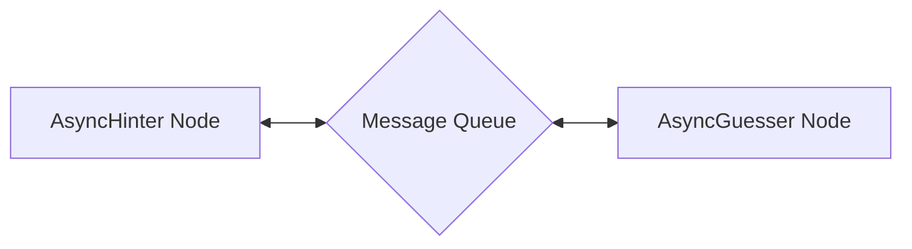

Here's what each component does:

1. **AsyncHinter Node**: Generates hints about the target word while avoiding forbidden words
2. **AsyncGuesser Node**: Makes guesses based on the hints received from the Hinter
3. **Message Queue**: Facilitates asynchronous communication between the agents

## Files

- [`main.py`](./main.py): Main entry point implementing the AsyncHinter and AsyncGuesser nodes and game flow
- [`utils.py`](./utils.py): Utility functions including LLM wrappers for generating hints and guesses
- [`requirements.txt`](./requirements.txt): Lists the required dependencies

## Example Output

```
=========== Taboo Game Starting! ===========
Target word: nostalgic
Forbidden words: ['memory', 'past', 'remember', 'feeling', 'longing']
============================================

Hinter: Here's your hint - Sentiment for earlier times.
Guesser: I guess it's - Nostalgia

Hinter: Here's your hint - Sentiment for earlier times.
Guesser: I guess it's - Reminiscence

Hinter: Here's your hint - Yearning for days gone by.
Guesser: I guess it's - Sentimentality

Hinter: Here's your hint - Reliving cherished moments or experiences.
Guesser: I guess it's - Memories

Hinter: Here's your hint - Recollection of cherished experiences.
Guesser: I guess it's - Reflection

Hinter: Here's your hint - Yearning for earlier times.
Guesser: I guess it's - Longing

Hinter: Here's your hint - Sentiment for earlier times.
Guesser: I guess it's - Nostalgic
Game Over - Correct guess!
```


</details>

## Parallel Batch Translation Process ([python-parallel-batch](https://github.com/zvictor/brainyflow/tree/main/cookbook/python-parallel-batch))
Complexity Points: 8
[🦕🦕🦕🦕🦕]

This project demonstrates using BrainyFlow's async and parallel features (`ParallelFlow`, `Node`) to translate a document into multiple languages concurrently.<details>
<summary><strong>Details</strong></summary>


# Parallel Batch Translation Process

This project demonstrates using BrainyFlow's async and parallel features (`ParallelFlow`, `Node`) to translate a document into multiple languages concurrently.

- Check out the [Substack Post Tutorial](https://brainyflow.substack.com/p/parallel-llm-calls-from-scratch-tutorial) for more!

## Goal

Translate `../../README.md` into multiple languages (Chinese, Spanish, etc.) in parallel, saving each to a file in the `translations/` directory. The main goal is to compare execution time against a sequential process.

## Getting Started

1. Install requirements:

```bash
pip install -r requirements.txt
```

2. Set API Key:
   Set the environment variable for your Anthropic API key.

   ```bash
   export ANTHROPIC_API_KEY="your-api-key-here"
   ```

   _(Replace `"your-api-key-here"` with your actual key)_
   _(Alternatively, place `ANTHROPIC_API_KEY=your-api-key-here` in a `.env` file)_

3. Verify API Key (Optional):
   Run a quick check using the utility script.

   ```bash
   python utils.py
   ```

   _(Note: This requires a valid API key to be set.)_

4. Run the translation process:
   ```bash
   python main.py
   ```

## How It Works

The implementation uses a `Node` that processes translation requests concurrently. The `TranslateTextNodeParallel`:

1. Prepares batches, pairing the source text with each target language.

2. Executes translation calls to the LLM for all languages concurrently using `async` operations.

3. Saves the translated content to individual files (`translations/README_LANGUAGE.md`).

This approach leverages `asyncio` and parallel execution to speed up I/O-bound tasks like multiple API calls.

## Example Output & Comparison

Running this parallel version significantly reduces the total time compared to a sequential approach:

```
# --- Sequential Run Output (from brainyflow-batch) ---
Starting sequential translation into 8 languages...
Translated Chinese text
...
Translated Korean text
Saved translation to translations/README_CHINESE.md
...
Saved translation to translations/README_KOREAN.md

Total sequential translation time: ~1136 seconds

=== Translation Complete ===
Translations saved to: translations
============================


# --- Parallel Run Output (this example) ---
Starting parallel translation into 8 languages...
Translated French text
Translated Portuguese text
... # Messages may appear interleaved
Translated Spanish text
Saved translation to translations/README_CHINESE.md
...
Saved translation to translations/README_KOREAN.md

Total parallel translation time: ~209 seconds

=== Translation Complete ===
Translations saved to: translations
============================
```

_(Actual times will vary based on API response speed and system.)_

## Files

- [`main.py`](./main.py): Implements the parallel batch translation node and flow.
- [`utils.py`](./utils.py): Async wrapper for calling the Anthropic model.
- [`requirements.txt`](./requirements.txt): Project dependencies (includes `aiofiles`).
- [`translations/`](./translations/): Output directory (created automatically).


</details>

## Web Human-in-the-Loop (HITL) Feedback Service ([python-fastapi-hitl](https://github.com/zvictor/brainyflow/tree/main/cookbook/python-fastapi-hitl))
Complexity Points: 9
[🦖🦖🦖🦖🦖🦖]

This project demonstrates a minimal web application for human-in-the-loop workflows using BrainyFlow, FastAPI, and Server-Sent Events (SSE). Users can submit text, have it processed (simulated), review the output, and approve or reject it, potentially triggering reprocessing until approved.<details>
<summary><strong>Details</strong></summary>


# Web Human-in-the-Loop (HITL) Feedback Service

This project demonstrates a minimal web application for human-in-the-loop workflows using BrainyFlow, FastAPI, and Server-Sent Events (SSE). Users can submit text, have it processed (simulated), review the output, and approve or reject it, potentially triggering reprocessing until approved.

<p align="center">
  
</p>

## Features

- **Web UI:** Simple interface for submitting tasks and providing feedback.
- **BrainyFlow Workflow:** Manages the process -> review -> result/reprocess logic.
- **FastAPI Backend:** Serves the UI and handles API requests asynchronously.
- **Server-Sent Events (SSE):** Provides real-time status updates to the client without polling.

## How to Run

1.  Install Dependencies:

    ```bash
    pip install -r requirements.txt
    ```

2.  Run the FastAPI Server:
    Use Uvicorn (or another ASGI server):

    ```bash
    uvicorn server:app --reload --port 8000
    ```

    _(The `--reload` flag is useful for development.)_

3.  Access the Web UI:
    Open your web browser and navigate to `http://127.0.0.1:8000`.

4.  Use the Application:
    - Enter text into the textarea and click "Submit".
    - Observe the status updates pushed via SSE.
    - When prompted ("waiting_for_review"), use the "Approve" or "Reject" buttons.
    - If rejected, the process loops back. If approved, the final result is displayed.

## How It Works

The application uses BrainyFlow to define and execute the feedback loop workflow. FastAPI handles web requests and manages the real-time SSE communication.

**BrainyFlow Workflow:**

The core logic is orchestrated by a `Flow` defined in `flow.py`:

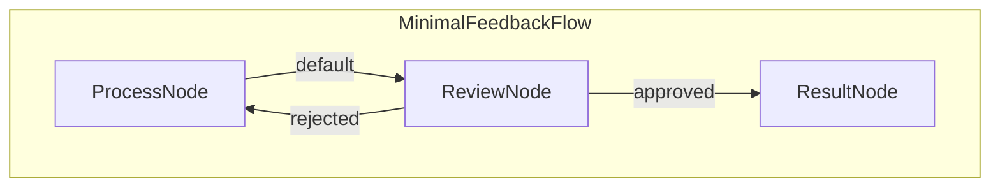

1.  **`ProcessNode`**: Receives input text, calls the minimal `process_task` utility, and stores the output.
2.  **`ReviewNode` (Async)**:
    - Pushes a "waiting_for_review" status with the processed output to the SSE queue.
    - Waits asynchronously for an external signal (triggered by the `/feedback` API endpoint).
    - Based on the received feedback ("approved" or "rejected"), determines the next step in the flow. Stores the result if approved.
3.  **`ResultNode`**: Logs the final approved result.

**FastAPI & SSE Integration:**

- The `/submit` endpoint creates a unique task, initializes the BrainyFlow `shared` state (including an `asyncio.Event` for review and an `asyncio.Queue` for SSE), and schedules the flow execution using `BackgroundTasks`.
- Nodes within the flow (specifically `ReviewNode`'s prep logic) put status updates onto the task-specific `sse_queue`.
- The `/stream/{task_id}` endpoint uses `StreamingResponse` to read from the task's `sse_queue` and push formatted status updates to the connected client via Server-Sent Events.
- The `/feedback/{task_id}` endpoint receives the human's decision, updates the `shared` state, and sets the `asyncio.Event` to unblock the waiting `ReviewNode`.

This setup allows for a decoupled workflow logic (BrainyFlow) and web interaction layer (FastAPI), with efficient real-time updates pushed to the user.

## Files

- [`server.py`](./server.py): The main FastAPI application handling HTTP requests, SSE, state management, and background task scheduling.
- [`nodes.py`](./nodes.py): Defines the BrainyFlow `Node` classes (`ProcessNode`, `ReviewNode`, `ResultNode`) for the workflow steps.
- [`flow.py`](./flow.py): Defines the BrainyFlow `Flow` that connects the nodes into the feedback loop.
- [`utils/process_task.py`](./utils/process_task.py): Contains the minimal simulation function for task processing.
- [`templates/index.html`](./templates/index.html): The HTML structure for the frontend user interface.
- [`static/style.css`](./static/style.css): Basic CSS for styling the frontend.
- [`requirements.txt`](./requirements.txt): Project dependencies (FastAPI, Uvicorn, Jinja2, BrainyFlow).


</details>

## Tool Calling: PDF Vision ([python-tool-pdf-vision](https://github.com/zvictor/brainyflow/tree/main/cookbook/python-tool-pdf-vision))
Complexity Points: 9
[🦖🦖🦖🦖🦖🦖]

A BrainyFlow example project demonstrating PDF processing with OpenAI's Vision API for OCR and text extraction.<details>
<summary><strong>Details</strong></summary>


# Tool Calling: PDF Vision

A BrainyFlow example project demonstrating PDF processing with OpenAI's Vision API for OCR and text extraction.

## Features

- Convert PDF pages to images while maintaining quality and size limits
- Extract text from scanned documents using GPT-4 Vision API
- Support for custom extraction prompts
- Maintain page order and formatting in extracted text
- Batch processing of multiple PDFs from a directory

## Installation

1. Clone the repository
2. Install dependencies:
   ```bash
   pip install -r requirements.txt
   ```
3. Set your OpenAI API key as an environment variable:
   ```bash
   export OPENAI_API_KEY=your_api_key_here
   ```

## Usage

1. Place your PDF files in the `pdfs` directory
2. Run the example:
   ```bash
   python main.py
   ```
   The script will process all PDF files in the `pdfs` directory and output the extracted text for each one.

## Project Structure

```
brainyflow-tool-pdf-vision/
├── pdfs/           # Directory for PDF files to process
├── tools/
│   ├── pdf.py     # PDF to image conversion
│   └── vision.py  # Vision API integration
├── utils/
│   └── call_llm.py # OpenAI client config
├── nodes.py       # BrainyFlow nodes
├── flow.py        # Flow configuration
└── main.py        # Example usage
```

## Flow Description

1. **LoadPDFNode**: Loads PDF and converts pages to images
2. **ExtractTextNode**: Processes images with Vision API
3. **CombineResultsNode**: Combines extracted text from all pages

## Customization

You can customize the extraction by modifying the prompt in `shared`:

```python
shared = {
    "pdf_path": "your_file.pdf",
    "extraction_prompt": "Your custom prompt here"
}
```

## Limitations

- Maximum PDF page size: 2000px (configurable in `tools/pdf.py`)
- Vision API token limit: 1000 tokens per response
- Image size limit: 20MB per image for Vision API

## License

MIT


</details>

## Nested Batch Flow Example ([python-nested-batch](https://github.com/zvictor/brainyflow/tree/main/cookbook/python-nested-batch))
Complexity Points: 9.5
[🦖🦖🦖🦖🦖🦖]

This example demonstrates Nested batch Flow using a simple school grades calculator.<details>
<summary><strong>Details</strong></summary>


# Nested Batch Flow Example

This example demonstrates Nested batch Flow using a simple school grades calculator.

## What this Example Does

Calculates average grades for:

1. Each student in a class
2. Each class in the school

## Structure

```
school/
├── class_a/
│   ├── student1.txt  (grades: 7.5, 8.0, 9.0)
│   └── student2.txt  (grades: 8.5, 7.0, 9.5)
└── class_b/
    ├── student3.txt  (grades: 6.5, 8.5, 7.0)
    └── student4.txt  (grades: 9.0, 9.5, 8.0)
```

## Running the Example

```bash
pip install -r requirements.txt
python main.py
```

## Expected Output

```
Processing class_a...
- student1: Average = 8.2
- student2: Average = 8.3
Class A Average: 8.25

Processing class_b...
- student3: Average = 7.3
- student4: Average = 8.8
Class B Average: 8.05

School Average: 8.15
```


</details>

## Web Crawler with Content Analysis ([python-tool-crawler](https://github.com/zvictor/brainyflow/tree/main/cookbook/python-tool-crawler))
Complexity Points: 9.5
[🦖🦖🦖🦖🦖🦖]

A web crawler tool built with BrainyFlow that crawls websites and analyzes content using LLM.<details>
<summary><strong>Details</strong></summary>


# Web Crawler with Content Analysis

A web crawler tool built with BrainyFlow that crawls websites and analyzes content using LLM.

## Features

- Crawls websites while respecting domain boundaries
- Extracts text content and links from pages
- Analyzes content using GPT-4 to generate:
  - Page summaries
  - Main topics/keywords
  - Content type classification
- Processes pages in batches for efficiency
- Generates a comprehensive analysis report

## Installation

1. Clone the repository
2. Install dependencies:
   ```bash
   pip install -r requirements.txt
   ```
3. Set your OpenAI API key:
   ```bash
   export OPENAI_API_KEY='your-api-key'
   ```

## Usage

Run the crawler:

```bash
python main.py
```

You will be prompted to:

1. Enter the website URL to crawl
2. Specify maximum number of pages to crawl (default: 10)

The tool will then:

1. Crawl the specified website
2. Extract and analyze content using GPT-4
3. Generate a report with findings

## Project Structure

```
brainyflow-tool-crawler/
├── tools/
│   ├── crawler.py     # Web crawling functionality
│   └── parser.py      # Content analysis using LLM
├── utils/
│   └── call_llm.py    # LLM API wrapper
├── nodes.py           # BrainyFlow nodes
├── flow.py           # Flow configuration
├── main.py           # Main script
└── requirements.txt   # Dependencies
```

## Limitations

- Only crawls within the same domain
- Text content only (no images/media)
- Rate limited by OpenAI API
- Basic error handling

## Dependencies

- brainyflow: Flow-based processing
- requests: HTTP requests
- beautifulsoup4: HTML parsing
- openai: GPT-4 API access


</details>

## Resume Qualification - Map Reduce Example ([python-map-reduce](https://github.com/zvictor/brainyflow/tree/main/cookbook/python-map-reduce))
Complexity Points: 10
[☄️☄️☄️☄️☄️☄️☄️]

A BrainyFlow example that demonstrates how to implement a Map-Reduce pattern for processing and evaluating resumes.<details>
<summary><strong>Details</strong></summary>


# Resume Qualification - Map Reduce Example

A BrainyFlow example that demonstrates how to implement a Map-Reduce pattern for processing and evaluating resumes.

## Features

- Read and process multiple resume files using a Map-Reduce pattern
- Evaluate each resume individually using an LLM with structured YAML output
- Determine if candidates qualify for technical roles based on specific criteria
- Aggregate results to generate qualification statistics and summaries

## Getting Started

1. Install the required dependencies:

```bash
pip install -r requirements.txt
```

2. Set your OpenAI API key as an environment variable:

```bash
export OPENAI_API_KEY=your_api_key_here
```

3. Run the application:

```bash
python main.py
```

## How It Works

The workflow follows a classic Map-Reduce pattern with sequential nodes.

## Files

- [`main.py`](./main.py): Main entry point for running the resume qualification workflow
- [`flow.py`](./flow.py): Defines the flow that connects the nodes
- [`nodes.py`](./nodes.py): Contains the node classes for each step in the workflow
- [`utils.py`](./utils.py): Utility functions including the LLM wrapper
- [`requirements.txt`](./requirements.txt): Lists the required dependencies
- [`data/`](./data/): Directory containing sample resume files for evaluation

## Example Output

```
Starting resume qualification processing...

===== Resume Qualification Summary =====
Total candidates evaluated: 5
Qualified candidates: 2 (40.0%)

Qualified candidates:
- Emily Johnson
- John Smith

Detailed evaluation results:
✗ Michael Williams (resume3.txt)
✓ Emily Johnson (resume2.txt)
✗ Lisa Chen (resume4.txt)
✗ Robert Taylor (resume5.txt)
✓ John Smith (resume1.txt)

Resume processing complete!
```


</details>

## Async Recipe Finder ([python-async-basic](https://github.com/zvictor/brainyflow/tree/main/cookbook/python-async-basic))
Complexity Points: 10.5
[☄️☄️☄️☄️☄️☄️☄️]

This example demonstrates async operations using a simple Recipe Finder that:<details>
<summary><strong>Details</strong></summary>


# Async Recipe Finder

This example demonstrates async operations using a simple Recipe Finder that:

1. Fetches recipes from an API (async HTTP)
2. Processes them with an LLM (async LLM)
3. Waits for user confirmation (async input)

## What this Example Does

When you run the example:

1. You enter an ingredient (e.g., "chicken")
2. It searches for recipes (async API call)
3. It suggests a recipe (async LLM call)
4. You approve or reject the suggestion
5. If rejected, it tries again with a different recipe

## How it Works

1. **FetchRecipes (Node)**

   ```python
   async def prep(self, shared):
       ingredient = input("Enter ingredient: ")
       return ingredient

   async def exec(self, ingredient):
       # Async API call
       recipes = await fetch_recipes(ingredient)
       return recipes
   ```

2. **SuggestRecipe (Node)**

   ```python
   async def exec(self, recipes):
       # Async LLM call
       suggestion = await call_llm_async(
           f"Choose best recipe from: {recipes}"
       )
       return suggestion
   ```

3. **GetApproval (Node)**
   ```python
   async def post(self, shared, prep_res, suggestion):
       # Async user input
       answer = await get_user_input(
           f"Accept {suggestion}? (y/n): "
       )
       self.trigger("accept" if answer == "y" else "retry")
   ```

## Running the Example

```bash
pip install -r requirements.txt
python main.py
```

## Sample Interaction

```
Enter ingredient: chicken
Fetching recipes...
Found 3 recipes.

Suggesting best recipe...
How about: Grilled Chicken with Herbs

Accept this recipe? (y/n): n
Suggesting another recipe...
How about: Chicken Stir Fry

Accept this recipe? (y/n): y
Great choice! Here's your recipe...
```

## Key Concepts

1. **Async Operations**: Using `async/await` for:

   - API calls (non-blocking I/O)
   - LLM calls (potentially slow)
   - User input (waiting for response)

2. **Node Methods**:

   - `prep`: Setup and data gathering
   - `exec`: Main async processing
   - `post`: Post-processing and decisions

3. **Flow Control**:
   - Actions ("accept"/"retry") control flow
   - Retry loop for rejected suggestions


</details>

## Chat with Memory Retrieval ([python-chat-memory](https://github.com/zvictor/brainyflow/tree/main/cookbook/python-chat-memory))
Complexity Points: 10.5
[☄️☄️☄️☄️☄️☄️☄️]

A chat application with memory retrieval using BrainyFlow. This example maintains a sliding window of recent conversations while retrieving relevant past conversations based on context.<details>
<summary><strong>Details</strong></summary>


# Chat with Memory Retrieval

A chat application with memory retrieval using BrainyFlow. This example maintains a sliding window of recent conversations while retrieving relevant past conversations based on context.

## Features

- Maintains a window of 3 most recent conversation pairs
- Archives older conversations with embeddings
- Uses vector similarity to retrieve the most relevant past conversation
- Combines recent context (3 pairs) with retrieved context (1 pair) for better responses

## Run It

1. Make sure your OpenAI API key is set:

   ```bash
   export OPENAI_API_KEY="your-api-key-here"
   ```

2. Install requirements and run the application:
   ```bash
   pip install -r requirements.txt
   python main.py
   ```

## How It Works

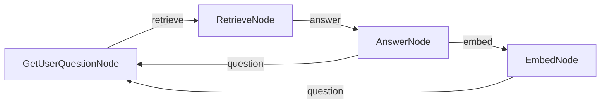

The chat application uses:

- Four specialized nodes:
  - `GetUserQuestionNode`: Handles interactive user input
  - `RetrieveNode`: Finds relevant past conversations using vector similarity
  - `AnswerNode`: Generates responses using both recent and retrieved context
  - `EmbedNode`: Archives older conversations with embeddings
- A sliding window approach that maintains only the 3 most recent conversation pairs in active context

## Files

- [`nodes.py`](./nodes.py): Four node implementations with clear separation of concerns
- [`flow.py`](./flow.py): Chat flow structure definition
- [`main.py`](./main.py): Entry point for running the demo
- [`utils/`](./utils/): Utility functions for embeddings, LLM calls, and vector operations

## Example Output

```
==================================================
BrainyFlow Chat with Memory
==================================================
This chat keeps your 3 most recent conversations
and brings back relevant past conversations when helpful
Type 'exit' to end the conversation
==================================================
Welcome to the interactive chat! Type 'exit' to end the conversation.

You: remember, my cat name is Whiskers and she only drinks from running water taps

Assistant: Got it! Whiskers only drinks from running water taps. If you have any questions or need advice related to her, feel free to ask!

You: remember, I have a peanut allergy but I can eat almonds and cashews without problems

Assistant: Understood! You have a peanut allergy but can safely eat almonds and cashews. If you need any assistance or information related to your dietary preferences or restrictions, just let me know!

You: remember, my anniversary is June 17th and I always forget to buy a gift until the last minute

Assistant: Got it! Your anniversary is on June 17th, and you often remember to buy a gift at the last minute. If you'd like, I can help you brainstorm gift ideas or set reminders as the date approaches!

You: remember, I lived in Portugal for 3 years when I was a child and still speak some Portuguese

Assistant: That's great to know! You lived in Portugal for three years during your childhood and still speak some Portuguese. If you ever want to practice or need help with anything related to Portuguese language or culture, feel free to ask!
✅ Added conversation to index at position 0
✅ Index now contains 1 conversations

You: remember, my favorite dessert is tiramisu but only if it's made with real mascarpone cheese
🔍 Finding relevant conversation for: remember, my favorite dessert ...
📄 Retrieved conversation (distance: 0.5008)

Assistant: Got it! Your favorite dessert is tiramisu, but only when it's made with real mascarpone cheese. If you ever need recommendations or recipes, just let me know!
✅ Added conversation to index at position 1
✅ Index now contains 2 conversations

You: remember, I collect vintage mechanical watches and my most valuable one is a 1965 Omega Seamaster
🔍 Finding relevant conversation for: remember, I collect vintage me...
📄 Retrieved conversation (distance: 0.5374)

Assistant: Got it! You collect vintage mechanical watches, and your most valuable piece is a 1965 Omega Seamaster. If you have questions about watches or need assistance with your collection, feel free to reach out!
✅ Added conversation to index at position 2
✅ Index now contains 3 conversations

You: what's my cat name?
🔍 Finding relevant conversation for: what's my cat name?...
📄 Retrieved conversation (distance: 0.3643)

Assistant: Your cat's name is Whiskers.
✅ Added conversation to index at position 3
✅ Index now contains 4 conversations
```


</details>

## Parallel Image Processor ([python-parallel-batch-flow](https://github.com/zvictor/brainyflow/tree/main/cookbook/python-parallel-batch-flow))
Complexity Points: 10.5
[☄️☄️☄️☄️☄️☄️☄️]

Demonstrates how a batch ParallelFlow processes multiple images with multiple filters &gt;8x faster than sequential processing.<details>
<summary><strong>Details</strong></summary>


# Parallel Image Processor

Demonstrates how a batch ParallelFlow processes multiple images with multiple filters >8x faster than sequential processing.

## Features

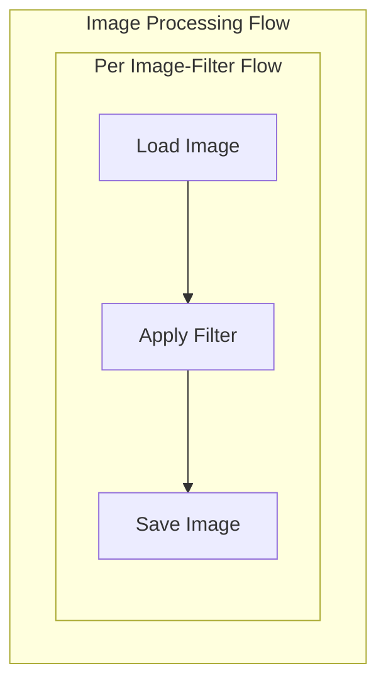

- Processes images with multiple filters in parallel
- Applies three different filters (grayscale, blur, sepia)
- Shows significant speed improvement over sequential processing
- Manages system resources with semaphores

## Run It

```bash
pip install -r requirements.txt
python main.py
```

## Output

```=== Processing Images in Parallel ===
Parallel Image Processor
------------------------------
Found 3 images:
- images/bird.jpg
- images/cat.jpg
- images/dog.jpg

Running sequential batch flow...
Processing 3 images with 3 filters...
Total combinations: 9
Loading image: images/bird.jpg
Applying grayscale filter...
Saved: output/bird_grayscale.jpg
...etc

Timing Results:
Sequential batch processing: 13.76 seconds
Parallel batch processing: 1.71 seconds
Speedup: 8.04x

Processing complete! Check the output/ directory for results.
```

## Key Points

- **Sequential**: Total time = sum of all item times

  - Good for: Rate-limited APIs, maintaining order

- **Parallel**: Total time ≈ longest single item time
  - Good for: I/O-bound tasks, independent operations


</details>

## Agent Example ([typescript-agent](https://github.com/zvictor/brainyflow/tree/main/cookbook/typescript-agent))
Complexity Points: 11
[🐭🐭🐭🐭🐭🐭🐭🐭]

This example demonstrates how to build a question-answering agent using TypeScript and BrainyFlow. The agent can search the web for information and provide answers based on the search results.<details>
<summary><strong>Details</strong></summary>


# Agent Example

This example demonstrates how to build a question-answering agent using TypeScript and BrainyFlow. The agent can search the web for information and provide answers based on the search results.

## Overview

This agent demonstrates the following capabilities:

- Decision-making based on context
- Web searching for information
- Generating comprehensive answers

### Step and Usage

```bash
# from BrainyFlow root directory
cd cookbook/typescript-agent

cp .env.example .env # add your API key

npm install
npm run agent -- "this is your question"
```

Default question is "What is the latest Deepseek LLM model?" if you did not provide any argument after `npm run agent`

## Features

- Performs web searches to gather information
- Collects and processes information from search results
- Answers user questions based on the gathered information

## How It Works

The agent flow comprises three nodes:

1. **DecideNode**: The core of the agent flow that determines whether it can answer the question directly or needs to search for more information.
2. **SearchNode**: Executes web searches when the DecideNode determines that more information is needed.
3. **AnswerNode**: Generates a comprehensive answer when the DecideNode determines that sufficient context is available.

The flow starts with the DecideNode, which decides whether to search (triggering SearchNode) or answer (triggering AnswerNode) based on the current context. This decision is made in the `post` method, which returns either "search" or "answer".

After completing a search, the SearchNode's `post` method returns results to the DecideNode via the "decide" action. This allows the DecideNode to determine whether to search again or provide a final answer when the context is sufficient.

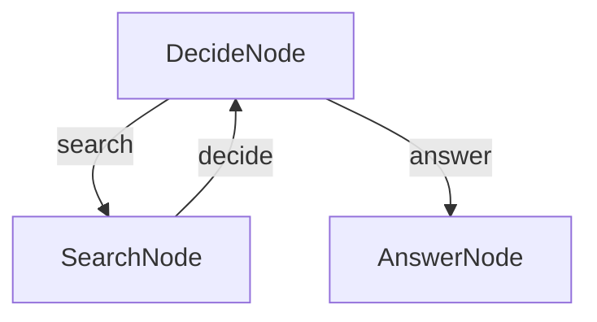


</details>

## Research Agent ([python-agent](https://github.com/zvictor/brainyflow/tree/main/cookbook/python-agent))
Complexity Points: 11.5
[🐭🐭🐭🐭🐭🐭🐭🐭]

This project demonstrates a simple yet powerful LLM-powered research agent.<details>
<summary><strong>Details</strong></summary>


# Research Agent

This project demonstrates a simple yet powerful LLM-powered research agent.

👉 Run the tutorial in your browser: [Try Google Colab Notebook](https://colab.research.google.com/github/zvictor/BrainyFlow/blob/main/cookbook/python-agent/demo.ipynb)

## Features

- Performs web searches to gather information
- Makes decisions about when to search vs. when to answer
- Generates comprehensive answers based on research findings

## Getting Started

1. Install the packages you need with this simple command:

```bash
pip install -r requirements.txt
```

2. Let's get your OpenAI API key ready:

```bash
export OPENAI_API_KEY="your-api-key-here"
```

3. Let's do a quick check to make sure your API key is working properly:

```bash
python utils.py
```

This will test both the LLM call and web search features. If you see responses, you're good to go!

4. Try out the agent with the default question (about Nobel Prize winners):

```bash
python main.py
```

5. Got a burning question? Ask anything you want by using the `--` prefix:

```bash
python main.py --"What is quantum computing?"
```

## How It Works?

The magic happens through a simple but powerful graph structure with three main parts:

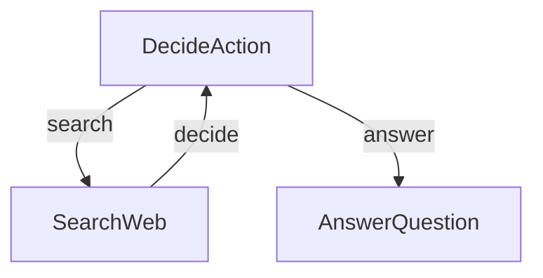

Here's what each part does:

1. **DecideAction**: The brain that figures out whether to search or answer
2. **SearchWeb**: The researcher that goes out and finds information
3. **AnswerQuestion**: The writer that crafts the final answer

Here's what's in each file:

- [`main.py`](./main.py): The starting point - runs the whole show!
- [`flow.py`](./flow.py): Connects everything together into a smart agent
- [`nodes.py`](./nodes.py): The building blocks that make decisions and take actions
- [`utils.py`](./utils.py): Helper functions for talking to the LLM and searching the web


</details>

## MCP Demo ([python-mcp](https://github.com/zvictor/brainyflow/tree/main/cookbook/python-mcp))
Complexity Points: 11.5
[🐭🐭🐭🐭🐭🐭🐭🐭]

This project shows how to build an agent that performs addition using BrainyFlow and Model Context Protocol (MCP). It presents a comparison between using MCP and basic function calling approaches.<details>
<summary><strong>Details</strong></summary>


# MCP Demo

This project shows how to build an agent that performs addition using BrainyFlow and Model Context Protocol (MCP). It presents a comparison between using MCP and basic function calling approaches.

This implementation is based on this tutorial (for Pocketflow): [MCP Simply Explained: Function Calling Rebranded or Genuine Breakthrough?](https://zacharyhuang.substack.com/p/mcp-simply-explained-function-calling)

## Features

- Mathematical operation tools through a simple terminal interface
- Integration with Model Context Protocol (MCP)
- Comparison between MCP and direct function calling
- **Simple toggle** between MCP and local function calling

## How to Run

1. Set your API key:

   ```bash
   export OPENAI_API_KEY="your-api-key-here"
   ```

   Or update it directly in `utils.py`

2. Install and run:
   ```bash
   pip install -r requirements.txt
   python main.py
   ```

## MCP vs Function Calling

To compare both approaches, this demo provides local function alternatives that don't require MCP:

- **Toggle with a simple flag:** Set `MCP = True` or `MCP = False` at the top of `utils.py` to switch between MCP and local implementations.
- No code changes needed! The application automatically uses either:
  - MCP server tools when `MCP = True`
  - Local function implementations when `MCP = False`

This allows you to see the difference between the two approaches while keeping the same workflow.

### Function Calling

- Functions are directly embedded in application code
- Each new tool requires modifying the application
- Tools are defined within the application itself

### MCP Approach

- Tools live in separate MCP servers
- Standard protocol for all tool interactions
- New tools can be added without changing the agent
- AI can interact with tools through a consistent interface

## How It Works


The agent uses BrainyFlow to create a workflow where:

1. It takes user input about numbers
2. Connects to the MCP server for mathematical operations (or uses local functions based on the `MCP` flag)
3. Returns the result

## Files

- [`main.py`](./main.py): Implementation of the addition agent using BrainyFlow
- [`utils.py`](./utils.py): Helper functions for API calls and MCP integration
- [`simple_server.py`](./simple_server.py): MCP server that provides the addition tool


</details>

## Voice Chat ([python-voice-chat](https://github.com/zvictor/brainyflow/tree/main/cookbook/python-voice-chat))
Complexity Points: 11.5
[🐭🐭🐭🐭🐭🐭🐭🐭]

This project demonstrates a voice-based interactive chat application built with BrainyFlow. Users can speak their queries, and the system will respond with spoken answers from an LLM, maintaining conversation history.<details>
<summary><strong>Details</strong></summary>


# Voice Chat

This project demonstrates a voice-based interactive chat application built with BrainyFlow. Users can speak their queries, and the system will respond with spoken answers from an LLM, maintaining conversation history.

- Check out the [Substack Post Tutorial](https://brainyflow.substack.com/p/build-your-own-voice-chatbot-from) for more!

## Features

- **Voice Activity Detection (VAD)**: Automatically detects when the user starts and stops speaking.
- **Speech-to-Text (STT)**: Converts spoken audio into text using OpenAI.
- **LLM Interaction**: Processes the transcribed text with an LLM (e.g., GPT-4o), maintaining conversation history.
- **Text-to-Speech (TTS)**: Converts the LLM's text response back into audible speech using OpenAI.
- **Continuous Conversation**: Loops back to listen for the next user query after responding, allowing for an ongoing dialogue.

## How to Run

1.  **Set your OpenAI API key**:

    ```bash
    export OPENAI_API_KEY="your-api-key-here"
    ```

    Ensure this environment variable is set, as the utility scripts for STT, LLM, and TTS rely on it.
    You can test individual utility functions (e.g., `python utils/call_llm.py`, `python utils/text_to_speech.py`) to help verify your API key and setup.

2.  **Install dependencies**:
    Make sure you have Python installed. Then, install the required libraries using pip:

    ```bash
    pip install -r requirements.txt
    ```

    This will install libraries such as `openai`, `brainyflow`, `sounddevice`, `numpy`, `scipy`, and `soundfile`.

    **Note for Linux users**: `sounddevice` may require PortAudio. If you encounter issues, you might need to install it first:

    ```bash
    sudo apt-get update && sudo apt-get install -y portaudio19-dev
    ```

3.  **Run the application**:
    ```bash
    python main.py
    ```
    Follow the console prompts. The application will start listening when you see "Listening for your query...".

## How It Works

The application uses a BrainyFlow workflow to manage the conversation steps:

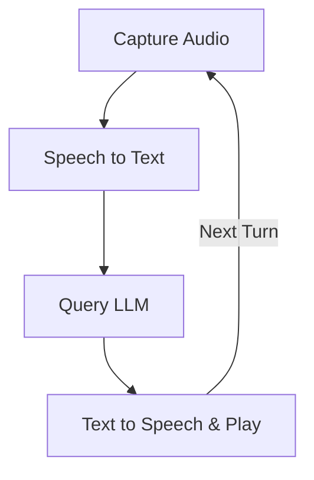

Here's what each node in the flow does:

1.  **`CaptureAudioNode`**: Records audio from the user's microphone. It uses Voice Activity Detection (VAD) to start recording when speech is detected and stop when silence is detected.
2.  **`SpeechToTextNode`**: Takes the recorded audio data, converts it to a suitable format, and sends it to OpenAI's STT API (gpt-4o-transcribe) to get the transcribed text.
3.  **`QueryLLMNode`**: Takes the transcribed text from the user, along with the existing conversation history, and sends it to an LLM (OpenAI's GPT-4o model) to generate an intelligent response.
4.  **`TextToSpeechNode`**: Receives the text response from the LLM, converts it into audio using OpenAI's TTS API (gpt-4o-mini-tts), and plays the audio back to the user. If the conversation is set to continue, it transitions back to the `CaptureAudioNode`.

## Example Interaction

When you run `main.py`:

1.  The console will display:
    ```
    Starting BrainyFlow Voice Chat...
    Speak your query after 'Listening for your query...' appears.
    ...
    ```
2.  When you see `Listening for your query...`, speak clearly into your microphone.
3.  After you stop speaking, the console will show updates:
    ```
    Audio captured (X.XXs), proceeding to STT.
    Converting speech to text...
    User: [Your transcribed query will appear here]
    Sending query to LLM...
    LLM: [The LLM's response text will appear here]
    Converting LLM response to speech...
    Playing LLM response...
    ```
4.  You will hear the LLM's response spoken aloud.
5.  The application will then loop back, and you'll see `Listening for your query...` again, ready for your next input.

The conversation continues in this manner. To stop the application, you typically need to interrupt it (e.g., Ctrl+C in the terminal), as it's designed to loop continuously.


</details>

## Text-to-SQL Workflow ([python-text2sql](https://github.com/zvictor/brainyflow/tree/main/cookbook/python-text2sql))
Complexity Points: 12
[🐭🐭🐭🐭🐭🐭🐭🐭]

A BrainyFlow example demonstrating a text-to-SQL workflow that converts natural language questions into executable SQL queries for an SQLite database, including an LLM-powered debugging loop for failed queries.<details>
<summary><strong>Details</strong></summary>


# Text-to-SQL Workflow

A BrainyFlow example demonstrating a text-to-SQL workflow that converts natural language questions into executable SQL queries for an SQLite database, including an LLM-powered debugging loop for failed queries.

- Check out the [Substack Post Tutorial](https://zacharyhuang.substack.com/p/text-to-sql-from-scratch-tutorial) (for Pocketflow) for more!

## Features

- **Schema Awareness**: Automatically retrieves the database schema to provide context to the LLM.
- **LLM-Powered SQL Generation**: Uses an LLM (GPT-4o) to translate natural language questions into SQLite queries (using YAML structured output).
- **Automated Debugging Loop**: If SQL execution fails, an LLM attempts to correct the query based on the error message. This process repeats up to a configurable number of times.

## Getting Started

1.  **Install Packages:**

    ```bash
    pip install -r requirements.txt
    ```

2.  **Set API Key:**
    Set the environment variable for your OpenAI API key.

    ```bash
    export OPENAI_API_KEY="your-api-key-here"
    ```

    _(Replace `"your-api-key-here"` with your actual key)_

3.  **Verify API Key (Optional):**
    Run a quick check using the utility script. If successful, it will print a short joke.

    ```bash
    python utils.py
    ```

    _(Note: This requires a valid API key to be set.)_

4.  **Run Default Example:**
    Execute the main script. This will create the sample `ecommerce.db` if it doesn't exist and run the workflow with a default query.

    ```bash
    python main.py
    ```

    The default query is:

    > Show me the names and email addresses of customers from New York

5.  **Run Custom Query:**
    Provide your own natural language query as command-line arguments after the script name.
    ```bash
    python main.py What is the total stock quantity for products in the 'Accessories' category?
    ```
    Or, for queries with spaces, ensure they are treated as a single argument by the shell if necessary (quotes might help depending on your shell):
    ```bash
    python main.py "List orders placed in the last 30 days with status 'shipped'"
    ```

## How It Works

The workflow uses several nodes connected in a sequence, with a loop for debugging failed SQL queries.

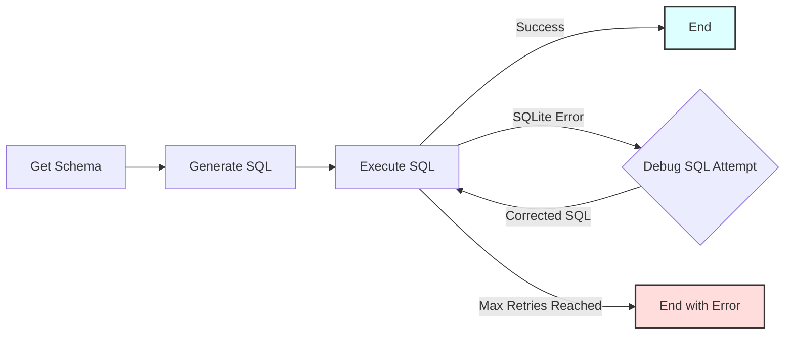

**Node Descriptions:**

1.  **`GetSchema`**: Connects to the SQLite database (`ecommerce.db` by default) and extracts the schema (table names and columns).
2.  **`GenerateSQL`**: Takes the natural language query and the database schema, prompts the LLM to generate an SQLite query (expecting YAML output with the SQL), and parses the result.
3.  **`ExecuteSQL`**: Attempts to run the generated SQL against the database.
    - If successful, the results are stored, and the flow ends successfully.
    - If an `sqlite3.Error` occurs (e.g., syntax error), it captures the error message and triggers the debug loop.
4.  **`DebugSQL`**: If `ExecuteSQL` failed, this node takes the original query, schema, failed SQL, and error message, prompts the LLM to generate a _corrected_ SQL query (again, expecting YAML).
5.  **(Loop)**: The corrected SQL from `DebugSQL` is passed back to `ExecuteSQL` for another attempt.
6.  **(End Conditions)**: The loop continues until `ExecuteSQL` succeeds or the maximum number of debug attempts (default: 3) is reached.

## Files

- [`main.py`](./main.py): Main entry point to run the workflow. Handles command-line arguments for the query.
- [`flow.py`](./flow.py): Defines the BrainyFlow `Flow` connecting the different nodes, including the debug loop logic.
- [`nodes.py`](./nodes.py): Contains the `Node` classes for each step (`GetSchema`, `GenerateSQL`, `ExecuteSQL`, `DebugSQL`).
- [`utils.py`](./utils.py): Contains the minimal `call_llm` utility function.
- [`populate_db.py`](./populate_db.py): Script to create and populate the sample `ecommerce.db` SQLite database.
- [`requirements.txt`](./requirements.txt): Lists Python package dependencies.
- [`README.md`](./README.md): This file.

## Example Output (Successful Run)

```
=== Starting Text-to-SQL Workflow ===
Query: 'total products per category'
Database: ecommerce.db
Max Debug Retries on SQL Error: 3
=============================================

===== DB SCHEMA =====

Table: customers
  - customer_id (INTEGER)
  - first_name (TEXT)
  - last_name (TEXT)
  - email (TEXT)
  - registration_date (DATE)
  - city (TEXT)
  - country (TEXT)

Table: sqlite_sequence
  - name ()
  - seq ()

Table: products
  - product_id (INTEGER)
  - name (TEXT)
  - description (TEXT)
  - category (TEXT)
  - price (REAL)
  - stock_quantity (INTEGER)

Table: orders
  - order_id (INTEGER)
  - customer_id (INTEGER)
  - order_date (TIMESTAMP)
  - status (TEXT)
  - total_amount (REAL)
  - shipping_address (TEXT)

Table: order_items
  - order_item_id (INTEGER)
  - order_id (INTEGER)
  - product_id (INTEGER)
  - quantity (INTEGER)
  - price_per_unit (REAL)

=====================


===== GENERATED SQL (Attempt 1) =====

SELECT category, COUNT(*) AS total_products
FROM products
GROUP BY category

====================================

SQL executed in 0.000 seconds.

===== SQL EXECUTION SUCCESS =====

category | total_products
-------------------------
Accessories | 3
Apparel | 1
Electronics | 3
Home Goods | 2
Sports | 1

=== Workflow Completed Successfully ===
====================================
```


</details>

## Research Supervisor ([python-supervisor](https://github.com/zvictor/brainyflow/tree/main/cookbook/python-supervisor))
Complexity Points: 13
[🐒🐒🐒🐒🐒🐒🐒🐒🐒]

This project demonstrates a supervisor that oversees an unreliable [research agent](../brainyflow-agent) to ensure high-quality answers.<details>
<summary><strong>Details</strong></summary>


# Research Supervisor

This project demonstrates a supervisor that oversees an unreliable [research agent](../brainyflow-agent) to ensure high-quality answers.

## Features

- Evaluates responses for quality and relevance
- Rejects nonsensical or unreliable answers
- Requests new answers until a quality response is produced

## Getting Started

1. Install the packages you need with this simple command:

```bash
pip install -r requirements.txt
```

2. Let's get your OpenAI API key ready:

```bash
export OPENAI_API_KEY="your-api-key-here"
```

3. Let's do a quick check to make sure your API key is working properly:

```bash
python utils.py
```

This will test both the LLM call and web search features. If you see responses, you're good to go!

4. Try out the agent with the default question (about Nobel Prize winners):

```bash
python main.py
```

5. Got a burning question? Ask anything you want by using the `--` prefix:

```bash
python main.py --"What is quantum computing?"
```

## How It Works?

The magic happens through a simple but powerful graph structure with these main components:

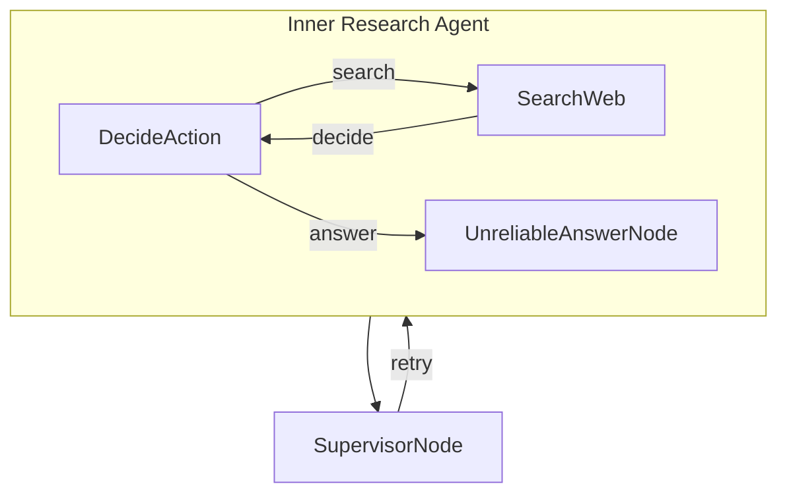

Here's what each part does:

1. **DecideAction**: The brain that figures out whether to search or answer based on current context
2. **SearchWeb**: The researcher that goes out and finds information using web search
3. **UnreliableAnswerNode**: Generates answers (with a 50% chance of being unreliable)
4. **SupervisorNode**: Quality control that validates answers and rejects nonsensical ones

## Example Output

```
🤔 Processing question: Who won the Nobel Prize in Physics 2024?
🤔 Agent deciding what to do next...
🔍 Agent decided to search for: Nobel Prize in Physics 2024 winner
🌐 Searching the web for: Nobel Prize in Physics 2024 winner
📚 Found information, analyzing results...
🤔 Agent deciding what to do next...
💡 Agent decided to answer the question
🤪 Generating unreliable dummy answer...
✅ Answer generated successfully
    🔍 Supervisor checking answer quality...
    ❌ Supervisor rejected answer: Answer appears to be nonsensical or unhelpful
🤔 Agent deciding what to do next...
💡 Agent decided to answer the question
✍️ Crafting final answer...
✅ Answer generated successfully
    🔍 Supervisor checking answer quality...
    ✅ Supervisor approved answer: Answer appears to be legitimate

🎯 Final Answer:
The Nobel Prize in Physics for 2024 was awarded jointly to John J. Hopfield and Geoffrey Hinton. They were recognized "for foundational discoveries and inventions that enable machine learning with artificial neural networks." Their work has been pivotal in the field of artificial intelligence, specifically in developing the theories and technologies that support machine learning using artificial neural networks. John Hopfield is associated with Princeton University, while Geoffrey Hinton is connected to the University of Toronto. Their achievements have laid essential groundwork for advancements in AI and its widespread application across various domains.
```

## Files

- [`main.py`](./main.py): The starting point - runs the whole show!
- [`flow.py`](./flow.py): Connects everything together into a smart agent with supervision
- [`nodes.py`](./nodes.py): The building blocks that make decisions, take actions, and validate answers
- [`utils.py`](./utils.py): Helper functions for talking to the LLM and searching the web


</details>

## Retrieval Augmented Generation (RAG) ([python-rag](https://github.com/zvictor/brainyflow/tree/main/cookbook/python-rag))
Complexity Points: 16
[🤖🤖🤖🤖🤖🤖🤖🤖🤖🤖🤖🤖]

This project demonstrates a simplified RAG system that retrieves relevant documents based on user queries and generates answers using an LLM. This implementation is based directly on this tutorial (for Pocketflow): [Retrieval Augmented Generation (RAG) from Scratch — Tutorial For Dummies](https://zacharyhuang.substack.com/p/retrieval-augmented-generation-rag).<details>
<summary><strong>Details</strong></summary>


# Retrieval Augmented Generation (RAG)

This project demonstrates a simplified RAG system that retrieves relevant documents based on user queries and generates answers using an LLM. This implementation is based directly on this tutorial (for Pocketflow): [Retrieval Augmented Generation (RAG) from Scratch — Tutorial For Dummies](https://zacharyhuang.substack.com/p/retrieval-augmented-generation-rag).

## Features

- Document chunking for processing long texts
- FAISS-powered vector-based document retrieval
- LLM-powered answer generation

## How to Run

1. Set your API key:

   ```bash
   export OPENAI_API_KEY="your-api-key-here"
   ```

   Or update it directly in `utils.py`

   Let's do a quick check to make sure your API key is working properly:

   ```bash
   python utils.py
   ```

2. Install and run with the default query:

   ```bash
   pip install -r requirements.txt
   python main.py
   ```

3. Run the application with a sample query:

   ```bash
   python main.py --"How does the Q-Mesh protocol achieve high transaction speeds?"
   ```

## How It Works

The magic happens through a two-phase pipeline implemented with BrainyFlow:

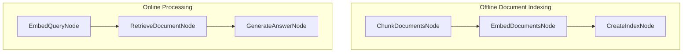

Here's what each part does:

1. **ChunkDocumentsNode**: Breaks documents into smaller chunks for better retrieval
2. **EmbedDocumentsNode**: Converts document chunks into vector representations
3. **CreateIndexNode**: Creates a searchable FAISS index from embeddings
4. **EmbedQueryNode**: Converts user query into the same vector space
5. **RetrieveDocumentNode**: Finds the most similar document using vector search
6. **GenerateAnswerNode**: Uses an LLM to generate an answer based on the retrieved content

## Example Output

```
✅ Created 5 chunks from 5 documents
✅ Created 5 document embeddings
🔍 Creating search index...
✅ Index created with 5 vectors
🔍 Embedding query: How to install BrainyFlow?
🔎 Searching for relevant documents...
📄 Retrieved document (index: 0, distance: 0.3427)
📄 Most relevant text: "BrainyFlow is a 300-line minimalist LLM framework
        Lightweight: Just 300 lines. Zero bloat, zero dependencies, zero vendor lock-in.
        Expressive: Everything you love—(Multi-)Agents, Workflow, RAG, and more.
        Agentic Coding: Let AI Agents (e.g., Cursor AI) build Agents—10x productivity boost!
        To install, pip install brainyflow or just copy the source code (only 300 lines)."

🤖 Generated Answer:
To install BrainyFlow, use the command `pip install brainyflow` or simply copy its 300 lines of source code.
```


</details>

## Agent-to-Agent with A2A Protocol ([python-a2a](https://github.com/zvictor/brainyflow/tree/main/cookbook/python-a2a))
Complexity Points: 20.5
[🌌🌌🌌🌌🌌🌌🌌🌌🌌🌌🌌🌌🌌🌌🌌]

This project demonstrates how to take an existing agent built with the BrainyFlow library and make it accessible to other agents using the **Agent-to-Agent (A2A) communication protocol**.<details>
<summary><strong>Details</strong></summary>


# Agent-to-Agent with A2A Protocol

This project demonstrates how to take an existing agent built with the BrainyFlow library and make it accessible to other agents using the **Agent-to-Agent (A2A) communication protocol**.

This implementation is based on this tutorial for Pocketflow: [A2A Protocol Simply Explained: Here are 3 key differences to MCP!](https://zacharyhuang.substack.com/p/a2a-protocol-simply-explained-here)

## How it Works: A2A Integration

This project combines two main parts:

1.  **BrainyFlow Agent Logic:** The original agent code ([`nodes.py`](nodes.py), [`utils.py`](utils.py), [`flow.py`](flow.py)) defines the internal workflow (Decide -> Search -> Answer). This code is taken directly from the [BrainyFlow Agent Tutorial](https://github.com/zvictor/BrainyFlow/tree/main/cookbook/python-agent).
2.  **A2A Server Wrapper:** Code from the [google/A2A samples repository](https://github.com/google/A2A/tree/main/samples/python) (`common/` directory) provides the necessary infrastructure to host the agent as an A2A-compliant server. _Note: Minor modifications were made to the common server/client code to add detailed logging for educational purposes._
3.  **The Bridge ([`task_manager.py`](task_manager.py)):** A custom `BrainyFlowTaskManager` class acts as the bridge. It receives A2A requests (like `tasks/send`), extracts the user query, runs the BrainyFlow `agent_flow`, takes the final result from the flow's shared state, and packages it back into an A2A `Task` object with the answer as an `Artifact`.

This demonstrates how a non-A2A agent framework can be exposed over the A2A protocol by implementing a specific `TaskManager`.

## Simplified Interaction Sequence

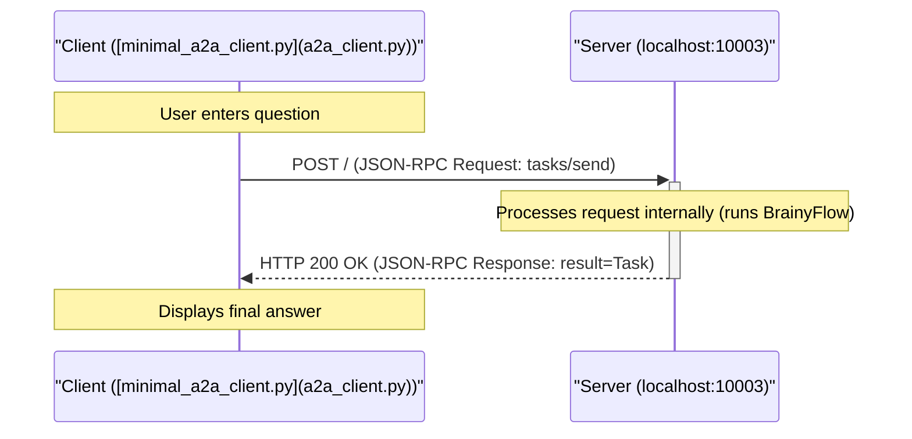

## Getting Started

### Prerequisites

- Python 3.10+ (due to type hinting used in the A2A `common` code)
- An OpenAI API Key

### Installation

1.  Install dependencies:

    ```bash
    pip install -r requirements.txt
    ```

2.  Set your OpenAI API key as an environment variable:

    ```bash
    export OPENAI_API_KEY="your-api-key-here"
    ```

    Let's do a quick check to make sure your API key is working properly:

    ```bash
    python utils.py
    ```

3.  Run the server from this directory:

    ```bash
    python a2a_server.py --port 10003
    ```

    You should see logs indicating the server has started on `http://localhost:10003`.

4.  Run the Client in a _separate terminal_

    ```bash
    python a2a_client.py --agent-url http://localhost:10003
    ```

5.  Follow the instructions in the client terminal to ask questions. Type `:q` or `quit` to exit the client.

## Example Interaction Logs

**(Server Log - showing internal BrainyFlow steps)**

```
2025-04-12 17:20:40,893 - __main__ - INFO - Starting BrainyFlow A2A server on http://localhost:10003
INFO:     Started server process [677223]
INFO:     Waiting for application startup.
INFO:     Application startup complete.
INFO:     Uvicorn running on http://localhost:10003 (Press CTRL+C to quit)
2025-04-12 17:20:57,647 - A2AServer - INFO - <- Received Request (ID: d3f3fb93350d47d9a94ca12bb62b656b):
{
  "jsonrpc": "2.0",
  "id": "d3f3fb93350d47d9a94ca12bb62b656b",
  "method": "tasks/send",
  "params": {
    "id": "46c3ce7b941a4fff9b8e3b644d6db5f4",
    "sessionId": "f3e12b8424c44241be881cd4bb8a269f",
    "message": {
      "role": "user",
      "parts": [
        {
          "type": "text",
          "text": "Who won the Nobel Prize in Physics 2024?"
        }
      ]
    },
    "acceptedOutputModes": [
      "text",
      "text/plain"
    ]
  }
}
2025-04-12 17:20:57,647 - task_manager - INFO - Received task send request: 46c3ce7b941a4fff9b8e3b644d6db5f4
2025-04-12 17:20:57,647 - common.server.task_manager - INFO - Upserting task 46c3ce7b941a4fff9b8e3b644d6db5f4
2025-04-12 17:20:57,647 - task_manager - INFO - Running BrainyFlow for task 46c3ce7b941a4fff9b8e3b644d6db5f4...
🤔 Agent deciding what to do next...
2025-04-12 17:20:59,213 - httpx - INFO - HTTP Request: POST https://api.openai.com/v1/chat/completions "HTTP/1.1 200 OK"
🔍 Agent decided to search for: 2024 Nobel Prize in Physics winner
🌐 Searching the web for: 2024 Nobel Prize in Physics winner
2025-04-12 17:20:59,974 - primp - INFO - response: https://lite.duckduckgo.com/lite/ 200
📚 Found information, analyzing results...
🤔 Agent deciding what to do next...
2025-04-12 17:21:01,619 - httpx - INFO - HTTP Request: POST https://api.openai.com/v1/chat/completions "HTTP/1.1 200 OK"
💡 Agent decided to answer the question
✍️ Crafting final answer...
2025-04-12 17:21:03,833 - httpx - INFO - HTTP Request: POST https://api.openai.com/v1/chat/completions "HTTP/1.1 200 OK"
✅ Answer generated successfully
2025-04-12 17:21:03,834 - task_manager - INFO - BrainyFlow completed for task 46c3ce7b941a4fff9b8e3b644d6db5f4
2025-04-12 17:21:03,834 - A2AServer - INFO - -> Response (ID: d3f3fb93350d47d9a94ca12bb62b656b):
{
  "jsonrpc": "2.0",
  "id": "d3f3fb93350d47d9a94ca12bb62b656b",
  "result": {
    "id": "46c3ce7b941a4fff9b8e3b644d6db5f4",
    "sessionId": "f3e12b8424c44241be881cd4bb8a269f",
    "status": {
      "state": "completed",
      "timestamp": "2025-04-12T17:21:03.834542"
    },
    "artifacts": [
      {
        "parts": [
          {
            "type": "text",
            "text": "The 2024 Nobel Prize in Physics was awarded to John J. Hopfield and Geoffrey Hinton for their foundational discoveries and inventions that have significantly advanced the field of machine learning through the use of artificial neural networks. Their pioneering work has been crucial in the development and implementation of algorithms that enable machines to learn and process information in a manner that mimics human cognitive functions. This advancement in artificial intelligence technology has had a profound impact on numerous industries, facilitating innovations across various applications, from image and speech recognition to self-driving cars."
          }
        ],
        "index": 0
      }
    ],
    "history": []
  }
}
```

**(Client Log - showing request/response)**

```
Connecting to agent at: http://localhost:10003
Using Session ID: f3e12b8424c44241be881cd4bb8a269f

Enter your question (:q or quit to exit) > Who won the Nobel Prize in Physics 2024?
Sending task 46c3ce7b941a4fff9b8e3b644d6db5f4...
2025-04-12 17:20:57,643 - A2AClient - INFO - -> Sending Request (ID: d3f3fb93350d47d9a94ca12bb62b656b, Method: tasks/send):
{
  "jsonrpc": "2.0",
  "id": "d3f3fb93350d47d9a94ca12bb62b656b",
  "method": "tasks/send",
  "params": {
    "id": "46c3ce7b941a4fff9b8e3b644d6db5f4",
    "sessionId": "f3e12b8424c44241be881cd4bb8a269f",
    "message": {
      "role": "user",
      "parts": [
        {
          "type": "text",
          "text": "Who won the Nobel Prize in Physics 2024?"
        }
      ]
    },
    "acceptedOutputModes": [
      "text",
      "text/plain"
    ]
  }
}
2025-04-12 17:21:03,835 - httpx - INFO - HTTP Request: POST http://localhost:10003 "HTTP/1.1 200 OK"
2025-04-12 17:21:03,836 - A2AClient - INFO - <- Received HTTP Status 200 for Request (ID: d3f3fb93350d47d9a94ca12bb62b656b)
2025-04-12 17:21:03,836 - A2AClient - INFO - <- Received Success Response (ID: d3f3fb93350d47d9a94ca12bb62b656b):
{
  "jsonrpc": "2.0",
  "id": "d3f3fb93350d47d9a94ca12bb62b656b",
  "result": {
    "id": "46c3ce7b941a4fff9b8e3b644d6db5f4",
    "sessionId": "f3e12b8424c44241be881cd4bb8a269f",
    "status": {
      "state": "completed",
      "timestamp": "2025-04-12T17:21:03.834542"
    },
    "artifacts": [
      {
        "parts": [
          {
            "type": "text",
            "text": "The 2024 Nobel Prize in Physics was awarded to John J. Hopfield and Geoffrey Hinton for their foundational discoveries and inventions that have significantly advanced the field of machine learning through the use of artificial neural networks. Their pioneering work has been crucial in the development and implementation of algorithms that enable machines to learn and process information in a manner that mimics human cognitive functions. This advancement in artificial intelligence technology has had a profound impact on numerous industries, facilitating innovations across various applications, from image and speech recognition to self-driving cars."
          }
        ],
        "index": 0
      }
    ],
    "history": []
  }
}
Task 46c3ce7b941a4fff9b8e3b644d6db5f4 finished with state: completed

Agent Response:
The 2024 Nobel Prize in Physics was awarded to John J. Hopfield and Geoffrey Hinton for their foundational discoveries and inventions that have significantly advanced the field of machine learning through the use of artificial neural networks. Their pioneering work has been crucial in the development and implementation of algorithms that enable machines to learn and process information in a manner that mimics human cognitive functions. This advancement in artificial intelligence technology has had a profound impact on numerous industries, facilitating innovations across various applications, from image and speech recognition to self-driving cars.
```

## Key A2A Integration Points

To make the BrainyFlow agent A2A-compatible, the following were essential:

1.  **A2A Server ([`common/server/server.py`](common/server/server.py)):** An ASGI application (using Starlette/Uvicorn) that listens for HTTP POST requests, parses JSON-RPC, and routes requests based on the `method` field.
2.  **A2A Data Types ([`common/types.py`](common/types.py)):** Pydantic models defining the structure of A2A messages, tasks, artifacts, errors, and the agent card, ensuring compliance with the `a2a.json` specification.
3.  **Task Manager ([`task_manager.py`](task_manager.py)):** A custom class (`BrainyFlowTaskManager`) inheriting from the common `InMemoryTaskManager`. Its primary role is implementing the `on_send_task` method (and potentially others like `on_send_task_subscribe` if streaming were supported). This method:
    - Receives the validated A2A `SendTaskRequest`.
    - Extracts the user's query (`TextPart`) from the request's `message`.
    - Initializes the BrainyFlow `shared_data` dictionary.
    - Creates and runs the BrainyFlow `agent_flow`.
    - Retrieves the final answer from the `shared_data` dictionary _after_ the flow completes.
    - Updates the task's state (e.g., to `COMPLETED` or `FAILED`) in the `InMemoryTaskManager`'s store.
    - Packages the final answer into an A2A `Artifact` containing a `TextPart`.
    - Constructs the final A2A `Task` object for the response.
4.  **Agent Card ([`a2a_server.py`](a2a_server.py)):** A Pydantic model (`AgentCard`) defining the agent's metadata (name, description, URL, capabilities, skills) served at `/.well-known/agent.json`.
5.  **Server Entry Point ([`a2a_server.py`](a2a_server.py)):** A script that initializes the `AgentCard`, the `BrainyFlowTaskManager`, and the `A2AServer`, then starts the Uvicorn server process.


</details>

<hr /><details>
<summary><strong>The Complexity Points System</strong></summary>


## Brainyflow Cookbook: Project Complexity Point System

This document outlines a revised point system to categorize projects within the Brainyflow cookbook by complexity. This system aims for simplicity, generalizability, and clear guidance for learners.

### I. Core Brainyflow Structure & Flow

Evaluates the fundamental Brainyflow constructs.

* **A. Node Usage**:  
  * **0.5 points per distinct Node class** implemented and used in the primary flow logic. (e.g., 4 unique Node classes \= 2 points).  
* **B. Flow Complexity**:  
  * Simple linear flow (e.g., A \>\> B \>\> C): **0 points**  
  * Flow with branching OR looping (e.g., A \- "action" \>\> B, B \>\> A): **1 point**  
  * Flow with both branching AND looping: **2 points**  
  * *(Note: These are mutually exclusive for a single primary flow; a flow is either linear, has branching/looping, or both.)*  
* **C. Advanced Flow Constructs**:  
  * Use of ParallelFlow (or significant parallel execution of nodes/flows): **3 points** (one-time for the project if the pattern is present).  
  * Use of Nested Flows (one Flow instance used as a node within another Flow): **2 points** (one-time for the project if the pattern is present and significant).

### II. Code & Logic Complexity

Assesses the custom code beyond basic Brainyflow definitions.

* **A. Logic within Node Methods** (prep, exec, post):  
  * **0.5 points per node** that contains minor custom logic (e.g., simple data transformation, formatting beyond direct pass-through).  
  * **An additional 1 point for that same node** (total 1.5 for that node in this sub-category) if its custom processing logic is significant (e.g., complex algorithms, detailed state management, intricate parsing).  
* **B. Helper Modules/Utilities** (e.g., code in utils.py or other non-node, non-flow Python/TypeScript modules, excluding simple API client wrappers which are covered by III.A/B):  
  * Project contains minor utilities or simple helper functions: **1 point** (total for this category if only minor utilities are present).  
  * Project contains complex helper functions/classes (e.g., custom VAD, advanced data structures, significant business logic): **2 points** (total for this category if complex utilities are present, supersedes the 1 point for minor).  
* **C. Project File Structure & Modularity**:  
  * **0.25 points per relevant Python/TypeScript file** (e.g., main.py, flow.py, nodes.py, utils.py, and other custom modules containing substantial logic).  
  * Exclude: README.md, requirements.txt, .ipynb, \_\_init\_\_.py, package.json, configuration files, empty or near-empty stub files.  
  * **Maximum of 2 points** for this category. (e.g., 4 files \= 1 point; 8 files \= 2 points; 10 files \= 2 points).  
* **D. Code Quality & Advanced Language Features**:  
  * Demonstrable use of strong typing (e.g., comprehensive type hints in Python, TypeScript's type system) that significantly contributes to the project's robustness or complexity of implementation: **1 point** (one-time for the project).  
  * Advanced error handling and resilience patterns (e.g., custom retry logic beyond basic node retries, sophisticated exception management, graceful degradation): **1 point** (one-time for the project).

### III. External Integrations & Tools

Points for incorporating external services, APIs, or complex data handling.

* **A. LLM API Usage** (Points are cumulative if multiple distinct API capabilities are used):  
  * Basic call (chat completion, text generation): **1 point**  
  * Embeddings API: **\+1 point**  
  * Vision API: **\+1 point**  
  * TTS (Text-to-Speech) API: **\+1 point**  
  * STT (Speech-to-Text) API: **\+1 point**  
* **B. Other External APIs/Services**:  
  * Web Search API (e.g., DuckDuckGo, SerpAPI): **1 point**  
  * Other distinct external APIs (e.g., weather API, financial data API): **1 point per distinct API type used**.  
* **C. Data Handling & Persistence**:  
  * Database Integration (e.g., SQLite, or other DBs): **2 points**  
  * Complex File I/O (e.g., processing PDFs, audio files, multiple structured files, image manipulation beyond simple read/write): **1 point**  
* **D. Implemented "Tool" Modules for LLM/Agent**:  
  * **1.5 points per distinct, non-trivial Python/TypeScript module** designed as a reusable "tool" for an agent (e.g., crawler.py in python-tool-crawler, a custom PDF processor tool). This is distinct from general helper utilities (II.B) and focuses on agent-callable tools. (Max 4.5 points for this category).

### IV. Advanced Brainyflow Patterns & User Interaction

Markers for sophisticated architectural patterns or user interfaces.

* **A. Key Design Patterns** (Apply points for each distinct, significantly implemented pattern):  
  * Basic Agent (LLM-based decision-making for flow control or simple tool selection): **2 points**  
  * RAG (Retrieval Augmented Generation \- explicit retrieve, augment, generate steps): **3 points**  
  * Supervisor Pattern (a flow/node validating or overseeing another): **2 points**  
  * Chain-of-Thought / ReAct (multi-step, structured reasoning orchestrated by the flow): **3 points**  
  * Majority Vote (or similar consensus mechanism over multiple LLM calls): **2 points**  
  * MapReduce (explicit map and reduce nodes/flows for batch data processing): **2 points**  
* **B. Communication & Protocols**:  
  * MCP (Model Context Protocol integration): **3 points**  
  * A2A (Agent-to-Agent communication setup): **4 points**  
* **C. User Interaction Methods**:  
  * Enhanced CLI (beyond simple input(), e.g., argument parsing, interactive menus): **0.5 points**  
  * Web-based UI (e.g., Streamlit, FastAPI with HTML, React): **2 points for a basic web UI**.  
  * **\+1 additional point** if the web UI involves significant backend API development (e.g., FastAPI managing state, SSE, background tasks for the UI, making it 3 total for complex web UIs).  
* **D. Multi-Agent System Complexity**:  
  * **1 point per distinct agent role** (e.g., a system with a Hinter agent and a Guesser agent gets 2 points).  
  * **\+1 point** if the agents' interaction involves complex communication patterns (e.g., asynchronous message queues, shared state beyond simple turn-passing, negotiation protocols).  
  * **\+1 point** if the system involves more than two agents that actively and distinctly contribute to the core task.  
  * *(Max 5 points for this category)*

### Complexity Tiers

Based on the total points, projects can be categorized into tiers:

* **Beginner (1-7 points)**: Introduces fundamental Brainyflow concepts.  
* **Intermediate (8-16 points)**: Covers more complex flow structures, basic patterns, and integrations.  
* **Advanced (17-25 points)**: Deals with sophisticated patterns, UI integrations, or complex tool building.  
* **Expert (26+ points)**: Combines multiple advanced features, involves intricate system design.
</details>

