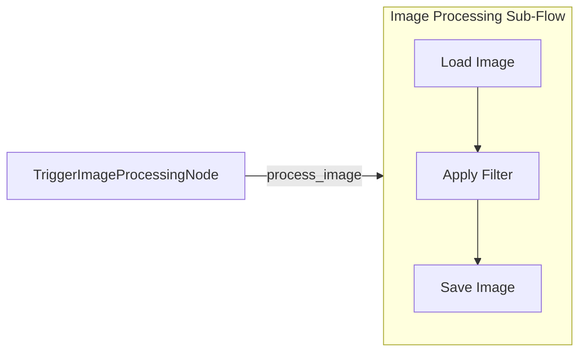

# BrainyFlow Batch Processing Example (Fan-Out Pattern with Nested Flow)

This example demonstrates how to process multiple images with different filters using a fan-out pattern with standard BrainyFlow Nodes and a nested Flow orchestrated by a ParallelFlow. This replaces the older `SequentialBatchFlow` approach.

## What this Example Demonstrates

- How to process multiple items by triggering a sub-flow for each item.
- Implementing a fan-out pattern to distribute work to a nested Flow.
- Using a `ParallelFlow` to run multiple instances of a sub-flow concurrently.
- Using `Memory` for state management, including passing data to nested flows via `forkingData`.
- Using explicit `trigger()` calls for flow control.

## Project Structure

```
python-batch-flow/
├── README.md
├── requirements.txt
├── images/
│   ├── cat.jpg        # Sample image 1
│   ├── dog.jpg        # Sample image 2
│   └── bird.jpg       # Sample image 3
├── main.py            # Entry point
├── flow.py            # Main Flow and sub-flow definitions
└── nodes.py           # Node implementations for image processing
```

## How it Works

The example processes multiple images with different filters using a main flow orchestrated by a `ParallelFlow` and a nested sub-flow:



Here's what each part does:

1.  **`Image Processing Sub-Flow`**: This is a standard `Flow` that handles the processing of a _single_ image with a _single_ filter. It consists of `LoadImage`, `ApplyFilter`, and `SaveImage` nodes.
2.  **`TriggerImageProcessingNode` (Main Flow)**: This node is part of the main flow. It reads the list of images and filters from memory, generates all image-filter combinations, and then triggers the `image_processing_sub_flow` for _each_ combination using the `process_image` action and passing the specific image name and filter type via `forkingData`.
3.  **`ParallelFlow` (Main Flow Orchestration)**: The main flow is a `ParallelFlow` starting with the `TriggerImageProcessingNode`. This ensures that all the triggered instances of the `image_processing_sub_flow` run concurrently.

This pattern demonstrates how BrainyFlow can efficiently process multiple related tasks concurrently by fanning out work to nested flows, replacing the need for specialized batch flow types.

## Installation

```bash
pip install -r requirements.txt
```

## Usage

```bash
python main.py
```

## Sample Output

```
Trigger: Triggering processing for 9 image-filter combinations.
Processing images with filters...
Saved filtered image to: output/cat_grayscale.jpg
Saved filtered image to: output/dog_blur.jpg
Saved filtered image to: output/bird_sepia.jpg
...
All image processing complete!
Check the 'output' directory for results.
```

## Key Concepts Illustrated

1.  **Fan-Out Pattern**: Shows how to distribute work across multiple instances of a sub-flow.
2.  **Concurrent Processing**: Demonstrates using `ParallelFlow` to run nested flows concurrently.
3.  **Nested Flows**: Illustrates using a `Flow` as a node within another `Flow`.
4.  **Memory Management**: Shows how `Memory` is used for global state and how `forkingData` passes local state to nested flows.
5.  **Explicit Triggers**: Shows how `self.trigger()` is used for flow control and passing data via `forkingData`.
