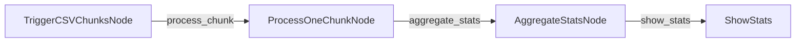

# BrainyFlow Batch Processing Example (Fan-Out/Aggregate Pattern)

This example demonstrates how to process a large CSV file in chunks using a fan-out/aggregate pattern with standard BrainyFlow Nodes and a ParallelFlow. This replaces the older `SequentialBatchNode` approach.

## What this Example Demonstrates

- How to process large inputs by breaking them into manageable chunks using standard Nodes.
- Implementing a fan-out pattern to trigger processing for each chunk.
- Implementing an aggregate pattern to combine results from concurrent processing.
- Using `ParallelFlow` for concurrent chunk processing.
- Using `Memory` for state management.
- Using explicit `trigger()` calls for flow control.

## Project Structure

```
python-batch-node/
├── README.md
├── requirements.txt
├── data/
│   └── sales.csv      # Sample large CSV file
├── main.py            # Entry point
├── flow.py            # Flow definition
└── nodes.py           # Node implementations (Trigger, Processor, Aggregator)
```

## How it Works

The example processes a large CSV file containing sales data using three main nodes orchestrated by a `ParallelFlow`:



1.  **`TriggerCSVChunksNode`**: Reads the input CSV file in chunks, then triggers a `process_chunk` action for each chunk, passing the chunk data and its index to the local memory of the next node. It also initializes the global memory structure for results and a counter.
2.  **`ProcessOneChunkNode`**: Receives a single chunk from its local memory, processes it to calculate statistics (total sales, number of transactions, total amount) for that chunk, stores the result in the global memory at the correct index, decrements a counter, and triggers the `aggregate_stats` action when all chunks are processed.
3.  **`AggregateStatsNode`**: Reads all the individual chunk statistics from global memory, aggregates them into final statistics (total sales, average sale, total transactions), stores the final statistics in global memory, and triggers the `show_stats` action.
4.  **`ShowStats`**: Reads the final statistics from global memory and prints them to the console.

This pattern demonstrates how BrainyFlow can efficiently process multiple related tasks concurrently using standard nodes and flows, replacing the need for specialized batch node types.

## Installation

```bash
pip install -r requirements.txt
```

## Usage

```bash
python main.py
```

## Sample Output

```
Trigger: Triggering processing for 10 CSV chunks.
Processor: Processing chunk (Index 0)
Processor: Processing chunk (Index 1)
...
Processor: Finished chunk (Index 9)
Processor: All chunks processed, triggering aggregate.
Reducer: Aggregating 10 chunk statistics.
Reducer: Statistics aggregation complete.

Final Statistics:
- Total Sales: $1,234,567.89
- Average Sale: $123.45
- Total Transactions: 10,000
```

## Key Concepts Illustrated

1.  **Fan-Out/Aggregate Pattern**: Shows how to distribute work across multiple node instances and then collect the results.
2.  **Concurrent Processing**: Demonstrates using `ParallelFlow` to run processing nodes concurrently.
3.  **Memory Management**: Illustrates using `Memory` for both global state (`memory.statistics`) and local state (`memory.chunk_data` via `forkingData`).
4.  **Explicit Triggers**: Shows how `self.trigger()` is used for flow control and passing data via `forkingData`.
