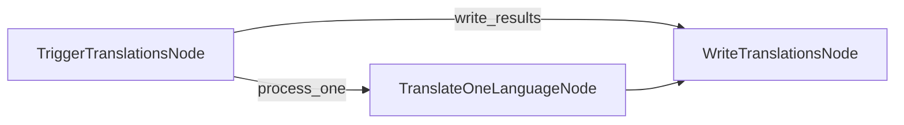

# Batch Translation Process

This project demonstrates a batch processing implementation that enables LLMs to translate documents into multiple languages simultaneously. It's designed to efficiently handle the translation of markdown files while preserving formatting.

## Features

- Translates markdown content into multiple languages in parallel
- Saves translated files to specified output directory

## Getting Started

1. Install the required packages:

```bash
pip install -r requirements.txt
```

2. Set up your API key:

```bash
export ANTHROPIC_API_KEY="your-api-key-here"
```

3. Run the translation process:

```bash
python main.py
```

## How It Works

The implementation now uses a fan-out pattern with three nodes orchestrated by a `Flow` for sequential processing:



1.  **`TriggerTranslationsNode`**: Reads the input text and languages from memory and triggers a `process_one` action for each language, passing the specific text, language, and index to the local memory of the next node. It also triggers the `write_results` action to initiate the final writing step after all processing is triggered.
2.  **`TranslateOneLanguageNode`**: Receives the specific language and text from its local memory, calls the LLM to perform the translation for that single language, and stores the result in the global memory. It then triggers the default action to proceed.
3.  **`WriteTranslationsNode`**: Reads all the individual translation results from global memory, creates the output directory if it doesn't exist, and saves each translation to a separate file.

This pattern demonstrates how BrainyFlow can process multiple related tasks using standard nodes and flows.

## Example Output

When you run the translation process, you'll see output similar to this:

```
Translated Chinese text
Translated Spanish text
Translated Japanese text
Translated German text
Translated Russian text
Translated Portuguese text
Translated French text
Translated Korean text
Saved translation to translations/README_CHINESE.md
Saved translation to translations/README_SPANISH.md
Saved translation to translations/README_JAPANESE.md
Saved translation to translations/README_GERMAN.md
Saved translation to translations/README_RUSSIAN.md
Saved translation to translations/README_PORTUGUESE.md
Saved translation to translations/README_FRENCH.md
Saved translation to translations/README_KOREAN.md

=== Translation Complete ===
Translations saved to: translations
============================
```

## Files

- [`main.py`](./main.py): Implementation of the batch translation node
- [`utils.py`](./utils.py): Simple wrapper for calling the Anthropic model
- [`requirements.txt`](./requirements.txt): Project dependencies

The translations are saved to the `translations` directory, with each file named according to the target language.
