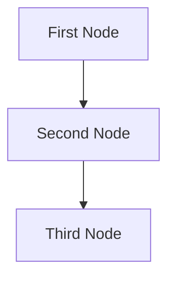

# Your Project Title

## Project Requirements

A description of the project requirements.

## Utility Functions

1. **Call LLM** (`utils/call_llm.py`)

## Flow Design

1. **First Node**
2. **Second Node**
3. **Third Node**

### Flow Diagram



## Data Structure

The global memory structure will be organized as follows:

```python
shared = {
    "key": "value"
}
```

## Node Designs

### 1. First Node

- **Purpose**: What the node does
- **Design**: Regular Node (no Batch)
- **Data Access**:
  - Read: `memory.key` from global memory
  - Write: `memory.key = value` to global memory
- **Flow Control**: Uses `self.trigger("action_name")` to transition to the next node.

### 2. Second Node

...

### 3. Third Node
