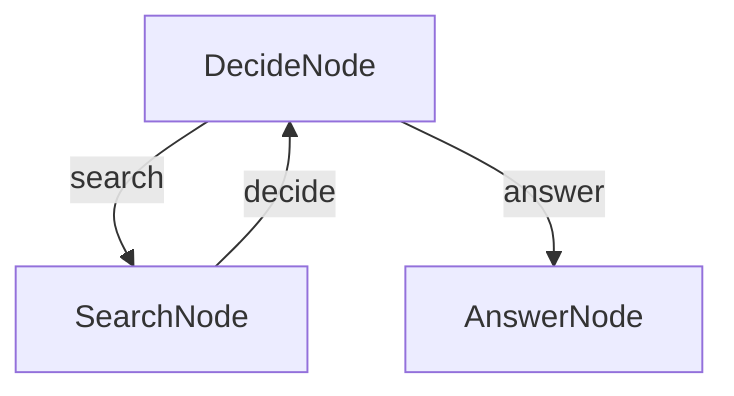

# TypeScript Agent Example

This example demonstrates how to build a question-answering agent using TypeScript and BrainyFlow. The agent can search the web for information and provide answers based on the search results.

## Overview

This agent demonstrates the following capabilities:
- Decision-making based on context
- Web searching for information
- Generating comprehensive answers
### Step for quick testing

```bash
# from BrainyFlow root directory
cd typescript-agent

cp .env.example .env # add your API key

npm install
npm run agent
```

Default question is inside `main.ts`, change it and see the result.

## Features

- Performs web searches to gather information
- Collects and processes information from search results
- Answers user questions based on the gathered information
## How It Works

The agent flow comprises three nodes:

1. **DecideNode**: The core of the agent flow that determines whether it can answer the question directly or needs to search for more information.
2. **SearchNode**: Executes web searches when the DecideNode determines that more information is needed.
3. **AnswerNode**: Generates a comprehensive answer when the DecideNode determines that sufficient context is available.

The flow starts with the DecideNode, which decides whether to search (triggering SearchNode) or answer (triggering AnswerNode) based on the current context. This decision is made in the `post` method, which returns either "search" or "answer".

After completing a search, the SearchNode's `post` method returns results to the DecideNode via the "decide" action. This allows the DecideNode to determine whether to search again or provide a final answer when the context is sufficient.
