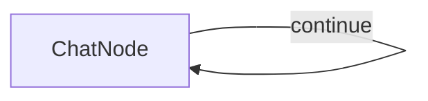

# Terminal Chat Interface Example

A simple command-line chat interface for interacting with OpenAI models using Node.js and TypeScript.

### Step and Usage

```bash
# from BrainyFlow root directory
cd cookbook/typescript-chat

cp .env.example .env # add your API key

npm install
npm run chat
```

### Features

- Simple and straightforward chat interface directly in your terminal.

### How it Works

The application have 1 node only which is **ChatNode** but in work as a self-loop. After you initialized the program, the app will greets you in the terminal and waits for your input; each time you type a message and press enter, your input is added to the ongoing conversation log.

Every time you send a message, the full dialogue history—including both your questions and the assistant’s earlier replies—is sent to the OpenAI API. This provides context so the AI’s responses remain relevant and coherent as the conversation progresses. The assistant’s answer is then displayed to you and appended to the session, maintaining a seamless flow of dialogue.

The chat continues in this loop, allowing for back-and-forth conversation; you can type messages as long as you like and, when finished, simply type `exit` to close the session gracefully.


