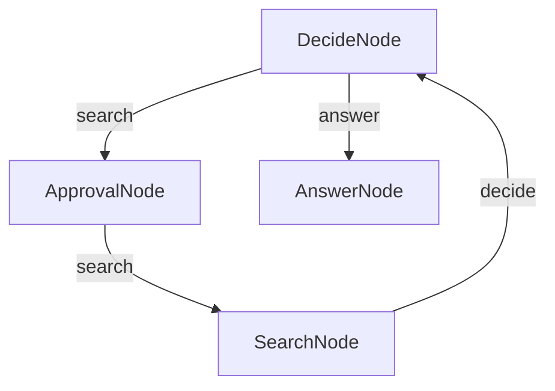

# TypeScript Human In The Loop Agent Example

This example demonstrates how to build a question-answering agent using TypeScript and BrainyFlow. The agent will ask for human permission before searching the web for information and provide answers based on the search results.

## Overview

This agent demonstrates the following capabilities:
- Decision-making based on context
- Web searching for information
- Prompt user asking for permission before perform any tool calling task
- Generating comprehensive answers

### Step and Usage

```bash
# from BrainyFlow root directory
cd cookbook/typescript-human-in-the-loop-agent

cp .env.example .env # add your API key

npm install
npm run agent -- "this is your question"
```

Default question is "who is the ceo of microsoft?" if you did not provide any argument after `npm run agent`

## Features

- Performs web searches to gather information
- Collects and processes information from search results
- Answers user questions based on the gathered information

## How It Works

The agent flow comprises three nodes:

1. **DecideNode**: The core of the agent flow that determines whether it can answer the question directly or needs to search for more information.
2. **ApprovalNode**: This node will prompt user for permission before perform any tool calling.
2. **SearchNode**: Executes web searches when the DecideNode determines that more information is needed.
3. **AnswerNode**: Generates a comprehensive answer when the DecideNode determines that sufficient context is available.

The flow starts with the DecideNode, which decides whether to search (triggering ApprovalNode) or answer (triggering AnswerNode) based on the current context. This decision is made in the `post` method, which returns either "search" or "answer".

Before the application will perform any tool calling task, ApprovalNode will prompt user and ask for permission to perform a tool call (SearchNode, in this case) and return a "search" action in order user approve a tool call or "done" and exit the app if user disapprove, also if user give answer other than "yes" or "no" it will decide what to do again with DecideNode 

After completing a search, the SearchNode's `post` method returns results to the DecideNode via the "decide" action. This allows the DecideNode to determine whether to search again or provide a final answer when the context is sufficient.

