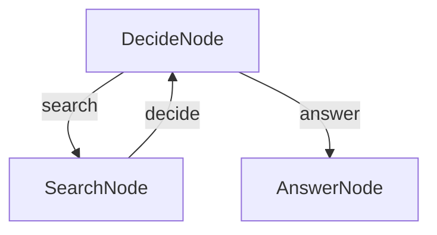
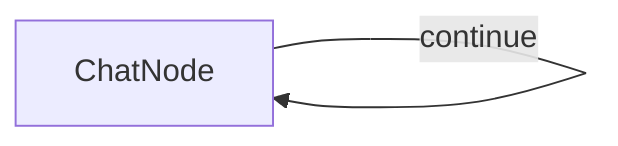

# TypeScript Examples

All projects listed below can be found in our [cookbook directory](https:/github.com/zvictor/brainyflow/tree/main/cookbook).

## TypeScript Agent Example ([typescript-agent](https:/github.com/zvictor/brainyflow/tree/main/cookbook/typescript-agent))
This example demonstrates how to build a question-answering agent using TypeScript and BrainyFlow. The agent can search the web for information and provide answers based on the search results.<details>
<summary><strong>Details</strong></summary>


# TypeScript Agent Example

This example demonstrates how to build a question-answering agent using TypeScript and BrainyFlow. The agent can search the web for information and provide answers based on the search results.

## Overview

This agent demonstrates the following capabilities:

- Decision-making based on context
- Web searching for information
- Generating comprehensive answers

### Step and Usage

```bash
# from BrainyFlow root directory
cd cookbook/typescript-agent

cp .env.example .env # add your API key

npm install
npm run agent -- "this is your question"
```

Default question is "What is the latest Deepseek LLM model?" if you did not provide any argument after `npm run agent`

## Features

- Performs web searches to gather information
- Collects and processes information from search results
- Answers user questions based on the gathered information

## How It Works

The agent flow comprises three nodes:

1. **DecideNode**: The core of the agent flow that determines whether it can answer the question directly or needs to search for more information.
2. **SearchNode**: Executes web searches when the DecideNode determines that more information is needed.
3. **AnswerNode**: Generates a comprehensive answer when the DecideNode determines that sufficient context is available.

The flow starts with the DecideNode, which decides whether to search (triggering SearchNode) or answer (triggering AnswerNode) based on the current context. This decision is made in the `post` method, which returns either "search" or "answer".

After completing a search, the SearchNode's `post` method returns results to the DecideNode via the "decide" action. This allows the DecideNode to determine whether to search again or provide a final answer when the context is sufficient.




</details>

## TypeScript Terminal Chat Interface Example ([typescript-chat](https:/github.com/zvictor/brainyflow/tree/main/cookbook/typescript-chat))
A simple command-line chat interface for interacting with OpenAI models using Node.js and TypeScript.<details>
<summary><strong>Details</strong></summary>


# TypeScript Terminal Chat Interface Example

A simple command-line chat interface for interacting with OpenAI models using Node.js and TypeScript.

### Step and Usage

```bash
# from BrainyFlow root directory
cd cookbook/typescript-chat

cp .env.example .env # add your API key

npm install
npm run chat
```

### Features

- Simple and straightforward chat interface directly in your terminal.

### How it Works

The application have 1 node only which is **ChatNode** but in work as a self-loop. After you initialized the program, the app will greets you in the terminal and waits for your input; each time you type a message and press enter, your input is added to the ongoing conversation log.

Every time you send a message, the full dialogue history—including both your questions and the assistant’s earlier replies—is sent to the OpenAI API. This provides context so the AI’s responses remain relevant and coherent as the conversation progresses. The assistant’s answer is then displayed to you and appended to the session, maintaining a seamless flow of dialogue.

The chat continues in this loop, allowing for back-and-forth conversation; you can type messages as long as you like and, when finished, simply type `exit` to close the session gracefully.



</details>

