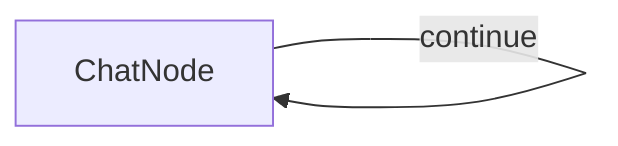
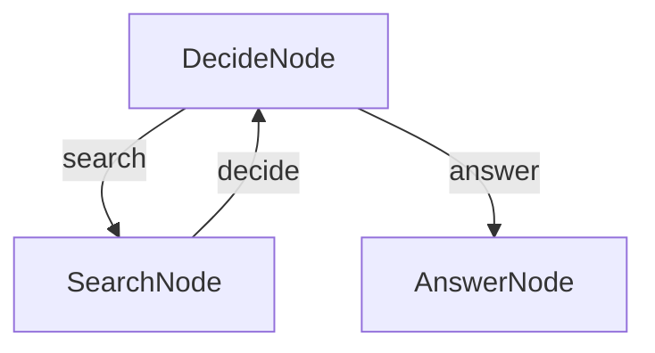

# TypeScript Examples

All projects listed below can be found in our [cookbook directory](https://github.com/zvictor/brainyflow/tree/main/cookbook).

## Terminal Chat Interface Example ([typescript-chat](https://github.com/zvictor/brainyflow/tree/main/cookbook/typescript-chat))
Complexity Points: 3.5
[🥚]

A simple command-line chat interface for interacting with OpenAI models using Node.js and TypeScript.<details>
<summary><strong>Details</strong></summary>


# Terminal Chat Interface Example

A simple command-line chat interface for interacting with OpenAI models using Node.js and TypeScript.

### Step and Usage

```bash
# from BrainyFlow root directory
cd cookbook/typescript-chat

cp .env.example .env # add your API key

npm install
npm run chat
```

### Features

- Simple and straightforward chat interface directly in your terminal.

### How it Works

The application have 1 node only which is **ChatNode** but in work as a self-loop. After you initialized the program, the app will greets you in the terminal and waits for your input; each time you type a message and press enter, your input is added to the ongoing conversation log.

Every time you send a message, the full dialogue history—including both your questions and the assistant’s earlier replies—is sent to the OpenAI API. This provides context so the AI’s responses remain relevant and coherent as the conversation progresses. The assistant’s answer is then displayed to you and appended to the session, maintaining a seamless flow of dialogue.

The chat continues in this loop, allowing for back-and-forth conversation; you can type messages as long as you like and, when finished, simply type `exit` to close the session gracefully.




</details>

## Agent Example ([typescript-agent](https://github.com/zvictor/brainyflow/tree/main/cookbook/typescript-agent))
Complexity Points: 11
[🐥🐥🐥]

This example demonstrates how to build a question-answering agent using TypeScript and BrainyFlow. The agent can search the web for information and provide answers based on the search results.<details>
<summary><strong>Details</strong></summary>


# Agent Example

This example demonstrates how to build a question-answering agent using TypeScript and BrainyFlow. The agent can search the web for information and provide answers based on the search results.

## Overview

This agent demonstrates the following capabilities:

- Decision-making based on context
- Web searching for information
- Generating comprehensive answers

### Step and Usage

```bash
# from BrainyFlow root directory
cd cookbook/typescript-agent

cp .env.example .env # add your API key

npm install
npm run agent -- "this is your question"
```

Default question is "What is the latest Deepseek LLM model?" if you did not provide any argument after `npm run agent`

## Features

- Performs web searches to gather information
- Collects and processes information from search results
- Answers user questions based on the gathered information

## How It Works

The agent flow comprises three nodes:

1. **DecideNode**: The core of the agent flow that determines whether it can answer the question directly or needs to search for more information.
2. **SearchNode**: Executes web searches when the DecideNode determines that more information is needed.
3. **AnswerNode**: Generates a comprehensive answer when the DecideNode determines that sufficient context is available.

The flow starts with the DecideNode, which decides whether to search (triggering SearchNode) or answer (triggering AnswerNode) based on the current context. This decision is made in the `post` method, which returns either "search" or "answer".

After completing a search, the SearchNode's `post` method returns results to the DecideNode via the "decide" action. This allows the DecideNode to determine whether to search again or provide a final answer when the context is sufficient.




</details>

<hr /><details>
<summary><strong>The Complexity Points System</strong></summary>


## Brainyflow Cookbook: Project Complexity Point System

This document outlines a revised point system to categorize projects within the Brainyflow cookbook by complexity. This system aims for simplicity, generalizability, and clear guidance for learners.

### I. Core Brainyflow Structure & Flow

Evaluates the fundamental Brainyflow constructs.

* **A. Node Usage**:  
  * **0.5 points per distinct Node class** implemented and used in the primary flow logic. (e.g., 4 unique Node classes \= 2 points).  
* **B. Flow Complexity**:  
  * Simple linear flow (e.g., A \>\> B \>\> C): **0 points**  
  * Flow with branching OR looping (e.g., A \- "action" \>\> B, B \>\> A): **1 point**  
  * Flow with both branching AND looping: **2 points**  
  * *(Note: These are mutually exclusive for a single primary flow; a flow is either linear, has branching/looping, or both.)*  
* **C. Advanced Flow Constructs**:  
  * Use of ParallelFlow (or significant parallel execution of nodes/flows): **3 points** (one-time for the project if the pattern is present).  
  * Use of Nested Flows (one Flow instance used as a node within another Flow): **2 points** (one-time for the project if the pattern is present and significant).

### II. Code & Logic Complexity

Assesses the custom code beyond basic Brainyflow definitions.

* **A. Logic within Node Methods** (prep, exec, post):  
  * **0.5 points per node** that contains minor custom logic (e.g., simple data transformation, formatting beyond direct pass-through).  
  * **An additional 1 point for that same node** (total 1.5 for that node in this sub-category) if its custom processing logic is significant (e.g., complex algorithms, detailed state management, intricate parsing).  
* **B. Helper Modules/Utilities** (e.g., code in utils.py or other non-node, non-flow Python/TypeScript modules, excluding simple API client wrappers which are covered by III.A/B):  
  * Project contains minor utilities or simple helper functions: **1 point** (total for this category if only minor utilities are present).  
  * Project contains complex helper functions/classes (e.g., custom VAD, advanced data structures, significant business logic): **2 points** (total for this category if complex utilities are present, supersedes the 1 point for minor).  
* **C. Project File Structure & Modularity**:  
  * **0.25 points per relevant Python/TypeScript file** (e.g., main.py, flow.py, nodes.py, utils.py, and other custom modules containing substantial logic).  
  * Exclude: README.md, requirements.txt, .ipynb, \_\_init\_\_.py, package.json, configuration files, empty or near-empty stub files.  
  * **Maximum of 2 points** for this category. (e.g., 4 files \= 1 point; 8 files \= 2 points; 10 files \= 2 points).  
* **D. Code Quality & Advanced Language Features**:  
  * Demonstrable use of strong typing (e.g., comprehensive type hints in Python, TypeScript's type system) that significantly contributes to the project's robustness or complexity of implementation: **1 point** (one-time for the project).  
  * Advanced error handling and resilience patterns (e.g., custom retry logic beyond basic node retries, sophisticated exception management, graceful degradation): **1 point** (one-time for the project).

### III. External Integrations & Tools

Points for incorporating external services, APIs, or complex data handling.

* **A. LLM API Usage** (Points are cumulative if multiple distinct API capabilities are used):  
  * Basic call (chat completion, text generation): **1 point**  
  * Embeddings API: **\+1 point**  
  * Vision API: **\+1 point**  
  * TTS (Text-to-Speech) API: **\+1 point**  
  * STT (Speech-to-Text) API: **\+1 point**  
* **B. Other External APIs/Services**:  
  * Web Search API (e.g., DuckDuckGo, SerpAPI): **1 point**  
  * Other distinct external APIs (e.g., weather API, financial data API): **1 point per distinct API type used**.  
* **C. Data Handling & Persistence**:  
  * Database Integration (e.g., SQLite, or other DBs): **2 points**  
  * Complex File I/O (e.g., processing PDFs, audio files, multiple structured files, image manipulation beyond simple read/write): **1 point**  
* **D. Implemented "Tool" Modules for LLM/Agent**:  
  * **1.5 points per distinct, non-trivial Python/TypeScript module** designed as a reusable "tool" for an agent (e.g., crawler.py in python-tool-crawler, a custom PDF processor tool). This is distinct from general helper utilities (II.B) and focuses on agent-callable tools. (Max 4.5 points for this category).

### IV. Advanced Brainyflow Patterns & User Interaction

Markers for sophisticated architectural patterns or user interfaces.

* **A. Key Design Patterns** (Apply points for each distinct, significantly implemented pattern):  
  * Basic Agent (LLM-based decision-making for flow control or simple tool selection): **2 points**  
  * RAG (Retrieval Augmented Generation \- explicit retrieve, augment, generate steps): **3 points**  
  * Supervisor Pattern (a flow/node validating or overseeing another): **2 points**  
  * Chain-of-Thought / ReAct (multi-step, structured reasoning orchestrated by the flow): **3 points**  
  * Majority Vote (or similar consensus mechanism over multiple LLM calls): **2 points**  
  * MapReduce (explicit map and reduce nodes/flows for batch data processing): **2 points**  
* **B. Communication & Protocols**:  
  * MCP (Model Context Protocol integration): **3 points**  
  * A2A (Agent-to-Agent communication setup): **4 points**  
* **C. User Interaction Methods**:  
  * Enhanced CLI (beyond simple input(), e.g., argument parsing, interactive menus): **0.5 points**  
  * Web-based UI (e.g., Streamlit, FastAPI with HTML, React): **2 points for a basic web UI**.  
  * **\+1 additional point** if the web UI involves significant backend API development (e.g., FastAPI managing state, SSE, background tasks for the UI, making it 3 total for complex web UIs).  
* **D. Multi-Agent System Complexity**:  
  * **1 point per distinct agent role** (e.g., a system with a Hinter agent and a Guesser agent gets 2 points).  
  * **\+1 point** if the agents' interaction involves complex communication patterns (e.g., asynchronous message queues, shared state beyond simple turn-passing, negotiation protocols).  
  * **\+1 point** if the system involves more than two agents that actively and distinctly contribute to the core task.  
  * *(Max 5 points for this category)*

### Complexity Tiers

Based on the total points, projects can be categorized into tiers:

* **Beginner (1-7 points)**: Introduces fundamental Brainyflow concepts.  
* **Intermediate (8-16 points)**: Covers more complex flow structures, basic patterns, and integrations.  
* **Advanced (17-25 points)**: Deals with sophisticated patterns, UI integrations, or complex tool building.  
* **Expert (26+ points)**: Combines multiple advanced features, involves intricate system design.
</details>

