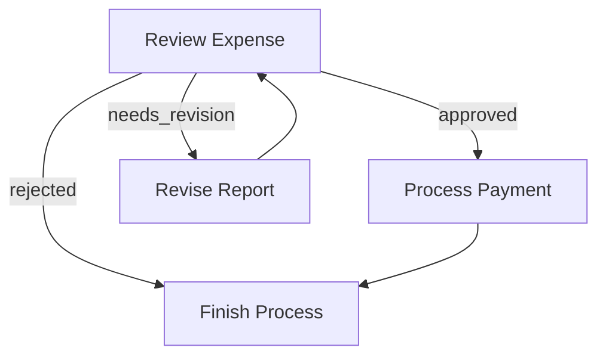
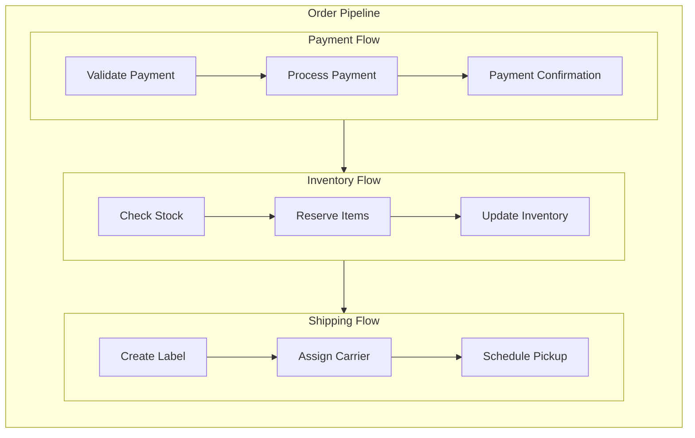
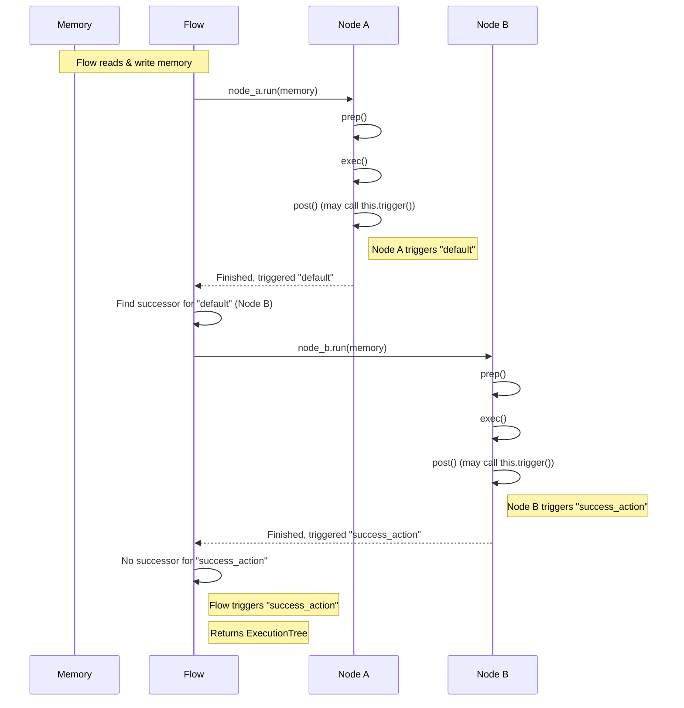

# Flow: Orchestrating Nodes in a Directed Graph

A **Flow** orchestrates a graph of Nodes, connecting them through action-based transitions. Flows enable you to create complex application logic including sequences, branches, loops, and nested workflows.

They manage the execution order, handle data flow between nodes, and provide error handling and cycle detection.

## Creating a Flow

A Flow begins with a **start node**, a memory state, and follows the [action-based transitions defined by the nodes](./nodes.md) until it reaches a node with no matching transition for its returned action.




```python
from caskada import Flow, Node

# Define nodes and transitions (placeholders for actual node classes)
# node_a = NodeA()
# node_b = NodeB()
# node_c = NodeC()
# node_d = NodeD()

node_a >> node_b # Default transition, equivalent to node_a.next(node_b)
node_b - "success" >> node_c # Named transition, equivalent to node_b.on("success", node_c)
node_b - "error" >> node_d   # Named transition, equivalent to node_b.on("error", node_d)

# Start with an initial memory object
memory = {"input": "some data"}

# Create flow starting with node_a
flow = Flow(start=node_a)

# Run the flow, passing the memory object.
# The memory object is modified in place.
# The run method returns an ExecutionTree.
execution_result = await flow.run(memory)

print("Flow finished. Final memory state:", memory)
print('Execution Tree:', execution_result)
```





```typescript
import { Flow, Memory, Node } from 'caskada'

// Define nodes and transitions (placeholders for actual node classes)
// const node_a = new YourActualNode();
// const node_b = new YourActualNode();
// const node_c = new YourActualNode();
// const node_d = new YourActualNode();

node_a.next(node_b) // Default transition
node_b.on('success', node_c) // Named transition
node_b.on('error', node_d) // Named transition

// Define the expected memory structure (optional but recommended)
interface MyGlobalStore {
  input?: any
  result?: any
  error?: any
}

// Start with an initial memory object
const memory: MyGlobalStore = { input: 'some data' }

// Create flow starting with node_a
const flow = new Flow<MyGlobalStore>(node_a)

// Run the flow, passing the memory object.
// The memory object is modified in place.
// The run method returns an ExecutionTree.
const executionResult = await flow.run(memory)

// Print the final state of the memory object and the execution result
console.log('Flow finished. Final memory state:', memory)
console.log('Execution Tree:', executionResult)
// Example output (depending on flow logic):
// { input: 'some data', result: 'processed data from node_c' }
// or
// { input: 'some data', error: 'error details from node_d' }
```




## Controlling Flow Execution

### Branching and Looping

Flows support complex patterns like branching (conditionally following different paths) and looping (returning to previous nodes).

#### Example: Expense Approval Flow

Here's a simple expense approval flow that demonstrates branching and looping:




```python
from caskada import Flow, Node

# Define the nodes first (placeholders for actual node classes)
# review = ReviewExpenseNode()
# revise = ReviseReportNode()
# payment = ProcessPaymentNode()
# finish = FinishProcessNode()
# ...

# Define the flow connections
review - "approved" >> payment        # If approved, process payment
review - "needs_revision" >> revise   # If needs changes, go to revision
review - "rejected" >> finish         # If rejected, finish the process

revise >> review   # After revision, go back for another review (default action)
payment >> finish  # After payment, finish the flow (default action)

# Create the flow
expense_flow = Flow(start=review)
```





```typescript
import { Flow, Node } from 'caskada'

// Define the nodes first (placeholders for actual node classes)
// const review = new ReviewExpenseNode()
// const revise = new ReviseReportNode()
// const payment = new ProcessPaymentNode()
// const finish = new FinishProcessNode()

// Define the flow connections
review.on('approved', payment) // If approved, process payment
review.on('needs_revision', revise) // If needs changes, go to revise
review.on('rejected', finish) // If rejected, finish

revise.next(review) // After revision (default trigger), go back for another review
payment.next(finish) // After payment (default trigger), finish the process

// Create the flow, starting with the review node
const expenseFlow = new Flow(review)
```




This flow creates the following execution paths:

1.  If `review` triggers `"approved"`, the expense moves to the `payment` node.
2.  If `review` triggers `"needs_revision"`, it goes to the `revise` node, which then loops back to `review`.
3.  If `review` triggers `"rejected"`, it moves to the `finish` node and stops.



### Flow as a Node

Every `Flow` is in fact a specialized type of `Node`. This means a `Flow` itself can be used as a node within another, larger `Flow`, enabling powerful composition and nesting patterns.


The difference from a standard `Node` is that `Flow` overrides `execRunner()` - a method called inside `run()` - to make it a specialized method tasked with orchestrating internal nodes.

<details>
  <summary>What sets Flow apart from a standard Node</summary>
  
- A `Flow`'s primary role is orchestration, not direct computation like a standard `Node`'s `exec()` method.
- It ignores `exec`, so you should not define it (nor `execRunner`) in a `Flow`.
- It still has the `prep` and `post` lifecycle methods, which you _can_ override if you need to perform setup before the sub-flow runs or cleanup/processing after it completes.
- When a `Flow` (acting as a node) finishes its internal execution, what action it triggers for its parent flow is determined by a combination of its own `post()` method and any **explicitly propagated actions** from its internal nodes (see "Action Propagation" below).
</details>


This allows you to:

1.  Break down complex applications into manageable sub-flows.
2.  Reuse flows across different applications.
3.  Create hierarchical workflows with clear separation of concerns.

#### Example: Order Processing Pipeline (Illustrating Nesting)

Here's a practical example that breaks down order processing into nested flows:




```python
from caskada import Flow, Node

# Payment processing sub-flow
validate_payment >> process_payment >> payment_confirmation
payment_flow = Flow(start=validate_payment)

# Inventory sub-flow
check_stock >> reserve_items >> update_inventory
inventory_flow = Flow(start=check_stock)

# Shipping sub-flow
create_label >> assign_carrier >> schedule_pickup
shipping_flow = Flow(start=create_label)

# Connect the flows into a main order pipeline
payment_flow >> inventory_flow >> shipping_flow

order_pipeline = Flow(start=payment_flow) # Create the master flow

# Run the entire pipeline
memory = { orderId: 'XYZ789', customerId: 'CUST123' }
await order_pipeline.run(memory)
print('Order pipeline completed. Final state:', memory)
```





```typescript
import { Flow, Node } from 'caskada'

// Payment processing sub-flow
validatePayment.next(processPayment).next(paymentConfirmation)
const paymentFlow = new Flow(validatePayment)

// Inventory sub-flow
checkStock.next(reserveItems).next(updateInventory)
const inventoryFlow = new Flow(checkStock)

// Shipping sub-flow
createLabel.next(assignCarrier).next(schedulePickup)
const shippingFlow = new Flow(createLabel)

paymentFlow.next(inventoryFlow) // Default transition after paymentFlow completes
inventoryFlow.next(shippingFlow) // Default transition after inventoryFlow completes

// Create the master flow, starting with the paymentFlow
const orderPipeline = new Flow(paymentFlow)

// --- Run the entire pipeline ---
const globalStore = { orderId: 'XYZ789', customerId: 'CUST123' }
await orderPipeline.run(globalStore)
console.log('Order pipeline completed. Final state:', globalStore)
```




This creates a clean separation of concerns while maintaining a clear execution path:



### Cycle Detection

Loops are created by connecting a node back to a previously executed node. To prevent infinite loops, `Flow` includes cycle detection controlled by the `maxVisits` option in its constructor (default is 15). If a node is visited more times than `maxVisits` during a single `flow.run()` execution, an error is thrown.


This mechanism, combined with the `ExecutionTree` output, helps debug and manage complex looped behaviors.


```typescript
// Limit the number of times any node can be visited within this flow execution
const flow = new Flow(startNode, { maxVisits: 10 })
```

- The default value for `maxVisits` is `15`.
- Set `maxVisits` to `Infinity` or a very large number for effectively no limit (use with caution!).

### Propagation of Terminal Actions

Besides being capable of triggering actions like any other `Node`, a `Flow` also propagates actions triggered by internal _terminal nodes_. This allows for more dynamic and interconnected workflows, where an action deep within a sub-flow can influence the parent flow's path without needing explicit re-triggering at every level.


These terms can often be used interchangeably, with a subtle distinction:

- **Leaf Node (Graph Theory Term):** A leaf node is a node with no children (no outgoing edges).
- **Terminal Node (in Caskada context):** A node that, for a _specific triggered action_, has no defined successor _within the current Flow_.

Thus,

- **"Leaf node"** often implies a node that is structurally at the end of all possible paths within its local graph.
- **"Terminal node"** is a node that might have successors for _some_ actions but not for the one it currently triggers.
  

Think about it as a pratical way to "_hand over unfinished tasks in a flow directly to the next flow_".

Here's how it works:

1.  **Explicit Triggers:**

    - If a node **explicitly triggers** an action (e.g. `"some_action"`), and **no direct successor** is defined for this `"some_action"`, then `"some_action"` is collected by the running Flow and trickled up to its own successors.

2.  **Implicit default action:**

    - If a node finishes **without** an explicit `.trigger()` call, it does **not** automatically collect or propagate any default action outside of the running Flow.

3.  **Flow's own `post()` Method and Final Action:**

    - After a Flow's execution completes, its own `post()` method is called. Any `.trigger()` calls made within `.post()` are effectively combined with the explicitly propagated actions collected from the internal terminal nodes (as described in point 1).
    - If no explicit actions were propagated from internal leaf nodes and `Flow.post()` also doesn't trigger anything, `Flow` will then implicitly trigger the default action.

**In essence:**

- **Explicit Triggers Bubble Up:** Actions explicitly triggered by terminal nodes deep within a sub-flow will "bubble up" to the sub-flow itself. The sub-flow then uses these actions to determine its path in the parent flow.

This mechanism allows for:

- **Permeable Sub-Flows:** Design sub-flows that can signal specific, unhandled outcomes to their parent.
- **Reduced Boilerplate:** Avoid manually re-triggering actions at the end of every sub-flow just to pass a signal upwards.
- **Context Preservation:** `forkingData` associated with an explicitly propagated trigger is carried along.
- **Concurrency Preservation:** The execution doesn’t end at the leaf node, it continues as you navigate into the next flow.

For example, an `"error_needs_escalation"` action explicitly triggered deep within a payment sub-flow can propagate out to be handled by a dedicated error-handling branch in the main order pipeline, even if the payment sub-flow itself doesn't define a handler for `"error_needs_escalation"`.

## Flow Parallelism

When a node's `post` method calls `this.trigger()` multiple times (e.g., for different actions, or for the same action with different `forkingData`), it effectively creates multiple branches of execution that will start from that node. How these branches are executed depends on the type of `Flow` being used.

The `Flow` class manages the execution of these branches via its `runTasks` method. This method takes a list of task functions (each function representing the execution of one triggered branch) and determines how they are run.

- In a standard `Flow`, `runTasks` executes them **sequentially**.
- In a `ParallelFlow`, `runTasks` executes them **concurrently**.

You can also create custom flow execution behaviors by subclassing `Flow` and overriding `runTasks`.

### 1. `Flow` (Sequential Execution)

The default `Flow` class executes the tasks generated by multiple triggers from a single node **sequentially**. It waits for the entire branch initiated by the first trigger to complete before starting the branch for the second trigger, and so on.

```typescript
const sequentialFlow = new Flow(startNode)
```

### 2. `ParallelFlow` (Concurrent Execution)

The `ParallelFlow` class executes the tasks generated by multiple triggers from a single node **concurrently** (e.g., using `Promise.all()` in TypeScript or `asyncio.gather()` in Python). This is useful for performance when branches are independent.

```typescript
const parallelFlow = new ParallelFlow(startNode) // Executes triggered branches in parallel
```

Use `ParallelFlow` when:

1.  A node needs to "fan-out" work into multiple independent branches (e.g., processing items in a batch).
2.  These branches do not have strict sequential dependencies on each other's immediate results (though they might all write back to the shared global memory).
3.  You want to potentially speed up execution by running these independent branches concurrently.


**Concurrency Considerations with `ParallelFlow`**:

When using `ParallelFlow`, be mindful of potential race conditions if multiple parallel branches attempt to modify the same property in the global `Memory` object simultaneously without proper synchronization. It's often safer for parallel branches to:

- Accumulate results in their `local` store (via `forkingData` and internal processing).
- Use unique keys or indices when writing to the global store.
- Potentially be followed by a final sequential aggregation step if needed.
  

### Custom Execution Logic (Overriding `runTasks`)

For more advanced control over how triggered branches are executed, you can extend `Flow` (or `ParallelFlow`) and override the `runTasks` method. This method receives a list of functions, where each function, when called, will execute one triggered branch.

```typescript
import { Flow, Memory } from 'caskada'

declare function sleep(ms: number): Promise<void>

class CustomExecutionFlow<GS extends Record<string, any>> extends Flow<GS> {
  protected async runTasks<T>(tasks: (() => Promise<T>)[]): Promise<Awaited<T>[]> {
    // Example: Run tasks sequentially with a delay between each
    const results: Awaited<T>[] = []
    for (const task of tasks) {
      results.push(await task())
      console.log('Custom runTasks: Task finished, waiting 1s...')
      await sleep(1000) // Wait 1 second between tasks
    }
    return results
  }
}
```

## Batch Processing (Fan-Out Pattern)

The standard way to process multiple items (sequentially or in parallel) in Caskada is using the "fan-out" pattern. This involves a node that triggers multiple instances of processing for individual items.

1.  **Trigger Node**:
    - A standard `Node` whose `post` method iterates through your items.
    - For each item, it forks the execution by triggering a chosen action with the data of that one item - e.g. `this.trigger("process_item", { item: current_item, index: i })`.
2.  **Processor Node**:
    - Another standard `Node` connected via the action triggered by the `TriggerNode` (e.g., `triggerNode.on("process_item", processorNode)`).
    - Its `prep` method typically reads the item-specific data from its `memory.local` store (which received the `forkingData`).
    - Its `exec` method performs the actual processing for that single item.
    - Its `post` method often stores the result back into the global `Memory` object, using the `index` to place it correctly (e.g., `memory.results[prepRes.index] = execRes.result`).
3.  **Flow Choice**:
    - Use `Flow(triggerNode)` for **sequential** batch processing (one item's processing branch completes before the next starts).
    - Use `ParallelFlow(triggerNode)` for **concurrent** batch processing (all items' processing branches are initiated concurrently).

In this setup, `Trigger Node` fans out the work.

If run with `ParallelFlow`, each `Processor Node` instance would execute concurrently. If run with a standard `Flow`, they would execute sequentially.

The results are written to `memory.results` using the index, which should be pre-allocated to be safe for parallel execution.

This pattern leverages the core `Flow` and `Node` abstractions to handle batching effectively, and is the base for more complex patterns such as MapReduce.

For a more detailed exploration, including implementation examples, refer to the [MapReduce pattern](../design_pattern/mapreduce.md).

## Flow In-Depth Execution Process

When you call `flow.run(memory)`, the flow executes the following steps internally:

1.  It starts with the designated `start` node.
2.  For the current node, it executes its lifecycle (`prep → exec → pos`), passing to the `prep` and `post` methods a `Memory` instance that wraps the global store and manages local state for that specific execution path.
3.  After the node's `post()` method, the flow determines the action(s) triggered by that node (via `this.trigger()` calls in `post()`)
    3.a. If no call is made during the execution of the node, an implicit `DEFAULT_ACTION` (i.e. an action called `"default"`) is triggered.
4.  For each triggered action, it finds the corresponding successor node(s) defined by `.on()` or `.next()`.
5.  It recursively executes the successor node(s). If `forkingData` was provided, a new local memory scope is created for that branch, inheriting the global store but with the `forkingData` merged into its local state.
6.  This process repeats until it reaches all terminal nodes (i.e. nodes with no defined successors within the current flow), or the flow completes.
7.  The flow finishes its execution by running its own `post` method, where it can trigger any final action, together with the explicitly triggered actions of all terminal nodes.
8.  Upon completion, `flow.run()` returns an `ExecutionTree` object, which is a structured representation of the execution path, the actions triggered at each step, and the resulting sub-trees.



## Best Practices

- **Start Simple**: Begin with a linear flow and add branching/looping complexity gradually.
- **Visualize First**: Sketch your flow diagram (using Mermaid or similar tools) before coding to clarify logic.
- **Flow Modularity**: Design flows as reusable components. Break down complex processes into smaller, nested sub-flows.
- **Memory Planning**: Define clear interfaces for your `GlobalStore` and `LocalStore` types upfront. Decide what state needs to be global versus what can be passed locally via `forkingData`.
- **Action Naming**: Use descriptive, meaningful action names (e.g., 'user_clarification_needed', 'data_validated') instead of generic names like 'next' or 'step2'.
- **Explicit Transitions**: Clearly define transitions for all expected actions a node might trigger. Consider adding default `.next()` transitions for unexpected or completion actions.
- **Understand Action Propagation**: Be aware of how explicit triggers from within sub-flows can propagate outwards. Use this to your advantage for signaling complex outcomes, but also ensure that sub-flows correctly handle actions internally if they are not meant to propagate (by defining successors for them within the sub-flow).
- **Cycle Management**: Be mindful of loops. Use the `maxVisits` option in the `Flow` constructor to prevent accidental infinite loops.
- **Error Strategy**: Decide how errors should propagate. Should a node's `execFallback` handle errors and allow the flow to continue, or should errors terminate the flow? Define specific error actions (`node.on('error', errorHandlerNode)`) if needed.
- **Parallelism Choice**: Use `ParallelFlow` when branches are independent and can benefit from concurrent execution. Stick with `Flow` (sequential) if branches have dependencies or shared resource contention that isn't managed.
- **Memory Isolation**: Leverage `forkingData` in `trigger` calls to pass data down specific branches via the `local` store, keeping the `global` store cleaner. This is crucial for parallel execution and maintaining branch-specific context.
- **Test Incrementally**: Test individual nodes using `node.run()` and test sub-flows before integrating them into larger pipelines.
- **Avoid Deep Nesting**: While nesting flows is powerful, keep the hierarchy reasonably flat (e.g., 2-3 levels deep) for maintainability and ease of understanding.

Flows provide the orchestration layer that determines how your nodes interact, ensuring that data moves predictably through your application (via the `Memory` object) and that execution follows your intended paths, ultimately returning an `ExecutionTree` for introspection.

By following these principles, you can create complex, maintainable AI applications that are easy to reason about and extend.
