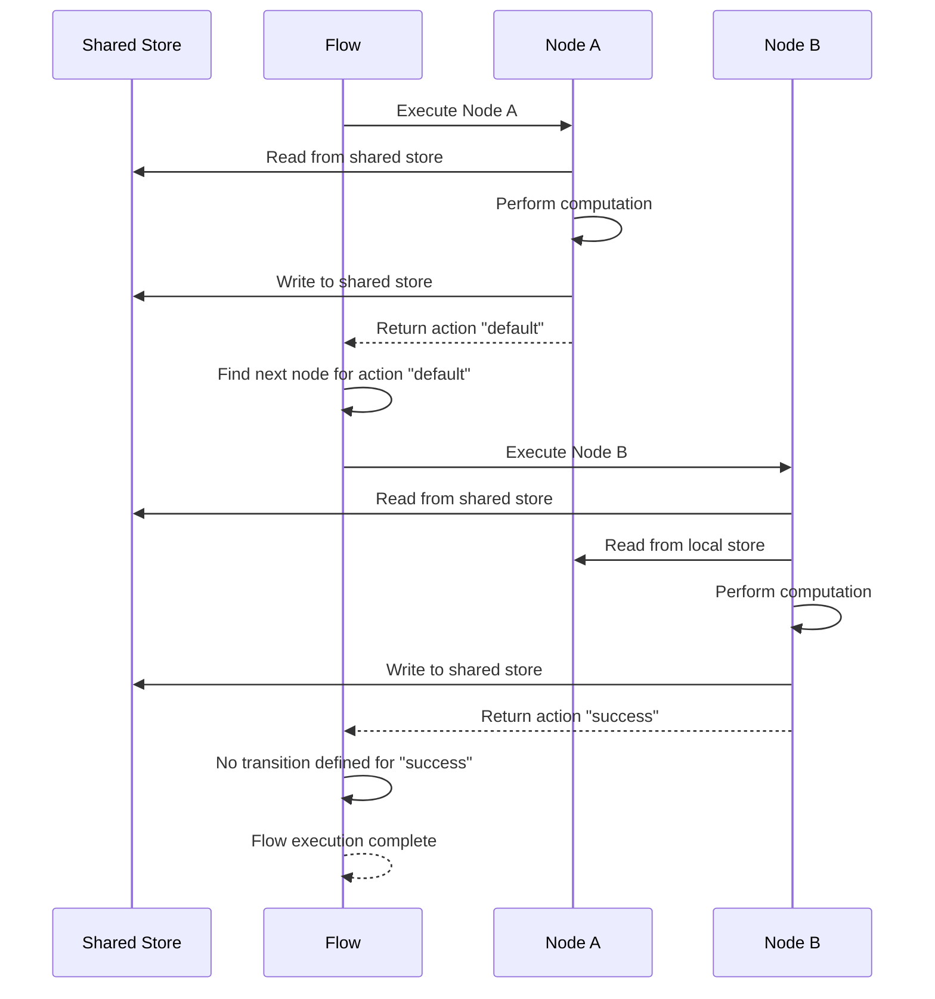
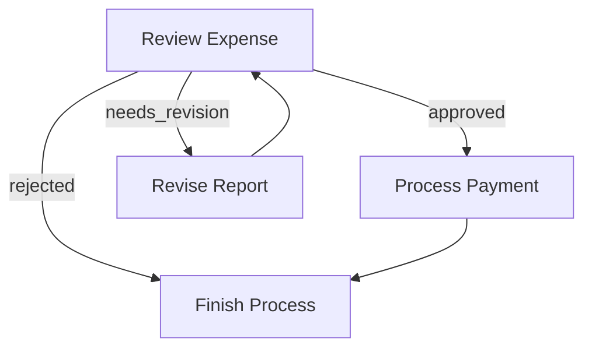
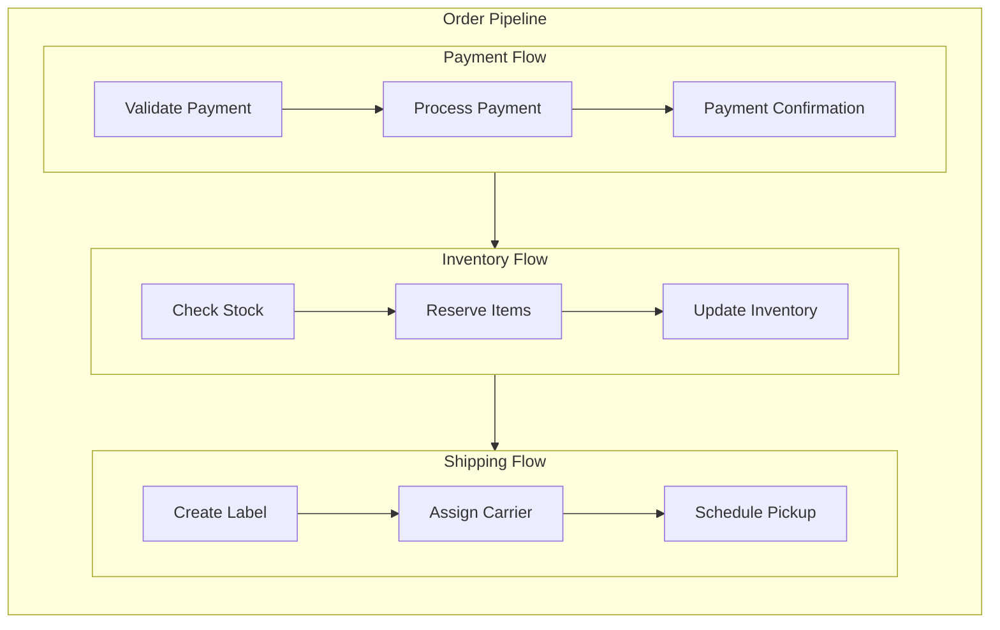

# Flow: Orchestrating Nodes in a Directed Graph

A **Flow** orchestrates a graph of Nodes, connecting them through action-based transitions. Flows enable you to create complex application logic including sequences, branches, loops, and nested workflows.

They manage the execution order, handle data flow between nodes, and provide error handling and cycle detection.

## Action-based Transitions

Each **Node** can trigger multiple actions in the flow. The Node's `trigger(action_name)` method can run inside `post()` to schedule an **Action** string that determines which nodes to execute next. If a Node doesn't trigger anything, the default action `"default"` is used.

### Defining Transitions




You can define transitions with syntax sugar:

1. **Basic default transition**: `node_a >> node_b`
   This means if `node_a` triggers `"default"`, go to `node_b`.

2. **Named action transition**: `node_a - "action_name" >> node_b`
   This means if `node_a` triggers `"action_name"`, go to `node_b`.

Note that `node_a >> node_b` is equivalent to `node_a - "default" >> node_b`

```python
# Basic default transition
node_a >> node_b  # If node_a triggers "default", go to node_b

# Named action transition
node_a - "success" >> node_b  # If node_a triggers "success", go to node_b
node_a - "error" >> node_c    # If node_a triggers "error", go to node_c
```





1. **Basic default transition**: `node_a.next(node_b)`
   This means if `node_a` triggers `"default"`, go to `node_b`.

2. **Named action transition**: `node_a.on('action_name', node_b)` or `node_a.next(node_b, 'action_name')`
   This means if `node_a` triggers `"action_name"`, go to `node_b`.

Note that `node_a.next(node_b)` is equivalent to both `node_a.next(node_b, 'default')` and `node_a.on('default', node_b)`

```python
# Basic default transition
node_a.next(node_b) # If node_a triggers "default", go to node_b

# Named action transition
node_a.on('success', node_b) # If node_a triggers "success", go to node_b
node_a.on('error', node_c) # If node_a triggers "error", go to node_c

# Alternative syntax
node_a.next(node_b, 'success') # Same as node_a.on('success', node_b)
```





1. **Basic default transition**: `node_a.next(node_b)`
   This means if `node_a` triggers `"default"`, go to `node_b`.

2. **Named action transition**: `node_a.on('action_name', node_b)` or `node_a.next(node_b, 'action_name')`
   This means if `node_a` triggers `"action_name"`, go to `node_b`.

Note that `node_a.next(node_b)` is equivalent to both `node_a.next(node_b, 'default')` and `node_a.on('default', node_b)`

```typescript
// Basic default transition
node_a.next(node_b) // If node_a triggers "default", go to node_b

// Named action transition
node_a.on('success', node_b) // If node_a triggers "success", go to node_b
node_a.on('error', node_c) // If node_a triggers "error", go to node_c

// Alternative syntax
node_a.next(node_b, 'success') // Same as node_a.on('success', node_b)
```




## Creating a Flow

A Flow begins with a **start node**, a memory state, and follows the action-based transitions (_described above_) until it reaches a node with no matching transition for its returned action.




```python
from brainyflow import Flow

# Define nodes and transitions
node_a >> node_b
node_b - "success" >> node_c
node_b - "error" >> node_d

# Create a shared/global store
memory = {}

# Create flow starting with node_a
flow = Flow(start=node_a)

# Run the flow with a shared store
await flow.run(memory)
# Print the results
print(memory)
```





```typescript
import { Flow } from 'brainyflow'

// Define nodes and transitions
node_a.next(node_b)
node_b.on('success', node_c)
node_b.on('error', node_d)

// Create a shared/global store
const memory = {}

// Create flow starting with node_a
const flow = new Flow(node_a)

// Run the flow with a shared store
await flow.run(memory)
// Print the results
console.log(memory)
```




## Flow Execution Process

When you call `flow.run(memory)`, the flow executes the following steps:

1. The flow executes the start node
2. It examines the action(s) triggered by node's `trigger()` method
3. It follows the corresponding transition(s) to the next node(s)
4. This process repeats until it reaches a point where it cannot find a node with a matching transition for its action



## Controlling Flow Execution

### Branching and Looping

Flows support complex patterns like branching (conditionally following different paths) and looping (returning to previous nodes).

#### Example: Expense Approval Flow

Here's a simple expense approval flow that demonstrates branching and looping:




```python
# Define the nodes first
# review = ReviewExpenseNode()
# revise = ReviseReportNode()
# payment = ProcessPaymentNode()
# finish = FinishProcessNode()
# ...

# Define the flow connections
review - "approved" >> payment        # If approved, process payment
review - "needs_revision" >> revise   # If needs changes, go to revision
review - "rejected" >> finish         # If rejected, finish the process

revise >> review   # After revision, go back for another review
payment >> finish  # After payment, finish the process

# Create the flow
expense_flow = Flow(start=review)
```





```typescript
// Define the nodes first
// const review = new ReviewExpenseNode()
// const revise = new ReviseReportNode()
// const payment = new ProcessPaymentNode()
// const finish = new FinishProcessNode()
// ..

// Define the flow connections
review.on('approved', payment) // If approved, process payment
review.on('needs_revision', revise) // If needs changes, go to revision
review.on('rejected', finish) // If rejected, finish the process

revise.next(review) // After revision, go back for another review
payment.next(finish) // After payment, finish the process

// Create the flow
const expenseFlow = new Flow(review)
```




This flow creates the following execution paths:

1. If `review` triggers `"approved"`, the expense moves to the `payment` node
2. If `review` triggers `"needs_revision"`, it goes to the `revise` node, which then loops back to `review`
3. If `review` triggers `"rejected"`, it moves to the `finish` node and stops



### Flow as a Node

Every Flow is in fact a Node - _`Flow` is a subclass of `Node`_ - which means it can be used as a Node within another Flow, enabling powerful composition patterns.


The only technical difference from Node is that `Flow` has a specialized `exec()` method that orchestrates its internal nodes and which cannot be overridden.

- It inherits the Node lifecycle (`prep → exec → post`)
- Its `prep()` and `post()` methods keep the same behavior and can be overridden, but `exec()` cannot
- When run, it executes internal nodes according to their transitions
  

This allows you to:

1. Break down complex applications into manageable sub-flows
2. Reuse flows across different applications
3. Create hierarchical workflows with clear separation of concerns

#### Example: Order Processing Pipeline

Here's a practical example that breaks down order processing into nested flows:




```python
# Payment processing sub-flow
validate_payment >> process_payment >> payment_confirmation
payment_flow = Flow(start=validate_payment)

# Inventory sub-flow
check_stock >> reserve_items >> update_inventory
inventory_flow = Flow(start=check_stock)

# Shipping sub-flow
create_label >> assign_carrier >> schedule_pickup
shipping_flow = Flow(start=create_label)

# Connect the flows into a main order pipeline
payment_flow >> inventory_flow >> shipping_flow

# Create the master flow
order_pipeline = Flow(start=payment_flow)

# Run the entire pipeline
await order_pipeline.run(shared_data)
```





```typescript
// Payment processing sub-flow
validatePayment.next(processPayment).next(paymentConfirmation)
const paymentFlow = new Flow(validatePayment)

// Inventory sub-flow
checkStock.next(reserveItems).next(updateInventory)
const inventoryFlow = new Flow(checkStock)

// Shipping sub-flow
createLabel.next(assignCarrier).next(schedulePickup)
const shippingFlow = new Flow(createLabel)

// Connect the flows into a main order pipeline
paymentFlow.next(inventoryFlow).next(shippingFlow)

// Create the master flow
const orderPipeline = new Flow(paymentFlow)

// Run the entire pipeline
await orderPipeline.run(sharedData)
```




This creates a clean separation of concerns while maintaining a clear execution path:



### Cycle Detection

Flows automatically detect and prevent infinite loops:


This ensures that the flow does not get stuck in an infinite loop. If a node is visited more than the specified number of times, the flow will throw an error.


```typescript
// Limit the number of times a node can be visited within this flow
const flow = new Flow(startNode, { maxVisits: 10 })
```

- The default value is `5`.
- For no limit, set `maxVisits` to `Infinity`

## Flow Parallelism

BrainyFlow offers two built-in types - and the possibility to create custom ones\_ - of flows that provide different levels of parallelism when nodes trigger multiple successors:

### 1. Sequential Flow

The default `Flow` class executes nodes sequentially, waiting for each node to complete before proceeding to the next one.

```typescript
const sequentialFlow = new Flow(startNode)
```

### 2. Parallel Flow

The `ParallelFlow` class executes multiple branches in parallel when a node triggers multiple successors.

```typescript
const parallelFlow = new ParallelFlow(startNode)

// Useful for batch processing or independent tasks
await parallelFlow.run(initialMemory)
```

### Custom Runners

You can also create custom flow runners that process each triggered/node in the way you want. You are free to implement queueing, threading, or any other parallel execution pattern by overriding the `runTasks(tasks)` method.

```typescript
class CustomExecutionFlow<GlobalStore, AllowedActions> extends Flow<GlobalStore, AllowedActions> {
  async runTasks<T>(tasks: (() => T)[]): Promise<Awaited<T>[]> {
    return await Promise.all(tasks.map((task) => task()))
  }
}
```

## Best Practices

- **Start Simple**: Begin with a linear flow and add branching/looping as needed
- **Visualize First**: Sketch your flow diagram before coding
- **Flow Modularity**: Design flows as reusable components
- **Memory Planning**: Plan your global and local memory structure upfront
- **Document Transitions**: Add comments explaining the conditions for each transition
- **Action Naming**: Use descriptive action names for branching
- **Cycle Prevention**: Be cautious with circular references between nodes
- **Error Strategy**: Decide whether errors should terminate the flow or be handled gracefully
- **Test Incrementally**: Build and test one section of your flow at a time
- **Diverse Testing**: Test flows with different input scenarios
- **Error Handling**: Always include paths for handling errors
- **Avoid Deep Nesting**: Keep nesting to a resoanable level, for maintainability
- **Memory Isolation**: Use local memory to isolate parallel processing branches

Flows provide the orchestration layer that determines how your nodes interact, ensuring that data moves predictably through your application and that execution follows your intended paths.

By following these principles, you can create complex, maintainable AI applications that are easy to reason about and extend.
