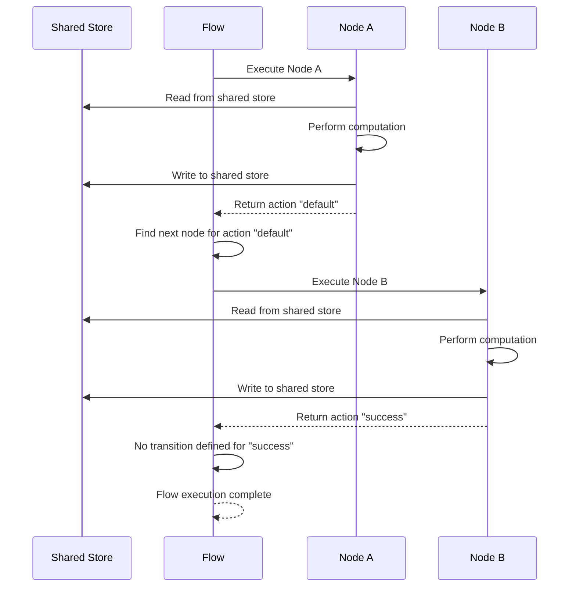
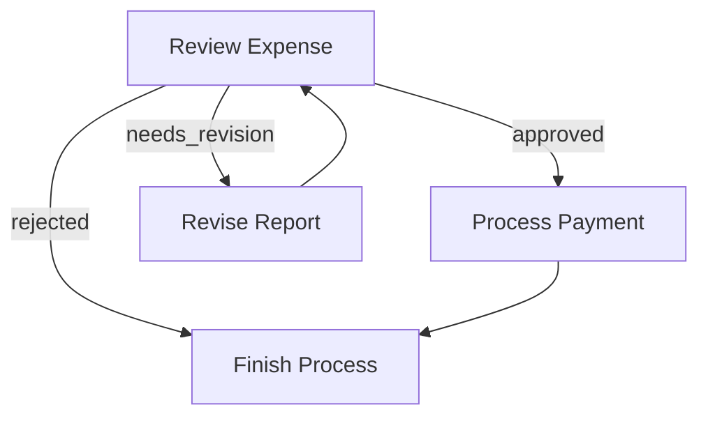
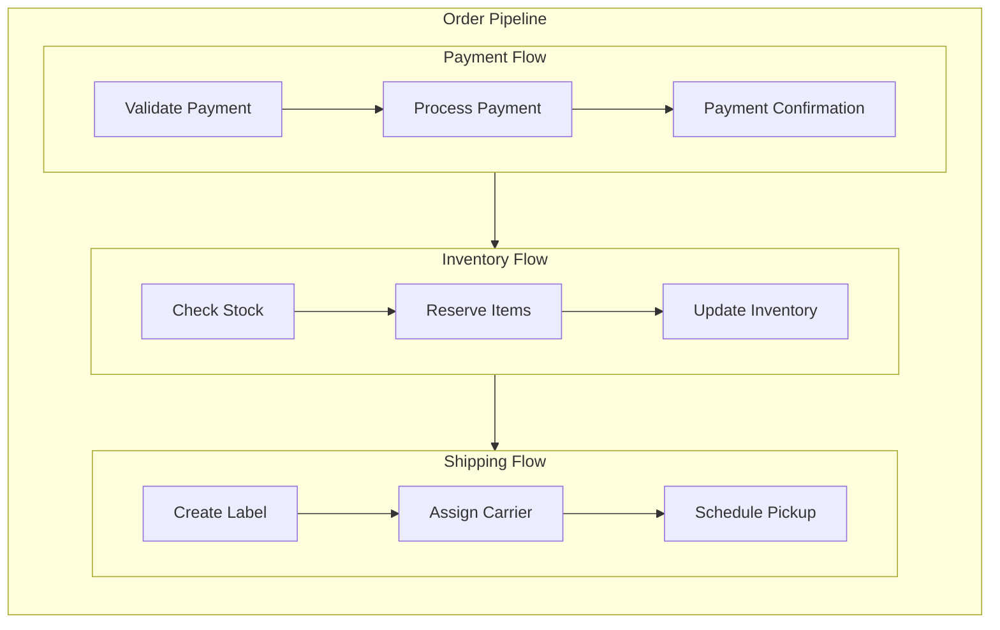

# Flow: Orchestrating Nodes in a Directed Graph

A **Flow** orchestrates a graph of Nodes, connecting them through action-based transitions. Flows enable you to create complex application logic including sequences, branches, loops, and nested workflows.

## Action-based Transitions

Each Node's `post()` method returns an **Action** string that determines which node to execute next. If `post()` doesn't return anything, the default action `"default"` is used.

### Defining Transitions




You can define transitions primarily with syntax sugar:

1. **Basic default transition**: `node_a >> node_b`
   This means if `node_a.post()` returns `"default"`, go to `node_b`.

2. **Named action transition**: `node_a - "action_name" >> node_b`
   This means if `node_a.post()` returns `"action_name"`, go to `node_b`.

Note that `node_a >> node_b` is equivalent to `node_a - "default" >> node_b`

```python
# Basic default transition
node_a >> node_b  # If node_a returns "default", go to node_b

# Named action transition
node_a - "success" >> node_b  # If node_a returns "success", go to node_b
node_a - "error" >> node_c    # If node_a returns "error", go to node_c
```





1. **Basic default transition**: `node_a.next(node_b)`
   This means if `node_a.post()` returns `"default"`, go to `node_b`.

2. **Named action transition**: `node_a.on('action_name', node_b)` or `node_a.next(node_b, 'action_name')`
   This means if `node_a.post()` returns `"action_name"`, go to `node_b`.

Note that `node_a.next(node_b)` is equivalent to both `node_a.next(node_b, 'default')` and `node_a.on('default', node_b)`

```typescript
// Basic default transition
node_a.next(node_b) // If node_a returns "default", go to node_b

// Named action transition
node_a.on('success', node_b) // If node_a returns "success", go to node_b
node_a.on('error', node_c) // If node_a returns "error", go to node_c

// Alternative syntax
node_a.next(node_b, 'success') // Same as node_a.on('success', node_b)
```




## Creating a Flow

A Flow begins with a **start node** and follows the action-based transitions until it reaches a node with no matching transition for its returned action.




```python
from brainyflow import Flow

# Define nodes and transitions
node_a >> node_b
node_b - "success" >> node_c
node_b - "error" >> node_d

# Create flow starting with node_a
flow = Flow(start=node_a)

# Run the flow with a shared store
await flow.run(shared)
```





```typescript
import { Flow } from 'brainyflow'

// Define nodes and transitions
node_a.next(node_b)
node_b.on('success', node_c)
node_b.on('error', node_d)

// Create flow starting with node_a
const flow = new Flow(node_a)

// Run the flow with a shared store
await flow.run(shared)
```




## Flow Execution Process

When you call `flow.run(shared)`:

1. The flow executes the start node
2. It examines the action returned by the node's `post()` method
3. It follows the corresponding transition to the next node
4. This process repeats until it reaches a node with no matching transition for its action



## Branching and Looping

Flows support complex patterns like branching (conditionally following different paths) and looping (returning to previous nodes).

### Example: Expense Approval Flow

Here's a simple expense approval flow that demonstrates branching and looping:




```python
# Define the nodes first
# review = ReviewExpenseNode()
# revise = ReviseReportNode()
# payment = ProcessPaymentNode()
# finish = FinishProcessNode()
# ...

# Define the flow connections
review - "approved" >> payment        # If approved, process payment
review - "needs_revision" >> revise   # If needs changes, go to revision
review - "rejected" >> finish         # If rejected, finish the process

revise >> review   # After revision, go back for another review
payment >> finish  # After payment, finish the process

# Create the flow
expense_flow = Flow(start=review)
```





```typescript
// Define the nodes first
// const review = new ReviewExpenseNode()
// const revise = new ReviseReportNode()
// const payment = new ProcessPaymentNode()
// const finish = new FinishProcessNode()
// ..

// Define the flow connections
review.on('approved', payment) // If approved, process payment
review.on('needs_revision', revise) // If needs changes, go to revision
review.on('rejected', finish) // If rejected, finish the process

revise.next(review) // After revision, go back for another review
payment.next(finish) // After payment, finish the process

// Create the flow
const expenseFlow = new Flow(review)
```




This flow creates the following execution paths:

1. If `review.post()` returns `"approved"`, the expense moves to the `payment` node
2. If `review.post()` returns `"needs_revision"`, it goes to the `revise` node, which then loops back to `review`
3. If `review.post()` returns `"rejected"`, it moves to the `finish` node and stops



## Nested Flows

A Flow can be used as a Node within another Flow, enabling powerful composition patterns. This allows you to:

1. Break down complex applications into manageable sub-flows
2. Reuse flows across different applications
3. Create hierarchical workflows with clear separation of concerns

### Flow as a Node

When a Flow is used as a Node:

- It inherits the Node lifecycle (`prep → exec → post`)
- Its `prep()` and `post()` methods can be overridden
- It won't allow for a custom `exec()` method since its main logic is to orchestrate its internal nodes
- When run, it executes its internal nodes according to their transitions

### Example: Order Processing Pipeline

Here's a practical example that breaks down order processing into nested flows:




```python
# Payment processing sub-flow
validate_payment >> process_payment >> payment_confirmation
payment_flow = Flow(start=validate_payment)

# Inventory sub-flow
check_stock >> reserve_items >> update_inventory
inventory_flow = Flow(start=check_stock)

# Shipping sub-flow
create_label >> assign_carrier >> schedule_pickup
shipping_flow = Flow(start=create_label)

# Connect the flows into a main order pipeline
payment_flow >> inventory_flow >> shipping_flow

# Create the master flow
order_pipeline = Flow(start=payment_flow)

# Run the entire pipeline
await order_pipeline.run(shared_data)
```





```typescript
// Payment processing sub-flow
validatePayment.next(processPayment).next(paymentConfirmation)
const paymentFlow = new Flow(validatePayment)

// Inventory sub-flow
checkStock.next(reserveItems).next(updateInventory)
const inventoryFlow = new Flow(checkStock)

// Shipping sub-flow
createLabel.next(assignCarrier).next(schedulePickup)
const shippingFlow = new Flow(createLabel)

// Connect the flows into a main order pipeline
paymentFlow.next(inventoryFlow).next(shippingFlow)

// Create the master flow
const orderPipeline = new Flow(paymentFlow)

// Run the entire pipeline
await orderPipeline.run(sharedData)
```




This creates a clean separation of concerns while maintaining a clear execution path:



## Flow Parameters

When a Flow is used as a Node, you can pass parameters to it using `set_params()`. These parameters are then accessible within the Flow's nodes:




```python
# Create a flow
process_flow = Flow(start=some_node)

# Set parameters
process_flow.set_params({"mode": "fast", "max_items": 10})

# Use the flow in another flow
main_flow = Flow(start=process_flow)

# Run the main flow
await main_flow.run(shared)
```





```typescript
// Create a flow
const processFlow = new Flow(someNode)

// Set parameters
processFlow.setParams({ mode: 'fast', maxItems: 10 })

// Use the flow in another flow
const mainFlow = new Flow(processFlow)

// Run the main flow
await mainFlow.run(shared)
```




## Best Practices

1. **Start Simple**: Begin with a linear flow and add branching/looping as needed
2. **Visualize First**: Sketch your flow diagram before coding
3. **Name Actions Clearly**: Use descriptive action names that indicate the decision made
4. **Test Incrementally**: Build and test one section of your flow at a time
5. **Document Transitions**: Add comments explaining the conditions for each transition
6. **Error Handling**: Always include paths for handling errors
7. **Avoid Deep Nesting**: Keep nesting to 2-3 levels for maintainability

By following these principles, you can create complex, maintainable AI applications that are easy to reason about and extend.
