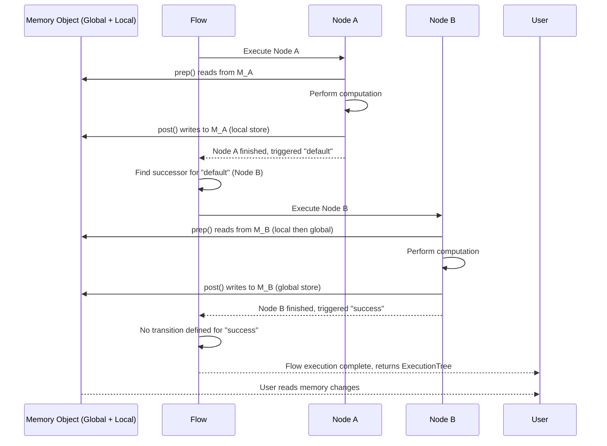
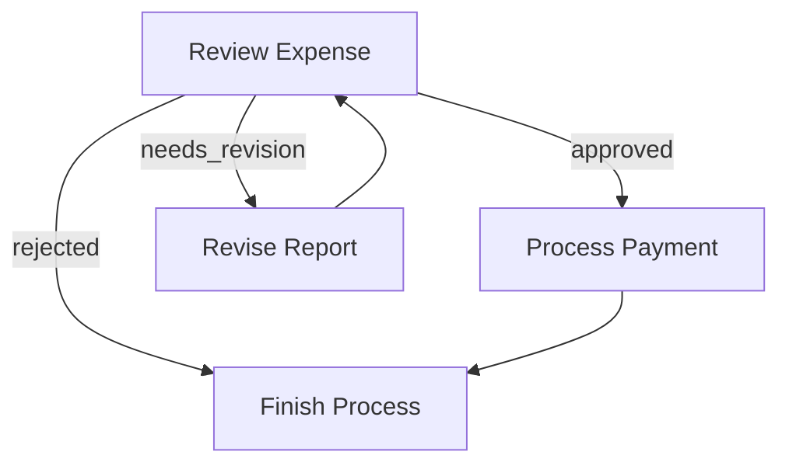
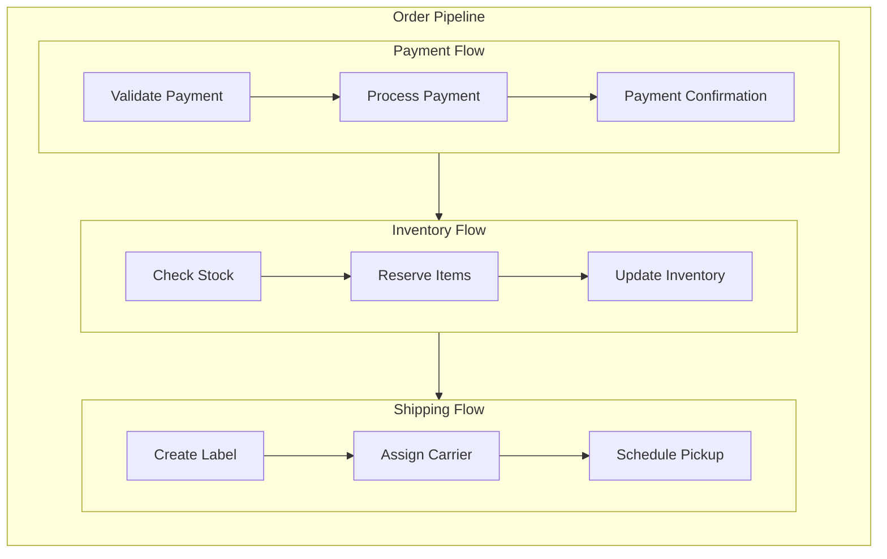

# Flow: Orchestrating Nodes in a Directed Graph

A **Flow** orchestrates a graph of Nodes, connecting them through action-based transitions. Flows enable you to create complex application logic including sequences, branches, loops, and nested workflows.

They manage the execution order, handle data flow between nodes, and provide error handling and cycle detection.

## Creating a Flow

A Flow begins with a **start node**, a memory state, and follows the [action-based transitions defined by the nodes](./nodes.md) until it reaches a node with no matching transition for its returned action.




```python
from brainyflow import Flow, Node

# Define nodes and transitions
# node_a = Node() ... etc.
node_a >> node_b
node_b - "success" >> node_c
node_b - "error" >> node_d

# Start with an empty memory object
memory = {}

# Create flow starting with node_a
flow = Flow(start=node_a)

# Run the flow, passing the memory object
execution_result = await flow.run(memory)

# Run the flow, passing the memory object.
# The memory object is modified in place.
# The run method returns an ExecutionTree.
print("Flow finished. Final memory state:", memory)
print('Execution Tree:', execution_result)
```





```typescript
import { Flow, Node } from 'brainyflow'

// Define nodes and transitions
// const node_a = new Node(); ... etc.
node_a.next(node_b) // Default transition
node_b.on('success', node_c) // Named transition
node_b.on('error', node_d) // Named transition

// Define the expected memory structure (optional but recommended)
interface MyGlobalStore {
  input?: any
  result?: any
  error?: any
}

// Start with an empty memory object
const memory = { input: 'some data' }

// Create flow starting with node_a
const flow = new Flow<MyGlobalStore>(node_a)

// Run the flow, passing the memory object.
// The memory object is modified in place.
// The run method returns an ExecutionTree.
const executionResult = await flow.run(memory)

// Print the final state of the memory object and the execution result
console.log('Flow finished. Final memory state:', memory)
console.log('Execution Tree:', executionResult)
// Example output (depending on flow logic):
// { input: 'some data', result: 'processed data from node_c' }
// or
// { input: 'some data', error: 'error details from node_d' }
```




## Flow Execution Process

When you call `flow.run(memory)`, the flow executes the following steps internally:

1.  It starts with the designated `start` node.
2.  For the current node, it executes its lifecycle (`prep` -> `execRunner` -> `post`), passing to the `prep` and `post` methods a `Memory` instance that wraps the global store and manages local state.
3.  It looks for triggered action (specified by `trigger()` calls), then it finds the corresponding successor node(s) defined by `.on()` or `.next()`.
4.  It recursively executes the successor node(s) with their respective cloned local memories.
5.  This process repeats until it reaches nodes that trigger actions with no defined successors, or the flow completes.
6.  The `run` method modifies the original `Memory` object's global store in place.
7.  Upon completion, `flow.run()` returns an `ExecutionTree` object, which is a structured representation of the execution path, the actions triggered at each step, and the resulting sub-trees.



## Controlling Flow Execution

### Branching and Looping

Flows support complex patterns like branching (conditionally following different paths) and looping (returning to previous nodes).

#### Example: Expense Approval Flow

Here's a simple expense approval flow that demonstrates branching and looping:




```python
from brainyflow import Flow, Node

# Define the nodes first
# review = ReviewExpenseNode()
# revise = ReviseReportNode()
# payment = ProcessPaymentNode()
# finish = FinishProcessNode()
# ...

# Define the flow connections
review - "approved" >> payment        # If approved, process payment
review - "needs_revision" >> revise   # If needs changes, go to revision
review - "rejected" >> finish         # If rejected, finish the process

revise >> review   # After revision, go back for another review
payment >> finish  # After payment, finish the flow

# Create the flow
expense_flow = Flow(start=review)
```





```typescript
import { Flow, Node } from 'brainyflow'

// Define the nodes first
// const review = new ReviewExpenseNode()
// const revise = new ReviseReportNode()
// const payment = new ProcessPaymentNode()
// const finish = new FinishProcessNode()

// Define the flow connections
review.on('approved', payment) // If approved, process payment
review.on('needs_revision', revise) // If needs changes, go to revise
review.on('rejected', finish) // If rejected, finish

revise.next(review) // After revision (default trigger), go back for another review
payment.next(finish) // After payment (default trigger), finish the process

// Create the flow, starting with the review node
const expenseFlow = new Flow(review)
```




This flow creates the following execution paths:

1. If `review` triggers `"approved"`, the expense moves to the `payment` node
2. If `review` triggers `"needs_revision"`, it goes to the `revise` node, which then loops back to `review`
3. If `review` triggers `"rejected"`, it moves to the `finish` node and stops



### Flow as a Node

Every `Flow` is in fact a specialized type of `Node`. This means a `Flow` itself can be used as a node within another, larger `Flow`, enabling powerful composition and nesting patterns.


The difference from Node is that `Flow` has a specialized `execRunner()` method - _the internal caller of `exec()`_ - that orchestrates its internal nodes and which cannot be overridden.
As such:

- A `Flow`'s primary role is orchestration, not direct computation like a standard `Node`.
- You cannot override `exec` or `execRunner` in a `Flow`.
- It still has the `prep` and `post` lifecycle methods, which you _can_ override if you need to perform setup before the sub-flow runs or cleanup/processing after it completes.
- When a `Flow` used as a node finishes its internal execution, it triggers its _own_ successors in the parent flow based on its `post` method's `trigger` calls (or the default action).



This allows you to:

1. Break down complex applications into manageable sub-flows
2. Reuse flows across different applications
3. Create hierarchical workflows with clear separation of concerns

#### Example: Order Processing Pipeline

Here's a practical example that breaks down order processing into nested flows:




```python
from brainyflow import Flow, Node

# Payment processing sub-flow
validate_payment >> process_payment >> payment_confirmation
payment_flow = Flow(start=validate_payment)

# Inventory sub-flow
check_stock >> reserve_items >> update_inventory
inventory_flow = Flow(start=check_stock)

# Shipping sub-flow
create_label >> assign_carrier >> schedule_pickup
shipping_flow = Flow(start=create_label)

# Connect the flows into a main order pipeline
payment_flow >> inventory_flow >> shipping_flow

order_pipeline = Flow(start=payment_flow) # Create the master flow

# Run the entire pipeline
memory = { orderId: 'XYZ789', customerId: 'CUST123' }
await order_pipeline.run(memory)
# print('Order pipeline completed. Final state:', memory)
```





```typescript
import { Flow, Node } from 'brainyflow'

// Payment processing sub-flow
validatePayment.next(processPayment).next(paymentConfirmation)
const paymentFlow = new Flow(validatePayment)

// Inventory sub-flow
checkStock.next(reserveItems).next(updateInventory)
const inventoryFlow = new Flow(checkStock)

// Shipping sub-flow
createLabel.next(assignCarrier).next(schedulePickup)
const shippingFlow = new Flow(createLabel)

paymentFlow.next(inventoryFlow) // Default transition after paymentFlow completes
inventoryFlow.next(shippingFlow) // Default transition after inventoryFlow completes

// Create the master flow, starting with the paymentFlow
const orderPipeline = new Flow(paymentFlow)

// --- Run the entire pipeline ---
// const globalStore = { orderId: 'XYZ789', customerId: 'CUST123' }
// await orderPipeline.run(globalStore);
// console.log('Order pipeline completed. Final state:', globalStore)
```




This creates a clean separation of concerns while maintaining a clear execution path:



### Cycle Detection

Loops are created by connecting a node back to a previously executed node. To prevent infinite loops, `Flow` includes cycle detection controlled by the `maxVisits` option in its constructor (default is 15). If a node is visited more times than `maxVisits` during a single run, an error is thrown.


This mechanism, combined with the `ExecutionTree` output, helps debug and manage complex looped behaviors.


```typescript
// Limit the number of times a node can be visited within this flow
const flow = new Flow(startNode, { maxVisits: 10 })
```

- The default value for `maxVisits` is `15`.
- Set `maxVisits` to `Infinity` or a very large number for effectively no limit (use with caution!).

## Flow Parallelism

When a node's `post` method calls `this.trigger()` multiple times (e.g., for different actions or for the same action with different `forkingData`), it effectively creates multiple branches of execution that will start from that node. How these branches are executed depends on the type of `Flow` being used.

The `Flow` class manages the execution of these branches via its `runTasks` method. This method takes an array of task functions (each function representing the execution of one triggered branch) and determines how they are run.

- In a standard `Flow`, `runTasks` executes them sequentially.
- In a `ParallelFlow`, `runTasks` executes them concurrently.

You can also create custom flow execution behaviors simply by subclassing `Flow` and overriding `runTasks`.
BrainyFlow offers two built-in types - _and the possibility to create custom ones_ - of flows that provide different levels of parallelism when nodes trigger multiple successors:

### 1. `Flow` (Sequential Execution)

The default `Flow` class executes the tasks generated by multiple triggers **sequentially**. It waits for the entire branch initiated by the first trigger to complete before starting the branch for the second trigger, and so on.

```typescript
const sequentialFlow = new Flow(startNode)
```

### 2. `ParallelFlow` (Concurrent Execution)

The `ParallelFlow` class executes the tasks generated by multiple triggers **concurrently** using `Promise.all()` (TypeScript) or `asyncio.gather()` (Python). This is useful for performance when branches are independent (e.g., batch processing items).

```typescript
const parallelFlow = new ParallelFlow(startNode) // Executes triggered branches in parallel
```

Use `ParallelFlow` when:

1.  A node needs to "fan-out" work into multiple independent branches (e.g., processing items in a batch).
2.  These branches do not have dependencies on each other's immediate results (though they might all write back to the shared global memory).
3.  You want to potentially speed up execution by running these independent branches concurrently.



When using `ParallelFlow`, be mindful of potential race conditions if multiple parallel branches try to modify the same property in the global `Memory` object simultaneously without proper synchronization. Often, it's safer for parallel branches to accumulate results in their `local` store (via `forkingData` and internal processing) or use unique keys/indices when writing to the global store, potentially followed by a final sequential aggregation step if needed.



### Custom Execution Logic (Overriding `runTasks`)

For more advanced control over how triggered branches are executed, you can extend `Flow` (or `ParallelFlow`) and override the `runTasks` method. This method receives an array of functions, where each function represents the execution of one triggered branch.

```typescript
import { Flow, Memory } from 'brainyflow'

declare function sleep(ms: number): Promise<void> // Assuming sleep is available

class CustomExecutionFlow extends Flow {
  async runTasks<T>(tasks: (() => Promise<T>)[]): Promise<Awaited<T>[]> {
    // Example: Run tasks sequentially with a delay between each
    const results: Awaited<T>[] = []
    for (const task of tasks) {
      results.push(await task())
      console.log('Custom runTasks: Task finished, waiting 1s...')
      await sleep(1000) // Wait 1 second between tasks
    }
    return results
  }
}
```

## Batch Processing (Fan-Out Pattern)

The standard way to process multiple items (sequentially or in parallel) in BrainyFlow is using the "fan-out" pattern. This involves a node that triggers multiple instances of processing for individual items. This pattern does **not** require specialized "BatchNode" or "BatchFlow" classes.

1.  **Trigger Node**:
    - A standard `Node` whose `post` method iterates through your items (e.g., from `prepRes.items`).
    - For each item, it calls `this.trigger` with forking data. E.g., `this.trigger("process_item", { item: current_item, index: i })`.
    - The forked data is crucial for passing item-specific data to the local memory of the next node.
2.  **Processor Node**:
    - Another standard `Node` connected via the action triggered by the `TriggerNode`. E.g. `triggerNode.on("process_item", processorNode)`.
    - Its `prep` reads the forked data from its local memory.
    - Its `exec` performs the actual processing for that single item.
    - Its `post` typically stores the result back into the global `Memory` object (e.g., `memory.results[prepRes.index] = execRes.result`).
3.  **Flow Choice**:
    - Use `Flow(triggerNode)` for **sequential** batch processing (one item completes before the next starts).
    - Use `ParallelFlow(triggerNode)` for **concurrent** batch processing (all items are processed in parallel).

This pattern leverages the core `Flow` and `Node` abstractions to handle batching effectively.

#### Example: Simple Batch Processing




```python
class TriggerBatchNode(Node):
    async def prep(self, memory):
        return memory.items_to_process or []

    async def post(self, memory, prep_res: list, exec_res):
        items = prep_res
        memory.results = [None] * len(items) # Pre-allocate for parallel
        for index, item in enumerate(items):
            self.trigger("process_one", {"item_data": item, "result_index": index})
        # Optional: self.trigger("aggregate") if needed

class ProcessOneItemNode(Node):
    async def prep(self, memory):
        return {"item": memory.item_data, "index": memory.result_index}

    async def exec(self, prep_res):
        result = f"Processed {prep_res['item']}" # Placeholder
        return {"result": result, "index": prep_res["index"]}

    async def post(self, memory, prep_res, exec_res):
        memory.results[exec_res["index"]] = exec_res["result"]

# Setup
trigger = TriggerBatchNode()
processor = ProcessOneItemNode()
trigger - "process_one" >> processor

# Choose Flow type
# sequential_batch_flow = Flow(trigger)
parallel_batch_flow = ParallelFlow(trigger)

# Run
# memory = {"items_to_process": ["A", "B", "C"]}
# await parallel_batch_flow.run(memory)
# print(memory["results"]) # Output: ['Processed A', 'Processed B', 'Processed C']
```





```typescript
interface BatchGlobalStore {
  items_to_process?: any[]
  results?: Record<string, any>
}
interface BatchLocalStore {
  item_data?: any
  result_index?: number
}

class TriggerBatchNode extends Node<BatchGlobalStore, BatchLocalStore, ['process_one', 'aggregate']> {
  async prep(memory: Memory<BatchGlobalStore>): Promise<any[]> {
    return memory.items_to_process ?? []
  }
  async post(memory: Memory<BatchGlobalStore>, items: any[], execRes: void): Promise<void> {
    memory.results = new Array(items.length).fill(null) // Pre-allocate
    items.forEach((item, index) => {
      this.trigger('process_one', { item_data: item, result_index: index })
    })
    // Optional: this.trigger("aggregate");
  }
}

class ProcessOneItemNode extends Node<BatchGlobalStore, BatchLocalStore> {
  async prep(memory: Memory<BatchGlobalStore, BatchLocalStore>): Promise<{ item: any; index: number }> {
    return { item: memory.item_data, index: memory.result_index ?? -1 }
  }
  async exec(prepRes: { item: any; index: number }): Promise<{ result: any; index: number }> {
    const result = `Processed ${prepRes.item}` // Placeholder
    return { result, index: prepRes.index }
  }
  async post(memory: Memory<BatchGlobalStore>, prepRes: any, execRes: { result: any; index: number }): Promise<void> {
    if (!memory.results) memory.results = {}
    memory.results[String(execRes.index)] = execRes.result
  }
}

// Setup
const trigger = new TriggerBatchNode()
const processor = new ProcessOneItemNode()
trigger.on('process_one', processor)

// Choose Flow type
// const sequentialBatchFlow = new Flow<BatchGlobalStore>(trigger);
const parallelBatchFlow = new ParallelFlow<BatchGlobalStore>(trigger)

// Run
// async function run() {
//   const memory: BatchGlobalStore = { items_to_process: ["A", "B", "C"] };
//   await parallelBatchFlow.run(memory);
//   console.log(memory.results); // Output: ['Processed A', 'Processed B', 'Processed C']
// }
// run();
```




In this example, `TriggerBatchNode` fans out the work. If run with `ParallelFlow`, each `ItemProcessorNode` instance would execute concurrently. If run with a standard `Flow`, they would execute sequentially.
The results are written to `memory.results` using the index as a key, which is safer for parallel execution than assuming array indices will be filled in order.

## Best Practices

- **Start Simple**: Begin with a linear flow and add branching/looping complexity gradually.
- **Visualize First**: Sketch your flow diagram (using Mermaid or similar tools) before coding to clarify logic.
- **Flow Modularity**: Design flows as reusable components. Break down complex processes into smaller, nested sub-flows.
- **Memory Planning**: Define clear interfaces for your `GlobalStore` and `LocalStore` types upfront. Decide what state needs to be global versus what can be passed locally via `forkingData`.
- **Action Naming**: Use descriptive, meaningful action names (e.g., 'user_clarification_needed', 'data_validated') instead of generic names like 'next' or 'step2'.
- **Explicit Transitions**: Clearly define transitions for all expected actions a node might trigger. Consider adding default `.next()` transitions for unexpected or completion actions.
- **Cycle Management**: Be mindful of loops. Use the `maxVisits` option in the `Flow` constructor to prevent accidental infinite loops.
- **Error Strategy**: Decide how errors should propagate. Should a node's `execFallback` handle errors and allow the flow to continue, or should errors terminate the flow? Define specific error actions (`node.on('error', errorHandlerNode)`) if needed.
- **Parallelism Choice**: Use `ParallelFlow` when branches are independent and can benefit from concurrent execution. Stick with `Flow` (sequential) if branches have dependencies or shared resource contention.
- **Memory Isolation**: Leverage `forkingData` in `trigger` calls to pass data down specific branches via the `local` store, keeping the `global` store cleaner. This is crucial for parallel execution.
- **Test Incrementally**: Test individual nodes using `node.run()` and test sub-flows before integrating them into larger pipelines.
- **Avoid Deep Nesting**: While nesting flows is powerful, keep the hierarchy reasonably flat (e.g., 2-3 levels deep) for maintainability.

Flows provide the orchestration layer that determines how your nodes interact, ensuring that data moves predictably through your application (via the `Memory` object) and that execution follows your intended paths, ultimately returning an `ExecutionTree` for introspection.

By following these principles, you can create complex, maintainable AI applications that are easy to reason about and extend.
