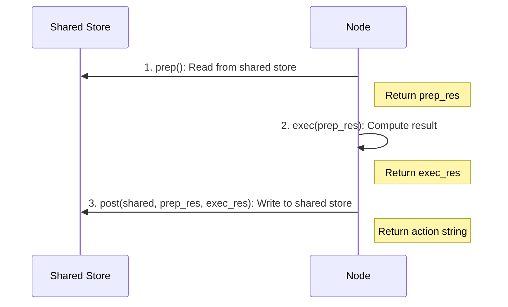

# Nodes

Nodes are the fundamental building blocks in BrainyFlow. Each node performs a specific task within your workflow, processing data and optionally triggering downstream nodes.

## Node Lifecycle

<div align="center">
  
</div>

Every node follows a three-phase lifecycle:

1. **Prep**: Gather and prepare input data
2. **Exec**: Perform the main processing task
3. **Post**: Process results, update memory and trigger downstream actions


**Why 3 steps?** This design enforces separation of concerns.

All steps are **optional**. For example, you can implement only `prep` and `post` if you just need to process data without external computation.


### 1. `async prep(shared)`

- Extracts necessary data from the `memory` store
- Performs any required preprocessing or validation
- Returns `prep_res`, which becomes input for `exec()` and `post()`

### 2. `async exec(prep_res)`

- Performs the main computation (often an LLM call or API request)
- ⚠️ Can **NOT** access the `memory` store directly
- ⚠️ No side effects! It should be designed for idempotence when retries are enabled
- Returns `exec_res`, which is passed to `post()`

### 3. `async post(shared, prep_res, exec_res)`

- Writes computation results back to the `memory` store
- Has access to both the original input (`prep_res`) and result (`exec_res`)
- Triggers next actions in the flow
  - If no action is triggered, defaults to `["default"]`



## Creating Custom Nodes

To create a custom node, extend the `Node` class and implement the lifecycle methods:

```typescript
class TextProcessorNode extends Node {
  async prep(memory: Memory): Promise {
    // Read input data
    return memory.text
  }

  async exec(text: string): Promise {
    // Process the text
    return text.toUpperCase()
  }

  async post(memory: Memory, input: string, result: string): Promise {
    // Store the result
    memory.processedText = result

    // Trigger next node
    this.trigger('default')
  }
}
```

## Error Handling

Nodes include built-in retry capabilities for handling transient failures in `exec()` calls.

To handle failures gracefully after all retries are exhausted, override the `exec_fallback` method.




```python
my_node = MyNode(max_retries=3, wait=10)  # Retry up to 3 times with 10s between retries

# Custom error handling
class CustomRetryNode(Node):
    async def exec_fallback(self, prep_res, error) -> str:
        # Handle the error after all retries have failed
        print(f"Failed after {error.retry_count} retries")
        return "Fallback response"
```





```typescript
// Create a node with retry options
const myNode = new MyNode({ maxRetries: 3, wait: 10 }) // Retry up to 3 times with 10s between retries

// Custom error handling
class CustomRetryNode extends Node {
  async execFallback(prepRes: string, error: NodeError): Promise {
    // Handle the error after all retries have failed
    console.error(`Failed after ${error.retryCount} retries`)
    return 'Fallback response'
  }
}
```




By default, `execFallback` just re-raises the exception. You can override it to return a fallback result instead, which becomes the `exec_res` passed to `post()`.

Key retry parameters:

- `max_retries` (int): Maximum number of execution attempts (default: 1, meaning no retry)
- `wait` (int): Seconds to wait between retries (default: 0)

`wait` is specially helpful when you encounter rate-limits or quota errors from your LLM provider and need to back off.
During retries, you can access the current retry count (0-based) via `self.cur_retry` (Python) or `this.curRetry` (TypeScript).

## Connecting Nodes

Nodes end their execution by triggering actions in the flow.
For each action triggered, the flow will run a corresponding node.
Triggering an action is done using the `trigger(actionName[, forkingData])` method.


We've opted for including the documentation of Node's methods `next()` and `on()` in the [flow's chapter](./flow.md) because they are used primarily as part of the flow composition.

Please check the [flow's chapter](./flow.md) for details on how to connect nodes, trigger and handle (multiple) actions, and control the process flow.


### Single Successor

```typescript
class RouterNode extends Node {
  async prep(memory: Memory): Promise {
    return memory.content
  }

  async exec(content: string): Promise {
    return detectLanguage(content)
  }

  async post(memory: Memory, content: string, language: string): Promise {
    // Trigger different paths based on language
    this.trigger(language)
  }
}

// Connect nodes to different actions
const router = new RouterNode()
const englishProcessor = new EnglishProcessorNode()
const spanishProcessor = new SpanishProcessorNode()

router.on('english', englishProcessor)
router.on('spanish', spanishProcessor)
```

### Multiple Successors

Nodes can trigger multiple output paths, effectively turning a single execution into multiple parallel branches, triggering multiple child executions, each with their own [local memory](./memory.md):

```typescript
class BatchProcessor extends Node {
  async post(memory: Memory, prepResult: any, items: string[]): Promise {
    // Process each item in a separate branch
    for (const item of items) {
      this.trigger('default', { currentItem: item })
    }
  }
}
```

## Running Individual Nodes

Nodes have an extra method `run(shared)`, which calls `prep → exec → post`. Use it only for debugging or testing a single node!


`Node.run` **does not** proceed to a successor!

This method is useful only for debugging or testing a single node, but not for running a [flow](./flow.md)!

Always use `Flow.run` instead to ensure the full pipeline runs correctly.


## Best Practices

- **Single Responsibility**: Keep nodes focused on a single task
- **Read in Prep**: Use the prep phase to gather all required inputs
- **Process in Exec**: Perform the main work in the exec phase
- **Write in Post**: Update memory and trigger successors in post
- **Immutability**: Treat inputs as immutable for predictable behavior
- **Error Handling**: Use the retry mechanism for resilient flows
