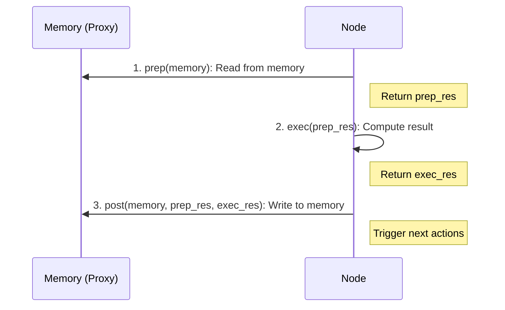

# Nodes

Nodes are the fundamental building blocks in BrainyFlow. Each node performs a specific task within your workflow, processing data and optionally triggering downstream nodes.

## Node Lifecycle

<div align="center">
  
</div>

Every node follows a three-phase lifecycle:

1.  **`prep`**: Gather and prepare input data from the `memory` object.
2.  **`exec`**: Perform the main processing task (potentially retried). Receives data from `prep`. **Cannot** access the `memory` object directly.
3.  **`post`**: Process results, update the `memory` object (global or local store), and trigger downstream actions. Receives data from `prep` and `exec`, plus the `memory` instance.


**Why 3 steps?** This design enforces separation of concerns.

All steps are **optional**. For example, you can implement only `prep` and `post` if you just need to process data without external computation.


### 1. `async prep(memory)`

- Receives the current `memory` instance (a proxy managing global and local stores).
- Extracts necessary data by external sources or by accessing properties on the `memory` object (e.g., `memory.someData`). The proxy reads from the local store first, then the global store.
- Performs any required preprocessing or validation.
- Can optionally return a `PrepResult`, which is passed as input to `exec()` and `post()`.

### 2. `async exec(prepRes)`

- Receives the result from `prep()` (`prepRes`).
- Performs the main computation (e.g., LLM call, API request, calculation).
- ⚠️ **Cannot** access the `Memory` instance directly. This enforces separation and aids retry logic.
- ⚠️ Should ideally be idempotent (produce the same result given the same input) and have no side effects if retries (`maxRetries > 1`) are enabled, as it might be called multiple times.
- Returns an `ExecResult`, which is passed to `post()`.
- _Note:_ The actual execution logic, including retries, is handled by the internal `execRunner` method, which calls this `exec` method.

### 3. `async post(memory, prepRes, execRes)`

- Receives the `memory` instance, the result from `prep()` (`prepRes`), and the result from `exec()` (`execRes`).
- Processes results and writes data back to the `memory` object (usually the global store, e.g., `memory.result = execRes`).
- **This is the only place to call `this.trigger()`** to specify which downstream nodes should run next and optionally pass `forkingData` to their local memory.
  - If no `trigger` is called, the flow proceeds via the `DEFAULT_ACTION` ('default') with no specific `forkingData`.



## Creating Custom Nodes

To create a custom node, extend the `Node` class and implement the lifecycle methods:




```python
from brainyflow import Node, Memory

class TextProcessorNode(Node):
    async def prep(self, memory: Memory):
        # Read input data
        return memory.text

    async def exec(self, text: str):
        # Process the text
        return text.upper()

    async def post(self, memory: Memory, input_text: str, result: str):
        # Store the result in the global store
        memory.processed_text = result

        # Trigger the default next node (optional)
        self.trigger('default')
```





```typescript
import { Memory, Node } from 'brainyflow'

class TextProcessorNode extends Node {
  async prep(memory: Memory): Promise<string> {
    // Read input data
    return memory.text
  }

  async exec(text: string): Promise<string> {
    // Process the text
    return text.toUpperCase()
  }

  async post(memory: Memory, input: string, result: string): Promise<void> {
    // Store the result in the global store
    memory.processed_text = result

    // Trigger the default next node (optional)
    this.trigger('default')
  }
}
```




## Error Handling

Nodes include built-in retry capabilities for handling transient failures in `exec()` calls.

You can configure retries via the constructor:

- `maxRetries` (number): Maximum number of attempts for `exec()` (default: 1, meaning no retry).
- `wait` (number): Seconds to wait between retry attempts (default: 0).

The `wait` parameter is specially helpful when you encounter rate-limits or quota errors from your LLM provider and need to back off.
During retries, you can access the current retry count (0-based) via `self.cur_retry` (Python) or `this.curRetry` (TypeScript).

To handle failures gracefully after all retry attempts for `exec()` are exhausted, override the `execFallback` method.

By default, `execFallback` just re-raises the exception. You can override it to return a fallback result instead, which becomes the `exec_res` passed to `post()`, allowing the flow to potentially continue.




```python
from brainyflow import Node, Memory, NodeError

my_node = MyNode(max_retries=3, wait=10) # Assuming MyNode is defined elsewhere

class CustomErrorHandlingNode(Node):
    async def exec(self, prep_res):
        print(f"Exec attempt: {self.cur_retry + 1}")
        if self.cur_retry < 2:
             raise ValueError("Temporary failure!")
        return "Success on retry"

    async def exec_fallback(self, prep_res, error: NodeError) -> str:
        # This is called only if exec fails on the last attempt
        print(f"Exec failed after {error.retry_count + 1} attempts: {error}")
        # Return a fallback value instead of raising error
        return f"Fallback response due to repeated errors: {error}"

    async def post(self, memory: Memory, prep_res, exec_res: str):
        # exec_res will be "Success on retry" or "Fallback response..."
        print(f"Post: Received result '{exec_res}'")
        memory.final_result = exec_res
        self.trigger('default')

```





```typescript
import { Memory, Node, NodeError } from 'brainyflow'

type PrepResult = void
type ExecResult = string

const myNode = new CustomErrorHandlingNode({ maxRetries: 3, wait: 10 })

class CustomErrorHandlingNode extends Node<any, any, [], PrepResult, ExecResult> {
  async exec(prepRes: PrepResult): Promise<ExecResult> {
    console.log(`Exec attempt: ${this.curRetry + 1}`)
    if (this.curRetry < 2) {
      throw new Error('Temporary failure!')
    }
    return 'Success on retry'
  }
  Z
  async execFallback(prepRes: PrepResult, error: NodeError): Promise<ExecResult> {
    // This is called only if exec fails on the last attempt
    console.error(`Exec failed after ${error.retryCount + 1} attempts: ${error.message}`)
    // Return a fallback value instead of re-throwing
    return `Fallback response due to repeated errors: ${error.message}`
  }

  async post(memory: Memory<any, any>, prepRes: PrepResult, execRes: ExecResult): Promise<void> {
    // execRes will be "Success on retry" or "Fallback response..."
    console.log(`Post: Received result '${execRes}'`)
    memory.final_result = execRes
    this.trigger('default')
  }
}
```




## Triggering Successors (`trigger`)

Nodes signal which path(s) the flow should take next by calling `this.trigger()` within their `post` method.

```typescript
this.trigger(actionName: string | typeof DEFAULT_ACTION, forkingData?: SharedStore): void
```

- `actionName`: A string identifying the transition (e.g., 'success', 'failure', 'categoryA'). If omitted or if `trigger` is not called, `DEFAULT_ACTION` ('default') is assumed.
- `forkingData` (optional): An object containing data to be added _only_ to the `local` store of the `memory` instance passed to the triggered successor(s). This allows passing specific data down a particular branch without polluting the global store.

The running [Flow](./flow.md) uses the `actionName` to look up the successor nodes defined using `.on()` or `.next()`.


`trigger()` can **only** be called inside the `post()` method. Calling it elsewhere will throw an error.


## Defining Connections (`on`, `next`)

While `trigger` determines _which_ path to take _during_ execution, you define the possible paths _before_ execution, by using either `.next()` or `.on()`, as shown below:




You can define transitions with syntax sugar:

1. **Basic default transition**: `node_a >> node_b`
   This means if `node_a` triggers the default action, go to `node_b`.

2. **Named action transition**: `node_a - "action_name" >> node_b`
   This means if `node_a` triggers `"action_name"`, go to `node_b`.

Note that `node_a >> node_b` is equivalent to `node_a - "default" >> node_b`

```python
# Basic default transition
node_a >> node_b  # If node_a triggers "default", go to node_b

# Named action transitions
node_a - "success" >> node_b  # If node_a triggers "success", go to node_b
node_a - "error" >> node_c    # If node_a triggers "error", go to node_c
```





1. **Basic default transition**: `node_a.next(node_b)`
   This means if `node_a` triggers `"default"`, go to `node_b`.

2. **Named action transition**: `node_a.on('action_name', node_b)` or `node_a.next(node_b, 'action_name')`
   This means if `node_a` triggers `"action_name"`, go to `node_b`.

Note that `node_a.next(node_b)` is equivalent to both `node_a.next(node_b, 'default')` and `node_a.on('default', node_b)`

```python
# Basic default transition
node_a.next(node_b) # If node_a triggers "default", go to node_b

# Named action transition
node_a.on('success', node_b) # If node_a triggers "success", go to node_b
node_a.on('error', node_c) # If node_a triggers "error", go to node_c

# Alternative syntax
node_a.next(node_b, 'success') # Same as node_a.on('success', node_b)
```





1.  **Basic default transition**: `node_a.next(node_b)`
    This means if `node_a` triggers `"default"`, `node_b` will execute next.

2.  **Named action transition**: `node_a.on('action_name', node_b)` or `node_a.next(node_b, 'action_name')`
    This means if `node_a` triggers `"action_name"`, `node_b` will execute next.

Note that `node_a.next(node_b)` is equivalent to both `node_a.next(node_b, 'default')` and `node_a.on('default', node_b)`. Both methods return the _successor_ node (`node_b` in this case), allowing for chaining.

```typescript
// Basic default transition
node_a.next(node_b) // If node_a triggers "default", go to node_b

// Named action transition
node_a.on('success', node_b) // If node_a triggers "success", go to node_b
node_a.on('error', node_c) // If node_a triggers "error", go to node_c

// Alternative syntax
node_a.next(node_b, 'success') // Same as node_a.on('success', node_b)
```




To summarize it:

- `node.on(actionName, successorNode)`: Connects `successorNode` to be executed when `node` triggers `actionName`.
- `node.next(successorNode, actionName = DEFAULT_ACTION)`: A convenience method, equivalent to `node.on(actionName, successorNode)`.

These methods are typically called when constructing your `Flow`. See the [Flow documentation](./flow.md) for detailed examples of graph construction.

### Example: Conditional Branching




```python
from brainyflow import Node, Flow, Memory

# Assuming detect_language, EnglishProcessorNode, SpanishProcessorNode, UnknownProcessorNode are defined elsewhere

class RouterNode(Node):
    async def prep(self, memory: Memory):
        # Read content from global memory
        return memory.content

    async def exec(self, content: str):
        return await detect_language(content)

    async def post(self, memory: Memory, content: str, language: str):
        print(f"RouterPost: Detected language '{language}', storing and triggering.")
        memory.language = language
        # Trigger the specific action based on the detected language
        self.trigger(language) # e.g., trigger 'english' or 'spanish' or 'unknown'

# --- Flow Definition ---
router = RouterNode()
english_processor = EnglishProcessorNode()
spanish_processor = SpanishProcessorNode()
unknown_processor = UnknownProcessorNode() # Handle unknown case

# Define connections for specific actions using syntax sugar
router - "english" >> english_processor
router - "spanish" >> spanish_processor
router - "unknown" >> unknown_processor # Add path for unknown

flow = Flow(start=router)

# --- Execution Example ---
async def run_flow():
    memory_en = {"content": "Hello world"}
    await flow.run(memory_en)
    print("--- English Flow Done ---", memory_en)

    memory_es = {"content": "Hola mundo"}
    await flow.run(memory_es)
    print("--- Spanish Flow Done ---", memory_es)

    memory_unk = {"content": "Bonjour le monde"}
    await flow.run(memory_unk)
    print("--- Unknown Flow Done ---", memory_unk)

asyncio.run(run_flow())
```





```typescript
import { Flow, Memory, Node } from 'brainyflow'

// Assuming detectLanguage, EnglishProcessorNode, SpanishProcessorNode, UnknownProcessorNode are defined elsewhere

interface RouterGlobalStore {
  content: string
  language?: string
}
type RouterActions = 'english' | 'spanish' | 'unknown' // Add unknown action

class RouterNode extends Node<RouterGlobalStore, any, RouterActions[]> {
  async prep(memory: Memory<RouterGlobalStore, any>): Promise<string> {
    return memory.content
  }

  async exec(content: string | undefined): Promise<string> {
    return await detectLanguage(content)
  }

  async post(
    memory: Memory<RouterGlobalStore, any>,
    prepRes: string, // Content
    execRes: string, // Language detected
  ): Promise<void> {
    console.log(`RouterPost: Detected language '${language}', storing and triggering.")
    memory.language = execRes
    // Trigger the specific action based on the detected language
    this.trigger(execRes as RouterActions)
  }
}

// --- Flow Definition ---
const router = new RouterNode()
const englishProcessor = new EnglishProcessorNode()
const spanishProcessor = new SpanishProcessorNode()
const unknownProcessor = new UnknownProcessorNode()

// Define connections for specific actions
router.on('english', englishProcessor)
router.on('spanish', spanishProcessor)
router.on('unknown', unknownProcessor)

const flow = new Flow(router)

// --- Execution Example ---
async function runFlow() {
  const storeEn: RouterGlobalStore = { content: "Hello world" };
  await flow.run(storeEn);
  console.log("--- English Flow Done ---", storeEn);

  const storeEs: RouterGlobalStore = { content: "Hola mundo" };
  await flow.run(storeEs);
  console.log("--- Spanish Flow Done ---", storeEs);

  const storeUnk: RouterGlobalStore = { content: "Bonjour le monde" };
  await flow.run(storeUnk);
  console.log("--- Unknown Flow Done ---", storeUnk);
}
runFlow();
```




### Example: Multiple Triggers (Fan-Out)

Nodes can call `trigger` multiple times within `post` to initiate multiple downstream paths. Each triggered path gets its own cloned `memory`, potentially with unique `local` data provided via `forkingData`. This is the core pattern for replacing dedicated Batch nodes as found in other frameworks.




```python
from brainyflow import Node, Flow, Memory, ParallelFlow

# Assuming process_item is defined elsewhere

class ItemProcessorNode(Node):
    async def prep(self, memory: Memory):
        # Access data from local store passed via forkingData
        return memory.currentItem, memory.currentIndex # Pass both to exec

    async def exec(self, prep_res):
        item, index = prep_res
        # ... perform processing ...
        result = await process_item(item) # Example async call
        return result, index # Pass result and index to post

    async def post(self, memory: Memory, prep_res, exec_res):
        item, original_index = prep_res
        result, _ = exec_res
        # Write results back to global store using a pre-allocated list or dict
        # Using index ensures correct order even with ParallelFlow
        if not hasattr(memory, 'results_list') or not isinstance(memory.results_list, list):
             # This should ideally be initialized by the trigger node
             print("Warning: results_list not initialized correctly in global memory.")
             memory.results_list = [] # Fallback initialization
        # Ensure list is long enough (can happen with parallel execution)
        while len(memory.results_list) <= original_index:
            memory.results_list.append(None)
        memory.results_list[original_index] = {"item": item, "result": result}
        print(f" ItemProcessor Post (Index {original_index}): Stored result for '{item}'.")
        # No trigger needed here, end of this branch

class BatchTriggerNode(Node):
    async def prep(self, memory: Memory):
        # Read items from global memory
        print("BatchTrigger Prep: Reading items.")
        return memory.items or []

    # No exec needed, just passing items through prep_res

    async def post(self, memory: Memory, items: list, exec_res):
        print(f"BatchTrigger Post: Triggering processing for {len(items)} items.")
        # Initialize results list in global memory (pre-allocate for parallel writes)
        memory.results_list = [None] * len(items)

        # Trigger 'process_one' action for each item, passing the item AND its index in local memory
        for index, item in enumerate(items):
            # Each trigger gets a *clone* of the current memory,
            # with 'currentItem' and 'currentIndex' added to the *local* store of that clone.
            print(f" BatchTrigger Post: Triggering process_one for item '{item}' (Index {index})")
            self.trigger('process_one', { "currentItem": item, "currentIndex": index })

        # After triggering all items, trigger the aggregation step
        print("BatchTrigger Post: Triggering aggregation.")
        self.trigger('aggregation')

# --- Flow Definition ---
batch_trigger = BatchTriggerNode()
item_processor = ItemProcessorNode()
# aggregator = AggregationNode() # Assume an AggregationNode exists

batch_trigger - "process_one" >> item_processor # Connect the 'process_one' action
# batch_trigger - "aggregation" >> aggregator # Connect the aggregation action

# Use ParallelFlow to run item processing concurrently
flow = ParallelFlow(start=batch_trigger)
# Or for sequential: flow = Flow(start=batch_trigger)

# --- Execution Example ---
# async def run_flow():
#     memory_data = { "items": ['apple', 'banana', 'cherry'] }
#     await flow.run(memory_data)
#     print("\n--- Fan-Out Flow Complete ---")
#     print("Final Results List:", memory_data.get("results_list"))
#     # If using an aggregator node:
#     # print("Aggregated Result:", memory_data.get("aggregated_result"))
#
# asyncio.run(run_flow())
```





```typescript
import { Flow, Memory, Node, ParallelFlow } from 'brainyflow'

declare function processItem(item: string): Promise<any> // Assuming processItem is declared elsewhere

// Define Memory and Action types
interface GlobalStore {
  items?: string[]
  results_list?: ({ item: string; result: any } | null)[] // Use list for ordered results
  aggregated_result?: any
}
interface LocalStore {
  currentItem: string
  currentIndex: number
}
type FanOutActions = 'process_one' | 'aggregation'

class ItemProcessorNode extends Node<GlobalStore, LocalStore> {
  async prep(memory: Memory<GlobalStore, LocalStore>): Promise<{ item: string; index: number }> {
    // Access data from local store passed via forkingData
    return { item: memory.currentItem, index: memory.currentIndex }
  }

  async exec(prepRes: { item: string; index: number }): Promise<{ result: any; index: number }> {
    // ... perform processing ...
    const result = await processItem(prepRes.item) // Use real function!
    return { result, index: prepRes.index }
  }

  async post(
    memory: Memory<GlobalStore, LocalStore>,
    prepRes: { item: string; index: number },
    execRes: { result: any; index: number },
  ): Promise<void> {
    // Ensure list is long enough (important for ParallelFlow)
    while (memory.results_list.length <= originalIndex) {
      memory.results_list.push(null)
    }
    memory.results_list[originalIndex] = { item: prepRes.item ?? 'N/A', result: execRes.result }
    console.log(
      ` ItemProcessor Post (Index ${originalIndex}): Stored result for '${prepRes.item}'.`,
    )
    // No trigger needed here, end of this branch
  }
}

class BatchTriggerNode extends Node<GlobalStore, LocalStore, FanOutActions[]> {
  async prep(memory: Memory<GlobalStore, LocalStore>): Promise<string[] | undefined> {
    return memory.items
  }

  // We don't need exec here, just pass items through

  async post(
    memory: Memory<GlobalStore, LocalStore>,
    prepRes: string[] | undefined, // items
    execRes: void,
  ): Promise<void> {
    const items = prepRes || []

    console.log(`BatchTrigger Post: Triggering processing for ${items.length} items.`)
    // Initialize results list in global memory (pre-allocate for parallel writes)
    memory.results_list = new Array(items.length).fill(null)

    // Trigger 'process_one' action for each item, passing item AND index in local memory
    for (const [index, item] of items.entries()) {
      // Each trigger gets a *clone* of the current memory,
      // with 'currentItem' and 'currentIndex' added to the *local* store of that clone.
      console.log(` BatchTrigger Post: Triggering process_one for item '${item}' (Index ${index})`)
      this.trigger('process_one', { currentItem: item, currentIndex: index })
    }

    // After triggering all items, trigger the aggregation step
    console.log('BatchTrigger Post: Triggering aggregation.')
    this.trigger('aggregation')
  }
}

// --- Flow Definition ---
const batchTrigger = new BatchTriggerNode()
const itemProcessor = new ItemProcessorNode()
// const aggregator = new AggregationNode(); // Assume an AggregationNode exists

batchTrigger.on('process_one', itemProcessor) // Connect the 'process_one' action
// batchTrigger.on('aggregation', aggregator); // Connect aggregation step if used

// Use ParallelFlow to run item processing concurrently
const flow = new ParallelFlow(batchTrigger)
// Or for sequential: const flow = new Flow(batchTrigger);

// --- Execution Example ---
// async function runFlow() {
//    const globalStore: GlobalStore = { items: ['apple', 'banana', 'cherry'] };
//    await flow.run(globalStore);
//    console.log("\n--- Fan-Out Flow Complete ---");
//    console.log("Final Results List:", globalStore.results_list);
//    // If using an aggregator node:
//    // console.log("Aggregated Result:", globalStore.aggregated_result);
// }
// runFlow();
```




In this example, `BatchTriggerNode` fans out the work. If run with `ParallelFlow`, each `ItemProcessorNode` instance would execute concurrently. If run with a standard `Flow`, they would execute sequentially.

## Running Individual Nodes

Nodes have an extra method `run(memory)`, which calls `prep → exec → post`. Use it only for **testing or debugging individual nodes in isolation**.


**Do NOT use `node.run()` to execute a workflow.**

`node.run()` executes only the single node it's called on. It **does not** look up or execute any successor nodes defined via `.on()` or `.next()`.

Always use `Flow.run()` or `ParallelFlow.run()` to execute a complete graph workflow. Using `node.run()` directly will lead to incomplete execution.


```typescript
// Run with propagate: false (default) - returns ExecResult
async node.run(memory: Memory | GlobalStore): Promise<ExecResult | void> // Accepts Memory object or initial global store

// Run with propagate: true - returns triggers for Flow execution
async node.run(memory: Memory | GlobalStore, propagate: true): Promise<[Action, Memory][]> // Accepts Memory object or initial global store
```

## Best Practices

- **Single Responsibility**: Keep nodes focused on a single, well-defined task.
- **Read in `prep`**: Gather all necessary data from the `memory` object in the `prep` phase. Return only what `exec` needs.
- **Compute in `exec`**: Perform the core computation in `exec`. Keep it free of side effects and direct `memory` object access.
- **Write & Trigger in `post`**: Update the `memory` object (usually the global store) and call `trigger` in the `post` phase.
- **Use `forkingData`**: Pass branch-specific data via `trigger`'s `forkingData` argument to populate the `local` store for successors, keeping the global store clean.
- **Type Safety**: Use TypeScript generics (`Node<G, L, A, P, E>`) to define the expected structure of `memory` stores, actions, and results.
- **Error Handling**: Leverage the built-in retry logic (`maxRetries`, `wait`) and `execFallback` for resilience.
