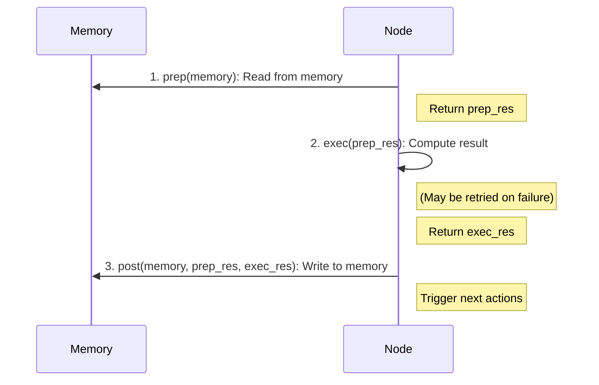

# Node: The Basic Unit of Work

In BrainyFlow, a **Node** is the fundamental building block of any application. It represents a discrete, self-contained unit of work within a larger flow. Nodes are designed to be reusable, testable, and fault-tolerant.

## Node Lifecycle

<div align="center">
  
</div>

Every node follows a clear, three-phase lifecycle when executed: `prep` → `exec` → `post`. This separation of concerns ensures clean data handling, computation, and state management.

1.  **`prep(memory)`**:

    - **Purpose**: Prepare the node for execution. This is where the node reads necessary input data from the `Memory` object (which includes both global and local state).
    - **Output**: Returns a `prep_res` (preparation result) that will be passed directly to the `exec` method. This ensures `exec` is pure and doesn't directly access shared memory.
    - **Best Practice**: Keep `prep` focused on data retrieval and initial validation. Avoid heavy computation or side effects here.

2.  **`exec(prep_res)`**:

    - **Purpose**: Execute the core business logic or computation of the node. This method receives only the `prep_res` from the `prep` method.
    - **Output**: Returns an `exec_res` (execution result) that will be passed to the `post` method.
    - **Key Principle**: `exec` should be a **pure function** (or as close as possible). It should not directly access the `Memory` object or perform side effects. This makes `exec` highly testable and retryable.
    - **Fault Tolerance**: This is the phase where retries are applied if configured.

3.  **`post(memory, prep_res, exec_res)`**:
    - **Purpose**: Post-process the results of `exec`, update the `Memory` object, and determine the next steps in the flow.
    - **Input**: Receives the `Memory` object, `prep_res`, and `exec_res`.
    - **Key Actions**:
      - Write results back to the global `Memory` store.
      - Call `self.trigger("action_name", forking_data={...})` (Python) or `this.trigger("action_name", {...})` (TypeScript) to specify which action was completed and pass any branch-specific data to the local store of successor nodes.
      - A node can trigger multiple actions, leading to parallel execution if the flow is a `ParallelFlow`.



## Creating Custom Nodes

To create a custom node, extend the `Node` class and implement the lifecycle methods:




```python
from brainyflow import Node, Memory

class TextProcessorNode(Node):
    async def prep(self, memory) -> str:
        # Read input data
        return memory.text

    async def exec(self, text: str) -> str:
        # Process the text
        return text.upper()

    async def post(self, memory, input_text: str, result: str):
        # Store the result in the global store
        memory.processed_text = result

        # Trigger the default next node (optional)
        self.trigger('default')
```





```typescript
import { Memory, Node } from 'brainyflow'

class TextProcessorNode extends Node {
  async prep(memory): Promise<string> {
    // Read input data
    return memory.text
  }

  async exec(text: string): Promise<string> {
    // Process the text
    return text.toUpperCase()
  }

  async post(memory, input: string, result: string): Promise<void> {
    // Store the result in the global store
    memory.processed_text = result

    // Trigger the default next node (optional)
    this.trigger('default')
  }
}
```




All step definitions are **optional**. For example, you can implement only `prep` and `post` if you just need to alter data without external computation, or skip `post` if the node does not write any data to memory.

## Error Handling

Nodes include built-in retry capabilities for handling transient failures in `exec()` calls.

You can configure retries with 2 options in their constructor to control their behavior:

- `id` (string, optional): A unique identifier for the node. If not provided, a UUID is generated.
- `maxRetries` (number): Maximum number of attempts for `exec()` (default: 1, meaning no retry).
- `wait` (number): Seconds to wait between retry attempts (default: 0).
  The `wait` parameter is especially helpful when you encounter rate-limits or quota errors from your LLM provider and need to back off.

During retries, you can access the current retry count (0-based) via `self.cur_retry` (Python) or `this.curRetry` (TypeScript).

To handle failures gracefully after all retry attempts for `exec()` are exhausted, override the `execFallback` method.

By default, `execFallback` just re-raises the exception. You can override it to return a fallback result instead, which becomes the `exec_res` passed to `post()`, allowing the flow to potentially continue.
The `error` object passed to `execFallback` will be an instance of `NodeError` and will include a `retryCount` property indicating the number of retries performed.




```python
from brainyflow import Node, NodeError, Flow

class CustomErrorHandlingNode(Node):
    async def exec(self, prep_res):
        print(f"Exec attempt: {self.cur_retry + 1}")
        if self.cur_retry < 2: # Fail for first 2 attempts
            raise ValueError("Simulated exec failure")
        return "Successful result on retry"

    async def exec_fallback(self, prep_res, error: NodeError) -> str:
        # This is called only if exec fails on the last attempt
        print(f"Exec failed after {error.retry_count + 1} attempts: {error}")
        # Return a fallback value instead of re-raising the error
        return f"Fallback response due to repeated errors: {error}"

    async def post(self, memory, prep_res, exec_res: str):
        # exec_res will be "Success on retry" or "Fallback response..."
        print(f"Post: Received result '{exec_res}'")
        memory.final_result = exec_res
        print(f"Post: Final result is '{exec_res}'")

# Example usage
node = CustomErrorHandlingNode(max_retries=3, wait=5) # Will retry twice, then fallback
flow = Flow(start=node)
await flow.run({})
```





```typescript
import { Node, NodeError } from 'brainyflow'

const myNodeInstance = new CustomErrorHandlingNode({ maxRetries: 3, wait: 5 })

class CustomErrorHandlingNode extends Node {
  async exec(prepRes: PrepResult): Promise<ExecResult> {
    console.log(`Exec attempt: ${this.curRetry + 1}`)
    if (this.curRetry < 2) {
      // Fail for first 2 attempts
      throw new Error('Simulated exec failure')
    }
    return 'Successful result on retry'
  }

  async execFallback(prepRes, error: NodeError): Promise<ExecResult> {
    // This is called only if exec fails on the last attempt
    console.error(`Exec failed after ${(error.retryCount ?? this.curRetry) + 1} attempts: ${error.message}`)
    // Return a fallback value instead of re-throwing
    return `Fallback response due to repeated errors: ${error.message}`
  }

  async post(memory, prepRes, execRes): Promise<void> {
    // execRes will be "Success on retry" or "Fallback response..."
    console.log(`Post: Received result '${execRes}'`)
    memory.final_result = execRes
    console.log(`Post: Final result is '${execRes}'`)
  }
}

// Example usage
// import { Flow, createMemory } from 'brainyflow';
const node = new CustomErrorHandlingNode({ maxRetries: 3, wait: 5 }) // Will retry twice, then fallback
const flow = new Flow(node)
await flow.run({})
```




## Node Transitions

Nodes define how the flow progresses by triggering actions. These actions are then used by the `Flow` to determine the next node(s) to execute.




```python
self.trigger(action_name: str, forking_data: Optional[SharedStore] = None) -> None
```





```typescript
trigger(actionName: string, forkingData: Record<string, unknown> = {}): void
```




- Call this method within the `post` method of your node.
- `action_name`: A string identifying the action that just completed (e.g., `"success"`, `"error"`, `"data_ready"`). This name corresponds to the transitions defined in the `Flow` (e.g., `node.on('action_name', nextNode)`).
- `forking_data` (optional): A dictionary (Python) or object (TypeScript) whose key-value pairs will be deeply cloned and merged into the **local store** (`memory.local`) of the memory instance passed to the next node(s) triggered by this action. This allows for passing specific data down a particular branch without polluting the global store.
- A node can call `trigger` multiple times in its `post` method, leading to multiple successor branches being executed (sequentially in `Flow`, concurrently in `ParallelFlow`).


`trigger()` can **only** be called inside the `post()` method. Calling it elsewhere will result in errors.


The running [Flow](./flow.md) uses the `action_name` triggered to look up the successor nodes, which are defined using `.on()` or `.next()` (as seen in the next section below).

## Defining Connections (`on`, `next`)

While `trigger` determines _which_ path to take _during_ execution, you define the possible paths _before_ execution, by using either `.next()` or `.on()`, as shown below:




You can define transitions with syntax sugar:

1. **Basic default transition**: `node_a >> node_b`
   This means if `node_a` triggers the default action, go to `node_b`.

2. **Named action transition**: `node_a - "action_name" >> node_b`
   This means if `node_a` triggers `"action_name"`, go to `node_b`.

Note that `node_a >> node_b` is equivalent to `node_a - "default" >> node_b`

```python
# Basic default transition
node_a >> node_b  # If node_a triggers "default", go to node_b

# Named action transitions
node_a - "success" >> node_b  # If node_a triggers "success", go to node_b
node_a - "error" >> node_c    # If node_a triggers "error", go to node_c
```





1. **Basic default transition**: `node_a.next(node_b)`
   This means if `node_a` triggers `"default"`, go to `node_b`.

2. **Named action transition**: `node_a.on('action_name', node_b)` or `node_a.next(node_b, 'action_name')`
   This means if `node_a` triggers `"action_name"`, go to `node_b`.

Note that `node_a.next(node_b)` is equivalent to both `node_a.next(node_b, 'default')` and `node_a.on('default', node_b)`

```python
# Basic default transition
node_a.next(node_b) # If node_a triggers "default", go to node_b

# Named action transition
node_a.on('success', node_b) # If node_a triggers "success", go to node_b
node_a.on('error', node_c) # If node_a triggers "error", go to node_c

# Alternative syntax
node_a.next(node_b, 'success') # Same as node_a.on('success', node_b)
```





1.  **Basic default transition**: `node_a.next(node_b)`
    This means if `node_a` triggers `"default"`, `node_b` will execute next.

2.  **Named action transition**: `node_a.on('action_name', node_b)` or `node_a.next(node_b, 'action_name')`
    This means if `node_a` triggers `"action_name"`, `node_b` will execute next.

Note that `node_a.next(node_b)` is equivalent to both `node_a.next(node_b, 'default')` and `node_a.on('default', node_b)`. Both methods return the _successor_ node (`node_b` in this case), allowing for chaining.

```typescript
// Basic default transition
node_a.next(node_b) // If node_a triggers "default", go to node_b

// Named action transition
node_a.on('success', node_b) // If node_a triggers "success", go to node_b
node_a.on('error', node_c) // If node_a triggers "error", go to node_c

// Alternative syntax
node_a.next(node_b, 'success') // Same as node_a.on('success', node_b)
```




To summarize it:

- `node.on(actionName, successorNode)`: Connects `successorNode` to be executed when `node` triggers `actionName`.
- `node.next(successorNode, actionName = DEFAULT_ACTION)`: A convenience method, equivalent to `node.on(actionName, successorNode)`.

These methods are typically called when constructing your `Flow`. See the [Flow documentation](./flow.md) for detailed examples of graph construction.

### Example: Conditional Branching

A common pattern is a "router" node that determines the next step based on some condition (e.g., language detection, data validation result).




```python
import asyncio
from brainyflow import Flow, Node, DEFAULT_ACTION

async def detect_language(content: str) -> str:
    if "hello" in content.lower(): return "english"
    if "hola" in content.lower(): return "spanish"
    return "unknown"

class RouterNode(Node):
    async def prep(self, memory):
        return memory.content

    async def exec(self, content: str):
        return await detect_language(content)

    async def post(self, memory, prep_res: str, exec_res: str):
        print(f"RouterPost: Detected language '{exec_res}', storing and triggering.")
        memory.language = exec_res # Store language in global memory
        # Trigger the specific action based on the detected language
        self.trigger(exec_res) # e.g., trigger 'english' or 'spanish' or 'unknown'

# Assuming EnglishProcessorNode, SpanishProcessorNode, UnknownProcessorNode are defined elsewhere

# --- Flow Definition ---
router = RouterNode()
english_processor = EnglishProcessorNode()
spanish_processor = SpanishProcessorNode()
unknown_processor = UnknownProcessorNode()

# Define connections for specific actions using syntax sugar
router - "english" >> english_processor
router - "spanish" >> spanish_processor
router - "unknown" >> unknown_processor # Add path for unknown

flow = Flow(start=router)

async def run_flow():
    memory_en = {"content": "Hello world"}
    await flow.run(memory_en)
    print("--- English Flow Done ---", memory_en)

    memory_es = {"content": "Hola mundo"}
    await flow.run(memory_es)
    print("--- Spanish Flow Done ---", memory_es)

    memory_unk = {"content": "Bonjour le monde"}
    await flow.run(memory_unk)
    print("--- Unknown Flow Done ---", memory_unk)

asyncio.run(run_flow())
```





```typescript
import { Flow, Memory, Node, SharedStore } from 'brainyflow'

function detectLanguage(content: string): Promise<'english' | 'spanish' | 'unknown'> {
  if ('hello' in content.toLowerCase()) return 'english'
  if ('hola' in content.toLowerCase()) return 'spanish'
  return 'unknown'
}

interface RouterGlobalStore {
  content: string
  language?: string
}
type RouterActions = 'english' | 'spanish' | 'unknown' // Add unknown action

class RouterNode extends Node<RouterGlobalStore, any, any, RouterActions[]> {
  async prep(memory: Memory<RouterGlobalStore, any>): Promise<string> {
    return memory.content
  }

  async exec(content: string | undefined): Promise<string> {
    return await detectLanguage(content)
  }

  async post(
    memory: Memory<RouterGlobalStore>,
    prepRes: string, // Content from prep
    execRes: string, // Language detected
  ): Promise<void> {
    console.log(`RouterPost: Detected language '${execRes}', storing and triggering.`)
    memory.language = execRes
    // Trigger the specific action based on the detected language
    this.trigger(execRes as RouterActions)
  }
}

// Assuming EnglishProcessorNode, SpanishProcessorNode, UnknownProcessorNode are defined elsewhere

// --- Flow Definition ---
const router = new RouterNode()
const englishProcessor = new EnglishProcessorNode()
const spanishProcessor = new SpanishProcessorNode()
const unknownProcessor = new UnknownProcessorNode()

// Define connections for specific actions
router.on('english', englishProcessor)
router.on('spanish', spanishProcessor)
router.on('unknown', unknownProcessor)

const flow = new Flow(router)

// --- Execution Example ---
async function runFlow() {
  const storeEn: RouterGlobalStore = { content: 'Hello world' }
  await flow.run(storeEn)
  console.log('--- English Flow Done ---', storeEn)

  const storeEs: RouterGlobalStore = { content: 'Hola mundo' }
  await flow.run(storeEs)
  console.log('--- Spanish Flow Done ---', storeEs)

  const storeUnk: RouterGlobalStore = { content: 'Bonjour le monde' }
  await flow.run(storeUnk)
  console.log('--- Unknown Flow Done ---', storeUnk)
}
runFlow()
```




### Example: Multiple Triggers (Fan-Out / Batch Processing)

A single node can call `this.trigger()` multiple times within its `post` method to initiate multiple downstream paths simultaneously. Each triggered path receives its own cloned `memory` instance, potentially populated with unique `local` data via the `forkingData` argument.

This "fan-out" capability is the core pattern used for **batch processing** (processing multiple items, often in parallel).

For a detailed explanation and examples of implementing batch processing using this fan-out pattern with `Flow` or `ParallelFlow`, please see the [Flow documentation](./flow.md#implementing-batch-processing-fan-out-pattern).

## Running Individual Nodes

Nodes have a `run(memory, propagate?)` method, which executes its full lifecycle (`prep` -> `execRunner` (which handles `exec` and `execFallback`) -> `post`). This method is primarily intended for **testing or debugging individual nodes in isolation**, and in production code you should always use `Flow.run(memory)` instead.


**Do NOT use `node.run()` to execute a workflow.**

`node.run()` executes only the single node it's called on. It **does not** look up or execute any successor nodes defined via `.on()` or `.next()`.

Always use `Flow.run(memory)` or `ParallelFlow.run(memory)` to execute a complete graph workflow. Using `node.run()` directly will lead to incomplete execution if you expect the flow to continue.


The `node.run()` method can, however, return information about triggered actions if the `propagate` argument is set to `true`. This is used internally by the `Flow` execution mechanism.




```typescript
// Run with propagate: false (default) - returns ExecResult
async node.run(memory: Memory | GlobalStore, propagate?: false): Promise<ExecResult>

// Run with propagate: true - returns triggers for Flow execution
async node.run(memory: Memory | GlobalStore, propagate: true): Promise<List<Tuple<Action, Memory>>>
```




```python
from typing import List, Tuple, Optional
from typing_extensions import Literal
from brainyflow import Memory, GlobalStore, Action, ExecResult

# Run with propagate=False (default) - returns ExecResult
async def run(self, memory: Union[Memory, GlobalStore], propagate: Literal[False] = False) -> Optional[ExecResult]: ...

# Run with propagate=True - returns triggers for Flow execution
async def run(self, memory: Union[Memory, GlobalStore], propagate: Literal[True]) -> List[Tuple[Action, Memory]]: ...
```




## Best Practices

- **Single Responsibility**: Each node should do one thing well. Avoid at all costs monolithic nodes that handle too many responsibilities!
- **Pure `exec`**: Keep the `exec` method free of side effects and direct memory access. All inputs should come from `prep_res`, and all outputs should go to `exec_res`.
- **Clear `prep` and `post`**: Use `prep` for input gathering and `post` for output handling and triggering.
- **Respect the lifecycle**: Read in `prep`, compute in `exec`, write and trigger in `post`. No exceptions allowed!
- **Use `forkingData`**: Pass branch-specific data via `trigger`'s `forkingData` argument to populate the `local` store for successors, keeping the global store clean.
- **Type Safety**: For better developer experience, define the expected structure of `memory` stores, actions, and results.
- **Error Handling**: Leverage the built-in retry logic (`maxRetries`, `wait`) and `execFallback` for resilience.
