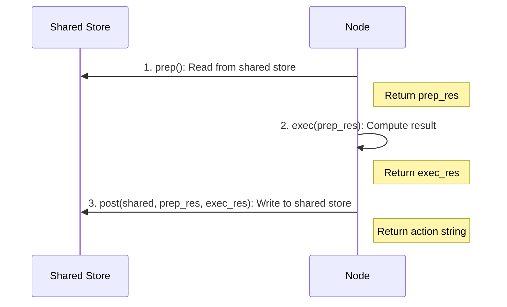

# Node

A **Node** is the smallest building block in BrainyFlow. Each Node has 3 steps in its lifecycle: `prep -> exec -> post`:

## Node Lifecycle

<div align="center">
  
</div>

1. `async prep(shared)`

   - **Read and preprocess data** from the `shared` store.
   - Examples: Query databases, read files, or serialize data into a string.
   - Return `prep_res`, which is used by `exec()` and `post()`.

2. `async exec(prep_res)`

   - **Execute compute logic**, with optional retries and error handling.
   - Examples: LLM calls, remote API calls, tool use.
   - ⚠️ This shall be used only for computation and must **NOT** access `shared`.
   - ⚠️ If retries are enabled, ensure idempotent implementation.
   - Return `exec_res`, which is passed to `post()`.

3. `async post(shared, prep_res, exec_res)`
   - **Postprocess and write data** back to `shared`.
   - Examples: Update databases, change states, log results.
   - **Decide the next action** by returning a string (`action = "default"` if `None` is returned).


**Why 3 steps?** To enforce the principle of _separation of concerns_. Data storage and data processing are operated separately.

All steps are _optional_. For example, you can implement only `prep` and `post` if you just need to process data without external computation.




## Fault Tolerance & Retries

You can **retry** `exec()` if it raises an exception via two parameters when defining the Node:

- `max_retries` (int): Maximum times to run `exec()`. The default is `1` (**no** retry).
- `wait` (int): The time to wait (in **seconds**) before the next retry. By default, `wait=0` (no waiting).

`wait` is helpful when you encounter rate-limits or quota errors from your LLM provider and need to back off.




```python
my_node = SummarizeFile(max_retries=3, wait=10)
```





```typescript
const myNode = new SummarizeFile({ maxRetries: 3, wait: 10 })
```




When an exception occurs in `exec()`, the Node automatically retries until:

- It either succeeds, or
- The Node has retried `max_retries - 1` times already and fails on the last attempt.

You can get the current retry count (0-based) from `cur_retry`.




```python
class RetryNode(Node):
    async def exec(self, prep_res):
        print(f"Retry {self.cur_retry} times")
        raise Exception("Failed")
```





```typescript
class RetryNode extends Node {
  async exec(prepRes: any): Promise {
    console.log(`Retry ${this.curRetry} times`)
    throw new Error('Failed')
  }
}
```




## Graceful Fallback

To **gracefully handle** exceptions (after all retries) rather than raising them, override:




```python
async def exec_fallback(self, prep_res, exc):
    raise exc  # Default behavior is to re-raise
```





```typescript
async execFallback(prepRes: any, exc: Error): Promise {
  throw exc;  // Default behavior is to re-raise
}
```




By default, this method just re-raises the exception. You can override it to return a fallback result instead, which becomes the `exec_res` passed to `post()`.

## Example: Summarize File




```python
class SummarizeFile(Node):
    async def prep(self, shared):
        return shared["data"]

    async def exec(self, prep_res):
        if not prep_res:
            return "Empty file content"
        prompt = f"Summarize this text in 10 words: {prep_res}"
        summary = call_llm(prompt)  # might fail
        return summary

    async def exec_fallback(self, prep_res, exc):
        # Provide a simple fallback instead of crashing
        return "There was an error processing your request."

    async def post(self, shared, prep_res, exec_res):
        shared["summary"] = exec_res
        # Return "default" by not returning

summarize_node = SummarizeFile(max_retries=3)

async def main():
    # node.run() calls prep->exec->post
    # If exec() fails, it retries up to 3 times before calling exec_fallback()
    action_result = await summarize_node.run(shared)
    print("Action returned:", action_result)  # "default"
    print("Summary stored:", shared["summary"])

asyncio.run(main())
```





```typescript
class SummarizeFile extends Node {
  async prep(shared: any): Promise<any> {
    return shared['data']
  }

  async exec(prepRes: any): Promise<string> {
    if (!prepRes) {
      return 'Empty file content'
    }
    const prompt = `Summarize this text in 10 words: ${prepRes}`
    const summary = await callLLM(prompt) // might fail
    return summary
  }

  async execFallback(prepRes: any, exc: Error): Promise<string> {
    // Provide a simple fallback instead of crashing
    return 'There was an error processing your request.'
  }

  async post(shared: any, prepRes: any, execRes: any): Promise<string> {
    shared['summary'] = execRes
    // Return "default" by not returning
  }
}

const summarizeNode = new SummarizeFile({ maxRetries: 3 })

// node.run() calls prep->exec->post
// If exec() fails, it retries up to 3 times before calling execFallback()
const actionResult = await summarizeNode.run(shared)

console.log('Action returned:', actionResult) // "default"
console.log('Summary stored:', shared['summary'])
```



