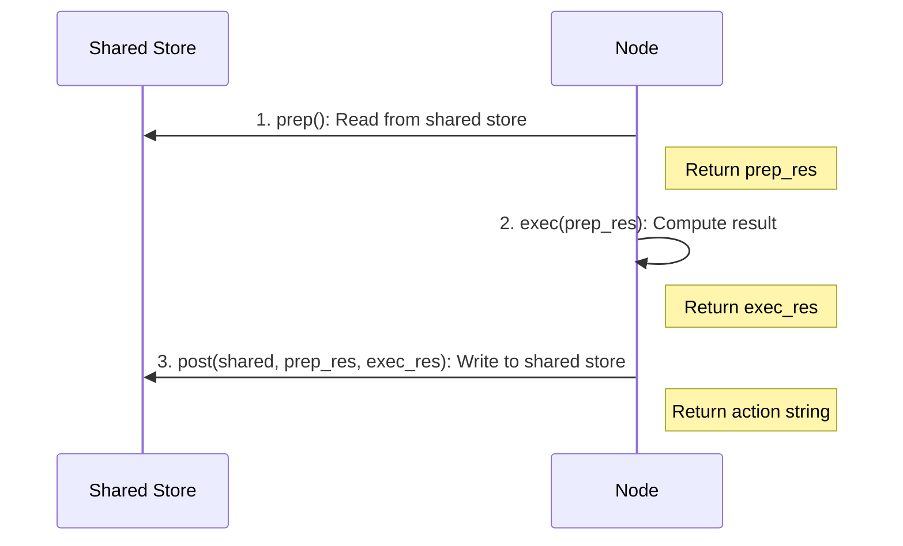

# Node: The Fundamental Building Block

A **Node** is the smallest reusable unit in BrainyFlow. Each Node follows a 3-step lifecycle that enforces the principle of separation of concerns.

## Node Lifecycle

<div align="center">
  
</div>

### 1. `async prep(shared)`

**Purpose**: Read and preprocess data from the shared store.

- Extracts necessary data from the `shared` store
- Performs any required preprocessing or validation
- Returns `prep_res`, which becomes input for `exec()` and `post()`

### 2. `async exec(prep_res)`

**Purpose**: Execute the core computation logic.

- Performs the main computation (often an LLM call or API request)
- ⚠️ Must **NOT** access the `shared` store directly
- ⚠️ Should be designed for idempotence when retries are enabled
- Returns `exec_res`, which is passed to `post()`

### 3. `async post(shared, prep_res, exec_res)`

**Purpose**: Process results and update the shared store.

- Writes computation results back to the `shared` store
- Has access to both the original input (`prep_res`) and result (`exec_res`)
- Returns an action string that determines the next node in the flow
  - If no value is returned, defaults to `"default"`


**Why 3 steps?** This design enforces separation of concerns:

- `prep`: Data access and preparation
- `exec`: Pure computation (no side effects)
- `post`: Result processing and state updates

All steps are **optional**. For example, you can implement only `prep` and `post` if you just need to process data without external computation.




## Fault Tolerance & Retries

Nodes support automatic retries for handling transient failures in `exec()` calls:




```python
my_node = MyNode(max_retries=3, wait=10)  # Retry up to 3 times with 10s delay
```





```typescript
const myNode = new MyNode({ maxRetries: 3, wait: 10 }) // Retry up to 3 times with 10s delay
```




Key retry parameters:

- `max_retries` (int): Maximum number of execution attempts (default: 1, meaning no retry)
- `wait` (int): Seconds to wait between retries (default: 0)

`wait` is specially helpful when you encounter rate-limits or quota errors from your LLM provider and need to back off.
During retries, you can access the current retry count (0-based) via `self.cur_retry` (Python) or `this.curRetry` (TypeScript).




```python
class RetryNode(Node):
    async def exec(self, prep_res):
        print(f"Retried {self.cur_retry} times")
        raise Exception("Failed")
```





```typescript
class RetryNode extends Node {
  async exec(prepRes: any): Promise {
    console.log(`Retried ${this.curRetry} times`)
    throw new Error('Failed')
  }
}
```




## Graceful Fallbacks

To handle failures gracefully after all retries are exhausted, override the `exec_fallback` method:




```python
async def exec_fallback(self, prep_res, exc):
    raise exc  # Default behavior is to re-raise
```





```typescript
async execFallback(prepRes: any, exc: Error): Promise {
  throw exc;  // Default behavior is to re-raise
}
```




By default, this method just re-raises the exception. You can override it to return a fallback result instead, which becomes the `exec_res` passed to `post()`.

## Example: Summarize File




```python
class SummarizeFile(Node):
    async def prep(self, shared):
        return shared["data"]

    async def exec(self, prep_res):
        if not prep_res:
            return "Empty file content"
        prompt = f"Summarize this text in 10 words: {prep_res}"
        summary = call_llm(prompt)  # might fail
        return summary

    async def exec_fallback(self, prep_res, exc):
        # Provide a simple fallback instead of crashing
        return "There was an error processing your request."

    async def post(self, shared, prep_res, exec_res):
        shared["summary"] = exec_res
        # Return "default" by not returning

summarize_node = SummarizeFile(max_retries=3)

async def main():
    # node.run() calls prep->exec->post
    # If exec() fails, it retries up to 3 times before calling exec_fallback()
    action_result = await summarize_node.run(shared)
    print("Action returned:", action_result)  # "default"
    print("Summary stored:", shared["summary"])

asyncio.run(main())
```





```typescript
class SummarizeFile extends Node {
  async prep(shared: any): Promise<any> {
    return shared['data']
  }

  async exec(prepRes: any): Promise<string> {
    if (!prepRes) {
      return 'Empty file content'
    }
    const prompt = `Summarize this text in 10 words: ${prepRes}`
    const summary = await callLLM(prompt) // might fail
    return summary
  }

  async execFallback(prepRes: any, exc: Error): Promise<string> {
    // Provide a simple fallback instead of crashing
    return 'There was an error processing your request.'
  }

  async post(shared: any, prepRes: any, execRes: any): Promise<string> {
    shared['summary'] = execRes
    // Return "default" by not returning
  }
}

const summarizeNode = new SummarizeFile({ maxRetries: 3 })

// node.run() calls prep->exec->post
// If exec() fails, it retries up to 3 times before calling execFallback()
const actionResult = await summarizeNode.run(shared)

console.log('Action returned:', actionResult) // "default"
console.log('Summary stored:', shared['summary'])
```




## Example: Document Retrieval




```python
class RetrieveRelevantDocuments(Node):
    """Node that retrieves relevant documents based on a query."""

    async def prep(self, shared):
        """Extract query and vector database from shared store."""
        query = shared["input"]["query"]
        vector_db = shared["resources"]["vector_db"]
        return query, vector_db

    async def exec(self, inputs):
        """Retrieve relevant documents using vector similarity."""
        query, vector_db = inputs

        # Get query embedding
        query_embedding = await get_embedding(query)

        # Search vector database
        results = await vector_db.search(
            query_embedding,
            limit=5,
            min_score=0.7
        )

        return results

    async def post(self, shared, prep_res, exec_res):
        """Store retrieved documents in shared store."""
        shared["processing"]["relevant_documents"] = exec_res
        shared["metadata"]["processing_steps"].append({
            "step": "document_retrieval",
            "timestamp": datetime.now().isoformat(),
            "document_count": len(exec_res)
        })

        # Determine next action based on results
        if not exec_res:
            return "fallback_search"
        return "generate_response"
```





```typescript
// Node that retrieves relevant documents based on a query
class RetrieveRelevantDocuments extends Node {
  async prep(shared: any): Promise<any> {
    // Extract query and vector database from shared store
    const query = shared['input']['query']
    const vectorDb = shared['resources']['vector_db']
    return [query, vectorDb]
  }

  async exec(inputs: any): Promise<any> {
    // Retrieve relevant documents using vector similarity
    const [query, vectorDb] = inputs

    // Get query embedding
    const queryEmbedding = await getEmbedding(query)

    // Search vector database
    const results = await vectorDb.search(
      queryEmbedding,
      limit: 5,
      minScore: 0.7
    )

    return results
  }

  async post(shared: any, prepRes: any, execRes: any): Promise<string> {
    // Store retrieved documents in shared store
    shared['processing']['relevant_documents'] = execRes
    shared['metadata']['processing_steps'].push({
      'step': 'document_retrieval',
      'timestamp': new Date().toISOString(),
      'document_count': execRes.length
    })

    // Determine next action based on results
    if (!execRes) {
      return 'fallback_search'
    }
    return 'generate_response'
  }
}
```




## Running Individual Nodes

Nodes have an extra method `run(shared)`, which calls `prep->exec->post` and returns the action.


`Node.run` **does not** proceed to a successor!

This method is useful for debugging or testing a single node, but not for running a [flow](./flow.md)!

Always use `Flow.run` instead to ensure the full pipeline runs correctly.


Compare it with `Flow.run`:

- `node.run(shared)`: Just runs that node alone (calls `prep->exec->post()`), returns an Action.
- `flow.run(shared)`: Executes from the start node, follows Actions to the next node, and so on until the flow can't continue.
