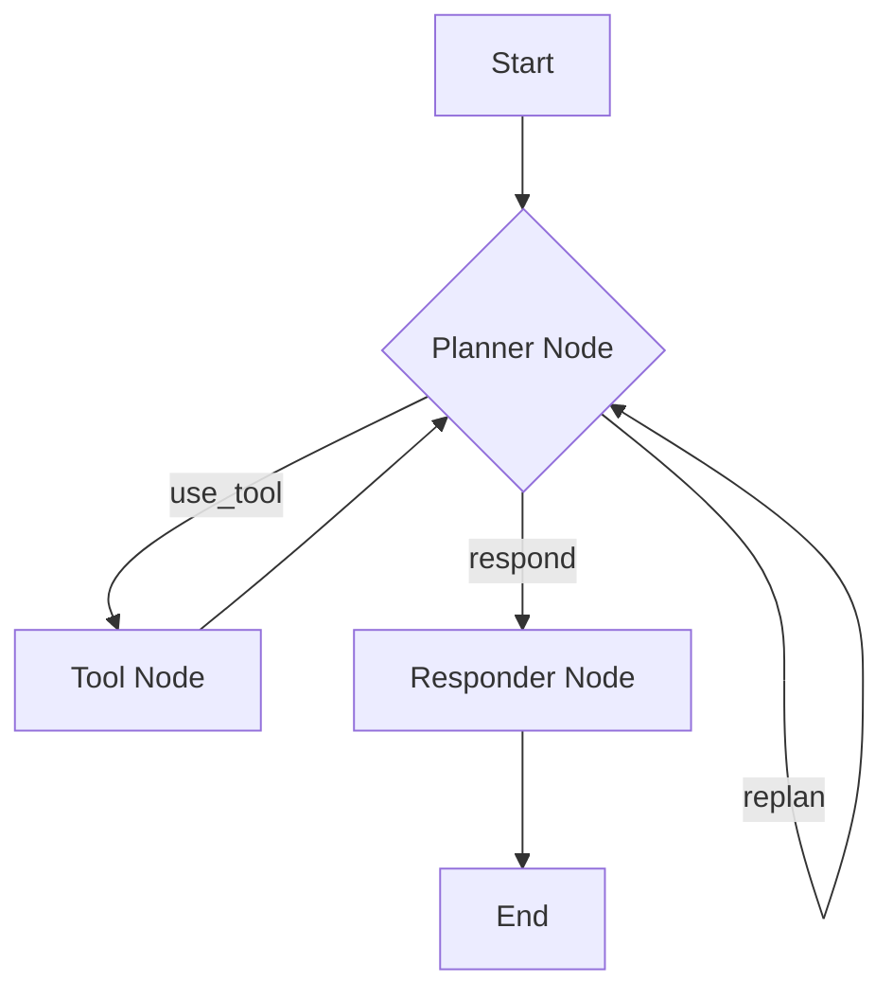

# Agent Design Pattern

The Agent pattern provides a robust and flexible way to build autonomous AI systems that can reason, plan, and interact with their environment. It's particularly well-suited for tasks requiring multiple steps, tool use, and dynamic decision-making.

<div align="center">
  
</div>

## Nodes of an Agent

An agent typically consists of the following components:

1.  **Planner Node**:
    - **Role**: Decides the next action based on the current state and the overall goal. This often involves an LLM call to generate a plan or select a tool.
    - **Output**: Triggers an action corresponding to the chosen next step (e.g., `"use_tool"`, `"respond"`, `"replan"`).
2.  **Tool Nodes**:
    - **Role**: Implement specific functionalities (e.g., search, calculator, API calls, code execution).
    - **Execution**: Called by the Planner Node.
    - **Output**: Return results that the Planner Node can use for subsequent decisions.
3.  **Responder Node**:
    - **Role**: Formulates the final response to the user or takes a concluding action.
    - **Execution**: Triggered when the Planner Node determines the task is complete.

## Agent Flow

The typical flow of an agent involves a loop:

1.  **Observe**: The agent receives an input (e.g., user query).
2.  **Plan**: The Planner Node analyzes the input and current memory to decide the next action.
3.  **Act**: The agent executes the chosen action (e.g., calls a tool, generates a response).
4.  **Reflect/Loop**: The result of the action is fed back into the memory, and the Planner Node re-evaluates the situation, potentially leading to further planning and action until the goal is achieved.



The core of building **high-performance** and **reliable** agents boils down to:

1. **Context Management:** Provide _relevant, minimal context._ For example, rather than including an entire chat history, retrieve the most relevant via [RAG](./rag.md). Even with larger context windows, LLMs might still fall victim to ["lost in the middle"](https://arxiv.org/abs/2307.03172), overlooking mid-prompt content.

2. **Action Space:** Provide _a well-structured and unambiguous_ set of actions—avoiding overlap like separate `read_databases` or `read_csvs`. Instead, import CSVs into the database.

## Best Practices

- **Incremental:** Feed content in manageable chunks (500 lines or 1 page) instead of all at once.

- **Overview-zoom-in:** First provide high-level structure (table of contents, summary), then allow drilling into details (raw texts).

- **Parameterized/Programmable:** Instead of fixed actions, enable parameterized (columns to select) or programmable (SQL queries) actions, for example, to read CSV files.

- **Backtracking:** Let the agent undo the last step instead of restarting entirely, preserving progress when encountering errors or dead ends.

## Example: Search Agent (with Tool Use)

Let's create a basic agent that can answer questions by either directly responding or using a "search" tool.

This agent:

1. Decides whether to search or answer
2. If searches, loops back to decide if more search needed
3. Answers when enough context gathered

For simplicity, these will be overly-simplified mock tools/nodes. For a more in-depth implementation, check the implementations in our cookbook for [Python](https://github.com/skadaai/caskada/tree/main/cookbook/python-agent) or [TypeScript](https://github.com/skadaai/caskada/tree/main/cookbook/typescript-agent).

### 1. Define Tool Nodes

First, we define (mock) our tool nodes.




```python
from brainyflow import Node

# Mock tool: Search
class SearchTool(Node):
    async def prep(self, memory):
        return memory.search_term

    async def exec(self, query: str):
        print(f"Executing search for: {query}")
        # Simulate a search API call
        if "nobel prize" in query.lower():
            return "The Nobel Prize in Physics 2024 was awarded to John Doe for his work on quantum entanglement."
        return f"No specific information found for '{query}'."

    async def post(self, memory, prep_res: str, exec_res: str):
        prev_searches = memory.get("context", [])
        memory["context"] = prev_searches + [
            {"term": memory["search_term"], "result": exec_res}
        ]
```





```typescript
import { Node } from 'brainyflow'

// Mock tool: Search
class SearchTool extends Node {
  async prep(memory): Promise<string> {
    return memory.search_term
  }

  async exec(query: string): Promise<string> {
    console.log(`Executing search for: ${query}`)
    // Simulate a search API call
    if (query.toLowerCase().includes('nobel prize')) {
      return 'The Nobel Prize in Physics 2024 was awarded to John Doe for his work on quantum entanglement.'
    }
    return `No specific information found for '${query}'.`
  }

  async post(memory, prepRes: string, execRes: string): Promise<void> {
    if (!memory.context) {
      memory.context = []
    }
    memory.context.push({ term: memory.search_term, result: exec_res })
  }
}
```




### 2. Define Agent Nodes and Flow




````python
from brainyflow import Node, Memory

class DecideAction(Node):
    async def prep(self, shared):
        context = shared.get("context", "No previous search")
        query = shared["query"]
        return query, context

    async def exec(self, inputs):
        query, context = inputs
        prompt = f"""
Given input: {query}
Previous search results: {context}
Should I: 1) Search web for more info 2) Answer with current knowledge
Output in yaml:
```yaml
action: search/answer
reason: why this action
search_term: search phrase if action is search
```"""
        resp = call_llm(prompt)
        yaml_str = resp.split("```yaml")[1].split("```")[0].strip()
        result = yaml.safe_load(yaml_str)

        assert isinstance(result, dict)
        assert "action" in result
        assert "reason" in result
        assert result["action"] in ["search", "answer"]
        if result["action"] == "search":
            assert "search_term" in result

        return result

    async def post(self, shared, prep_res, exec_res):
        if exec_res["action"] == "search":
            shared["search_term"] = exec_res["search_term"]
        self.trigger(exec_res["action"])

class DirectAnswer(Node):
    def prep(self, shared):
        return shared["query"], shared.get("context", "")

    def exec(self, inputs):
        query, context = inputs
        return call_llm(f"Context: {context}\nAnswer: {query}")

    def post(self, shared, prep_res, exec_res):
       print(f"Answer: {exec_res}")
       shared["answer"] = exec_res

# Connect nodes
decide = DecideAction()
search = SearchTool()
answer = DirectAnswer()

decide - "search" >> search
decide - "answer" >> answer
search >> decide  # Loop back

flow = Flow(start=decide)

async def main():
    memory_data = {"query": "Who won the Nobel Prize in Physics 2024?"}
    await flow.run(memory_data) # Pass memory object
    print("Final Memory State:", memory_data) # See final memory state

if __name__ == "__main__":
    import asyncio
    asyncio.run(main())
````





```````typescript
import { parse } from 'yaml'
import { Node, Flow } from './brainyflow'

class DecideAction extends Node {
  async prep(memory) {
    const context = memory.context ?? "No previous search";
    const query = memory.query;
    return [query, context];
  }

  async exec(inputs) {
    const [query, context] = inputs;
    const prompt = `
Given input: ${query}
Previous search results: ${typeof context === 'string' ? context : JSON.stringify(context)}
Should I: 1) Search web for more info 2) Answer with current knowledge
Output in yaml:
\`\`\`yaml
action: search/answer
reason: why this action
search_term: search phrase if action is search
\`\`\``;
    const resp = await callLLM(prompt);
    const yamlStrMatch = resp.split("``````")[0]?.trim();
    const result = parse(yamlStrMatch);

    // Basic assertions (can be removed if not desired for direct transpile)
    if (typeof result !== 'object' || result === null) throw new Error("YAML parse error");
    if (!result.action || !result.reason) throw new Error("Missing action/reason in YAML");
    if (result.action !== "search" && result.action !== "answer") throw new Error("Invalid action");
    if (result.action === "search" && !result.search_term) throw new Error("Missing search_term for search action");

    return result;
  }

  async post(memory, prepRes: any, execRes: any): Promise<void> {
    if (execRes.action === "search") {
      memory.search_term = execRes.search_term;
    }
    this.trigger(execRes.action);
  }
}

class DirectAnswer extends Node {
  async prep(memory) {
    const query = memory.query;
    const context = memory.context ?? "";
    return [query, context];
  }

  async exec(inputs: any) {
    const [query, context] = inputs;
    const contextString = typeof context === 'string' ? context : JSON.stringify(context);
    return await callLLM(`Context: ${contextString}\nAnswer: ${query}`);
  }

  async post(memory, prepRes: any, execRes: any): Promise<void> {
    console.log(`Answer: ${execRes}`);
    memory.answer = execRes;
  }
}

// --- Flow Definition ---
const decide = new DecideAction()
const search = new SearchTool()
const answer = new DirectAnswer()

decide.on("search", search);
decide.on("answer", answer);
search.next(decide); // Loop back

const agentFlow = new Flow(decide);

// --- Main Execution ---
async function main() {
  const memory = { query: "Who won the Nobel Prize in Physics 2024?" };
  await agentFlow.run(memory);
  console.log("Final Memory State:", memory);
}

main();
```



This example demonstrates how BrainyFlow's core abstractions (Nodes, Flows, Memory) can be combined to build a simple agent that exhibits planning and tool-use capabilities. The `Memory` object is crucial for maintaining state across the different steps of the agent's execution.
```````
