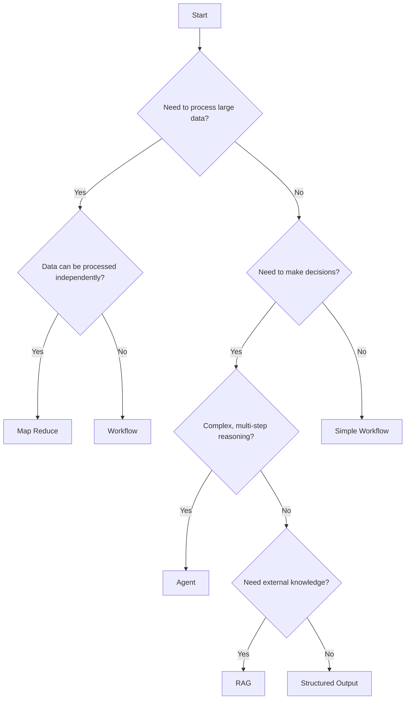

# Design Patterns

BrainyFlow makes it easy to implement popular design patterns for LLM applications. This section covers the key patterns you can build with the framework.

## Available Design Patterns

  

### Core Patterns

1. [Agent](./agent.md): Create autonomous agents that can make decisions and take actions based on context.
2. [Workflow](./workflow.md): Chain multiple tasks into sequential pipelines for complex operations.
3. [RAG](./rag.md): Integrate data retrieval with generation for knowledge-augmented responses.
4. [Map Reduce](./mapreduce.md): Process large datasets by splitting work into parallel tasks and combining results.
5. [Structured Output](./structure.md): Format LLM outputs consistently using structured formats like YAML or JSON.

### Advanced Patterns

6. [Multi-Agents](./multi_agent.md): Coordinate multiple agents working together on complex tasks.

## Choosing the Right Pattern

When building your LLM application, consider these factors when selecting a design pattern:

| Pattern           | Best For                  | When To Use                                             |
| ----------------- | ------------------------- | ------------------------------------------------------- |
| Agent             | Dynamic problem-solving   | When tasks require reasoning and decision-making        |
| Workflow          | Sequential processing     | When steps are well-defined and follow a clear order    |
| RAG               | Knowledge-intensive tasks | When external information is needed for responses       |
| Map Reduce        | Large data processing     | When handling datasets too large for a single operation |
| Structured Output | Consistent formatting     | When outputs need to follow specific schemas            |
| Multi-Agents      | Complex collaboration     | When tasks benefit from specialized agent roles         |

## Decision Tree

Use this decision tree to help determine which pattern best fits your use case:

## Combining Patterns

Many real-world applications combine multiple patterns. For example:

- An **Agent** that uses **RAG** to retrieve information before making decisions
- A **Workflow** that includes **Map Reduce** steps for processing large datasets
- **Multi-Agents** that each use **Structured Output** for consistent communication

The modular nature of BrainyFlow makes it easy to combine these patterns to solve complex problems.

## Next Steps

Explore each design pattern in detail to understand how to implement it in your application:

- Start with [Agent](./agent.md) to learn about autonomous decision-making
- Check out [Workflow](./workflow.md) for sequential processing patterns
- Dive into [RAG](./rag.md) to see how to augment LLMs with external knowledge
