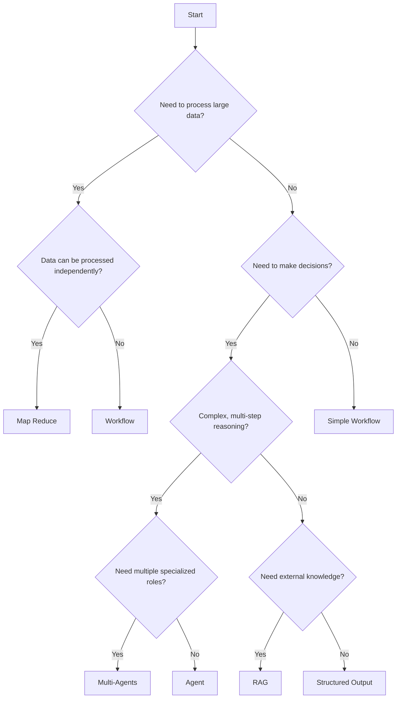
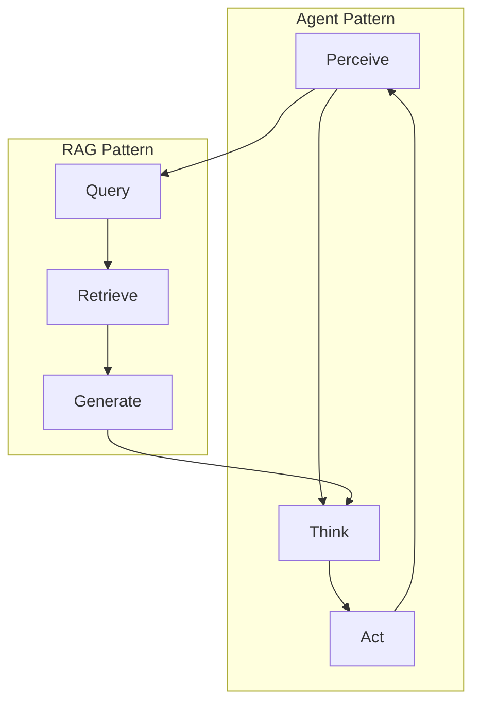

# Design Patterns

BrainyFlow supports a variety of design patterns that enable you to build complex AI applications. These patterns leverage the core abstractions of nodes, flows, and shared store to implement common AI system architectures.

## Overview of Design Patterns

<div align="center">
  
</div>

BrainyFlow's minimalist design allows it to support various high-level AI design paradigms:

| Pattern                             | Description                                                     | Use Cases                                       |
| ----------------------------------- | --------------------------------------------------------------- | ----------------------------------------------- |
| [RAG](./rag.md)                     | Retrieval-Augmented Generation for knowledge-grounded responses | Question answering, knowledge-intensive tasks   |
| [Agent](./agent.md)                 | Autonomous entities that can perceive, reason, and act          | Virtual assistants, autonomous decision-making  |
| [Workflow](./workflow.md)           | Sequential or branching business processes                      | Form processing, approval flows                 |
| [MapReduce](./map_reduce.md)        | Distributed processing of large datasets                        | Document summarization, parallel processing     |
| [Structured Output](./structure.md) | Generating outputs that follow specific schemas                 | Data extraction, configuration generation       |
| [Multi-Agents](./multi_agent.md)    | Multiple agents working together on complex tasks               | Collaborative problem-solving, role-based tasks |

## Choosing the Right Pattern

When designing your application, consider these factors when selecting a pattern:

| Pattern           | Best For                  | When To Use                                             |
| ----------------- | ------------------------- | ------------------------------------------------------- |
| RAG               | Knowledge-intensive tasks | When external information is needed for responses       |
| Agent             | Dynamic problem-solving   | When tasks require reasoning and decision-making        |
| Workflow          | Sequential processing     | When steps are well-defined and follow a clear order    |
| Map Reduce        | Large data processing     | When handling datasets too large for a single operation |
| Structured Output | Consistent formatting     | When outputs need to follow specific schemas            |
| Multi-Agents      | Complex collaboration     | When tasks benefit from specialized agent roles         |

### Decision Tree

Use this decision tree to help determine which pattern best fits your use case:



## Pattern Composition

BrainyFlow's nested flow capability allows you to compose multiple patterns. For instance:



This composition enables powerful applications that combine the strengths of different patterns.
For example, an agent might use RAG to access knowledge, then apply chain-of-thought reasoning to solve a problem.
Other examples include:

- An **Agent** that uses **RAG** to retrieve information before making decisions
- A **Workflow** that includes **Map Reduce** steps for processing large datasets
- **Multi-Agents** that each use **Structured Output** for consistent communication

## Implementation Examples

Each pattern can be implemented using BrainyFlow's core abstractions. Here's a simple example of the agent pattern:




```python
from brainyflow import Flow, Node

# Define the agent's components (assuming these classes exist)
perceive = PerceiveNode()
think = ThinkNode()
act = ActNode()

# Connect them in a cycle
perceive >> think >> act >> perceive

# Create the agent flow
agent_flow = Flow(start=perceive)
```





```typescript
import { Flow, Node } from 'brainyflow'

// Define the agent's components (assuming these classes exist)
const perceive = new PerceiveNode()
const think = new ThinkNode()
const act = new ActNode()

// Connect them in a cycle
perceive.next(think).next(act).next(perceive)

// Create the agent flow
const agentFlow = new Flow(perceive)
```




For more detailed implementations of each pattern, see the individual pattern documentation pages.

## Best Practices

1. **Start Simple**: Begin with the simplest pattern that meets your needs
2. **Modular Design**: Design patterns to be composable and reusable
3. **Clear Interfaces**: Define clear interfaces between pattern components
4. **Test Incrementally**: Test each pattern component before integration
5. **Monitor Performance**: Watch for bottlenecks in your pattern implementation

By understanding and applying these design patterns, you can build sophisticated AI applications that are both powerful and maintainable.
