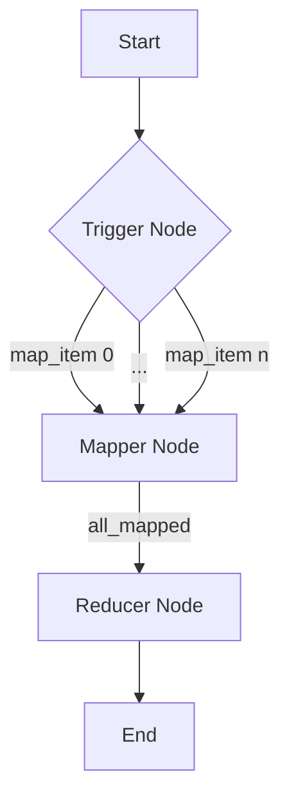

# MapReduce Design Pattern

The MapReduce pattern is a powerful way to process large datasets by breaking down a complex task into two main phases: **Map** (processing individual items) and **Reduce** (aggregating results). BrainyFlow provides the perfect abstractions to implement this pattern efficiently, especially with its `ParallelFlow` for concurrent mapping.

<div align="center">
  
</div>

## Core Components

1.  **Trigger Node**:
    - **Role**: Triggers the fan-out to Mapper Nodes from a list of items.
    - **Implementation**: A standard `Node` whose `post` method iterates through the input collection and calls `this.trigger()` for each item, passing item-specific data as `forkingData`.
2.  **Mapper Node**:
    - **Role**: Takes a single item from the input collection and transforms it.
    - **Implementation**: A standard `Node` that receives an individual item (often via `forkingData` in its local memory) and performs a specific computation (e.g., summarizing a document, extracting key-value pairs).
    - **Output**: Stores the processed result for that item in the global `Memory` object, typically using a unique key (e.g., `memory.results[item_id] = processed_data`).
3.  **Reducer Node**:
    - **Role**: Collects and aggregates the results from all Mapper Nodes.
    - **Implementation**: A standard `Node` that reads all individual results from the global `Memory` and combines them into a final output. This node is usually triggered after all Mapper Nodes have completed.

## MapReduce Flow



## Pattern Implementation

We use a `ParallelFlow` for the mapping phase for performance gain.




```python
from brainyflow import Node, Flow, ParallelFlow

class Trigger(Node):
    async def prep(self, memory):
        assert hasattr(memory, "items"), f"'items' must be set in memory"
        return getattr(memory, "items")

    async def post(self, memory, items, exec_res):
        setattr(memory,"output", {} if isinstance(items, dict) else [None] * len(items))
        for index, input in (enumerate(items) if isinstance(items, (list, tuple)) else items.items()):
            self.trigger("default", {"index": index, "item": input})

class Reducer(Node):
    async def prep(self, memory):
        assert hasattr(memory, "index"), "index of processed item must be set in memory"
        assert hasattr(memory, "item"), "processed item must be set in memory"
        return memory.index, memory.item

    async def post(self, memory, prep_res, exec_res):
        memory.output[prep_res[0]] = prep_res[1]

def mapreduce(iterate: Node | Flow):
    trigger = Trigger()
    reduce = Reducer()

    trigger >> iterate >> reduce
    return ParallelFlow(start=trigger)
```




```typescript
import { Flow, Node, ParallelFlow } from 'brainyflow'

class Trigger extends Node {
  async prep(memory): Promise<any[] | Record<string, any>> {
    if (!memory.items) {
      throw new Error("'items' must be set in memory")
    }
    return memory.items
  }

  async post(memory, items, execRes): Promise<void> {
    memory.output = Array.isArray(items) ? new Array(items.length).fill(null) : {}

    if (Array.isArray(items)) {
      items.forEach((item, index) => {
        this.trigger('default', { index, item })
      })
    } else {
      Object.entries(items).forEach(([key, value]) => {
        this.trigger('default', { index: key, item: value })
      })
    }
  }
}

class Reducer extends Node {
  async prep(memory) {
    return [memory.local.index, memory.local.item]
  }

  async post(memory, prepRes, execRes) {
    const [index, itemResultFromIterate] = prepRes

    if (Array.isArray(memory.output)) {
      ;(memory.output as any[])[index] = itemResultFromIterate
    } else {
      ;(memory.output as Record<string, any>)[index.toString()] = itemResultFromIterate
    }
  }
}

export function mapreduce(iterate: Node | Flow): ParallelFlow {
  const trigger = new Trigger()
  const reduce = new Reducer()

  trigger.next(iterate).next(reduce)

  return new ParallelFlow(trigger)
}
```




### Example: Document Summarization

Let's create a flow to summarize multiple text files using the pattern we just created.

For simplicity, these will be overly-simplified mock tools/nodes. For a more in-depth implementation, check the implementations in our cookbook for [Resume Qualification (Python)](https://github.com/zvictor/BrainyFlow/tree/main/cookbook/python-map-reduce) - _more TypeScript examples coming soon ([PRs welcome](https://github.com/zvictor/BrainyFlow)!)_.

### 1. Define Mapper Node (Summarizer)

This node will summarize a single file.




```python
from brainyflow import Node

# Assume call_llm is defined elsewhere
class SummarizeFileNode(Node):
    async def prep(self, memory):
        # Item data comes from forkingData in local memory
        return {"filename": memory.item.filename, "content": memory.item.content}

    async def exec(self, prep_res: dict):
        prompt = f"Summarize the following text from {prep_res['filename']}:\n{prep_res['content']}"
        return await call_llm(prompt)

    async def post(self, memory, prep_res: dict, exec_res: str):
        # Store individual summary in local memory reusing the "item" key
        memory.local.item.summary = exec_res
```





```typescript
import { Node } from 'brainyflow'

// Assume callLLM is defined elsewhere
declare function callLLM(prompt: string): Promise<string>

class SummarizeFileNode extends Node {
  async prep(memory): Promise<{ filename: string; content: string }> {
    // Item data comes from forkingData in local memory
    return { filename: memory.item.filename ?? '', content: memory.item.file_content ?? '' }
  }

  async exec(prepRes: { filename: string; content: string }): Promise<string> {
    const prompt = `Summarize the following text from ${prepRes.filename}:\n${prepRes.content}`
    return await callLLM(prompt)
  }

  async post(memory, prepRes: { filename: string; content: string }, execRes: string): Promise<void> {
    // Store individual summary in local memory reusing the "item" key
    memory.local.item.summary = execRes
  }
}
```




### 2. Define Reducer Node (Aggregator)

This node will combine all individual summaries.




```python
from brainyflow import Node

class AggregateSummariesNode(Node):
    async def prep(self, memory):
        # Collect all file summaries from global memory
        return [item["summary"] for item in memory.output]

    async def exec(self, summaries: list[str]):
        combined_text = "\n\n".join(summaries)
        prompt = f"Combine the following summaries into one cohesive summary:\n{combined_text}"
        return await call_llm(prompt)

    async def post(self, memory, prep_res: dict, exec_res: str):
        memory.final_summary = exec_res # Store final aggregated summary
```





```typescript
import { Node } from 'brainyflow'

class AggregateSummariesNode extends Node {
  async prep(memory): Promise<string[]> {
    // Collect all summaries from global memory
    return memory.output.map((item) => item.summary)
  }

  async exec(summaries: string[]): Promise<string> {
    const combinedText = summaries.join('\n\n')
    const prompt = `Combine the following summaries into one cohesive summary:\n${combinedText}`
    return await callLLM(prompt)
  }

  async post(memory, prepRes: string[], execRes: string): Promise<void> {
    memory.final_summary = execRes // Store final aggregated summary
  }
}
```




### 3. Assemble the Flow




```python
import asyncio
from brainyflow import Flow

# (mapreduce, SummarizeFileNode and AggregateSummariesNode definitions as above)

# Instantiate nodes
summarizer = SummarizeFileNode()
aggregator = AggregateSummariesNode()

mapreduce_flow = mapreduce(summarizer)
mapreduce_flow >> aggregator

main_flow = Flow(start=mapreduce_flow)

# --- Execution ---
async def main():
    memory = {
        "items": {
            "file1.txt": "Alice was beginning to get very tired of sitting by her sister...",
            "file2.txt": "The quick brown fox jumps over the lazy dog.",
            "file3.txt": "Lorem ipsum dolor sit amet, consectetur adipiscing elit.",
        }
    }
    await main_flow.run(memory) # Pass memory object
    print('\n--- MapReduce Complete ---')
    print("Individual Summaries:", memory.get("file_summaries"))
    print("\nFinal Summary:\n", memory.get("final_summary"))

if __name__ == "__main__":
    asyncio.run(main())
```





```typescript
import { Flow, Memory, Node } from 'brainyflow'

// Assume callLLM is defined elsewhere
declare function callLLM(prompt: string): Promise<string>

// (mapreduce, SummarizeFileNode and AggregateSummariesNode definitions as above)

// Instantiate nodes
const summarizer = new SummarizeFileNode()
const aggregator = new AggregateSummariesNode()

const mapreduce_flow = mapreduce(summarizer)
mapreduce_flow.next(aggregator)

const main_flow = Flow(mapreduce_flow)

// --- Execution ---
async function main() {
  const memory = {
    items: {
      'file1.txt': 'Alice was beginning to get very tired of sitting by her sister...',
      'file2.txt': 'The quick brown fox jumps over the lazy dog.',
      'file3.txt': 'Lorem ipsum dolor sit amet, consectetur adipiscing elit.',
    },
  }
  await main_flow.run(memory)
  console.log('\n--- MapReduce Complete ---')
  console.log('Individual Summaries:', memory.file_summaries)
  console.log('\nFinal Summary:\n', memory.final_summary)
}

main().catch(console.error)
```




This example demonstrates how to implement a MapReduce pattern using BrainyFlow, leveraging `ParallelFlow` for concurrent processing of the map phase and the `Memory` object for collecting results before the reduce phase.
