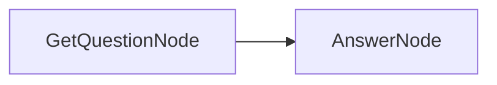

# Getting Started with BrainyFlow

Welcome to BrainyFlow! This framework helps you build powerful, modular AI applications using a simple yet expressive abstraction based on nested directed graphs.

## 1. Installation

First, ensure you have BrainyFlow installed:




```bash
pip install brainyflow
```





```bash
npm install brainyflow
```




For more installation options, see the [Installation Guide](./installation.md).

## 2. Core Concepts

BrainyFlow is built around a minimalist yet powerful abstraction that separates data flow from computation:

- **[Node](./core_abstraction/node.md)**: The fundamental building block that performs a single task with a clear lifecycle (`prep → exec → post`).
- **[Flow](./core_abstraction/flow.md)**: Orchestrates nodes in a directed graph, supporting branching, looping, and nesting.
- **[Memory](./core_abstraction/memory.md)**: A global data structure that enables communication between nodes.

## 3. Your First Flow

Let's build a simple Question-Answering flow to demonstrate BrainyFlow's core concepts:

### Step 1: Design Your Flow

Our flow will have two nodes:

1. `GetQuestionNode`: Captures the user's question
2. `AnswerNode`: Generates an answer using an LLM



### Step 2: Implement the Nodes




```python
from brainyflow import Node
from utils import call_llm  # Your LLM implementation

class GetQuestionNode(Node):
    async def prep(self, shared):
        """Get text input from user."""
        shared["question"] = input("Enter your question: ")

class AnswerNode(Node):
    async def prep(self, shared):
        """Extract the question from shared store."""
        return shared["question"]

    async def exec(self, question):
        """Call LLM to generate an answer."""
        return await call_llm(question)

    async def post(self, shared, prep_res, exec_res):
        """Store the answer in shared store."""
        shared["answer"] = exec_res
```





```typescript
import { Node } from 'brainyflow'
import { input } from '@inquirer/prompts'
import { callLLM } from './utils/callLLM' // Your LLM implementation

class GetQuestionNode extends Node {
  async prep(shared: Record): Promise {
    shared.question = await input({ message: 'Enter your question: ' })
  }
}

class AnswerNode extends Node {
  async prep(shared: Record): Promise {
    return shared.question
  }

  async exec(question: string): Promise {
    return await callLLM(question)
  }

  async post(shared: Record, prepRes: string, execRes: string): Promise {
    shared.answer = execRes
  }
}
```






**Review:** What was achieved here?

- `GetQuestionNode` writes the user's question to the `shared` store.
- `AnswerNode` reads the question from the `shared` store, calling an LLM utility, and writing the answer back to the `shared` store.



### Step 3: Connect the Nodes into a Flow




```python
from brainyflow import Flow

def create_qa_flow():
    get_question_node = GetQuestionNode()
    answer_node = AnswerNode()

    # Connect nodes: get_question_node → answer_node
    get_question_node >> answer_node

    return Flow(start=get_question_node)
```





```typescript
import { Flow } from 'brainyflow'

function createQaFlow(): Flow {
  const getQuestionNode = new GetQuestionNode()
  const answerNode = new AnswerNode()

  // Connect nodes: getQuestionNode → answerNode
  getQuestionNode.next(answerNode)

  return new Flow(getQuestionNode)
}
```






**Review:** What was achieved here?

- We created a flow that connects the nodes, letting the user's question propagate from `GetQuestionNode` to `AnswerNode` to generate an answer.



### Step 4: Run the Flow




```python
import asyncio

async def main():
    shared = {}  # Initialize empty shared store
    qa_flow = create_qa_flow()
    await qa_flow.run(shared)

    print(f"Question: {shared['question']}")
    print(f"Answer: {shared['answer']}")

if __name__ == "__main__":
    asyncio.run(main())
```





```typescript
async function main() {
  const shared: Record = {} // Initialize empty shared store
  const qaFlow = createQaFlow()
  await qaFlow.run(shared)

  console.log(`Question: ${shared.question}`)
  console.log(`Answer: ${shared.answer}`)
}

main().catch(console.error)
```






**Review:** What was achieved here?

- `qaFlow` has executed the flow, writing the user's question and answer to the `shared` store.



## 4. Key Design Principles

BrainyFlow follows these core design principles:

1. **Separation of Concerns**: Data storage (shared store) is separate from computation logic (nodes)
2. **Explicit Data Flow**: Data dependencies between steps are clear and traceable
3. **Composability**: Complex systems are built from simple, reusable components
4. **Minimalism**: The framework provides only essential abstractions, avoiding vendor-specific implementations

## 5. Next Steps

Now that you understand the basics, explore these resources to build sophisticated applications:

- [Core Abstractions](./core_abstraction/index.md): Dive deeper into nodes, flows, and communication
- [Design Patterns](./design_pattern/index.md): Learn more complex patterns like Agents, RAG, and MapReduce
- [Agentic Coding Guide](./guides/agentic_coding.md): Best practices for human-AI collaborative development
- [Best Practices](./guides/best_practices.md): Tips for building robust, maintainable applications
