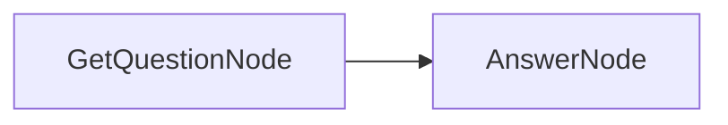

# Getting Started

Welcome to BrainyFlow! This guide will help you get started with the framework and build your first flow.

## 1. Installation

First, ensure you have BrainyFlow installed. Follow the instructions in the [Installation Guide](./installation.md).

## 2. Core Concepts

BrainyFlow uses a simple yet powerful abstraction based on a **Graph + Shared Store**:

- **[Node](./core_abstraction/node.md)**: Represents a single unit of work, often involving an LLM call or data processing.
- **[Flow](./core_abstraction/flow.md)**: Connects Nodes together to define the sequence of operations.
- **[Shared Store](./core_abstraction/communication.md)**: A dictionary-like object passed between nodes, allowing them to share data.
- **[Batch](./core_abstraction/batch.md)**: Enables processing multiple data items in parallel or sequentially.

## 3. Your First Flow

Let's create a simple Question-Answering flow:

1. **GetQuestionNode**: Takes user input.
2. **AnswerNode**: Uses an LLM to answer the question based on the input.



The implementation of this flow would simply be:

- `GetQuestionNode` writing the user's question to the `shared` store.
- `AnswerNode` reading the question from the `shared` store, calling an LLM utility, and writing the answer back to the `shared` store.

## 4. Implementation

Let's implement this flow step by step:

### Step 1: Create the Nodes

First, we'll create our two nodes:




```python
from brainyflow import Node
from utils import call_llm

class GetQuestionNode(Node):
    async def prep(self, shared):
        """Get text input from user."""
        shared["question"] = input("Enter your question: ")

class AnswerNode(Node):
    async def prep(self, shared):
        return shared["question"]

    async def exec(self, question):
        return call_llm(question)

    async def post(self, shared, prep_res, exec_res):
        shared["answer"] = exec_res
```





```typescript
import { Node } from 'brainyflow'
import { input } from '@inquirer/prompts'
import { callLLM } from './utils/callLLM'

class GetQuestionNode extends Node {
  async prep(shared): Promise {
    shared.question = (await input({ message: 'Enter your question: ' })) || ''
  }
}

class AnswerNode extends Node {
  async prep(shared: any): Promise {
    return shared['question']
  }

  async exec(question: string): Promise {
    return await callLLM(question)
  }

  async post(shared: any, _prepRes: any, execRes: string): Promise {
    shared['answer'] = execRes
  }
}
```




Please note that we intentionally do not provide a `callLLM` function but you can [use your own implementation](./utility_function/llm.md).

### Step 2: Create the Flow

Now, let's connect these nodes into a flow:




```python
from brainyflow import Flow

def create_qa_flow():
    get_question_node = GetQuestionNode()
    answer_node = AnswerNode()

    get_question_node >> answer_node

    return Flow(start=get_question_node)
```





```typescript
import { Flow } from 'brainyflow'

function createQaFlow(): Flow {
  const getQuestionNode = new GetQuestionNode()
  const answerNode = new AnswerNode()

  getQuestionNode.next(answerNode)

  return new Flow(getQuestionNode)
}
```




### Step 3: Run the Flow

Finally, let's run our flow:




```python
import asyncio

async def main():
    shared = {}
    qa_flow = create_qa_flow()
    await qa_flow.run(shared)
    print(f"Question: {shared['question']}")
    print(f"Answer: {shared['answer']}")

if __name__ == "__main__":
    asyncio.run(main())
```





```typescript
async function main() {
  const shared: Record = {}
  const qaFlow = createQaFlow()
  await qaFlow.run(shared)
  console.log(`Question: ${shared['question']}`)
  console.log(`Answer: ${shared['answer']}`)
}

main().catch(console.error)
```




## 5. Next Steps

The example we've just built is far from impressive, but it demonstrates the core building blocks of BrainyFlow. From there, you can quickly build much more complex flows and applications.

- Explore more complex [Design Patterns](./design_pattern/index.md) like Agents, RAG, and MapReduce.
- Learn about [Batch Processing](./core_abstraction/batch.md) for handling large datasets.
- Dive deeper into [Core Abstractions](./core_abstraction/index.md) to understand the framework's fundamentals.
- Check out the [Agentic Coding Guide](./guides/agentic_coding.md) for best practices in building self-coding LLM applications with BrainyFlow.
