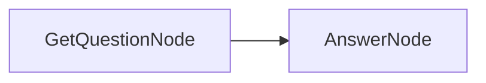

# Getting Started with BrainyFlow

Welcome to BrainyFlow! This framework helps you build powerful, modular AI applications using a simple yet expressive abstraction based on nested directed graphs.

## 1. Installation

First, ensure you have BrainyFlow installed:




```bash
pip install brainyflow
```





```bash
npm install brainyflow # or pnpm/yarn
```




For more installation options, see the [Installation Guide](./installation.md).

## 2. Core Concepts

BrainyFlow is built around a minimalist yet powerful abstraction that separates data flow from computation:

- **[Node](./core_abstraction/node.md)**: The fundamental building block that performs a single task with a clear lifecycle (`prep` → `exec` → `post`).
- **[Flow](./core_abstraction/flow.md)**: Orchestrates nodes in a directed graph, supporting branching, looping, and nesting.
- **[Memory](./core_abstraction/memory.md)**: Manages state, separating it into a shared `global` store and a forkable `local` store for isolated data flow between nodes.

## 3. Your First Flow

Let's build a simple Question-Answering flow to demonstrate BrainyFlow's core concepts:

### Step 1: Design Your Flow

Our flow will have two nodes:

1. `GetQuestionNode`: Captures the user's question
2. `AnswerNode`: Generates an answer using an LLM



### Step 2: Implement the Nodes




```python
import asyncio
from brainyflow import Node, Flow, Memory
from utils import call_llm  # Your LLM implementation

class GetQuestionNode(Node):
    async def prep(self, memory):
        """Get text input from user."""
        memory.question = input("Enter your question: ")

class AnswerNode(Node):
    async def prep(self, memory):
        """Extract the question from memory."""
        return memory.question

    async def exec(self, question: str | None):
        """Call LLM to generate an answer."""

        prompt = f"Answer the following question: {question}"
        return await call_llm(prompt)

    async def post(self, memory, prep_res: str | None, exec_res: str):
        """Store the answer in memory."""
        memory.answer = exec_res
        print(f"AnswerNode: Stored answer '{exec_res}'")
```





```typescript
import { Flow, Memory, Node } from 'brainyflow'
import { input } from '@inquirer/prompts'
import { callLLM } from './utils/callLLM'

// Define interfaces for Memory stores (optional but good practice)
interface QAGlobalStore {
  question?: string
  answer?: string
}
class GetQuestionNode extends Node<QAGlobalStore> {
  async prep(memory: Memory<QAGlobalStore>): Promise<void> {
    memory.question = await input({ message: 'Enter your question: ' })
  }
}

class AnswerNode extends Node<QAGlobalStore> {
  async prep(memory: Memory<QAGlobalStore>): Promise<string | undefined> {
    return memory.question
  }

  async exec(question: string | undefined): Promise<string> {
    const prompt = `Answer the following question: ${question}`
    return await callLLM(prompt)
  }

  async post(memory: Memory<QAGlobalStore>, prepRes: string | undefined, execRes: string): Promise<void> {
    memory.answer = execRes
    console.log(`AnswerNode: Stored answer '${execRes}'`)
  }
}
```






**Review:** What was achieved here?

- `GetQuestionNode` gets the user's question and writes it to the `memory` object (global store), then explicitly `trigger`s the default next node.
- `AnswerNode` reads the question from the `memory` object, calls an LLM utility, writes the answer back to the `memory` object, and `trigger`s the next step (or ends the flow).



### Step 3: Connect the Nodes into a Flow




```python
from .nodes import GetQuestionNode, AnswerNode # defined in the previous step
from brainyflow import Flow

def create_qa_flow():
    get_question_node = GetQuestionNode()
    answer_node = AnswerNode()

    # Connect nodes get_question_node → answer_node using the default action
    get_question_node >> answer_node  # >> is Pythonic syntax sugar for .next(node)

    # Create the Flow, specifying the starting node
    return Flow(start=get_question_node)
```





```typescript
// import { GetQuestionNode, AnswerNode } from './nodes'; // defined in the previous step
import { Flow } from 'brainyflow'

function createQaFlow(): Flow {
  const getQuestionNode = new GetQuestionNode()
  const answerNode = new AnswerNode()

  // Connect nodes getQuestionNode → answerNode using the default action
  getQuestionNode.next(answerNode)

  // Create the Flow, specifying the starting node
  return new Flow(getQuestionNode)
}
```






**Review:** What was achieved here?

- We instantiated the nodes and connected them using the default action (`>>` in Python, `.next()` in TypeScript).
- We created a `Flow` instance, telling it to start execution with `getQuestionNode`.



### Step 4: Run the Flow




```python
import asyncio
from .flow import create_qa_flow # defined in the previous step

async def main():
    memory = {} # Initialize empty memory (which acts as the global store)
    qa_flow = create_qa_flow()

    print("Running QA Flow...")
    # Run the flow, passing the initial global store.
    # The flow modifies the memory object in place.
    # The run method returns the final execution tree (we ignore it here).
    await qa_flow.run(memory)

    # Access the results stored in the global store
    print("\n--- Flow Complete ---")
    print(f"Question: {memory.question}")
    print(f"Answer: {memory.answer}")

if __name__ == '__main__':
    asyncio.run(main())
```





```typescript
import { createQaFlow, QAGlobalStore } from './flow' // defined in the previous steps

async function main() {
  // Initialize the global store (can be an empty object)
  const globalStore: QAGlobalStore = {}
  const qaFlow = createQaFlow()

  console.log('Running QA Flow...')
  // Run the flow, passing the initial global store.
  // The flow modifies the globalStore object in place.
  // The run method returns the final execution tree (we ignore it here).
  await qaFlow.run(globalStore)

  // Access the results stored in the global store
  console.log('\n--- Flow Complete ---')
  console.log(`Question: ${globalStore.question ?? 'N/A'}`)
  console.log(`Answer: ${globalStore.answer ?? 'N/A'}`)
}

main().catch(console.error)
```






**Review:** What was achieved here?

- We initialized an empty `memory` object (Python dictionary or TS object) to serve as the global store.
- `qaFlow.run(memory)` executed the flow. The `Memory` instance managed the state internally, reading from and writing to the `memory` object we passed in.
- The final `question` and `answer` are directly accessible in the original `memory` object after the flow completes.



## 4. Key Design Principles

BrainyFlow follows these core design principles:

1. **Separation of Concerns**: Data storage (the `memory` object managing global/local stores) is separate from computation logic (`Node` classes).
2. **Explicit Data Flow**: Data dependencies between steps are clear and traceable through `memory` access in `prep`/`post` and the results passed between `prep` → `exec` → `post`.
3. **Composability**: Complex systems (`Flow`s) are built from simple, reusable components (`Node`s), and Flows themselves can be nested within other Flows.
4. **Minimalism**: The framework provides only essential abstractions (`Node`, `Flow`, `Memory`), avoiding vendor-specific implementations or excessive boilerplate.

## 5. Next Steps

Now that you understand the basics, explore these resources to build sophisticated applications:

- [Core Abstractions](./core_abstraction/index.md): Dive deeper into nodes, flows, and communication
- [Design Patterns](./design_pattern/index.md): Learn more complex patterns like Agents, RAG, and MapReduce
- [Agentic Coding Guide](./guides/agentic_coding.md): Best practices for human-AI collaborative development

If you prefer, jump straight into our example projects:

- [Python Cookbook](./cookbook/python.md)
- [TypeScript Cookbook](./cookbook/typescript.md)
