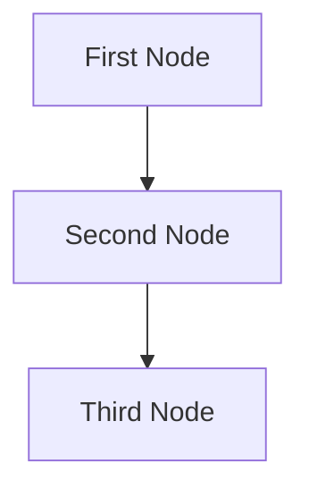
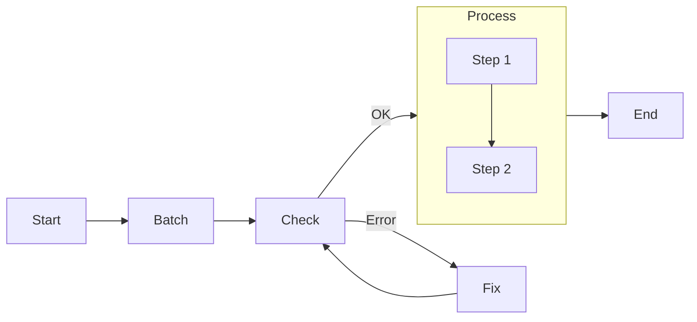

# Agentic Coding: Humans Design, Agents code!


If you are an AI agents involved in building LLM Systems, read this guide **VERY, VERY** carefully! This is the most important chapter in the entire document. Throughout development, you should always (1) start with a small and simple solution, (2) design at a high level (`docs/design.md`) before implementation, and (3) frequently ask humans for feedback and clarification.


Caskada embraces a collaborative approach to AI system development where humans and AI assistants work together iteratively, leveraging their complementary strengths to create robust, maintainable solutions.

## The Human-AI Co-Design Philosophy

The most effective AI systems emerge when humans focus on high-level design and strategic decisions while AI assistants handle implementation details. This approach recognizes that:

1. **Humans excel at:**

   - Disambiguating business requirements
   - Making strategic architectural decisions
   - Evaluating outputs based on real-world experience
   - Selecting appropriate external tools and APIs
   - Identifying edge cases from domain knowledge

2. **AI assistants excel at:**
   - Implementing detailed code
   - Generating comprehensive documentation
   - Exploring design variations rapidly
   - Handling repetitive implementation tasks
   - Optimizing for performance metrics

## The Co-Design Workflow

The development process follows these key stages, with varying levels of human and AI involvement:

| Stage             | Human Involvement | AI Involvement | Primary Responsibility                                                                |
| ----------------- | :---------------: | :------------: | ------------------------------------------------------------------------------------- |
| 1. Requirements   |     ★★★ High      |    ★☆☆ Low     | Human defines problem scope and success criteria                                      |
| 2. Flow Design    |    ★★☆ Medium     |   ★★☆ Medium   | Human outlines high-level architecture; AI refines details                            |
| 3. Utilities      |    ★★☆ Medium     |   ★★☆ Medium   | Humans provide available external APIs and integrations; AI helps with implementation |
| 4. Node Design    |      ★☆☆ Low      |    ★★★ High    | AI designs node types and data handling based on the flow                             |
| 5. Implementation |      ★☆☆ Low      |    ★★★ High    | AI writes code based on the established design                                        |
| 6. Optimization   |    ★★☆ Medium     |   ★★☆ Medium   | Human evaluates results; AI suggests improvements                                     |
| 7. Reliability    |      ★☆☆ Low      |    ★★★ High    | AI implements error handling and addresses corner cases                               |

## The Design Document

Having a clear and consistent design is paramount for successful development, and specifing the workflow design through documentation is a key part of this process. Unless your whole workflow is automated, we recommend starting the process by defining a design document (typically a markdown file) that outlines the high-level architecture and the expected outputs. This document - _typically located at `docs/design.md`_ - can be used as a reference for the AI assistant during the implementation phase and should be your main focus until you have a working prototype built.

You should iterate over steps 1 to 4 as many times as needed, improving your design file, before you move to step 5 (implementation).

<details>
  <summary>Design Document Template</summary>
  
````markdown
# Design Doc: Your Project Name

> Please DON'T remove notes for AI

## Requirements

> Notes for AI: Keep it simple and clear.
> If the requirements are abstract, write concrete user stories

### Problem Statement

[Describe the problem you're trying to solve in 2-3 sentences]

### Business Objectives

- [list few objectives; keep it concise]

### Success Criteria

- [Measurable outcome 1]
- [Measurable outcome 2]

### Sample Scenarios

1. **Scenario 1**: [Describe an example input]
   - Expected Output: [What should happen]
2. **Scenario 2**: [Describe another example input]
   - Expected Output: [What should happen]

## Flow Design

> Notes for AI:
>
> 1. Consider the design patterns of agent, map-reduce, rag, and workflow. Apply them if they fit.
> 2. Present a concise, high-level description of the workflow.

### Applicable Design Pattern:

1. Map the file summary into chunks, then reduce these chunks into a final summary.
2. Agentic file finder
   - _Context_: The entire summary of the file
   - _Action_: Find the file

### Flow high-level Design:

1. **[Node Name]**: [Purporse: This node is for ...]
2. **[Node Name]**: [Purporse: This node is for ...]
3. **[Node Name]**: [Purporse: This node is for ...]

> Notes for AI:
>
> Sketch a simple diagram or describe the flow of data



### Decision Points

- When [condition], the system should [action]
- When [condition], the system should [action]

### External Integrations

[list only the integrations that are strictly necessary, if any!]

- [Integration point]: [What data is exchanged]
- [Integration point]: [What data is exchanged]

## Utility Functions

> Notes for AI:
>
> 1. Understand the utility function definition thoroughly by reviewing the doc.
> 2. Include only the necessary utility functions, based on nodes in the flow.

### Function: [Name] ([file path])

#### Purpose

[1-2 sentences describing what this function does]

#### Input Parameters

- `[param1]` ([type]): [Description]
- `[param2]` ([type]): [Description]

#### Expected Output

- [Return type]: [Description of what's returned; keep it concise!]

#### Error Handling

- When [error condition], the function should [expected behavior]

#### External Dependencies

[list only the dependencies that are strictly necessary, if any!]

- [Dependency 1]: [Why it's needed]
- [Dependency 2]: [Why it's needed]

## Node Design

### Shared Store Schema

> Notes for AI: Try to minimize data redundancy

The shared memory structure is organized as follows:

```python
shared = {
    "key": "value"
}
```

### Node Steps

> Notes for AI: Carefully decide whether to use Sequential/Parallel Batch.

1. First Node

- _Purpose_: Provide a short explanation of the node’s function
- _Type_: Decide between Regular, Batch, or Async
- _Steps_:
  - _prep_: Read "key" from the shared store
  - _exec_: Call the utility function
  - _post_: Write "key" to the shared store

2. Second Node
   ...

## Evaluation Criteria

### Output Quality

- [Criterion 1]: [Description of what makes a good output]
  - Score 1-5: [What each score means]
- [Criterion 2]: [Description]
  - Score 1-5: [What each score means]

### System Performance

- [Metric 1]: [Target value and why it matters]
- [Metric 2]: [Target value and why it matters]

### Edge Cases to Test

[list only the edge cases that are strictly relevant, if any!]

1. [Edge case description]
   - Expected handling: [What should happen]
2. [Edge case description]
   - Expected handling: [What should happen]

````
</details>

## Detailed Stage Breakdown

### 1. Requirements Specification

The human partner takes the lead in defining what the system should accomplish:

**Key Activities:**

- Define the problem scope and business objectives
- Establish clear success criteria
- Provide example inputs and expected outputs
- Identify constraints and limitations

**Best Practices:**

- **User-Centric Approach:** Define problems from the user's perspective rather than listing features
- **Concrete Examples:** Develop several example inputs and expected outputs
- **Manual Walkthrough:** Solve examples by hand to understand the process before automating it
- **Value vs. Complexity:** Prioritize high-value features with manageable complexity

### 2. Flow Design

The human outlines the high-level architecture while the AI assistant helps refine the details:

**Key Activities:**

- Identify applicable [design patterns](../design_pattern/index.md) (Agent, RAG, MapReduce, etc.)
- Map out information flow between components
  - For each node in the flow, start with a high-level one-line description of what it does.
- Define decision points and branching logic
  - If using **Map Reduce**, specify how to map (what to split) and how to reduce (how to combine).
  - If using **Agent**, specify what are the inputs (context) and what are the possible actions.
  - If using **RAG**, specify what to embed, noting that there's usually both offline (indexing) and online (retrieval) workflows.
- Document expected inputs and outputs for each stage

**Flow Visualization:**
Create a mermaid diagram to visualize your application flow:



**Design Principles:**

- **Modularity:** Break complex tasks into discrete, manageable components
- **Single Responsibility:** Each node should perform one clear function
- **Explicit Data Flow:** Make data dependencies between nodes transparent
- **Appropriate Granularity:** Balance between too coarse (complex) and too granular (fragmented)

### 3. Utility Functions

The human identifies necessary external tools and APIs while the AI helps implement the interfaces.


**Sometimes, design Utilies before Flow:** For example, for an LLM project to automate a legacy system, the bottleneck will likely be the available interface to that system. Start by designing the hardest utilities for interfacing, and then build the flow around them.


Utility functions serve as the interface between your LLM application and external systems:

<div align="center"></div>

**Categories of Utilities:**

- **Input Processing:** File reading, API data fetching, database queries
- **External Tools:** Web search, code execution, specialized APIs
- **Output Handling:** Data storage, notification systems, report generation
- **LLM Interaction:** Model calling, embedding generation, prompt management
  - **NOTE**: _LLM-based tasks_ (e.g., summarizing text, analyzing sentiment) are **NOT** utility functions; rather, they are _core functions_ internal in the AI system.

**Implementation Guidelines:**

- Create isolated, testable functions with clear interfaces
- Document input/output specifications and error handling
- Include usage examples and test cases
- Implement proper error handling and retry logic
- Document their input/output, as well as why they are necessary. For example:

```yaml
name: get_embedding (utils/get_embedding.py)
input: string
output: a vector of 3072 floats
necessity: Used by the second node to embed text
```

**Example Utility Implementation:**




```python
# utils/call_llm.py
from openai import OpenAI

def call_llm(prompt):
    client = OpenAI(api_key="YOUR_API_KEY_HERE")
    r = client.chat.completions.create(
        model="gpt-4o",
        messages=[{"role": "user", "content": prompt}]
    )
    return r.choices[0].message.content

if __name__ == "__main__":
	# Simple test case
    prompt = "What is the meaning of life?"
    print(call_llm(prompt))
```





```typescript
// utils/callLLM.ts
import OpenAI from 'openai'

export async function callLLM(prompt: string): Promise<string> {
  const openai = new OpenAI({
    apiKey: 'YOUR_API_KEY_HERE',
  })

  const response = await openai.chat.completions.create({
    model: 'gpt-4o',
    messages: [{ role: 'user', content: prompt }],
  })

  return response.choices[0]?.message?.content || ''
}

// Simple test case
;(async () => {
  const prompt = 'What is the meaning of life?'
  console.log(await callLLM(prompt))
})()
```




### 4. Node Design

The AI assistant takes the lead in designing the processing units within the application flow:

**Node Design Principles:**

- **Data Isolation:** Use the shared store for communication between nodes
- **Clear Lifecycle:** Follow the `prep → exec → post` pattern
- **Idempotent Operations:** Design for safe retries when possible
- **Graceful Degradation:** Implement fallbacks for failure scenarios

**Shared Store Design:**
Design your shared store schema to facilitate data flow between nodes:

```python
# Example shared store structure

shared = {
    "input": {
        "query": "How do neural networks learn?",
        "context": { # Another nested dict
            "persona": "The user is a computer science student.",
            "location": "San Francisco"
        }
    },
    "processing": {
        "search_results": [],
        "relevant_chunks": []
    },
    "output": {
        "response": None,
        "confidence": None
    },
    "metadata": {
        "start_time": "2025-04-06T18:38:00Z",
        "processing_steps": []
    }
}
```

**Node Specification:**
For each node, define how it reads and writes data, and which utility function it uses. Keep it specific but high-level without codes. For example:

- `prep`: Input requirements (what it reads from shared store)
- `exec`: Processing logic (what computation it performs)
- `post`: Output format (what it writes to shared store)
- `exec_fallback`: Error handling strategy (how it deals with failures)
- For batch processing, specify if it's a sequential or parallel node

### 5. Implementation


🎉 If you've reached this step, humans have finished the design. Now _Agentic Coding_ should be on its own!


The AI assistant transforms the design into working code:

**Implementation Guidelines:**

- **Start Simple:** Begin with a minimal viable implementation
- **Incremental Development:** Add features one at a time with testing
- **Fail Fast:** Avoid error suppression as much as you can to quickly identify issues
- **Comprehensive Logging:** Add detailed logging throughout the code for debugging
- **Root Cause Analysis:** Try to fix things at the cause, not the symptom

### 6. Evaluation and Optimization


**You'll likely iterate a lot!** Expect to repeat Steps 3–6 numerous times.

<div align="center"></div>


The human evaluates the system's performance while the AI suggests improvements.
For a quick initial evaluation, human intuition is often a good start.

**Evaluation Activities:**

- Test with diverse inputs to identify edge cases
- Assess output quality against success criteria
- Measure performance metrics (speed, accuracy, etc.)
- Gather user feedback if possible

Consider breaking down tasks further, redesigning the flow (Back to Step 3), introducing agentic decisions, or better managing input contexts.
If your flow design is already solid, move on to optimizing it:

**Optimization Strategies:**

- **Context Management:** Optimize information provided to each node
- **Prompt Engineering:** Refine instructions to reduce ambiguity
- **In-Context Learning:** Provide examples for difficult tasks
- **Architectural Refinements:** Adjust flow based on performance insights

### 7. Reliability Enhancement

The AI assistant implements error handling and addresses corner cases:

**Reliability Techniques:**

- **Node Retries**: Add checks in the node `exec` to ensure outputs meet requirements. Also, consider increasing `max_retries` and `wait` times.
- **Logging:** Maintain logs of all attempts for debugging
- **Self-Evaluation:** Add a separate node and have the LLM evaluate its own outputs
- **Graceful Degradation:** Implement fallbacks for when primary approaches fail

## The Iterative Development Process

Agentic Coding is inherently iterative. Expect to cycle through these stages multiple times:

1. **Start Small:** Begin with a minimal implementation of core functionality
2. **Test and Evaluate:** Gather feedback on performance and output quality
3. **Identify Improvements:** Determine which aspects need enhancement
4. **Refine Design:** Update flow, nodes, or utilities as needed
5. **Implement Changes:** Make targeted improvements
6. **Repeat:** Continue the cycle until quality targets are met

## Best Practices for Effective Co-Design

### For Human Partners:

- **Be Specific:** Provide clear, unambiguous requirements
- **Offer Examples:** Illustrate desired behavior with concrete examples
- **Provide Feedback:** Give specific, actionable feedback on AI implementations
- **Embrace Iteration:** Expect multiple cycles of refinement
- **Focus on Design:** Concentrate on high-level architecture and evaluation

### For AI Assistants:

- **Ask Questions:** Seek clarification when requirements are ambiguous
- **Explain Reasoning:** Document design decisions and implementation choices
- **Suggest Alternatives:** Offer multiple approaches when appropriate
- **Identify Limitations:** Be transparent about potential issues or edge cases
- **Learn from Feedback:** Incorporate human feedback into subsequent iterations

## Conclusion

Agentic Coding represents a powerful approach to developing AI systems by combining human design expertise with AI implementation capabilities. By following this structured process, you can create more effective, maintainable, and reliable AI systems while focusing human effort where it adds the most value.

Remember that the most successful projects start simple, iterate quickly, and continuously incorporate feedback. Let humans handle the "why" and "what" while AI assistants handle the "how" of implementation.

Human-AI collaboration is a journey of continuous learning and improvement. Embrace the iterative nature of the process, and you'll build increasingly sophisticated applications that deliver real value to users.
