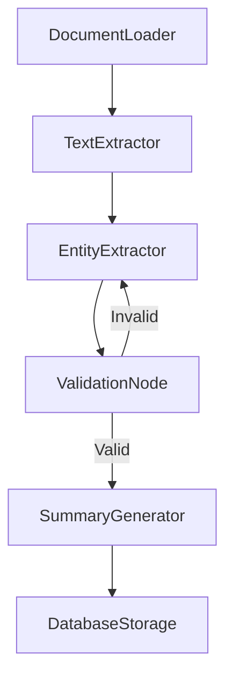

# Agentic Coding with BrainyFlow


If you are an AI agent involved in building AI systems, read this guide **VERY, VERY** carefully! This is the most important chapter in the entire document. Throughout development, you should always:

1.  start with a small and simple solution
2.  design at a high level (`docs/design.md`) before implementation
3.  frequently ask humans for feedback and clarification



Agentic coding represents a powerful approach to software development where humans focus on high-level design and strategic decisions while AI agents handle implementation details. This guide will help you create effective design documents that enable successful BrainyFlow implementations.

## The AI Implementation Brief

Before writing any code, create a comprehensive AI Implementation Brief at `docs/design.md`. This document serves as the foundation for human-AI collaboration and should contain these essential sections:

### 1. Requirements Definition

Clearly articulate what you're building and why:

- **Problem Statement**: Define the problem being solved in 1-2 sentences
- **User Needs**: Describe who will use this and what they need
- **Success Criteria**: List measurable outcomes that define success
- **Constraints**: Note any technical or business limitations

Example:

```
We need a document processing system that extracts key information from legal contracts,
summarizes them, and stores the results for easy retrieval. This will help our legal
team review contracts 70% faster.
```

### 2. Flow Design

Outline the high-level architecture using BrainyFlow's nested directed graph abstraction:

- **Flow Diagram**: Create a mermaid diagram showing node connections
- **Processing Stages**: Describe each major stage in the flow
- **Decision Points**: Identify where branching logic occurs
- **Data Flow**: Explain how information moves through the system

Example:



### 3. Utility Functions

List all external utilities needed:

- **Function Name**: Clear, descriptive name
- **Purpose**: What the function does
- **Inputs/Outputs**: Expected parameters and return values
- **External Dependencies**: Any APIs or libraries required

Example:

```
extract_entities(text: str) -> dict:
- Purpose: Uses NER to identify entities in text
- Input: Document text string
- Output: Dictionary of entity lists by type
- Dependencies: spaCy NLP library with legal model
```

### 4. Node Design

For each node in your flow, define:

- **Purpose**: One-line description of what the node does
- **Shared Store Access**: What data it reads from and writes to the shared store
- **Lifecycle Implementation**: How `prep`, `exec`, and `post` will be implemented
- **Action Returns**: What actions the node might return to direct flow
- **Error Handling**: How failures will be managed

Example:

```
EntityExtractorNode:
- Purpose: Identifies parties, dates, and monetary values in contract text
- Reads: document_text from shared store
- Writes: entities dictionary to shared store
- Actions: Returns "valid" if entities found, "retry" if processing failed
- Error Handling: Will retry up to 3 times with exponential backoff
```

### 5. Shared Store Schema

Define the structure of your shared store:

- **Key Namespaces**: Major sections of your shared store
- **Data Types**: Expected types for each key
- **Data Flow**: How data evolves through processing

Example:

```
shared = {
    "input": {
        "document_path": "path/to/file.pdf"  # Input file path
    },
    "processing": {
        "document_text": "",     # Extracted text content
        "entities": {            # Extracted entities
            "parties": [],
            "dates": [],
            "amounts": []
        },
        "validation_status": ""  # Status after validation
    },
    "output": {
        "summary": "",           # Generated summary
        "storage_id": ""         # Database reference ID
    }
}
```

## Best Practices for Your Design Document

1. **Start Simple**: Begin with the minimal viable solution
2. **Be Explicit**: Clearly define all components and their interactions
3. **Visualize Flows**: Use diagrams to illustrate complex relationships
4. **Define Boundaries**: Clarify what's in and out of scope
5. **Consider Edge Cases**: Note how the system handles failures

## Implementation Process

After completing your design document:

1. **Review with Stakeholders**: Ensure the design meets requirements. If you are the AI agent, ask the user to verify the design document and confirm it fits their needs.
2. **Refine as Needed**: Iterate on the design based on feedback
3. **Hand Off to AI**: Provide the design document to your AI assistant - If you are the AI agent, start working on the solution based on the design document
4. **Collaborative Implementation**: Work with AI to implement the design
5. **Test and Validate**: Verify the implementation against success criteria

By creating a thorough AI Implementation Brief, you provide your AI assistant with the clear direction needed to implement an effective BrainyFlow solution while maintaining human oversight of the critical design decisions.

Remember: The quality of your design document directly impacts the quality of the implementation. Invest time in creating a comprehensive brief to ensure successful outcomes.
