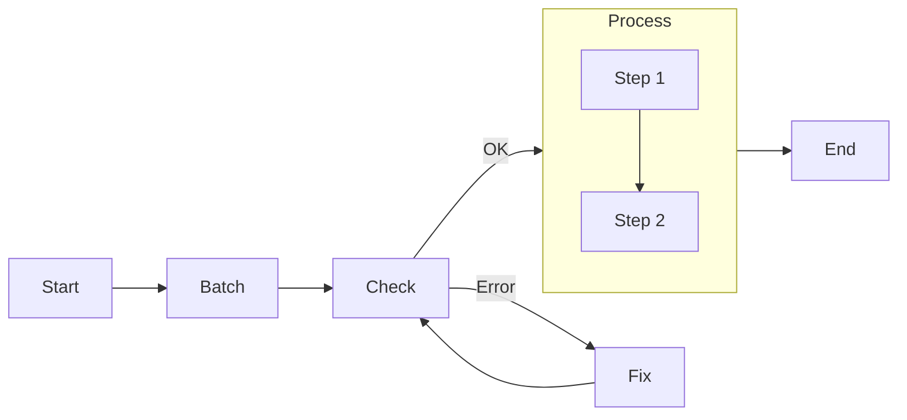

# Agentic Coding: Humans Design, Agents code!


If you are an AI agents involved in building LLM Systems, read this guide **VERY, VERY** carefully! This is the most important chapter in the entire document. Throughout development, you should always (1) start with a small and simple solution, (2) design at a high level (`docs/design.md`) before implementation, and (3) frequently ask humans for feedback and clarification.


## Introduction

Agentic Coding represents a paradigm shift in software development where humans focus on high-level design and strategic decisions while AI agents handle implementation details. This approach leverages the complementary strengths of both humans and AI to create more efficient, robust, and maintainable LLM applications.

## The Agentic Coding Workflow

The development process follows seven key stages, with varying levels of human and AI involvement:

| Stage             | Human Involvement | AI Involvement | Primary Responsibility                                                                        |
| ----------------- | :---------------: | :------------: | --------------------------------------------------------------------------------------------- |
| 1. Requirements   |     ★★★ High      |    ★☆☆ Low     | Human defines problem scope and success criteria                                              |
| 2. Flow Design    |    ★★☆ Medium     |   ★★☆ Medium   | Human outlines high-level architecture; AI refines details                                    |
| 3. Utilities      |    ★★☆ Medium     |   ★★☆ Medium   | Humans provide available external APIs and integrations, and the AI helps with implementation |
| 4. Node Design    |      ★☆☆ Low      |    ★★★ High    | AI helps design the node types and data handling based on the flow.                           |
| 5. Implementation |      ★☆☆ Low      |    ★★★ High    | AI writes code based on the established design                                                |
| 6. Optimization   |    ★★☆ Medium     |   ★★☆ Medium   | Human evaluates results; AI suggests improvements                                             |
| 7. Reliability    |      ★☆☆ Low      |    ★★★ High    | AI implements error handling and addresses corner cases.                                      |

## Detailed Stage Breakdown

### 1. Requirements Analysis

Before building an LLM application, thoroughly evaluate whether AI is the right solution for your problem:

**Ideal Use Cases:**

- Content generation and transformation (summaries, translations, rewrites)
- Information extraction and classification
- Conversational interfaces with well-defined domains
- Decision support with clear parameters

**Less Suitable Use Cases:**

- Problems requiring perfect accuracy or deterministic outputs
- Tasks needing specialized domain expertise beyond LLM training
- Complex decision-making with high-stakes consequences
- Problems with ambiguous success criteria

**Best Practices:**

- **User-Centric Approach:** Define problems from the user's perspective rather than listing features
- **Concrete Examples:** Develop several example inputs and expected outputs
- **Manual Walkthrough:** Solve examples by hand to understand the process before automation
- **Value vs. Complexity:** Prioritize high-value features with manageable complexity

### 2. Flow Design


**If Humans can't specify the flow, AI Agents can't automate it!** Before building an LLM system, thoroughly understand the problem and potential solution by manually solving example inputs to develop intuition.  


The flow design stage establishes the application's architecture and processing pipeline:

**Key Activities:**

- Identify applicable [design patterns](./design_pattern/index.md) (Agent, RAG, MapReduce, etc.)
- Map out information flow between components
  - For each node in the flow, start with a high-level one-line description of what it does.
- Define decision points and branching logic
  - If using **Map Reduce**, specify how to map (what to split) and how to reduce (how to combine).
  - If using **Agent**, specify what are the inputs (context) and what are the possible actions.
  - If using **RAG**, specify what to embed, noting that there's usually both offline (indexing) and online (retrieval) workflows.
- Document expected inputs and outputs for each stage

**Flow Visualization:**
Create a mermaid diagram to visualize your application flow:



**Design Principles:**

- **Modularity:** Break complex tasks into discrete, manageable components
- **Single Responsibility:** Each node should perform one clear function
- **Explicit Data Flow:** Make data dependencies between nodes transparent
- **Appropriate Granularity:** Balance between too coarse (complex) and too granular (fragmented)

### 3. Utility Functions


**Sometimes, design Utilies before Flow:** For example, for an LLM project to automate a legacy system, the bottleneck will likely be the available interface to that system. Start by designing the hardest utilities for interfacing, and then build the flow around them.


Utility functions serve as the interface between your LLM application and external systems:

<div align="center"></div>

**Categories of Utilities:**

- **Input Processing:** File reading, API data fetching, database queries
- **External Tools:** Web search, code execution, specialized APIs
- **Output Handling:** Data storage, notification systems, report generation
- **LLM Interaction:** Model calling, embedding generation, prompt management
  - **NOTE**: _LLM-based tasks_ (e.g., summarizing text, analyzing sentiment) are **NOT** utility functions; rather, they are _core functions_ internal in the AI system.

**Implementation Guidelines:**

- Create isolated, testable functions with clear interfaces
- Document input/output specifications and error handling
- Include usage examples and test cases
- Implement proper error handling and retry logic
- Document their input/output, as well as why they are necessary. For example:

```yaml
name: get_embedding (utils/get_embedding.py)
input: string
output: a vector of 3072 floats
necessity: Used by the second node to embed text
```

**Example Utility Implementation:**




```python
# utils/call_llm.py
from openai import OpenAI

def call_llm(prompt):
    client = OpenAI(api_key="YOUR_API_KEY_HERE")
    r = client.chat.completions.create(
        model="gpt-4o",
        messages=[{"role": "user", "content": prompt}]
    )
    return r.choices[0].message.content

if __name__ == "__main__":
	# Simple test case
    prompt = "What is the meaning of life?"
    print(call_llm(prompt))
```





```typescript
// utils/callLLM.ts
import OpenAI from 'openai'

export async function callLLM(prompt: string): Promise<string> {
  const openai = new OpenAI({
    apiKey: 'YOUR_API_KEY_HERE',
  })

  const response = await openai.chat.completions.create({
    model: 'gpt-4o',
    messages: [{ role: 'user', content: prompt }],
  })

  return response.choices[0]?.message?.content || ''
}

// Simple test case
;(async () => {
  const prompt = 'What is the meaning of life?'
  console.log(await callLLM(prompt))
})()
```




### 4. Node Design

Nodes are the processing units within your application flow, each with a specific responsibility:

**Node Design Principles:**

- **Data Isolation:** Use the shared store for communication between nodes
- **Clear Lifecycle:** Follow the `prep -> exec -> post` pattern
- **Idempotent Operations:** Design for safe retries when possible
- **Graceful Degradation:** Implement fallbacks for failure scenarios

**Shared Store Design:**
Start by designing your shared store schema to facilitate data flow between nodes:

```python
# Example shared store structure
shared = {
    "input": {
        "query": "How do neural networks learn?",
        "context": { # Another nested dict
            "persona": "The user is a computer science student.",
            "location": "San Francisco"
        }
    },
    "processing": {
        "search_results": [],
        "relevant_chunks": []
    },
    "output": {
        "response": None,
        "confidence": None
    },
    "metadata": {
        "start_time": "2025-04-06T18:38:00Z",
        "processing_steps": []
    }
}
```

**Node Specification:**
For each node, define how it reads and writes data, and which utility function it uses. Keep it specific but high-level without codes. For example:

- `prep`: Input requirements (what it reads from shared store)
- `exec`: Processing logic (what computation it performs)
- `post`: Output format (what it writes to shared store)
- `exec_fallback`: Error handling strategy (how it deals with failures)
- For batch processing, specify if it's a sequential or parallel node

### 5. Implementation


🎉 If you've reached this step, humans have finished the design. Now _Agentic Coding_ begins!


The implementation stage transforms the design into working code:

**Implementation Guidelines:**

- **Start Simple:** Begin with a minimal viable implementation
- **Incremental Development:** Add features one at a time with testing
- **Fail Fast:** Avoid error suppression as much as you can to quickly identify issues
- **Comprehensive Logging:** Add detailed logging throughout the code for debugging

**Example Node Implementation:**

```python
class RetrieveRelevantDocuments(Node):
    """Node that retrieves relevant documents based on a query."""

    async def prep(self, shared):
        """Extract query and vector database from shared store."""
        query = shared["input"]["query"]
        vector_db = shared["resources"]["vector_db"]
        return query, vector_db

    async def exec(self, inputs):
        """Retrieve relevant documents using vector similarity."""
        query, vector_db = inputs

        # Get query embedding
        query_embedding = await get_embedding(query)

        # Search vector database
        results = await vector_db.search(
            query_embedding,
            limit=5,
            min_score=0.7
        )

        return results

    async def post(self, shared, prep_res, exec_res):
        """Store retrieved documents in shared store."""
        shared["processing"]["relevant_documents"] = exec_res
        shared["metadata"]["processing_steps"].append({
            "step": "document_retrieval",
            "timestamp": datetime.now().isoformat(),
            "document_count": len(exec_res)
        })

        # Determine next action based on results
        if not exec_res:
            return "fallback_search"
        return "generate_response"
```

### 6. Optimization


**You'll likely iterate a lot!** Expect to repeat Steps 3–6 countless times.

<div align="center"></div>


- **Use Intuition**: For a quick initial evaluation, human intuition is often a good start.
- **Redesign Flow (Back to Step 3)**: Consider breaking down tasks further, introducing agentic decisions, or better managing input contexts.
- **Context Management:** Optimize the information provided to each node
- If your flow design is already solid, move on to micro-optimizations:
- **Prompt Engineering**: Use clear, specific instructions with examples to reduce ambiguity.
- **In-Context Learning**: Provide robust examples for tasks that are difficult to specify with instructions alone.

7. **Reliability**
   - **Node Retries**: Add checks in the node `exec` to ensure outputs meet requirements, and consider increasing `max_retries` and `wait` times.
   - **Logging and Visualization**: Maintain logs of all attempts and visualize node results for easier debugging.
   - **Self-Evaluation**: Add a separate node and have the LLM evaluate and improve its own outputs

## Iterative Development Process

Agentic Coding is inherently iterative. Expect to cycle through these stages multiple times:

1. **Start Small:** Begin with a minimal implementation of the core functionality
2. **Test and Evaluate:** Gather feedback on performance and output quality
3. **Identify Improvements:** Determine which aspects need enhancement
4. **Refine Design:** Update flow, nodes, or utilities as needed
5. **Implement Changes:** Make targeted improvements
6. **Repeat:** Continue the cycle until quality targets are met

## Conclusion

Agentic Coding represents a powerful approach to developing LLM applications by combining human design expertise with AI implementation capabilities. By following this structured process, you can create more effective, maintainable, and reliable AI systems while focusing your human effort where it adds the most value.

Remember that the most successful projects start simple, iterate quickly, and continuously incorporate feedback. Let humans handle the "why" and "what" while AI agents handle the "how" of implementation.

Human-AI collaboration is a journey of continuous learning and improvement. Embrace the iterative nature of the process, and you'll build increasingly sophisticated applications that deliver real value to users.
