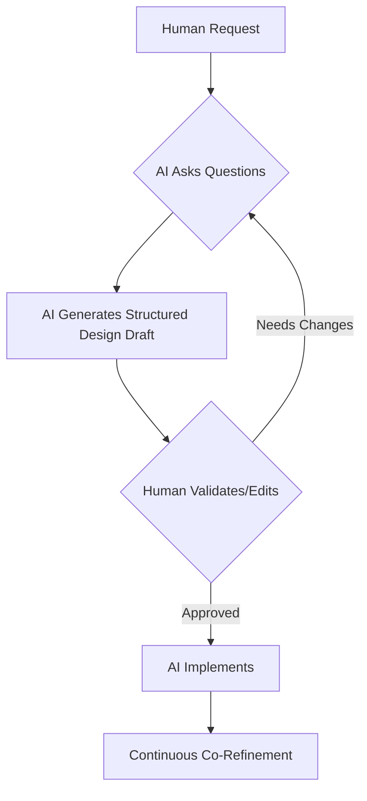
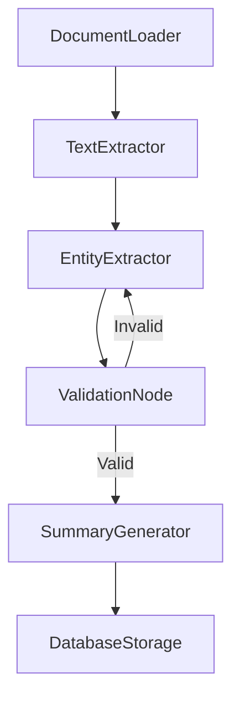

# Agentic Coding with BrainyFlow

<details>

<summary>Notes For AI Assistants</summary>


**AI only**: If you are a human, skip this section.


This is your implementation playbook and most important guideline. Strictly follow the instructions listed in this document.

Use the design document as your single source of truth. Never proceed to code without explicit human approval of the design.

1.  start with a small and simple solution
2.  design at a high level (`docs/design.md`) before implementation and do not start coding until the design is approved
3.  once approved, start coding and iterate on the design based on feedback
4.  do not stop coding until the implementation is working as intended and fully complaint with the design document

</details>

In the context of Human-AI Co-Design, agentic coding involves humans providing high-level guidance while AI agents handle implementation details:
It represents a powerful approach to software development where humans are freed up to focus solely in strategic decisions.
This guide will help you create effective design documents that enable successful BrainyFlow implementations.

## The AI Implementation Brief



- **AI-Driven Structuring:** Convert vague requests into technical specifications through dialogue
- **Essentialism:** Only capture requirements that directly impact implementation
- **Living Documentation:** Design evolves organically through implementation insights

Before writing any code, create a comprehensive AI Implementation Brief at `docs/design.md`. This document serves as the foundation for human-AI collaboration and should contain all the essential sections listed below.

### 1. Requirements Definition

Clearly articulate what you're building and why:

- **Problem Statement**: Define the problem being solved in 1-2 sentences
- **User Needs**: Describe who will use this and what they need
- **Success Criteria**: List measurable outcomes that define success
- **Constraints**: Note any technical or business limitations

Example:

```
We need a document processing system that extracts key information from legal contracts,
summarizes them, and stores the results for easy retrieval. This will help our legal
team review contracts 70% faster.
```

### 2. Flow Design

Outline the high-level architecture using BrainyFlow's nested directed graph abstraction:

- **Flow Diagram**: Create a mermaid diagram showing node connections
- **Processing Stages**: Describe each major stage in the flow
- **Decision Points**: Identify where branching logic occurs
- **Data Flow**: Explain how information moves through the system

Example:



### 3. Utility Functions

List all external utilities needed:

- **Function Name**: Clear, descriptive name
- **Purpose**: What the function does
- **Inputs/Outputs**: Expected parameters and return values
- **External Dependencies**: Any APIs or libraries required

Example:

```
extract_entities(text: str) -> dict:
- Purpose: Uses NER to identify entities in text
- Input: Document text string
- Output: Dictionary of entity lists by type
- Dependencies: spaCy NLP library with legal model
```

### 4. Node Design

For each node in your flow, define:

- **Purpose**: One-line description of what the node does
- **Shared Store Access**: What data it reads from and writes to the shared store
- **Lifecycle Implementation**: How `prep`, `exec`, and `post` will be implemented
- **Action Returns**: What actions the node might return to direct flow
- **Error Handling**: How failures will be managed

Example:

```
EntityExtractorNode:
- Purpose: Identifies parties, dates, and monetary values in contract text
- Reads: document_text from shared store
- Writes: entities dictionary to shared store
- Actions: Returns "valid" if entities found, "retry" if processing failed
- Error Handling: Will retry up to 3 times with exponential backoff
```

### 5. Shared Store Schema

Define the structure of your shared store. Using interfaces (TypeScript) or type hints (Python) is highly recommended.

- **Key Namespaces**: Major sections of your shared store (often represented as nested objects or distinct keys).
- **Data Types**: Expected types for each key.
- **Data Flow**: How data evolves through processing (which nodes read/write which keys).

Example:




```python
from typing import TypedDict, List, Dict, Any

# Define TypedDicts for structure (optional but good practice)
class InputStore(TypedDict):
    document_path: str

class ProcessingStore(TypedDict):
    document_text: str
    entities: Dict[str, List[Any]] # e.g., {"parties": [], "dates": [], "amounts": []}
    validation_status: str

class OutputStore(TypedDict):
    summary: str
    storage_id: str

# Conceptual structure of the memory object using separate keys
# (Actual implementation might use a single dict or class instance)
memory_conceptual = {
    "document_path": "path/to/file.pdf", # str
    "document_text": "",                 # str
    "entities": {                        # Dict[str, List[Any]]
        "parties": [],
        "dates": [],
        "amounts": []
    },
    "validation_status": "",             # str
    "summary": "",                       # str
    "storage_id": ""                     # str
}

# Note: In BrainyFlow, you typically access these directly, e.g.,
# memory.document_text = "..."
# entities = memory.entities
# This conceptual breakdown helps in planning the data flow.
```





```typescript
// Define interfaces for the shared store structure
interface InputStore {
  document_path: string
}

interface ProcessingStore {
  document_text: string
  entities: {
    parties: any[]
    dates: any[]
    amounts: any[]
  }
  validation_status: string
}

interface OutputStore {
  summary: string
  storage_id: string
}

// Combine interfaces for the complete global store (if using nested structure conceptually)
interface GlobalStore extends InputStore, ProcessingStore, OutputStore {}

// Or define a flat global store interface (more common in BrainyFlow usage)
interface FlatGlobalStore {
  document_path?: string
  document_text?: string
  entities?: {
    parties: any[]
    dates: any[]
    amounts: any[]
  }
  validation_status?: string
  summary?: string
  storage_id?: string
}

// Conceptual structure (using the flat interface)
const memoryConceptual: FlatGlobalStore = {
  document_path: 'path/to/file.pdf',
  document_text: '',
  entities: {
    parties: [],
    dates: [],
    amounts: [],
  },
  validation_status: '',
  summary: '',
  storage_id: '',
}

// Note: In BrainyFlow, you'd typically pass an object conforming to
// FlatGlobalStore (or a relevant subset) to flow.run() and access
// properties directly, e.g., memory.document_text = "...", const entities = memory.entities;
```




## Best Practices for Your Design Document

1. **Start Simple**: Begin with the minimal viable solution
2. **Be Explicit**: Clearly define all components and their interactions
3. **Visualize Flows**: Use diagrams to illustrate complex relationships
4. **Define Boundaries**: Clarify what's in and out of scope
5. **Consider Edge Cases**: Note how the system handles failures
6. **Be Concise**: Keep it short and to the point; Do not add any other section to the design document other than the ones listed above

## Implementation Process

After completing your design document:

1. **Review with Stakeholders**: Ensure the design meets requirements. If you are the AI agent, ask the user to verify the design document and confirm it fits their needs.
2. **Refine as Needed**: Iterate on the design based on feedback
3. **Hand Off to AI**: Provide the design document to your AI assistant - If you are the AI agent, start working on the solution based on the design document
4. **Collaborative Implementation**: Work with AI to implement the design
5. **Test and Validate**: Verify the implementation against success criteria

Once the AI assistant starts working on the implementation it's common for it to get lazy midway through the implementation.
Whenever it claims to be done, you can give it an extra push with the following prompt:

```markdown
Review the design document and the whole implemented code, then answer the following questions:

- are all stubs and placeholders gone?
- have all requirements and features been implemented?
- have you successfully run the application and all tests?
- what should be implemented next?

If the answer to any question is "no", or you can name something to be implemented next, then you are not done yet.
Go back to working and finish it! Do not stop until you are done.
```

<details>

<summary>Notes For AI Assistants</summary>


**AI only**: If you are a human, skip this section.


Be sure you **always** strictly follow these instructions:

1. **Be Patient**: Do not start the implementation until the design document is approved.
2. **Be Brainy**: Import `brainyflow` and use its archictecture to implement the design document! Adhere to the proposed flow, node and shared store design.
3. **Focus on What Matters**: Do not fix types or edge cases until you are certain the core implementation is working as intended.
4. **Be Adaptive**: Continuously refine the design document based on feedback and changes in the implementation, but keep it clear and concise.
5. **Be Compliant**: You must always write code that is compliant with the design document and the system's architecture. Remember to stick to the flow, node and shared store design:
   - prep(memory)
     Read and preprocess data from the memory object.
   - exec(prep_res)
     Execute compute logic. Receives result from prep. Cannot access memory.
   - post(memory, prep_res, exec_res)
     Postprocess results, write data back to the memory object (usually global store), and trigger next actions.
6. **Be Resilient**: You are not done until the implementation is working as intended.
7. **Be Accountable**: Before finishing the implementation, ask yourself the following questions:
   - are all stubs and placeholders gone?
   - have all requirements and features been implemented?
   - have I successfully run the application and all tests?
   - what should be implemented next?
     If the answer to any question is "no", or you can name something to be implemented next, then you are not done yet.
     Go back to working and finish it!

</details>

## Conclusion: Precision Through Structure

This approach ensures all BrainyFlow solutions maintain:

- **Human Focus:** Strategic requirements and validation

- **AI Precision:** Structured implementation targets

- **System Integrity:** Clear component boundaries

By enforcing these four pillars through adaptive dialogue rather than rigid templates, we achieve flexible yet reliable AI system development. The design document becomes a living contract between human intent and AI execution.

You provide your AI assistant with the clear direction needed to implement an effective BrainyFlow solution while maintaining human oversight of the critical design decisions.

Remember: The quality of your design document directly impacts the quality of the implementation. Invest time in creating a comprehensive brief to ensure successful outcomes.
