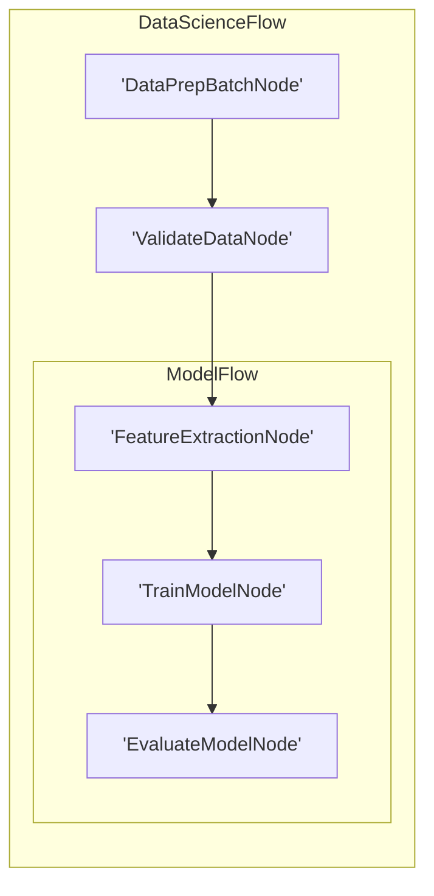

# Visualization and Logging



**BrainyFlow does NOT provide built-in utilities**

Instead, we offer examples that you can implement yourself. This approach gives you [more flexibility and control](../utility_function/index.md#why-not-built-in) over your project's dependencies and functionality.



Similar to LLM wrappers, we **don't** provide built-in visualization and debugging. Here, we recommend some _minimal_ (and incomplete) implementations. These examples can serve as a starting point for your own tooling.

## 1. Visualization with Mermaid

This code recursively traverses the nested graph, assigns unique IDs to each node, and treats Flow nodes as subgraphs to generate Mermaid syntax for a hierarchical visualization.




```python
def build_mermaid(start):
    ids, visited, lines = {}, set(), ["graph LR"]
    ctr = 1
    def get_id(n):
        nonlocal ctr
        return ids[n] if n in ids else (ids.setdefault(n, f"N{ctr}"), (ctr := ctr + 1))[0]
    def link(a, b):
        lines.append(f"    {a} --> {b}")
    def walk(node, parent=None):
        if node in visited:
            return parent and link(parent, get_id(node))
        visited.add(node)
        if isinstance(node, Flow):
            node.start and parent and link(parent, get_id(node.start))
            lines.append(f"\n    subgraph sub_flow_{get_id(node)}[{type(node).__name__}]")
            node.start and walk(node.start)
            for nxt in node.successors.values():
                node.start and walk(nxt, get_id(node.start)) or (parent and link(parent, get_id(nxt))) or walk(nxt)
            lines.append("    end\n")
        else:
            lines.append(f"    {(nid := get_id(node))}['{type(node).__name__}']")
            parent and link(parent, nid)
            [walk(nxt, nid) for nxt in node.successors.values()]
    walk(start)
    return "\n".join(lines)
```





```typescript
function buildMermaid(start: any): string {
  const ids: Record = {}
  const visited = new Set()
  const lines: string[] = ['graph LR']
  let ctr = 1

  function getId(n: any): string {
    const key = n.toString()
    if (key in ids) return ids[key]
    ids[key] = `N${ctr++}`
    return ids[key]
  }

  function link(a: string, b: string): void {
    lines.push(`    ${a} --> ${b}`)
  }

  function walk(node: any, parent: string | null = null): void {
    const nodeKey = node.toString()
    if (visited.has(nodeKey)) {
      if (parent) link(parent, getId(node))
      return
    }

    visited.add(nodeKey)

    if (node instanceof Flow) {
      if (node.start && parent) {
        link(parent, getId(node.start))
      }

      lines.push(`\n    subgraph sub_flow_${getId(node)}[${node.constructor.name}]`)

      if (node.start) {
        walk(node.start)
      }

      for (const nxt of Object.values(node.successors)) {
        if (node.start) {
          walk(nxt, getId(node.start))
        } else if (parent) {
          link(parent, getId(nxt))
        } else {
          walk(nxt)
        }
      }

      lines.push('    end\n')
    } else {
      const nid = getId(node)
      lines.push(`    ${nid}['${node.constructor.name}']`)

      if (parent) {
        link(parent, nid)
      }

      for (const nxt of Object.values(node.successors)) {
        walk(nxt, nid)
      }
    }
  }

  walk(start)
  return lines.join('\n')
}
```




For example, suppose we have a complex Flow for data science:




```python
class DataPrepBatchNode(BatchNode):
    def prep(self,shared): return []
class ValidateDataNode(Node): pass
class FeatureExtractionNode(Node): pass
class TrainModelNode(Node): pass
class EvaluateModelNode(Node): pass
class ModelFlow(Flow): pass
class DataScienceFlow(Flow):pass

feature_node = FeatureExtractionNode()
train_node = TrainModelNode()
evaluate_node = EvaluateModelNode()
feature_node >> train_node >> evaluate_node
model_flow = ModelFlow(start=feature_node)
data_prep_node = DataPrepBatchNode()
validate_node = ValidateDataNode()
data_prep_node >> validate_node >> model_flow
data_science_flow = DataScienceFlow(start=data_prep_node)
result = build_mermaid(start=data_science_flow)
print(result) # Output the Mermaid string
```





```typescript
// Define dummy nodes and flows for the example structure
class DataPrepNode extends Node {}
class ValidateDataNode extends Node {}
class FeatureExtractionNode extends Node {}
class TrainModelNode extends Node {}
class EvaluateModelNode extends Node {}
class ModelFlow extends Flow {}
class DataScienceFlow extends Flow {}

// Instantiate and connect
const featureNode = new FeatureExtractionNode()
const trainNode = new TrainModelNode()
const evaluateNode = new EvaluateModelNode()
featureNode.next(trainNode).next(evaluateNode)

const modelFlow = new ModelFlow(featureNode) // Flow starting with featureNode

const dataPrepNode = new DataPrepNode()
const validateNode = new ValidateDataNode()
dataPrepNode.next(validateNode).next(modelFlow)

const dataScienceFlow = new DataScienceFlow(dataPrepNode) // Top-level flow

// Generate Mermaid string (assuming buildMermaid function is defined as above)
const result = buildMermaid(dataScienceFlow)
console.log(result) // Output the Mermaid string
```




The code generates a Mermaid diagram:



## 2. Call Stack Debugging

For debugging purposes, it's useful to inspect the runtime call stack to understand the execution path through your nodes. This implementation extracts the Node call stack by examining the current execution frames:




```python
import inspect

def get_node_call_stack():
    stack = inspect.stack()
    node_names = []
    seen_ids = set()
    for frame_info in stack[1:]:
        local_vars = frame_info.frame.f_locals
        if 'self' in local_vars:
            caller_self = local_vars['self']
            if isinstance(caller_self, BaseNode) and id(caller_self) not in seen_ids:
                seen_ids.add(id(caller_self))
                node_names.append(type(caller_self).__name__)
    return node_names
```





```typescript
function getNodeCallStack(): string[] {
  // Create a new Error to capture the stack trace
  const stackTrace = new Error().stack || ''
  const nodeNames: string[] = []
  const seenIds = new Set()

  // Parse the stack trace to extract node information
  // This is a simplified implementation - in practice you would need
  // a more robust approach to track Node instances

  const stackFrames = stackTrace.split('\n').slice(1) // Skip Error constructor

  for (const frame of stackFrames) {
    // Look for Node class method calls in the stack trace
    // Format typically: "at NodeClassName.methodName"
    const match = frame.match(/at\s+(\w+)\.(prep|exec|post)/)

    if (match) {
      const className = match[1]
      // Check if this is likely a Node class (ends with "Node" or is a Flow)
      if ((className.endsWith('Node') || className.endsWith('Flow')) && !seenIds.has(className)) {
        seenIds.add(className)
        nodeNames.push(className)
      }
    }
  }

  return nodeNames
}
```




For example, suppose we have a complex Flow for data science:




```python
class DataPrepBatchNode(BatchNode):
    def prep(self, shared): return []
class ValidateDataNode(Node): pass
class FeatureExtractionNode(Node): pass
class TrainModelNode(Node): pass
class EvaluateModelNode(Node):
    def prep(self, shared):
        stack = get_node_call_stack()
        print("Call stack:", stack)
class ModelFlow(Flow): pass
class DataScienceFlow(Flow):pass

feature_node = FeatureExtractionNode()
train_node = TrainModelNode()
evaluate_node = EvaluateModelNode()
feature_node >> train_node >> evaluate_node
model_flow = ModelFlow(start=feature_node)
data_prep_node = DataPrepBatchNode()
validate_node = ValidateDataNode()
data_prep_node >> validate_node >> model_flow
data_science_flow = DataScienceFlow(start=data_prep_node)
data_science_flow.run({})
```





```typescript
// Define dummy nodes and flows
class DataPrepNode extends Node {
  async prep(memory: Memory): Promise<void> {
    console.log('Prep: DataPrepNode')
  }
}
class ValidateDataNode extends Node {
  async prep(memory: Memory): Promise<void> {
    console.log('Prep: ValidateDataNode')
  }
}
class FeatureExtractionNode extends Node {
  async prep(memory: Memory): Promise<void> {
    console.log('Prep: FeatureExtractionNode')
  }
}
class TrainModelNode extends Node {
  async prep(memory: Memory): Promise<void> {
    console.log('Prep: TrainModelNode')
  }
}
class EvaluateModelNode extends Node {
  async prep(memory: Memory): Promise<void> {
    // Call the stack inspection function here
    const stack = getNodeCallStack() // Assuming getNodeCallStack is defined
    console.log('Call stack inside EvaluateModelNode:', stack)
  }
}
class ModelFlow extends Flow {}
class DataScienceFlow extends Flow {}

// Instantiate and connect
const featureNode = new FeatureExtractionNode()
const trainNode = new TrainModelNode()
const evaluateNode = new EvaluateModelNode()
featureNode.next(trainNode).next(evaluateNode)

const modelFlow = new ModelFlow(featureNode)

const dataPrepNode = new DataPrepNode()
const validateNode = new ValidateDataNode()
dataPrepNode.next(validateNode).next(modelFlow)

const dataScienceFlow = new DataScienceFlow(dataPrepNode)

// Run the flow
console.log('Running data science flow...')
dataScienceFlow.run({}) // Pass an empty initial memory
```




The output would be: `Call stack: ['EvaluateModelNode', 'ModelFlow', 'DataScienceFlow']`

This shows the nested execution path, with the current node (`EvaluateModelNode`) at the top, followed by its parent flows.

## 3. Logging and Tracing

A simple logging utility can help track the flow of execution through your nodes:




```python
import logging
import time
from functools import wraps

# Configure logging
logging.basicConfig(level=logging.INFO,
                   format='%(asctime)s - %(name)s - %(levelname)s - %(message)s')
logger = logging.getLogger('brainyflow')

def trace_node(cls):
    """Class decorator to trace node execution"""
    # Ensure the methods exist before wrapping
    original_prep = getattr(cls, 'prep', None)
    original_exec = getattr(cls, 'exec', None)
    original_post = getattr(cls, 'post', None)

    @wraps(original_prep)
    async def traced_prep(self, memory: Memory):
        logger.info(f"ENTER prep: {type(self).__name__}")
        start_time = time.time()
        # Call original only if it exists
        result = await original_prep(self, memory) if original_prep else None
        elapsed = time.time() - start_time
        logger.info(f"EXIT prep: {type(self).__name__} ({elapsed:.3f}s)")
        return result

    @wraps(original_exec)
    async def traced_exec(self, prep_res):
        logger.info(f"ENTER exec: {type(self).__name__}")
        start_time = time.time()
        # Call original only if it exists
        result = await original_exec(self, prep_res) if original_exec else None
        elapsed = time.time() - start_time
        logger.info(f"EXIT exec: {type(self).__name__} ({elapsed:.3f}s)")
        return result

    @wraps(original_post)
    async def traced_post(self, memory: Memory, prep_res, exec_res):
        logger.info(f"ENTER post: {type(self).__name__}")
        start_time = time.time()
        # Call original only if it exists
        # Note: Original post doesn't return the action anymore
        if original_post:
             await original_post(self, memory, prep_res, exec_res)
        elapsed = time.time() - start_time
        # Log triggers separately if needed, as post doesn't return them
        logger.info(f"EXIT post: {type(self).__name__} ({elapsed:.3f}s)")
        # The decorator doesn't need to return anything from post

    # Assign wrapped methods back to the class
    if original_prep: cls.prep = traced_prep
    if original_exec: cls.exec = traced_exec
    if original_post: cls.post = traced_post
    return cls

# Usage:
@trace_node
class MyNode(Node):
    async def prep(self, memory: Memory):
        # logger.info(f"Reading from memory: {memory.some_input}") # Example read
        return "data"

    async def exec(self, prep_res):
        await asyncio.sleep(0.05) # Simulate work
        return prep_res.upper()

    async def post(self, memory: Memory, prep_res, exec_res):
        memory.result = exec_res # Write to memory object
        self.trigger("default")
```





```typescript
import { createLogger, format, transports } from 'winston' // Example logger

// Configure logging (using Winston as an example)
const logger = createLogger({
  level: 'info',
  format: format.combine(
    format.timestamp({ format: 'HH:mm:ss.SSS' }),
    format.printf(
      ({ timestamp, level, message }) => `${timestamp} - ${level.toUpperCase()} - ${message}`,
    ),
  ),
  transports: [new transports.Console()],
})

// --- Tracing Wrapper Function ---
// This function takes a Node class and returns a new class with tracing added.
// Note: This is a simplified example; real decorators might be more complex.
function withTracing<T extends new (...args: any[]) => Node>(NodeClass: T): T {
  return class TracedNode extends NodeClass {
    async prep(memory: Memory): Promise<any> {
      const nodeName = this.constructor.name
      logger.info(`ENTER prep: ${nodeName}`)
      const startTime = Date.now()
      try {
        // Call the original prep method
        const result = await super.prep(memory)
        const elapsed = (Date.now() - startTime) / 1000
        logger.info(`EXIT prep: ${nodeName} (${elapsed.toFixed(3)}s)`)
        return result
      } catch (e: any) {
        logger.error(`ERROR prep: ${nodeName} - ${e.message}`)
        throw e // Re-throw error after logging
      }
    }

    async exec(prepRes: any): Promise<any> {
      const nodeName = this.constructor.name
      logger.info(`ENTER exec: ${nodeName}`)
      const startTime = Date.now()
      try {
        // Call the original exec method
        const result = await super.exec(prepRes)
        const elapsed = (Date.now() - startTime) / 1000
        logger.info(`EXIT exec: ${nodeName} (${elapsed.toFixed(3)}s)`)
        return result
      } catch (e: any) {
        logger.error(`ERROR exec: ${nodeName} - ${e.message}`)
        throw e
      }
    }

    async post(memory: Memory, prepRes: any, execRes: any): Promise<void> {
      const nodeName = this.constructor.name
      logger.info(`ENTER post: ${nodeName}`)
      const startTime = Date.now()
      try {
        // Call the original post method
        await super.post(memory, prepRes, execRes)
        const elapsed = (Date.now() - startTime) / 1000
        logger.info(`EXIT post: ${nodeName} (${elapsed.toFixed(3)}s)`)
      } catch (e: any) {
        logger.error(`ERROR post: ${nodeName} - ${e.message}`)
        throw e
      }
    }
  } as T // Cast back to the original type structure
}

// --- Usage Example ---

// Define your original node
class MyOriginalNode extends Node {
  async prep(memory: Memory): Promise<string> {
    await new Promise((res) => setTimeout(res, 50)) // Simulate work
    return 'data'
  }

  async exec(prepRes: string): Promise<string> {
    await new Promise((res) => setTimeout(res, 100)) // Simulate work
    return prepRes.toUpperCase()
  }

  async post(memory: Memory, prepRes: string, execRes: string): Promise<void> {
    await new Promise((res) => setTimeout(res, 30)) // Simulate work
    memory.result = execRes
  }
}

// Wrap the original node class with tracing
const MyTracedNode = withTracing(MyOriginalNode)

// Use the traced node in a flow
// const tracedNodeInstance = new MyTracedNode();
// const flow = new Flow(tracedNodeInstance);
// flow.run({}).then(() => console.log("Flow finished"));

/* Example Output:
22:15:01.123 - INFO - ENTER prep: MyOriginalNode
22:15:01.175 - INFO - EXIT prep: MyOriginalNode (0.052s)
22:15:01.175 - INFO - ENTER exec: MyOriginalNode
22:15:01.277 - INFO - EXIT exec: MyOriginalNode (0.102s)
22:15:01.277 - INFO - ENTER post: MyOriginalNode
22:15:01.309 - INFO - EXIT post: MyOriginalNode (0.032s)
Flow finished
*/
```




This tracing utility provides detailed logs of node execution, including timing information, which can be invaluable for debugging and performance optimization.
