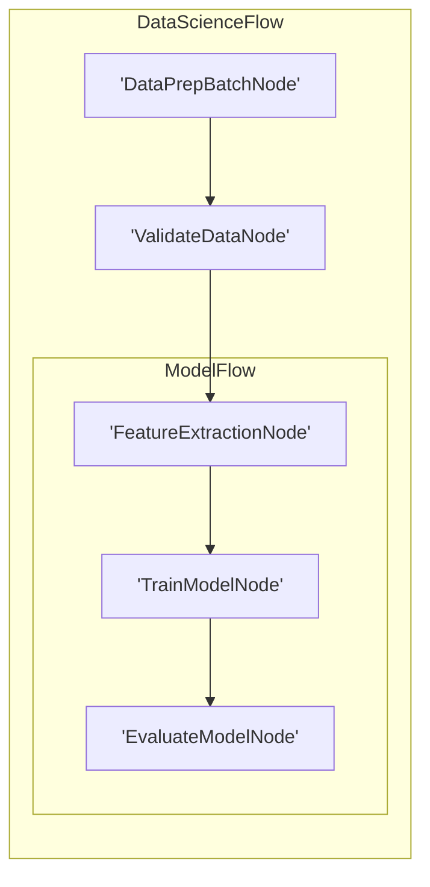

# Visualization & Logging



**Caskada does NOT provide built-in utilities**

Instead, we offer examples that you can implement yourself. This approach gives you [more flexibility and control](../utility_function/index.md#why-not-built-in) over your project's dependencies and functionality.



Understanding the execution flow of your Caskada application is crucial for debugging and optimization. The primary mechanism Caskada provides for this is the `ExecutionTree` returned by `Flow.run()`.

Similar to LLM wrappers, we **don't** provide built-in visualization and debugging. Here, we recommend some _minimal_ (and incomplete) implementations. These examples can serve as a starting point for your own tooling.

## The `ExecutionTree`

When you execute `await myFlow.run(memory)`, the method returns an `ExecutionTree`. This object provides a structured, hierarchical representation of the entire flow execution.

**Structure of `ExecutionTree` (Conceptual):**

```typescript
type Action = string | 'default'

interface ExecutionTree {
  order: number // Unique order of this node's execution in the flow
  type: string // Constructor name of the node (e.g., "MyCustomNode", "Flow")
  triggered: Record<Action, ExecutionTree[]> | null
  // An object where keys are action names triggered by this node.
  // Values are arrays of ExecutionTree(s) for the successor node(s)
  // that were executed due to that action.
  // `null` if the node was terminal for its branch or did not trigger actions
  // that led to further node executions visible in this tree.
  // (Note: Even if a node doesn't explicitly trigger, a 'default' action might be
  //  processed, leading to an empty array if no successor for 'default').
}
```

In Python, it's a `TypedDict` with similar fields: `order: int`, `type: str`, `triggered: Optional[Dict[Action, List[ExecutionTree]]]`.

**Benefits of `ExecutionTree`:**

1.  **Debugging**: Trace exactly which nodes ran, in what order, and which actions were triggered. This is invaluable for understanding why a flow took a particular path.
2.  **Visualization**: The tree structure can be directly used to generate visual diagrams of the execution path (see below).
3.  **Auditing & Logging**: Store the `ExecutionTree` (e.g., as JSON) for auditing purposes or detailed logging of a specific flow run.
4.  **Performance Analysis**: While not its primary purpose, you could augment nodes to record timing information and include it in a custom `ExecutionTree` or a parallel logging structure to identify bottlenecks.

## Logging Best Practices

While the `ExecutionTree` provides a structural log, you can complement it with traditional logging:

- **Integrate Your Preferred Logger**: Use standard logging libraries (Python's `logging`, `pino`/`winston` in TS).
- **Log in Node Lifecycle Methods**: Add log statements in `prep`, `exec`, and `post` to capture:
  - Node entry/exit.
  - Key data being read from or written to `Memory`.
  - Important decisions made or results computed.
  - Actions being triggered in `post`.
- **Contextual Information**: Include node ID (`self._node_order` / `this.__nodeOrder`), node type, and relevant `Memory` keys in your log messages.
- **Error Logging**: Ensure `execFallback` logs detailed error information before returning a fallback or re-throwing.

### Example: Python Logging with `ExecutionTree`

```python
import logging
import json
from brainyflow import Node, Memory, Flow

# ... (setup logger, define nodes as in previous Python logging example) ...

async def main():
    # ... (define node_a, node_b, connect them) ...
    # node_a = LoggingNode()
    # node_b = LoggingNode()
    # node_a >> node_b

    # flow = Flow(start=node_a)
    # memory_obj = Memory(global_store={"initial": "data"})

    # execution_result_tree = await flow.run(memory_obj)

    # logger.info(f"Flow execution completed. Final Memory: {dict(memory_obj)}")
    # logger.info(f"Execution Tree: {json.dumps(execution_result_tree, indent=2)}")
    pass # Placeholder for actual setup
```

## Visualization

The `ExecutionTree` is well-suited for generating visualizations of a _specific run_ of your flow.

### 1. Visualizing the Static Flow Definition

This code recursively traverses the nested graph, assigns unique IDs to each node, and treats Flow nodes as subgraphs to generate Mermaid syntax for a hierarchical visualization.




```python
def build_mermaid(start):
    ids, visited, lines = {}, set(), ["graph LR"]
    ctr = 1
    def get_id(n):
        nonlocal ctr
        return ids[n] if n in ids else (ids.setdefault(n, f"N{ctr}"), (ctr := ctr + 1))[0]
    def link(a, b):
        lines.append(f"    {a} --> {b}")
    def walk(node, parent=None):
        if node in visited:
            return parent and link(parent, get_id(node))
        visited.add(node)
        if isinstance(node, Flow):
            node.start and parent and link(parent, get_id(node.start))
            lines.append(f"\n    subgraph sub_flow_{get_id(node)}[{type(node).__name__}]")
            node.start and walk(node.start)
            for nxt in node.successors.values():
                node.start and walk(nxt, get_id(node.start)) or (parent and link(parent, get_id(nxt))) or walk(nxt)
            lines.append("    end\n")
        else:
            lines.append(f"    {(nid := get_id(node))}['{type(node).__name__}']")
            parent and link(parent, nid)
            [walk(nxt, nid) for nxt in node.successors.values()]
    walk(start)
    return "\n".join(lines)
```





```typescript
function buildMermaid(start: any): string {
  const ids: Record = {}
  const visited = new Set()
  const lines: string[] = ['graph LR']
  let ctr = 1

  function getId(n: any): string {
    const key = n.toString()
    if (key in ids) return ids[key]
    ids[key] = `N${ctr++}`
    return ids[key]
  }

  function link(a: string, b: string): void {
    lines.push(`    ${a} --> ${b}`)
  }

  function walk(node: any, parent: string | null = null): void {
    const nodeKey = node.toString()
    if (visited.has(nodeKey)) {
      if (parent) link(parent, getId(node))
      return
    }

    visited.add(nodeKey)

    if (node instanceof Flow) {
      if (node.start && parent) {
        link(parent, getId(node.start))
      }

      lines.push(`\n    subgraph sub_flow_${getId(node)}[${node.constructor.name}]`)

      if (node.start) {
        walk(node.start)
      }

      for (const nxt of Object.values(node.successors)) {
        if (node.start) {
          walk(nxt, getId(node.start))
        } else if (parent) {
          link(parent, getId(nxt))
        } else {
          walk(nxt)
        }
      }

      lines.push('    end\n')
    } else {
      const nid = getId(node)
      lines.push(`    ${nid}['${node.constructor.name}']`)

      if (parent) {
        link(parent, nid)
      }

      for (const nxt of Object.values(node.successors)) {
        walk(nxt, nid)
      }
    }
  }

  walk(start)
  return lines.join('\n')
}
```




For example, suppose we have a complex Flow for data science:




```python
class DataPrepBatchNode(BatchNode):
    def prep(self,shared): return []
class ValidateDataNode(Node): pass
class FeatureExtractionNode(Node): pass
class TrainModelNode(Node): pass
class EvaluateModelNode(Node): pass
class ModelFlow(Flow): pass
class DataScienceFlow(Flow):pass

feature_node = FeatureExtractionNode()
train_node = TrainModelNode()
evaluate_node = EvaluateModelNode()
feature_node >> train_node >> evaluate_node
model_flow = ModelFlow(start=feature_node)
data_prep_node = DataPrepBatchNode()
validate_node = ValidateDataNode()
data_prep_node >> validate_node >> model_flow
data_science_flow = DataScienceFlow(start=data_prep_node)
result = build_mermaid(start=data_science_flow)
print(result) # Output the Mermaid string
```





```typescript
// Define dummy nodes and flows for the example structure
class DataPrepNode extends Node {}
class ValidateDataNode extends Node {}
class FeatureExtractionNode extends Node {}
class TrainModelNode extends Node {}
class EvaluateModelNode extends Node {}
class ModelFlow extends Flow {}
class DataScienceFlow extends Flow {}

// Instantiate and connect
const featureNode = new FeatureExtractionNode()
const trainNode = new TrainModelNode()
const evaluateNode = new EvaluateModelNode()
featureNode.next(trainNode).next(evaluateNode)

const modelFlow = new ModelFlow(featureNode) // Flow starting with featureNode

const dataPrepNode = new DataPrepNode()
const validateNode = new ValidateDataNode()
dataPrepNode.next(validateNode).next(modelFlow)

const dataScienceFlow = new DataScienceFlow(dataPrepNode) // Top-level flow

// Generate Mermaid string (assuming buildMermaid function is defined as above)
const result = buildMermaid(dataScienceFlow)
console.log(result) // Output the Mermaid string
```




The code generates a Mermaid diagram:



### 2. Visualizing Runtime Execution from `ExecutionTree`

You can write a script to traverse the `ExecutionTree` and generate a graph definition for tools like Mermaid, Graphviz (DOT language), or JavaScript graph libraries (e.g., Vis.js, Cytoscape.js).

**Example: Generating Mermaid from `ExecutionTree` (Conceptual Python)**

```python
def to_mermaid(tree_node, parent_id=None, edge_label=None):
    mermaid_lines = []
    node_id = f"{tree_node['type']}_{tree_node['order']}"
    mermaid_lines.append(f"    {node_id}[\"{tree_node['type']} (#{tree_node['order']})\"]")

    if parent_id and edge_label:
        mermaid_lines.append(f"    {parent_id} -- {edge_label} --> {node_id}")

    if tree_node['triggered']:
        for action, next_trees in tree_node['triggered'].items():
            for next_tree_node in next_trees:
                mermaid_lines.extend(to_mermaid(next_tree_node, node_id, action))
    return mermaid_lines

# After a flow run:
# execution_tree = await my_flow.run(memory)
# print("flowchart TD")
# for line in to_mermaid(execution_tree):
#     print(line)
```

This script would output Mermaid syntax representing the actual path taken during that specific `flow.run()`.

By combining structured logging (from your nodes) with the `ExecutionTree`, you gain powerful tools for understanding, debugging, and monitoring your Caskada applications.


### 3. Call Stack Debugging

For debugging purposes, it's useful to inspect the runtime call stack to understand the execution path through your nodes. This implementation extracts the Node call stack by examining the current execution frames:




```python
import inspect

def get_node_call_stack():
    stack = inspect.stack()
    node_names = []
    seen_ids = set()
    for frame_info in stack[1:]:
        local_vars = frame_info.frame.f_locals
        if 'self' in local_vars:
            caller_self = local_vars['self']
            if isinstance(caller_self, BaseNode) and id(caller_self) not in seen_ids:
                seen_ids.add(id(caller_self))
                node_names.append(type(caller_self).__name__)
    return node_names
```





```typescript
function getNodeCallStack(): string[] {
  // Create a new Error to capture the stack trace
  const stackTrace = new Error().stack || ''
  const nodeNames: string[] = []
  const seenIds = new Set()

  // Parse the stack trace to extract node information
  // This is a simplified implementation - in practice you would need
  // a more robust approach to track Node instances

  const stackFrames = stackTrace.split('\n').slice(1) // Skip Error constructor

  for (const frame of stackFrames) {
    // Look for Node class method calls in the stack trace
    // Format typically: "at NodeClassName.methodName"
    const match = frame.match(/at\s+(\w+)\.(prep|exec|post)/)

    if (match) {
      const className = match[1]
      // Check if this is likely a Node class (ends with "Node" or is a Flow)
      if ((className.endsWith('Node') || className.endsWith('Flow')) && !seenIds.has(className)) {
        seenIds.add(className)
        nodeNames.push(className)
      }
    }
  }

  return nodeNames
}
```




For example, suppose we have a complex Flow for data science:




```python
class DataPrepBatchNode(BatchNode):
    def prep(self, shared): return []
class ValidateDataNode(Node): pass
class FeatureExtractionNode(Node): pass
class TrainModelNode(Node): pass
class EvaluateModelNode(Node):
    def prep(self, shared):
        stack = get_node_call_stack()
        print("Call stack:", stack)
class ModelFlow(Flow): pass
class DataScienceFlow(Flow):pass

feature_node = FeatureExtractionNode()
train_node = TrainModelNode()
evaluate_node = EvaluateModelNode()
feature_node >> train_node >> evaluate_node
model_flow = ModelFlow(start=feature_node)
data_prep_node = DataPrepBatchNode()
validate_node = ValidateDataNode()
data_prep_node >> validate_node >> model_flow
data_science_flow = DataScienceFlow(start=data_prep_node)
data_science_flow.run({})
```





```typescript
// Define dummy nodes and flows
class DataPrepNode extends Node {
  async prep(memory: Memory): Promise<void> {
    console.log('Prep: DataPrepNode')
  }
}
class ValidateDataNode extends Node {
  async prep(memory: Memory): Promise<void> {
    console.log('Prep: ValidateDataNode')
  }
}
class FeatureExtractionNode extends Node {
  async prep(memory: Memory): Promise<void> {
    console.log('Prep: FeatureExtractionNode')
  }
}
class TrainModelNode extends Node {
  async prep(memory: Memory): Promise<void> {
    console.log('Prep: TrainModelNode')
  }
}
class EvaluateModelNode extends Node {
  async prep(memory: Memory): Promise<void> {
    // Call the stack inspection function here
    const stack = getNodeCallStack() // Assuming getNodeCallStack is defined
    console.log('Call stack inside EvaluateModelNode:', stack)
  }
}
class ModelFlow extends Flow {}
class DataScienceFlow extends Flow {}

// Instantiate and connect
const featureNode = new FeatureExtractionNode()
const trainNode = new TrainModelNode()
const evaluateNode = new EvaluateModelNode()
featureNode.next(trainNode).next(evaluateNode)

const modelFlow = new ModelFlow(featureNode)

const dataPrepNode = new DataPrepNode()
const validateNode = new ValidateDataNode()
dataPrepNode.next(validateNode).next(modelFlow)

const dataScienceFlow = new DataScienceFlow(dataPrepNode)

// Run the flow
console.log('Running data science flow...')
dataScienceFlow.run({}) // Pass an empty initial memory
```




The output would be: `Call stack: ['EvaluateModelNode', 'ModelFlow', 'DataScienceFlow']`

This shows the nested execution path, with the current node (`EvaluateModelNode`) at the top, followed by its parent flows.
